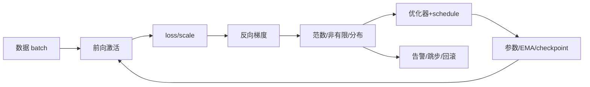

# 02 · 优化动力学与稳定训练

> 一句话点题：稳定训练是数值、优化和数据三套动力学的交集；优化器名称本身解释不了一条训练曲线。

<div class="lesson-meta"><span>DLF04—DLF05—DLF06</span><span>核心主线</span><span>预计 7 × 45 分钟</span><span>证据截止 2026-08-30</span></div>

## 解锁与跳过

先完成计算图与梯度验证，并能读训练/验证 loss 曲线。 即使你使用 AI 完成实现，也不能跳过本章的变量定义、反例和评测设计；这些部分决定你是否有能力发现一个“运行正常但结论错误”的系统。

## 本章可观察目标

完成后你能：解释 SGD/动量/AdamW 的更新差异；诊断初始化、归一化、批量和精度造成的不稳定；设计学习率、优化器与随机种子消融。阅读完成不计掌握；至少需要一次不看答案的解释、一次实际应用和一次边界判断。

## 研究问题：SGD、Adam、初始化和归一化怎样共同决定训练轨迹？

loss spike 可能由脏 batch、学习率暖启动、混合精度溢出、MoE 路由失衡或分布式通信错误造成。Adam 在某些配置更快降低训练损失，不代表在相同 token/算力下泛化更好。批量变化还会改变梯度噪声和有效学习率。

问题必须被写成“输入、状态、动作/输出、损失、约束、证据和停止条件”的组合。只写“提升效果”会把数据、算法、交互与业务结果混在一起，也无法设计反事实或消融。

## 三个知识节点怎样连接

| 节点 | 核心对象 | 最小充分解释 | 必须支持的决策 |
|---|---|---|---|
| DLF04 | 优化轨迹 | 随机梯度、动量和自适应尺度共同决定参数路径 | 未收敛、鞍点还是噪声 |
| DLF05 | 信号传播 | 初始化、残差和归一化控制激活/梯度尺度 | 深度增加后信息是否稳定 |
| DLF06 | 稳定训练 | 学习率、批量、精度、裁剪和监控形成闭环 | 何时恢复、回滚或调整 |

三者不是并列名词：第一个节点通常建立对象和假设，第二个节点解释机制，第三个节点把机制放进测量或交付边界。缺任何一层，都容易把局部指标误当成系统结论。

## 核心机制：梯度估计、动量与尺度控制

SGD 用 minibatch 给出总体梯度的噪声估计；动量平滑长期方向。Adam 对一阶、二阶矩做指数平均并按坐标缩放，AdamW 将权重衰减从自适应梯度更新中解耦。Xavier/He 初始化匹配前后向方差；残差提供短梯度路径；LayerNorm 按 token 特征归一化，适合序列模型。warmup 控制早期未校准激活下的更新。

理解机制时要区分三种量：**被设计者直接控制的变量**、**环境或数据生成过程决定的变量**、**只能通过代理指标观测的潜变量**。可靠实验一次只改变主要因子，其余配置进入版本化运行记录。

## 关键公式、假设与推导

动量 SGD 与 AdamW 的核心更新可概括为

$$
v_t=\beta v_{t-1}+g_t,\quad \theta_{t+1}=\theta_t-\eta v_t,
$$

$$
m_t=\beta_1m_{t-1}+(1-\beta_1)g_t,\quad
v_t=\beta_2v_{t-1}+(1-\beta_2)g_t^2,
$$

$$
\theta_{t+1}=(1-\eta\lambda)\theta_t-\eta\frac{\hat m_t}{\sqrt{\hat v_t}+\epsilon}.
$$

公式不是装饰。逐项检查：

- 权重衰减与 L2 正则在自适应优化器中不完全等价
- 梯度裁剪掩盖爆炸原因时只能作为护栏
- 混合精度 loss scaling 需监测溢出/跳步
- 比较优化器必须固定 token、模型、数据顺序和搜索预算

若假设不成立，正确做法不是继续套公式，而是换估计量、改采样/实验设计、缩小结论或明确拒绝自动决策。

## 证据拆解1：Decoupled Weight Decay Regularization

### 研究问题

为什么把 L2 项加到 Adam 梯度中不等于直接衰减权重？

### 核心机制、实验与指标

论文分析自适应尺度会改变 L2 惩罚的坐标作用，提出 AdamW 将权重衰减独立于梯度更新。

实验在图像分类与语言建模展示更可解释的超参数和泛化收益。

### 真正贡献、局限与适用边界

贡献是修正广泛使用的优化器正则实现。 具体优势依任务和调参；AdamW 也不会自动解决学习率、数据或数值问题。

## 证据拆解2：DeepSeek-V3 Technical Report

### 研究问题

大规模 MoE 训练怎样在较低激活参数和数值风险下保持稳定？

### 核心机制、实验与指标

报告描述 MLA、DeepSeekMoE、无辅助损失负载均衡、多 Token 预测、FP8 训练与系统协同；总参数 671B、每 Token 激活 37B，预训练 14.8T Token。

作者报告 2.788M H800 GPU 小时，并称训练中无不可恢复 loss spike 或回滚。

### 真正贡献、局限与适用边界

贡献是公开大规模稀疏模型在算法与系统层的联合稳定设计。 厂商自报、硬件/集群高度特定；不能用总 GPU 小时直接与不同实现和会计口径比较。

## 从论文或标准到产品主张：证据审计

| 日期 | 一手来源 | 它真正回答的问题 | 不能据此外推什么 |
|---|---|---|---|
| 2019-01-04 | Decoupled Weight Decay Regularization | 为什么把 L2 项加到 Adam 梯度中不等于直接衰减权重？ | 具体优势依任务和调参；AdamW 也不会自动解决学习率、数据或数值问题。 |
| 2024-12-27 | DeepSeek-V3 Technical Report | 大规模 MoE 训练怎样在较低激活参数和数值风险下保持稳定？ | 厂商自报、硬件/集群高度特定；不能用总 GPU 小时直接与不同实现和会计口径比较。 |

阅读来源时按四步记录：先抄下研究对象、比较基线、数据/场景和预算，再定位结果表或正式条文；随后区分作者直接观察、由结果支持的解释和你准备迁移到项目的推论；最后为推论写一个能推翻它的反例。**来源新并不等于证据强**：预印本、公司技术报告、正式标准、法规和独立复现承担的证明责任不同。数字必须连同分母、置信区间、硬件/本体、语言/人群与失败样本一起保存。

如果来源只证明组件指标改善，不得自动升级成端到端任务、真实用户价值、物理安全或合规结论。迁移到自己的项目时至少保留一个原方法基线、一个更简单基线和一个不使用该能力的基线；结果冲突时，优先检查任务定义、样本污染、资源预算、评价器偏差和运行边界，而不是挑选最符合预期的一项。

## 机制图：从输入到可验证结果



图中每条边都应能对应日志、数据版本、物理状态或人工记录；无法观测的边必须标为假设，不允许用模型的一段解释代替真实状态。

## 贯穿案例：Transformer 训练第 8k 步尖峰

先对尖峰 batch 重放，检查 token 长度、异常标签和 loss 分项；再检查 grad norm、FP8/FP16 overflow、学习率位置与各层激活。若只有某数据源触发，修数据和采样；若所有 batch 在 warmup 结束触发，检查 schedule。裁剪可防止模型损坏，但事故报告仍需找到根因。

案例的重点不是跑出最高分，而是保存“为什么选择这条路径”的证据：基线是什么、哪个假设最危险、失败怎样分层、什么条件触发降级或人工接管。

## 复现任务：最小因果链

1. 在小模型上比较 SGD、Adam、AdamW，固定 token 和搜索次数
2. 记录每层激活/梯度均值、方差和范数
3. 分别移除残差、归一化、warmup，观察失效
4. 制造异常 batch 并验证检测、跳步和 checkpoint 恢复

复现不是成功运行作者代码。你必须固定数据/环境、预算和评价器，至少重复三次，报告均值、离散程度、失败样本和资源消耗；若只能跑一次，要把结论降级为演示证据。

## 三轮实验与消融路线

**第一轮：测量链校准。** 只运行最简单基线，检查输入单位、时间/坐标/权限、随机种子、日志和评价器。抽取成功与失败样本人工复核；若真值或测量本身不稳定，停止模型比较。输出必须能回答“同一次运行能否被另一人重放”。

**第二轮：机制消融。** 在同一数据、预算、硬件或运行条件下，一次只加入一个关键机制；对每次变化写预期影响、未变化项和失败阈值。除了主指标，还要检查最坏切片、过程约束、P95/P99、资源与人工成本。若提升只在一个方便切片出现，应缩小能力声明。

**第三轮：边界与迁移。** 有计划地改变本章公式假设或 ODD：时间、人群、语言、对象、气象、本体、延迟、权限或供应商至少选择两项；注入缺失、冲突和失效。记录系统是正确拒绝/降级/接管，还是带着错误自信继续。最终产物不是“最佳分数”，而是一个可复核的能力范围、反例集和下一次变更会触发的回归集合。

## 实验与指标

| 维度 | 至少记录什么 | 为什么 |
|---|---|---|
| 任务质量 | 主指标、切片、置信区间与失败样本 | 确认改进是否稳定且可解释 |
| 训练 | loss、梯度/激活、吞吐、显存、数据量、FLOPs | 区分算法收益和更多计算 |
| 推理 | 首 Token、每 Token、P50/P95、吞吐、峰值内存 | 模型参数量不等于用户体验 |
| 风险 | 校准、偏移、攻击、记忆/污染与能耗 | 把能力放入真实部署边界 |

同时保留一个简单基线和一个“什么都不做/人工流程”基线。复杂方案只有在质量、成本、时延、风险或可扩展性至少一个维度形成可重复净收益时才晋级。

## 对产品、系统或研究架构的影响

- 训练卡记录有效 batch、token、schedule 和优化器全部状态
- checkpoint 包含随机数、采样器与 scaler
- 尖峰门禁区分数据异常、数值溢出和优化失稳
- 大规模前先用缩放实验校准超参迁移

这些决策应进入 PRD、实验卡、接口契约、安全案例或 ADR，而不只留在学习笔记。模型、数据、提示、硬件、环境与评价器任何一个升级，都要能触发有范围的回归测试。

## 会死在哪里

- 只保存模型权重无法精确续训
- 用更强裁剪掩盖坏数据
- 比较不同训练 Token 的优化器
- 把 Adam 二阶矩叫 Hessian
- 忽略分布式 worker 间数据/梯度差异

失败分析要写“触发条件—可观测信号—影响—检测—缓解—残余风险”。只写“模型可能出错”没有工程价值。

## 与 AI 协作模板

```text
请诊断这条训练曲线，按数据 batch、前向激活、损失分项、梯度、混合精度、优化器、schedule 和分布式状态逐层排查；固定 token 与搜索预算设计 SGD/AdamW 消融；给出可重放尖峰 batch、完整 checkpoint 和回滚门禁。
```

使用模板后仍需检查 AI 是否虚构来源、混用时间口径、悄悄改变任务定义，或把模拟结果外推到真实系统。

## 练习：构建训练稳定性仪表盘

训练一个 6 层网络，记录激活/梯度直方图、更新/参数比、overflow 和吞吐；故意删除归一化或提高学习率，写出诊断证据链。

提交物必须包含一个反例或失败样本。只有成功案例会让你误以为已经掌握；边界证据才能说明你知道方法何时不该用。

## 常见误区

Adam 总比 SGD 好；权重衰减就是 Adam 中的 L2；梯度裁剪解决爆炸根因；batch 越大越稳定且越优；恢复权重等于恢复训练。共同根因是把一个条件成立时的局部结论，扩张成不带条件的能力判断。

## 自测

<Quiz question="AdamW 的关键区别是什么？" :options='["不使用动量","将权重衰减与自适应梯度更新解耦","只适合卷积网络"]' :answer="1" explanation="解耦避免自适应预条件改变 L2 的等效衰减。" />

## 本章小结

- 训练稳定来自数据、数值和优化联合
- AdamW 解耦权重衰减
- 激活/梯度监控比单 loss 更有诊断力
- 可重放和完整 checkpoint 是恢复底线

<EvidenceTracker lesson="field-deep-learning-02-optimization-dynamics" />

## 本章完成标准

不看正文解释 AdamW 更新与 L2 的差别；完成 一次 loss spike 的重放与归因；能指出 梯度裁剪只能当护栏的原因。最近相关题平均至少 7/10 才标记为 basic；跨日期完成变式任务并达到 8.5/10，才标记为 proficient。

<div class="source-note">主要来源（证据截止 2026-08-30）：<a href="https://arxiv.org/abs/1711.05101">AdamW</a>、<a href="https://arxiv.org/abs/2412.19437">DeepSeek-V3</a>。数字只描述来源中的实验设置；标准、法规与产品能力均按页面版本和适用范围解释。</div>
