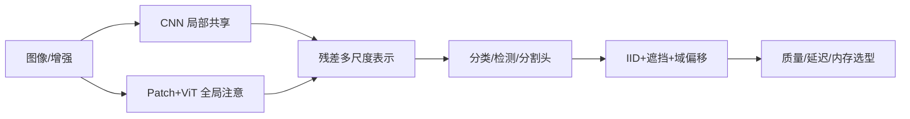

# 03 · 卷积、视觉骨干与归纳偏置

> 一句话点题：CNN 与 ViT 的差异不是旧与新，而是谁把局部性、全局性和数据规模假设写进架构。

<div class="lesson-meta"><span>DLF07—DLF08—DLF09</span><span>核心主线</span><span>预计 7 × 45 分钟</span><span>证据截止 2026-08-30</span></div>

## 解锁与跳过

需掌握卷积、矩阵乘法、反向传播和训练/验证对照。 即使你使用 AI 完成实现，也不能跳过本章的变量定义、反例和评测设计；这些部分决定你是否有能力发现一个“运行正常但结论错误”的系统。

## 本章可观察目标

完成后你能：解释卷积的局部连接、权共享与等变性；比较 ResNet、ViT 与现代卷积的归纳偏置；按数据量、算力和延迟选择视觉骨干。阅读完成不计掌握；至少需要一次不看答案的解释、一次实际应用和一次边界判断。

## 研究问题：局部性、平移等变与全局注意力之间如何取舍？

小型工业缺陷数据上，ViT 可能因缺乏预训练和错误增强而不如 CNN；大规模预训练后，ViT 又能获得更强迁移。模型参数相近不代表 FLOPs、内存访问和边缘延迟相同。图像分类分数也不代表定位、遮挡和域偏移下可靠。

问题必须被写成“输入、状态、动作/输出、损失、约束、证据和停止条件”的组合。只写“提升效果”会把数据、算法、交互与业务结果混在一起，也无法设计反事实或消融。

## 三个知识节点怎样连接

| 节点 | 核心对象 | 最小充分解释 | 必须支持的决策 |
|---|---|---|---|
| DLF07 | 卷积偏置 | 局部感受野和权共享编码平移结构 | 局部模式是否稳定可复用 |
| DLF08 | 残差骨干 | 恒等捷径让深层网络学习增量变换 | 深度是否带来可优化收益 |
| DLF09 | 视觉 Transformer | 图像 patch token 通过全局注意力交互 | 数据/预训练是否支撑更弱偏置 |

三者不是并列名词：第一个节点通常建立对象和假设，第二个节点解释机制，第三个节点把机制放进测量或交付边界。缺任何一层，都容易把局部指标误当成系统结论。

## 核心机制：局部等变、残差优化与 patch 注意力

卷积核在空间滑动实现平移等变，池化/步幅扩大感受野并降低分辨率。ResNet 让块学习 $F(x)$ 并输出 $x+F(x)$，改善深网络信号传播。ViT 把 patch 投影为 token，加位置编码后用多头自注意力全局混合。ConvNeXt 等反向吸收 Transformer 的训练和宏观设计，说明性能来自一组设计而非单一算子。

理解机制时要区分三种量：**被设计者直接控制的变量**、**环境或数据生成过程决定的变量**、**只能通过代理指标观测的潜变量**。可靠实验一次只改变主要因子，其余配置进入版本化运行记录。

## 关键公式、假设与推导

二维卷积可写为

$$
y_{i,j,c_o}=\sum_{u,v,c_i}K_{u,v,c_i,c_o}x_{i+u,j+v,c_i}.
$$

残差块 $y=x+F(x)$ 的梯度包含恒等路径：

$$
\frac{\partial L}{\partial x}=\frac{\partial L}{\partial y}\left(I+\frac{\partial F}{\partial x}\right).
$$

公式不是装饰。逐项检查：

- 卷积等变会被边界、步幅和池化改变
- 感受野理论大小不等于有效感受野
- patch 大小决定序列长度和细粒度信息
- 预训练数据与增强可能比骨干名字更影响结果

若假设不成立，正确做法不是继续套公式，而是换估计量、改采样/实验设计、缩小结论或明确拒绝自动决策。

## 证据拆解1：Deep Residual Learning for Image Recognition

### 研究问题

为什么更深网络出现退化，恒等捷径能否使其可优化？

### 核心机制、实验与指标

ResNet 用残差块和 shortcut 让网络学习相对恒等映射的增量，构建 50/101/152 层视觉网络。

论文在 ImageNet 和检测任务取得当时领先，并显示普通深网络训练误差反而更高的退化现象。

### 真正贡献、局限与适用边界

贡献是提供可扩展深度的优化接口，影响远超视觉。 原始结果不能代表今天最优骨干；残差也不保证任意深度/尺度稳定。

## 证据拆解2：An Image is Worth 16x16 Words

### 研究问题

纯 Transformer 在足够预训练数据下能否替代卷积视觉骨干？

### 核心机制、实验与指标

ViT 将图像分 patch、线性嵌入并用标准 Transformer encoder；依赖大规模监督预训练后迁移到中等图像任务。

作者报告在大预训练规模下匹配或超过强 CNN，同时训练计算更有竞争力。

### 真正贡献、局限与适用边界

贡献是证明视觉可统一成 token 序列建模。 小数据、边缘延迟和密集预测需要独立对照，不能从 ImageNet 迁移成绩概括。

## 证据拆解3：A ConvNet for the 2020s

### 研究问题

若逐步把现代训练和 Transformer 宏观设计移植到卷积，CNN 能否保持竞争力？

### 核心机制、实验与指标

ConvNeXt 从 ResNet 出发，调整 stage 比例、patchify stem、深度可分离卷积、LayerNorm、激活和训练策略。

论文在分类、检测与分割展示与同规模 Transformer 竞争。

### 真正贡献、局限与适用边界

贡献是用受控现代化削弱“注意力单独带来全部提升”的归因。 具体硬件效率与实现相关，架构消融也无法穷尽所有交互。

## 从论文或标准到产品主张：证据审计

| 日期 | 一手来源 | 它真正回答的问题 | 不能据此外推什么 |
|---|---|---|---|
| 2015-12-10 | Deep Residual Learning for Image Recognition | 为什么更深网络出现退化，恒等捷径能否使其可优化？ | 原始结果不能代表今天最优骨干；残差也不保证任意深度/尺度稳定。 |
| 2021-06-03 | An Image is Worth 16x16 Words | 纯 Transformer 在足够预训练数据下能否替代卷积视觉骨干？ | 小数据、边缘延迟和密集预测需要独立对照，不能从 ImageNet 迁移成绩概括。 |
| 2022-03-02 | A ConvNet for the 2020s | 若逐步把现代训练和 Transformer 宏观设计移植到卷积，CNN 能否保持竞争力？ | 具体硬件效率与实现相关，架构消融也无法穷尽所有交互。 |

阅读来源时按四步记录：先抄下研究对象、比较基线、数据/场景和预算，再定位结果表或正式条文；随后区分作者直接观察、由结果支持的解释和你准备迁移到项目的推论；最后为推论写一个能推翻它的反例。**来源新并不等于证据强**：预印本、公司技术报告、正式标准、法规和独立复现承担的证明责任不同。数字必须连同分母、置信区间、硬件/本体、语言/人群与失败样本一起保存。

如果来源只证明组件指标改善，不得自动升级成端到端任务、真实用户价值、物理安全或合规结论。迁移到自己的项目时至少保留一个原方法基线、一个更简单基线和一个不使用该能力的基线；结果冲突时，优先检查任务定义、样本污染、资源预算、评价器偏差和运行边界，而不是挑选最符合预期的一项。

## 机制图：从输入到可验证结果



图中每条边都应能对应日志、数据版本、物理状态或人工记录；无法观测的边必须标为假设，不允许用模型的一段解释代替真实状态。

## 贯穿案例：产线表面缺陷检测

只有 8,000 张图、缺陷尺寸小且相机固定。保留轻量 CNN 从头训练、预训练 ConvNeXt 和 ViT 三组；patch 不能大到吞掉细裂纹。按生产批次和相机分组测试，增加亮度、污染和遮挡切片。最终以漏检成本、边缘设备 P95 和校准选择，而非只看 ImageNet 架构声誉。

案例的重点不是跑出最高分，而是保存“为什么选择这条路径”的证据：基线是什么、哪个假设最危险、失败怎样分层、什么条件触发降级或人工接管。

## 复现任务：最小因果链

1. 固定图像分辨率与训练预算比较 CNN/ViT
2. 从小数据到增加预训练逐级改变数据条件
3. 用遮挡/平移测试等变和鲁棒性
4. 在目标硬件测预处理、推理和后处理完整延迟

复现不是成功运行作者代码。你必须固定数据/环境、预算和评价器，至少重复三次，报告均值、离散程度、失败样本和资源消耗；若只能跑一次，要把结论降级为演示证据。

## 三轮实验与消融路线

**第一轮：测量链校准。** 只运行最简单基线，检查输入单位、时间/坐标/权限、随机种子、日志和评价器。抽取成功与失败样本人工复核；若真值或测量本身不稳定，停止模型比较。输出必须能回答“同一次运行能否被另一人重放”。

**第二轮：机制消融。** 在同一数据、预算、硬件或运行条件下，一次只加入一个关键机制；对每次变化写预期影响、未变化项和失败阈值。除了主指标，还要检查最坏切片、过程约束、P95/P99、资源与人工成本。若提升只在一个方便切片出现，应缩小能力声明。

**第三轮：边界与迁移。** 有计划地改变本章公式假设或 ODD：时间、人群、语言、对象、气象、本体、延迟、权限或供应商至少选择两项；注入缺失、冲突和失效。记录系统是正确拒绝/降级/接管，还是带着错误自信继续。最终产物不是“最佳分数”，而是一个可复核的能力范围、反例集和下一次变更会触发的回归集合。

## 实验与指标

| 维度 | 至少记录什么 | 为什么 |
|---|---|---|
| 任务质量 | 主指标、切片、置信区间与失败样本 | 确认改进是否稳定且可解释 |
| 训练 | loss、梯度/激活、吞吐、显存、数据量、FLOPs | 区分算法收益和更多计算 |
| 推理 | 首 Token、每 Token、P50/P95、吞吐、峰值内存 | 模型参数量不等于用户体验 |
| 风险 | 校准、偏移、攻击、记忆/污染与能耗 | 把能力放入真实部署边界 |

同时保留一个简单基线和一个“什么都不做/人工流程”基线。复杂方案只有在质量、成本、时延、风险或可扩展性至少一个维度形成可重复净收益时才晋级。

## 对产品、系统或研究架构的影响

- 骨干选型绑定数据规模、任务粒度和硬件
- 增强变换需验证语义合法
- 分类之外保留定位/区域证据
- 延迟使用目标设备端到端测量

这些决策应进入 PRD、实验卡、接口契约、安全案例或 ADR，而不只留在学习笔记。模型、数据、提示、硬件、环境与评价器任何一个升级，都要能触发有范围的回归测试。

## 会死在哪里

- 用参数量代替实际延迟
- patch 大小抹去小目标
- 训练/测试拍摄批次泄漏
- 使用翻转等不合法增强
- 用分类准确率代表安全漏检

失败分析要写“触发条件—可观测信号—影响—检测—缓解—残余风险”。只写“模型可能出错”没有工程价值。

## 与 AI 协作模板

```text
请为视觉任务设计 CNN、ConvNeXt、ViT 公平比较：固定数据、预训练条件、分辨率、训练 FLOPs 和调参预算；按实体/设备/批次切分；报告质量、校准、遮挡/光照/域偏移、目标硬件 P95 与内存。解释局部/全局归纳偏置，不按架构新旧选型。
```

使用模板后仍需检查 AI 是否虚构来源、混用时间口径、悄悄改变任务定义，或把模拟结果外推到真实系统。

## 练习：测量数据规模如何改变骨干排名

在 10%、30%、100% 数据量下训练小 CNN 和小 ViT，分别加入/不加入预训练；画质量—数据—计算曲线并解释排名翻转。

提交物必须包含一个反例或失败样本。只有成功案例会让你误以为已经掌握；边界证据才能说明你知道方法何时不该用。

## 常见误区

ViT 已淘汰 CNN；卷积天然平移不变；参数少一定更快；预训练收益等于架构收益；ImageNet 领先等于领域任务领先。共同根因是把一个条件成立时的局部结论，扩张成不带条件的能力判断。

## 自测

<Quiz question="小缺陷任务使用过大 patch 最直接的风险是什么？" :options='["梯度一定爆炸","细粒度缺陷在 token 化时被平均或丢失","模型参数变成零"]' :answer="1" explanation="patch 是信息瓶颈，粒度需匹配目标尺度。" />

## 本章小结

- CNN 编码局部共享，ViT 借数据学习关系
- 残差结构改善深层优化
- 现代训练模糊了架构二分
- 选型必须联结任务、数据和硬件

<EvidenceTracker lesson="field-deep-learning-03-cnn-vision" />

## 本章完成标准

不看正文解释 CNN、ResNet 和 ViT 的归纳偏置；完成 一份跨数据规模的视觉骨干对照；能指出 ImageNet 排名无法直接迁移的条件。最近相关题平均至少 7/10 才标记为 basic；跨日期完成变式任务并达到 8.5/10，才标记为 proficient。

<div class="source-note">主要来源（证据截止 2026-08-30）：<a href="https://arxiv.org/abs/1512.03385">ResNet</a>、<a href="https://arxiv.org/abs/2010.11929">ViT</a>、<a href="https://arxiv.org/abs/2201.03545">ConvNeXt</a>。数字只描述来源中的实验设置；标准、法规与产品能力均按页面版本和适用范围解释。</div>
