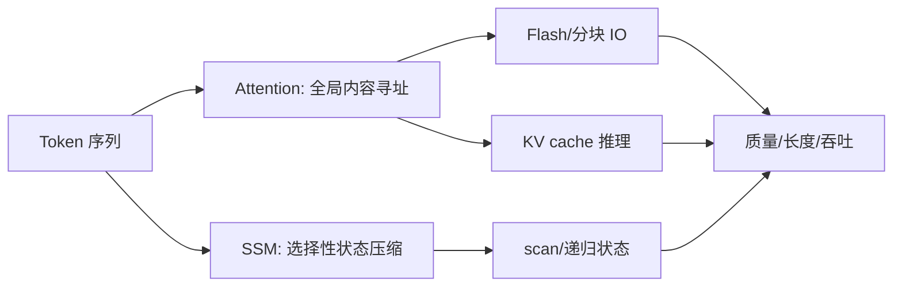

# 04 · 序列建模、Transformer 与 SSM

> 一句话点题：序列架构的竞争不是 $O(n^2)$ 与 $O(n)$ 的口号，而是内容检索、状态压缩、硬件利用和真实长度分布的联合问题。

<div class="lesson-meta"><span>DLF10—DLF11—DLF12</span><span>核心主线</span><span>预计 7 × 45 分钟</span><span>证据截止 2026-08-30</span></div>

## 解锁与跳过

需掌握矩阵乘法、残差/归一化、序列张量和基本复杂度。 即使你使用 AI 完成实现，也不能跳过本章的变量定义、反例和评测设计；这些部分决定你是否有能力发现一个“运行正常但结论错误”的系统。

## 本章可观察目标

完成后你能：推导自注意力与因果掩码；解释 KV cache、FlashAttention 和长序列瓶颈；比较 Transformer 与选择性 SSM 的质量/吞吐/记忆。阅读完成不计掌握；至少需要一次不看答案的解释、一次实际应用和一次边界判断。

## 研究问题：注意力的二次复杂度是否意味着 Transformer 必然被替代？

标准注意力能让任意 token 直接比较，却为训练构造 $n^2$ 关系；自回归推理又被 KV cache 容量和内存带宽限制。线性 SSM 压缩历史，长序列吞吐更好，但固定状态可能丢失精确回忆。论文中的百万长度不代表每种任务都有效利用百万上下文。

问题必须被写成“输入、状态、动作/输出、损失、约束、证据和停止条件”的组合。只写“提升效果”会把数据、算法、交互与业务结果混在一起，也无法设计反事实或消融。

## 三个知识节点怎样连接

| 节点 | 核心对象 | 最小充分解释 | 必须支持的决策 |
|---|---|---|---|
| DLF10 | 注意力 | 内容寻址的全局加权聚合 | 任务是否需要任意位置直接交互 |
| DLF11 | 高效实现 | 通过分块、融合和缓存减少内存 IO/重复计算 | 瓶颈在 FLOPs、带宽还是容量 |
| DLF12 | 选择性 SSM | 输入依赖状态更新以线性扫描保留/遗忘信息 | 长序列和内容检索如何权衡 |

三者不是并列名词：第一个节点通常建立对象和假设，第二个节点解释机制，第三个节点把机制放进测量或交付边界。缺任何一层，都容易把局部指标误当成系统结论。

## 核心机制：内容寻址、IO-aware attention 与选择性状态

Transformer 由 $QK^T$ 得到内容相关权重并聚合 $V$，因果 mask 阻止看未来。FlashAttention 不近似注意力，而是分块把中间矩阵留在片上 SRAM，减少 HBM 读写。Mamba 让 SSM 参数依输入变化，选择保留/忘记 token，并用 hardware-aware scan 并行训练、递归推理。

理解机制时要区分三种量：**被设计者直接控制的变量**、**环境或数据生成过程决定的变量**、**只能通过代理指标观测的潜变量**。可靠实验一次只改变主要因子，其余配置进入版本化运行记录。

## 关键公式、假设与推导

缩放点积注意力：

$$
\operatorname{Attn}(Q,K,V)=\operatorname{softmax}\left(\frac{QK^T}{\sqrt{d_k}}+M\right)V.
$$

离散状态空间模型：

$$
h_t=\bar A(x_t)h_{t-1}+\bar B(x_t)x_t,\qquad y_t=C(x_t)h_t.
$$

公式不是装饰。逐项检查：

- softmax 权重是模型路由而非人类可解释因果
- FlashAttention 改变 IO 复杂度而非数学结果
- KV cache 大小随层、头、长度和 dtype 增长
- SSM 线性时间不保证精确任意位置检索

若假设不成立，正确做法不是继续套公式，而是换估计量、改采样/实验设计、缩小结论或明确拒绝自动决策。

## 证据拆解1：FlashAttention

### 研究问题

能否通过 IO-aware 精确算法加速注意力并降低内存？

### 核心机制、实验与指标

算法把 $Q,K,V$ 分块，在 SRAM 中在线维护 softmax 统计，避免物化完整注意力矩阵；并给出 HBM IO 分析。

论文报告相对基线显著加速和节省内存，并支持更长上下文。

### 真正贡献、局限与适用边界

贡献是把硬件内存层级变成算法设计变量。 收益依 GPU、序列形状、内核和后续版本；不能把理论 FLOPs 当实际速度。

## 证据拆解2：Mamba: Linear-Time Sequence Modeling with Selective State Spaces

### 研究问题

SSM 如何获得内容相关选择能力并在语言上接近注意力？

### 核心机制、实验与指标

Mamba 使状态更新参数依输入变化，使用硬件感知并行 scan；网络不使用注意力或传统 MLP 块。

论文报告 3B Mamba 超过同规模 Transformer、匹配约两倍规模模型，并称推理吞吐最高约 5 倍、长度线性扩展。

### 真正贡献、局限与适用边界

贡献是让内容选择与线性状态更新结合成强通用骨干。 指标来自特定模型、硬件与 2023 基线；精确回忆和现代混合架构需重新测试。

## 从论文或标准到产品主张：证据审计

| 日期 | 一手来源 | 它真正回答的问题 | 不能据此外推什么 |
|---|---|---|---|
| 2022-06-23 | FlashAttention | 能否通过 IO-aware 精确算法加速注意力并降低内存？ | 收益依 GPU、序列形状、内核和后续版本；不能把理论 FLOPs 当实际速度。 |
| 2023-12-01 | Mamba: Linear-Time Sequence Modeling with Selective State Spaces | SSM 如何获得内容相关选择能力并在语言上接近注意力？ | 指标来自特定模型、硬件与 2023 基线；精确回忆和现代混合架构需重新测试。 |

阅读来源时按四步记录：先抄下研究对象、比较基线、数据/场景和预算，再定位结果表或正式条文；随后区分作者直接观察、由结果支持的解释和你准备迁移到项目的推论；最后为推论写一个能推翻它的反例。**来源新并不等于证据强**：预印本、公司技术报告、正式标准、法规和独立复现承担的证明责任不同。数字必须连同分母、置信区间、硬件/本体、语言/人群与失败样本一起保存。

如果来源只证明组件指标改善，不得自动升级成端到端任务、真实用户价值、物理安全或合规结论。迁移到自己的项目时至少保留一个原方法基线、一个更简单基线和一个不使用该能力的基线；结果冲突时，优先检查任务定义、样本污染、资源预算、评价器偏差和运行边界，而不是挑选最符合预期的一项。

## 机制图：从输入到可验证结果



图中每条边都应能对应日志、数据版本、物理状态或人工记录；无法观测的边必须标为假设，不允许用模型的一段解释代替真实状态。

## 贯穿案例：百万日志序列异常定位

任务既要检测长期趋势，也要精确找回某次关键错误。比较窗口 Transformer、Mamba 和混合层；数据按真实会话长度分层。指标包括异常 F1、关键事件 needle、多跳依赖、tokens/s、峰值显存和长序列衰减。若 SSM 吞吐领先但精确回忆失败，可用层次索引或局部 attention，而不是宣称架构绝对胜负。

案例的重点不是跑出最高分，而是保存“为什么选择这条路径”的证据：基线是什么、哪个假设最危险、失败怎样分层、什么条件触发降级或人工接管。

## 复现任务：最小因果链

1. 手算四 token 单头注意力和 mask
2. 在同一参数/训练 token 下比较小 Transformer 与 Mamba
3. 按 1k/8k/32k 长度报告质量、吞吐和内存
4. 加入精确复制与长期聚合两类合成任务定位偏置

复现不是成功运行作者代码。你必须固定数据/环境、预算和评价器，至少重复三次，报告均值、离散程度、失败样本和资源消耗；若只能跑一次，要把结论降级为演示证据。

## 三轮实验与消融路线

**第一轮：测量链校准。** 只运行最简单基线，检查输入单位、时间/坐标/权限、随机种子、日志和评价器。抽取成功与失败样本人工复核；若真值或测量本身不稳定，停止模型比较。输出必须能回答“同一次运行能否被另一人重放”。

**第二轮：机制消融。** 在同一数据、预算、硬件或运行条件下，一次只加入一个关键机制；对每次变化写预期影响、未变化项和失败阈值。除了主指标，还要检查最坏切片、过程约束、P95/P99、资源与人工成本。若提升只在一个方便切片出现，应缩小能力声明。

**第三轮：边界与迁移。** 有计划地改变本章公式假设或 ODD：时间、人群、语言、对象、气象、本体、延迟、权限或供应商至少选择两项；注入缺失、冲突和失效。记录系统是正确拒绝/降级/接管，还是带着错误自信继续。最终产物不是“最佳分数”，而是一个可复核的能力范围、反例集和下一次变更会触发的回归集合。

## 实验与指标

| 维度 | 至少记录什么 | 为什么 |
|---|---|---|
| 任务质量 | 主指标、切片、置信区间与失败样本 | 确认改进是否稳定且可解释 |
| 训练 | loss、梯度/激活、吞吐、显存、数据量、FLOPs | 区分算法收益和更多计算 |
| 推理 | 首 Token、每 Token、P50/P95、吞吐、峰值内存 | 模型参数量不等于用户体验 |
| 风险 | 校准、偏移、攻击、记忆/污染与能耗 | 把能力放入真实部署边界 |

同时保留一个简单基线和一个“什么都不做/人工流程”基线。复杂方案只有在质量、成本、时延、风险或可扩展性至少一个维度形成可重复净收益时才晋级。

## 对产品、系统或研究架构的影响

- 序列骨干选择按任务记忆类型与长度分布
- 训练和推理分别测 IO 与内存
- 长上下文宣传需通过检索、聚合和缺失信息测试
- 混合架构保留可消融层比例

这些决策应进入 PRD、实验卡、接口契约、安全案例或 ADR，而不只留在学习笔记。模型、数据、提示、硬件、环境与评价器任何一个升级，都要能触发有范围的回归测试。

## 会死在哪里

- 把 $O(n)$ 当所有硬件都更快
- 用 needle 检索代表长程推理
- 忽略 KV cache 精度和并发
- 把 attention map 当解释
- 比较不同训练数据/参数的架构

失败分析要写“触发条件—可观测信号—影响—检测—缓解—残余风险”。只写“模型可能出错”没有工程价值。

## 与 AI 协作模板

```text
请为序列任务比较 Transformer、FlashAttention 实现、选择性 SSM 与混合架构。固定参数、训练 token、数据和硬件；按长度报告任务质量、精确回忆、聚合、多跳、吞吐、首 token、峰值显存和 KV/状态容量；指出 IO、FLOPs 与内容记忆的不同瓶颈。
```

使用模板后仍需检查 AI 是否虚构来源、混用时间口径、悄悄改变任务定义，或把模拟结果外推到真实系统。

## 练习：让线性架构和注意力各赢一次

构造一个长期平均任务和一个任意位置精确复制任务，在多长度下对照两类模型；解释归纳偏置而非只报总平均。

提交物必须包含一个反例或失败样本。只有成功案例会让你误以为已经掌握；边界证据才能说明你知道方法何时不该用。

## 常见误区

注意力天然可解释；FlashAttention 是近似；线性复杂度必然低延迟；百万上下文等于百万有效推理；KV cache 只与参数量有关。共同根因是把一个条件成立时的局部结论，扩张成不带条件的能力判断。

## 自测

<Quiz question="FlashAttention 为什么能在数学结果近似不变时提速？" :options='["删除大部分 token","分块减少 HBM 与片上内存之间的 IO","把注意力换成卷积"]' :answer="1" explanation="核心是 IO-aware 精确计算。" />

## 本章小结

- 注意力提供全局内容寻址
- FlashAttention 优化 IO 而非改变目标
- Mamba 用输入选择压缩历史
- 真实选型需同时测记忆类型和系统性能

<EvidenceTracker lesson="field-deep-learning-04-sequence-transformer-ssm" />

## 本章完成标准

不看正文解释 attention 与选择性 SSM 的状态差异；完成 一个按长度分层的质量/吞吐对照；能指出 线性复杂度不保证更优的条件。最近相关题平均至少 7/10 才标记为 basic；跨日期完成变式任务并达到 8.5/10，才标记为 proficient。

<div class="source-note">主要来源（证据截止 2026-08-30）：<a href="https://arxiv.org/abs/2205.14135">FlashAttention</a>、<a href="https://arxiv.org/abs/2312.00752">Mamba</a>。数字只描述来源中的实验设置；标准、法规与产品能力均按页面版本和适用范围解释。</div>
