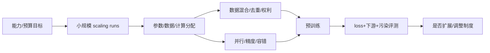

# 05 · 预训练、数据与缩放定律

> 一句话点题：缩放律是特定数据与架构区间内的预算工具，不是“越大必然越智能”的自然定律。

<div class="lesson-meta"><span>DLF13—DLF14—DLF15</span><span>强化核心</span><span>预计 7 × 45 分钟</span><span>证据截止 2026-08-30</span></div>

## 解锁与跳过

需理解训练动力学、Transformer 和统计泛化；不要求具备集群运维经验。 即使你使用 AI 完成实现，也不能跳过本章的变量定义、反例和评测设计；这些部分决定你是否有能力发现一个“运行正常但结论错误”的系统。

## 本章可观察目标

完成后你能：用缩放律区分参数、数据与计算；审计训练数据混合、去重和污染；阅读技术报告时归一化 token、FLOPs、硬件与能力主张。阅读完成不计掌握；至少需要一次不看答案的解释、一次实际应用和一次边界判断。

## 研究问题：增加参数、数据与计算时，收益和风险分别如何缩放？

参数量、训练 Token 和 FLOPs 经常被混为“规模”。重复低质量数据会降低有效信息，数据污染又让基准分数失真。技术报告中的 GPU 小时受芯片、利用率、精度和并行策略影响，不能直接横比。缩放拟合若跨越架构/数据制度变化，外推可能失败。

问题必须被写成“输入、状态、动作/输出、损失、约束、证据和停止条件”的组合。只写“提升效果”会把数据、算法、交互与业务结果混在一起，也无法设计反事实或消融。

## 三个知识节点怎样连接

| 节点 | 核心对象 | 最小充分解释 | 必须支持的决策 |
|---|---|---|---|
| DLF13 | 缩放律 | 在给定范式内拟合损失随模型、数据和计算的规律 | 如何分配有限预训练预算 |
| DLF14 | 数据混合 | 质量、重复、领域和顺序共同塑造能力 | 收集、过滤、重采样和权利边界 |
| DLF15 | 训练系统 | 并行、精度、通信和容错决定可实现算力 | 理论方案是否能稳定跑完 |

三者不是并列名词：第一个节点通常建立对象和假设，第二个节点解释机制，第三个节点把机制放进测量或交付边界。缺任何一层，都容易把局部指标误当成系统结论。

## 核心机制：计算最优分配与数据—系统协同

经验缩放律在固定范式下拟合 loss 随参数 $N$、数据 $D$ 或计算 $C$ 的幂律；Chinchilla 结论强调给定计算下模型与数据应共同扩展。数据管道进行语言/领域配比、质量过滤、去重、污染检测和权利治理。系统用数据/张量/流水线/专家并行与低精度提高利用率，但通信、负载不均和故障会改变有效计算。

理解机制时要区分三种量：**被设计者直接控制的变量**、**环境或数据生成过程决定的变量**、**只能通过代理指标观测的潜变量**。可靠实验一次只改变主要因子，其余配置进入版本化运行记录。

## 关键公式、假设与推导

常见经验形式：

$$
L(N,D)\approx L_\infty + A N^{-\alpha}+B D^{-\beta},
\qquad C\approx 6ND
$$

（常数与指数依实现和定义）。计算最优选择是在约束 $C$ 下最小化估计损失，而不是单独最大化 $N$。

公式不是装饰。逐项检查：

- 幂律只在观测尺度和固定数据/架构制度内可信
- token 不是跨 tokenizer 完全可比的数据单位
- $6ND$ 是粗略 dense Transformer 训练估计
- 下游能力、安全和涌现不能由预训练 loss 唯一决定

若假设不成立，正确做法不是继续套公式，而是换估计量、改采样/实验设计、缩小结论或明确拒绝自动决策。

## 证据拆解1：Training Compute-Optimal Large Language Models

### 研究问题

固定训练计算时，模型大小与训练 token 应怎样配置？

### 核心机制、实验与指标

Chinchilla 通过大量小规模训练拟合参数/数据缩放，提出当时许多大模型训练不足，并训练 70B 参数、1.4T token 模型对照。

论文报告 Chinchilla 以更小参数在多个任务超过更大 Gopher，同时推理更便宜。

### 真正贡献、局限与适用边界

贡献是把数据量重新放回计算最优配比。 指数依数据质量、架构和训练制度；现代重复训练、MoE 与后训练不能简单套用。

## 证据拆解2：The Llama 3 Herd of Models

### 研究问题

开源权重级别的现代基础模型如何组织数据、规模、后训练和安全评测？

### 核心机制、实验与指标

报告描述最高 405B dense 模型、15T+ token 预训练、多语言/代码数据、扩展上下文及 SFT/偏好优化流程。

作者跨知识、推理、代码、多语言和人工偏好给出广泛评测。

### 真正贡献、局限与适用边界

贡献是相对完整地公开模型族训练与后训练设计。 训练数据细节和基础设施仍不完全开放，厂商自评与公开 benchmark 存在污染/选择风险。

## 证据拆解3：DeepSeek-V3

### 研究问题

稀疏 MoE、MLA 和低精度系统怎样改变训练/推理资源分配？

### 核心机制、实验与指标

671B 总参数、37B 激活参数模型在 14.8T token 上训练，结合专家路由、MLA 和 FP8 系统设计。

报告给出 2.788M H800 GPU 小时和广泛评测，显示稀疏激活的成本路径。

### 真正贡献、局限与适用边界

贡献是算法/系统联合的开放技术报告。 硬件、软件与计费口径特定，且总参数、激活参数与能力不可线性换算。

## 从论文或标准到产品主张：证据审计

| 日期 | 一手来源 | 它真正回答的问题 | 不能据此外推什么 |
|---|---|---|---|
| 2022-03-29 | Training Compute-Optimal Large Language Models | 固定训练计算时，模型大小与训练 token 应怎样配置？ | 指数依数据质量、架构和训练制度；现代重复训练、MoE 与后训练不能简单套用。 |
| 2024-07-23 | The Llama 3 Herd of Models | 开源权重级别的现代基础模型如何组织数据、规模、后训练和安全评测？ | 训练数据细节和基础设施仍不完全开放，厂商自评与公开 benchmark 存在污染/选择风险。 |
| 2024-12-27 | DeepSeek-V3 | 稀疏 MoE、MLA 和低精度系统怎样改变训练/推理资源分配？ | 硬件、软件与计费口径特定，且总参数、激活参数与能力不可线性换算。 |

阅读来源时按四步记录：先抄下研究对象、比较基线、数据/场景和预算，再定位结果表或正式条文；随后区分作者直接观察、由结果支持的解释和你准备迁移到项目的推论；最后为推论写一个能推翻它的反例。**来源新并不等于证据强**：预印本、公司技术报告、正式标准、法规和独立复现承担的证明责任不同。数字必须连同分母、置信区间、硬件/本体、语言/人群与失败样本一起保存。

如果来源只证明组件指标改善，不得自动升级成端到端任务、真实用户价值、物理安全或合规结论。迁移到自己的项目时至少保留一个原方法基线、一个更简单基线和一个不使用该能力的基线；结果冲突时，优先检查任务定义、样本污染、资源预算、评价器偏差和运行边界，而不是挑选最符合预期的一项。

## 机制图：从输入到可验证结果



图中每条边都应能对应日志、数据版本、物理状态或人工记录；无法观测的边必须标为假设，不允许用模型的一段解释代替真实状态。

## 贯穿案例：训练一个 1B 中文领域模型

预算不是先定 1B 参数再塞数据，而是用 50M/100M/300M 小模型在多个 token 配比做 pilot，拟合 loss 与下游任务；对领域数据去重并保留文档级时间切分。报告 tokenizer 后 token、有效样本、FLOPs、GPU 利用率和碳/费用。若领域 SFT/RAG 已达到目标，不因缩放曲线漂亮就启动全量预训练。

案例的重点不是跑出最高分，而是保存“为什么选择这条路径”的证据：基线是什么、哪个假设最危险、失败怎样分层、什么条件触发降级或人工接管。

## 复现任务：最小因果链

1. 训练至少三个参数规模和三个数据量组合
2. 拟合幂律并保留未参与拟合的点验证
3. 对数据去重前后比较 memorization 与下游
4. 将 GPU 小时换算为硬件、精度、利用率和估计 FLOPs

复现不是成功运行作者代码。你必须固定数据/环境、预算和评价器，至少重复三次，报告均值、离散程度、失败样本和资源消耗；若只能跑一次，要把结论降级为演示证据。

## 三轮实验与消融路线

**第一轮：测量链校准。** 只运行最简单基线，检查输入单位、时间/坐标/权限、随机种子、日志和评价器。抽取成功与失败样本人工复核；若真值或测量本身不稳定，停止模型比较。输出必须能回答“同一次运行能否被另一人重放”。

**第二轮：机制消融。** 在同一数据、预算、硬件或运行条件下，一次只加入一个关键机制；对每次变化写预期影响、未变化项和失败阈值。除了主指标，还要检查最坏切片、过程约束、P95/P99、资源与人工成本。若提升只在一个方便切片出现，应缩小能力声明。

**第三轮：边界与迁移。** 有计划地改变本章公式假设或 ODD：时间、人群、语言、对象、气象、本体、延迟、权限或供应商至少选择两项；注入缺失、冲突和失效。记录系统是正确拒绝/降级/接管，还是带着错误自信继续。最终产物不是“最佳分数”，而是一个可复核的能力范围、反例集和下一次变更会触发的回归集合。

## 实验与指标

| 维度 | 至少记录什么 | 为什么 |
|---|---|---|
| 任务质量 | 主指标、切片、置信区间与失败样本 | 确认改进是否稳定且可解释 |
| 训练 | loss、梯度/激活、吞吐、显存、数据量、FLOPs | 区分算法收益和更多计算 |
| 推理 | 首 Token、每 Token、P50/P95、吞吐、峰值内存 | 模型参数量不等于用户体验 |
| 风险 | 校准、偏移、攻击、记忆/污染与能耗 | 把能力放入真实部署边界 |

同时保留一个简单基线和一个“什么都不做/人工流程”基线。复杂方案只有在质量、成本、时延、风险或可扩展性至少一个维度形成可重复净收益时才晋级。

## 对产品、系统或研究架构的影响

- 扩展前必须用 pilot 预测并设停止阈值
- 数据账本记录来源、许可、语言/领域和去重
- benchmark 污染检查在评测前冻结
- 训练成本和下游/安全收益同表决策

这些决策应进入 PRD、实验卡、接口契约、安全案例或 ADR，而不只留在学习笔记。模型、数据、提示、硬件、环境与评价器任何一个升级，都要能触发有范围的回归测试。

## 会死在哪里

- 跨 tokenizer 直接比较 token 数
- 用 GPU 小时代替 FLOPs/费用
- 在少量尺度上过度外推
- 重复数据制造表面 loss 收益
- 把预训练 loss 当所有能力代理

失败分析要写“触发条件—可观测信号—影响—检测—缓解—残余风险”。只写“模型可能出错”没有工程价值。

## 与 AI 协作模板

```text
请为预训练计划建立 compute/data/model 预算。设计多个 pilot 点拟合并外部验证缩放律；记录 tokenizer、有效 token、重复率、来源许可、领域配比；把 GPU 小时拆为硬件、精度、利用率和 FLOPs；给出下游、安全、污染与停止门槛，不从参数量直接推断能力。
```

使用模板后仍需检查 AI 是否虚构来源、混用时间口径、悄悄改变任务定义，或把模拟结果外推到真实系统。

## 练习：拟合一个会失败的缩放律

用小规模运行拟合幂律，再故意在最大点改变数据质量或架构，观察外推残差；解释制度变化为何使旧曲线失效。

提交物必须包含一个反例或失败样本。只有成功案例会让你误以为已经掌握；边界证据才能说明你知道方法何时不该用。

## 常见误区

参数越多必然更强；Chinchilla 比例是永久常数；token 是统一信息单位；GPU 小时可跨硬件直接比；更多数据不需要权利和重复审计。共同根因是把一个条件成立时的局部结论，扩张成不带条件的能力判断。

## 自测

<Quiz question="固定计算预算下，为什么不能只增大参数？" :options='["参数不参与训练","数据不足会使大模型训练不足，需联合分配 N 与 D","GPU 不支持参数"]' :answer="1" explanation="计算最优取决于参数和训练数据的联合缩放。" />

## 本章小结

- 缩放律是局部经验预算模型
- 参数、数据和计算需联合分配
- 数据质量/权利与系统利用率决定有效规模
- 任何制度变化都需重新校准外推

<EvidenceTracker lesson="field-deep-learning-05-pretraining-scaling-data" />

## 本章完成标准

不看正文解释 计算最优缩放与单纯放大参数的区别；完成 一份含 pilot 外部验证的训练预算；能指出 幂律跨制度外推失效的原因。最近相关题平均至少 7/10 才标记为 basic；跨日期完成变式任务并达到 8.5/10，才标记为 proficient。

<div class="source-note">主要来源（证据截止 2026-08-30）：<a href="https://arxiv.org/abs/2203.15556">Chinchilla</a>、<a href="https://arxiv.org/abs/2407.21783">Llama 3</a>、<a href="https://arxiv.org/abs/2412.19437">DeepSeek-V3</a>。数字只描述来源中的实验设置；标准、法规与产品能力均按页面版本和适用范围解释。</div>
