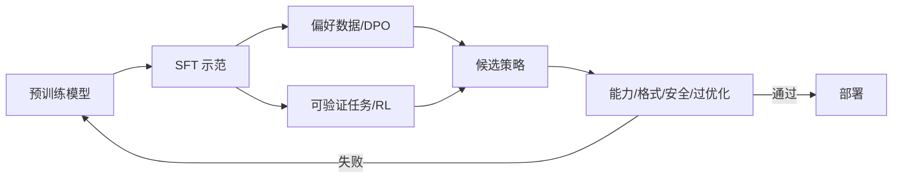

# 06 · 基础模型与后训练

> 一句话点题：后训练改变的是策略在提示条件下的行为分布；它既能释放能力，也能把评价器漏洞放大成系统性行为。

<div class="lesson-meta"><span>DLF16—DLF17—DLF18</span><span>强化核心</span><span>预计 7 × 45 分钟</span><span>证据截止 2026-08-30</span></div>

## 解锁与跳过

需理解预训练、条件生成、策略/奖励基本概念和离线评测。 即使你使用 AI 完成实现，也不能跳过本章的变量定义、反例和评测设计；这些部分决定你是否有能力发现一个“运行正常但结论错误”的系统。

## 本章可观察目标

完成后你能：区分 SFT、奖励建模、偏好优化与可验证 RL；推导 DPO 和策略优化的核心比率；建立行为回归、过优化和 reward hacking 门禁。阅读完成不计掌握；至少需要一次不看答案的解释、一次实际应用和一次边界判断。

## 研究问题：SFT、偏好优化与强化学习分别改变了什么分布？

SFT 可教格式却覆盖有限；偏好数据受标注者和采样策略影响；RL 在数学/代码等可验证任务上有清晰奖励，却可能学会长度、格式或测试漏洞。训练分数提升不等于知识增加，也不等于跨领域安全。需要保留基础模型、SFT、偏好/RL 多个 checkpoint 做同数据消融。

问题必须被写成“输入、状态、动作/输出、损失、约束、证据和停止条件”的组合。只写“提升效果”会把数据、算法、交互与业务结果混在一起，也无法设计反事实或消融。

## 三个知识节点怎样连接

| 节点 | 核心对象 | 最小充分解释 | 必须支持的决策 |
|---|---|---|---|
| DLF16 | 监督指令微调 | 在示范分布上最大化期望回答似然 | 格式/任务适配是否已有高质量示范 |
| DLF17 | 偏好优化 | 用成对/标量反馈改变输出相对偏好 | 反馈噪声与 KL 约束是否可控 |
| DLF18 | 可验证 RL | 在可检查结果上通过采样与奖励优化策略 | 探索能否带来真实推理而非投机 |

三者不是并列名词：第一个节点通常建立对象和假设，第二个节点解释机制，第三个节点把机制放进测量或交付边界。缺任何一层，都容易把局部指标误当成系统结论。

## 核心机制：从行为克隆到受约束策略优化

SFT 对专家示范做 teacher forcing。RLHF 训练奖励模型，再以 KL 约束策略不偏离参考；DPO 从 Bradley–Terry 偏好模型推导出直接比较 chosen/rejected 的分类目标，无需显式在线奖励模型。可验证 RL 用执行器/答案判定奖励采样轨迹；课程、采样温度、组相对优势与冷启动数据影响训练稳定和可读性。

理解机制时要区分三种量：**被设计者直接控制的变量**、**环境或数据生成过程决定的变量**、**只能通过代理指标观测的潜变量**。可靠实验一次只改变主要因子，其余配置进入版本化运行记录。

## 关键公式、假设与推导

DPO 常见目标为

$$
-\mathbb E\log\sigma\left(\beta\left[
\log\frac{\pi_\theta(y_w|x)}{\pi_{ref}(y_w|x)}-
\log\frac{\pi_\theta(y_l|x)}{\pi_{ref}(y_l|x)}
\right]\right).
$$

受 KL 约束的策略目标可概括为

$$
\max_\pi\mathbb E[r(x,y)]-\beta D_{KL}(\pi\|\pi_{ref}).
$$

公式不是装饰。逐项检查：

- 偏好对不等于绝对正确答案
- $\beta$ 控制偏好强度和参考约束
- 奖励可验证只证明判定器覆盖的结果
- 训练采样分布与部署提示分布可能不同

若假设不成立，正确做法不是继续套公式，而是换估计量、改采样/实验设计、缩小结论或明确拒绝自动决策。

## 证据拆解1：Direct Preference Optimization

### 研究问题

能否不用显式奖励模型和在线 RL 直接优化偏好？

### 核心机制、实验与指标

DPO 从 KL 约束奖励最优策略与 Bradley–Terry 偏好概率关系推导封闭目标，用 chosen/rejected 对训练策略。

论文在摘要、对话等任务报告与 PPO 类方法竞争且训练简单稳定。

### 真正贡献、局限与适用边界

贡献是降低偏好对齐工程复杂度并形成广泛基线。 离线偏好覆盖、reference 和超参会限制效果；DPO 不自动解决标签偏差或分布外过优化。

## 证据拆解2：DeepSeek-R1

### 研究问题

大规模可验证 RL 能否在没有初始 SFT 时产生复杂推理行为？

### 核心机制、实验与指标

R1-Zero 直接对基础模型做 RL，观察到自我验证、反思与长推理，但出现可读性和语言混合；R1 加入 cold-start、分阶段 RL/SFT，并蒸馏到小模型。

报告称 R1 在多项数学、代码和推理基准接近当时强闭源模型，并开放权重。

### 真正贡献、局限与适用边界

贡献是提供可验证奖励驱动 reasoning 的大规模证据与训练配方。 厂商自报且依赖具体数据/奖励/预算；基准表现不能证明忠实思维过程或开放任务通用性。

## 从论文或标准到产品主张：证据审计

| 日期 | 一手来源 | 它真正回答的问题 | 不能据此外推什么 |
|---|---|---|---|
| 2023-05-29 | Direct Preference Optimization | 能否不用显式奖励模型和在线 RL 直接优化偏好？ | 离线偏好覆盖、reference 和超参会限制效果；DPO 不自动解决标签偏差或分布外过优化。 |
| 2025-01-22 | DeepSeek-R1 | 大规模可验证 RL 能否在没有初始 SFT 时产生复杂推理行为？ | 厂商自报且依赖具体数据/奖励/预算；基准表现不能证明忠实思维过程或开放任务通用性。 |

阅读来源时按四步记录：先抄下研究对象、比较基线、数据/场景和预算，再定位结果表或正式条文；随后区分作者直接观察、由结果支持的解释和你准备迁移到项目的推论；最后为推论写一个能推翻它的反例。**来源新并不等于证据强**：预印本、公司技术报告、正式标准、法规和独立复现承担的证明责任不同。数字必须连同分母、置信区间、硬件/本体、语言/人群与失败样本一起保存。

如果来源只证明组件指标改善，不得自动升级成端到端任务、真实用户价值、物理安全或合规结论。迁移到自己的项目时至少保留一个原方法基线、一个更简单基线和一个不使用该能力的基线；结果冲突时，优先检查任务定义、样本污染、资源预算、评价器偏差和运行边界，而不是挑选最符合预期的一项。

## 机制图：从输入到可验证结果



图中每条边都应能对应日志、数据版本、物理状态或人工记录；无法观测的边必须标为假设，不允许用模型的一段解释代替真实状态。

## 贯穿案例：领域分析助手的后训练

先用 2,000 个经专家审阅的示范教报告结构和引用格式；用偏好对训练是否承认不确定、是否引用充分。计算题和可执行查询才进入可验证 RL。每阶段在冻结集比较事实、任务完成、拒绝、长度、引用支持率和领域外安全；若奖励升高但长答案/套模板增加，判为 reward proxy 过优化。

案例的重点不是跑出最高分，而是保存“为什么选择这条路径”的证据：基线是什么、哪个假设最危险、失败怎样分层、什么条件触发降级或人工接管。

## 复现任务：最小因果链

1. 在小模型上保留 base/SFT/DPO 三个 checkpoint
2. 同一提示集比较任务、格式、事实与 KL/长度变化
3. 构造偏好标签噪声和反事实顺序偏差
4. 为可验证奖励加入一个漏洞，观察策略是否利用

复现不是成功运行作者代码。你必须固定数据/环境、预算和评价器，至少重复三次，报告均值、离散程度、失败样本和资源消耗；若只能跑一次，要把结论降级为演示证据。

## 三轮实验与消融路线

**第一轮：测量链校准。** 只运行最简单基线，检查输入单位、时间/坐标/权限、随机种子、日志和评价器。抽取成功与失败样本人工复核；若真值或测量本身不稳定，停止模型比较。输出必须能回答“同一次运行能否被另一人重放”。

**第二轮：机制消融。** 在同一数据、预算、硬件或运行条件下，一次只加入一个关键机制；对每次变化写预期影响、未变化项和失败阈值。除了主指标，还要检查最坏切片、过程约束、P95/P99、资源与人工成本。若提升只在一个方便切片出现，应缩小能力声明。

**第三轮：边界与迁移。** 有计划地改变本章公式假设或 ODD：时间、人群、语言、对象、气象、本体、延迟、权限或供应商至少选择两项；注入缺失、冲突和失效。记录系统是正确拒绝/降级/接管，还是带着错误自信继续。最终产物不是“最佳分数”，而是一个可复核的能力范围、反例集和下一次变更会触发的回归集合。

## 实验与指标

| 维度 | 至少记录什么 | 为什么 |
|---|---|---|
| 任务质量 | 主指标、切片、置信区间与失败样本 | 确认改进是否稳定且可解释 |
| 训练 | loss、梯度/激活、吞吐、显存、数据量、FLOPs | 区分算法收益和更多计算 |
| 推理 | 首 Token、每 Token、P50/P95、吞吐、峰值内存 | 模型参数量不等于用户体验 |
| 风险 | 校准、偏移、攻击、记忆/污染与能耗 | 把能力放入真实部署边界 |

同时保留一个简单基线和一个“什么都不做/人工流程”基线。复杂方案只有在质量、成本、时延、风险或可扩展性至少一个维度形成可重复净收益时才晋级。

## 对产品、系统或研究架构的影响

- 每类后训练数据记录来源、标注政策与版本
- 训练阶段 checkpoint 支持行为回归和回退
- 奖励与 Judge 需红队并保留确定验证器
- 能力提升和安全/风格变化分开门禁

这些决策应进入 PRD、实验卡、接口契约、安全案例或 ADR，而不只留在学习笔记。模型、数据、提示、硬件、环境与评价器任何一个升级，都要能触发有范围的回归测试。

## 会死在哪里

- 把偏好等同真理
- 只测奖励模型分数
- 用同一 Judge 生成、训练和验收
- 忽略长度/格式投机
- 把推理文本当忠实内部机制

失败分析要写“触发条件—可观测信号—影响—检测—缓解—残余风险”。只写“模型可能出错”没有工程价值。

## 与 AI 协作模板

```text
请为后训练目标选择 SFT、DPO 或可验证 RL。先定义想改变的行为与不可回归项；审计示范/偏好/奖励来源；保留 base 和每阶段 checkpoint；同集报告能力、事实、格式、KL、长度、安全和 Judge 偏差；设计奖励漏洞与分布外测试。
```

使用模板后仍需检查 AI 是否虚构来源、混用时间口径、悄悄改变任务定义，或把模拟结果外推到真实系统。

## 练习：让奖励上升而产品变差

设计一个偏好数据偏爱长答案的实验，观察 DPO 后长度与真实正确率；再通过长度匹配、独立 rubric 或约束修正，解释哪个指标被投机。

提交物必须包含一个反例或失败样本。只有成功案例会让你误以为已经掌握；边界证据才能说明你知道方法何时不该用。

## 常见误区

SFT 会增加所有知识；DPO 不需要任何奖励假设；RL 奖励上升等于推理更真实；chain-of-thought 是忠实解释；后训练只影响风格。共同根因是把一个条件成立时的局部结论，扩张成不带条件的能力判断。

## 自测

<Quiz question="R1-Zero 出现长推理行为最谨慎的结论是什么？" :options='["模型获得人类同构思维","可验证 RL 改变了生成策略并提升相关基准，机制忠实性仍需验证","SFT 已不再有用"]' :answer="1" explanation="行为与基准证据不能直接证明内部思维等价。" />

## 本章小结

- SFT、偏好和 RL 改变不同训练信号
- DPO 简化但不消除偏好偏差
- 可验证奖励适合有可靠结果判定的任务
- 每阶段需独立回归和 reward hacking 测试

<EvidenceTracker lesson="field-deep-learning-06-foundation-posttraining" />

## 本章完成标准

不看正文解释 SFT、DPO、可验证 RL 的目标差异；完成 一个三 checkpoint 行为消融；能指出 奖励提升不能证明真实推理的原因。最近相关题平均至少 7/10 才标记为 basic；跨日期完成变式任务并达到 8.5/10，才标记为 proficient。

<div class="source-note">主要来源（证据截止 2026-08-30）：<a href="https://arxiv.org/abs/2305.18290">DPO</a>、<a href="https://arxiv.org/abs/2501.12948">DeepSeek-R1</a>。数字只描述来源中的实验设置；标准、法规与产品能力均按页面版本和适用范围解释。</div>
