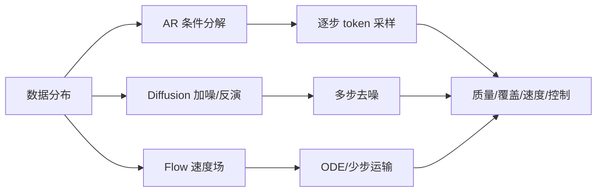

# 07 · 自回归、扩散与 Flow Matching

> 一句话点题：生成范式的核心区别是如何分解概率路径与计算：逐元素条件、随机去噪，或连续运输。

<div class="lesson-meta"><span>DLF19—DLF20—DLF21</span><span>强化核心</span><span>预计 7 × 45 分钟</span><span>证据截止 2026-08-30</span></div>

## 解锁与跳过

需掌握概率分布、最大似然、神经网络训练与常微分方程的基本直觉。 即使你使用 AI 完成实现，也不能跳过本章的变量定义、反例和评测设计；这些部分决定你是否有能力发现一个“运行正常但结论错误”的系统。

## 本章可观察目标

完成后你能：区分自回归、扩散、score 与 flow matching；推导前向扰动、反向去噪和速度场目标；比较质量、覆盖、控制、采样步数和训练成本。阅读完成不计掌握；至少需要一次不看答案的解释、一次实际应用和一次边界判断。

## 研究问题：不同生成范式怎样表示概率路径、速度与控制性？

FID、似然和人类偏好测量不同维度；少步采样可能更快却损失覆盖，classifier-free guidance 增强条件一致性又降低多样性。视觉逼真也可能复制训练样本、违反物理或忽略文字条件。比较范式必须固定数据、骨干、参数、训练算力和采样预算。

问题必须被写成“输入、状态、动作/输出、损失、约束、证据和停止条件”的组合。只写“提升效果”会把数据、算法、交互与业务结果混在一起，也无法设计反事实或消融。

## 三个知识节点怎样连接

| 节点 | 核心对象 | 最小充分解释 | 必须支持的决策 |
|---|---|---|---|
| DLF19 | 自回归 | 按因子分解逐 token/位置建模联合分布 | 顺序结构与精确似然是否重要 |
| DLF20 | 扩散/Score | 学习从噪声逐步反演到数据的分数或去噪器 | 多步生成和条件控制是否可接受 |
| DLF21 | Flow Matching | 回归连接噪声与数据分布的连续速度场 | 能否以更直路径和 ODE 采样 |

三者不是并列名词：第一个节点通常建立对象和假设，第二个节点解释机制，第三个节点把机制放进测量或交付边界。缺任何一层，都容易把局部指标误当成系统结论。

## 核心机制：概率因子分解、随机反演与分布运输

自回归按链式法则建模 $p(x)=prod p(x_i|x_{<i})$。扩散逐步加高斯噪声，网络预测噪声、score 或 velocity，再数十/数百步反向采样。Flow Matching 直接回归预设概率路径的条件速度场，推理通过 ODE 积分。DiT 用 Transformer 替代 U-Net 作为扩散骨干，显示生成性能可随计算扩展。

理解机制时要区分三种量：**被设计者直接控制的变量**、**环境或数据生成过程决定的变量**、**只能通过代理指标观测的潜变量**。可靠实验一次只改变主要因子，其余配置进入版本化运行记录。

## 关键公式、假设与推导

DDPM 前向过程：

$$
q(x_t|x_0)=\mathcal N(\sqrt{\bar\alpha_t}x_0,(1-\bar\alpha_t)I),
$$

常用噪声预测目标

$$
\mathbb E_{t,x_0,\epsilon}\lVert\epsilon-\epsilon_\theta(x_t,t,c)\rVert^2.
$$

Flow Matching 回归 $u_t$：

$$
\mathbb E\lVert v_\theta(x_t,t)-u_t(x_t)\rVert^2,\quad \dot x_t=v_\theta(x_t,t).
$$

公式不是装饰。逐项检查：

- 不同参数化可对应相近目标但数值性质不同
- ODE/SDE 求解误差和步数影响样本
- guidance 改变采样分布并非免费控制
- FID 对特征网络、样本量和领域敏感

若假设不成立，正确做法不是继续套公式，而是换估计量、改采样/实验设计、缩小结论或明确拒绝自动决策。

## 证据拆解1：Scalable Diffusion Models with Transformers

### 研究问题

扩散骨干能否用 Transformer 并呈现可预测的计算扩展？

### 核心机制、实验与指标

DiT 对 VAE latent patchify，加入 timestep/class 条件，用 Transformer blocks 预测去噪目标；以 Gflops 分级模型。

作者在 ImageNet 条件生成报告随模型计算增加 FID 改善，最大 DiT-XL/2 达到当时强结果。

### 真正贡献、局限与适用边界

贡献是把可扩展 Transformer 主干引入扩散。 ImageNet 类条件不代表开放文本/视频；FID 与 guidance 配置影响排名。

## 证据拆解2：Transition Matching

### 研究问题

能否用离散时间随机转移统一 flow 与连续自回归生成？

### 核心机制、实验与指标

TM 学习概率转移核，提出 DTM、ARTM、FHTM 三种变体；在固定架构、数据和超参下与 flow/连续 AR 比较。

作者报告 DTM 的质量/文本一致性和采样效率，并称 FHTM 是首个在相关设置匹配/超过 flow 的全因果连续生成方法。

### 真正贡献、局限与适用边界

贡献是扩展扩散/flow 与 AR 之间的设计空间，并强调受控比较。 2025 预印本结论来自特定图像设置；“统一”不等于在所有模态和规模领先。

## 证据拆解3：Selective Underfitting in Diffusion Models

### 研究问题

扩散为何不简单记住经验 score，泛化是否来自有选择的欠拟合？

### 核心机制、实验与指标

工作提出 selective underfitting：模型在数据空间某些区域更准确拟合 score、其他区域欠拟合，并设计干预验证区域差异与生成质量关系。

ICLR 2026 论文给出对扩散泛化的新可检验解释。

### 真正贡献、局限与适用边界

贡献是挑战“整体欠拟合”单一叙事。 理论/实验仍依模型和数据设置，不能将局部解释当所有扩散模型的完整机制。

## 从论文或标准到产品主张：证据审计

| 日期 | 一手来源 | 它真正回答的问题 | 不能据此外推什么 |
|---|---|---|---|
| 2022-12-19 | Scalable Diffusion Models with Transformers | 扩散骨干能否用 Transformer 并呈现可预测的计算扩展？ | ImageNet 类条件不代表开放文本/视频；FID 与 guidance 配置影响排名。 |
| 2025-06-30 | Transition Matching | 能否用离散时间随机转移统一 flow 与连续自回归生成？ | 2025 预印本结论来自特定图像设置；“统一”不等于在所有模态和规模领先。 |
| 2026-02-11 | Selective Underfitting in Diffusion Models | 扩散为何不简单记住经验 score，泛化是否来自有选择的欠拟合？ | 理论/实验仍依模型和数据设置，不能将局部解释当所有扩散模型的完整机制。 |

阅读来源时按四步记录：先抄下研究对象、比较基线、数据/场景和预算，再定位结果表或正式条文；随后区分作者直接观察、由结果支持的解释和你准备迁移到项目的推论；最后为推论写一个能推翻它的反例。**来源新并不等于证据强**：预印本、公司技术报告、正式标准、法规和独立复现承担的证明责任不同。数字必须连同分母、置信区间、硬件/本体、语言/人群与失败样本一起保存。

如果来源只证明组件指标改善，不得自动升级成端到端任务、真实用户价值、物理安全或合规结论。迁移到自己的项目时至少保留一个原方法基线、一个更简单基线和一个不使用该能力的基线；结果冲突时，优先检查任务定义、样本污染、资源预算、评价器偏差和运行边界，而不是挑选最符合预期的一项。

## 机制图：从输入到可验证结果



图中每条边都应能对应日志、数据版本、物理状态或人工记录；无法观测的边必须标为假设，不允许用模型的一段解释代替真实状态。

## 贯穿案例：可控工业零件图生成

产品需要按零件类别和缺陷类型合成训练数据。自回归 latent、DiT 和 flow 使用同一图像集与编码器；比较条件一致性、缺陷几何覆盖、最近训练样本距离、下游检测增益和每张延迟。漂亮样本若不提高真实测试检测、或只复制训练图，就不能作为数据引擎证据。

案例的重点不是跑出最高分，而是保存“为什么选择这条路径”的证据：基线是什么、哪个假设最危险、失败怎样分层、什么条件触发降级或人工接管。

## 复现任务：最小因果链

1. 在二维 toy distribution 可视化 AR/扩散/flow 覆盖
2. 固定骨干和训练步比较不同生成目标
3. 按采样步数画质量—速度曲线
4. 做最近邻/成员推断与下游 utility 评测

复现不是成功运行作者代码。你必须固定数据/环境、预算和评价器，至少重复三次，报告均值、离散程度、失败样本和资源消耗；若只能跑一次，要把结论降级为演示证据。

## 三轮实验与消融路线

**第一轮：测量链校准。** 只运行最简单基线，检查输入单位、时间/坐标/权限、随机种子、日志和评价器。抽取成功与失败样本人工复核；若真值或测量本身不稳定，停止模型比较。输出必须能回答“同一次运行能否被另一人重放”。

**第二轮：机制消融。** 在同一数据、预算、硬件或运行条件下，一次只加入一个关键机制；对每次变化写预期影响、未变化项和失败阈值。除了主指标，还要检查最坏切片、过程约束、P95/P99、资源与人工成本。若提升只在一个方便切片出现，应缩小能力声明。

**第三轮：边界与迁移。** 有计划地改变本章公式假设或 ODD：时间、人群、语言、对象、气象、本体、延迟、权限或供应商至少选择两项；注入缺失、冲突和失效。记录系统是正确拒绝/降级/接管，还是带着错误自信继续。最终产物不是“最佳分数”，而是一个可复核的能力范围、反例集和下一次变更会触发的回归集合。

## 实验与指标

| 维度 | 至少记录什么 | 为什么 |
|---|---|---|
| 任务质量 | 主指标、切片、置信区间与失败样本 | 确认改进是否稳定且可解释 |
| 训练 | loss、梯度/激活、吞吐、显存、数据量、FLOPs | 区分算法收益和更多计算 |
| 推理 | 首 Token、每 Token、P50/P95、吞吐、峰值内存 | 模型参数量不等于用户体验 |
| 风险 | 校准、偏移、攻击、记忆/污染与能耗 | 把能力放入真实部署边界 |

同时保留一个简单基线和一个“什么都不做/人工流程”基线。复杂方案只有在质量、成本、时延、风险或可扩展性至少一个维度形成可重复净收益时才晋级。

## 对产品、系统或研究架构的影响

- 生成系统报告路径、参数化、采样器和 guidance
- 选择以任务 utility 与覆盖而非只看 FID
- 合成数据进入训练前做重复、隐私和偏差审计
- 步数/质量/成本作为可配置产品策略

这些决策应进入 PRD、实验卡、接口契约、安全案例或 ADR，而不只留在学习笔记。模型、数据、提示、硬件、环境与评价器任何一个升级，都要能触发有范围的回归测试。

## 会死在哪里

- 只挑最好样本展示
- 不同算力比较范式
- FID 下降就宣称语义正确
- guidance 提高后忽略多样性坍缩
- 视觉逼真就假设物理正确

失败分析要写“触发条件—可观测信号—影响—检测—缓解—残余风险”。只写“模型可能出错”没有工程价值。

## 与 AI 协作模板

```text
请为自回归、扩散/DiT、flow matching 设计公平比较。固定数据、编码器、骨干容量、训练 FLOPs 与条件；按采样步数报告质量、覆盖、条件一致性、最近训练样本、下游 utility、延迟和能耗；加入复制、隐私和物理/领域约束测试。
```

使用模板后仍需检查 AI 是否虚构来源、混用时间口径、悄悄改变任务定义，或把模拟结果外推到真实系统。

## 练习：画一条采样步数 Pareto 曲线

对一个扩散或 flow 小模型使用多组采样步数，测质量、覆盖和延迟；找出产品可接受拐点，并说明指标冲突。

提交物必须包含一个反例或失败样本。只有成功案例会让你误以为已经掌握；边界证据才能说明你知道方法何时不该用。

## 常见误区

扩散生成等于随机加噪；flow 一定一步生成；FID 代表所有质量；guidance 免费提升；生成样本可直接当真实数据。共同根因是把一个条件成立时的局部结论，扩张成不带条件的能力判断。

## 自测

<Quiz question="classifier-free guidance 增强条件一致性时常见代价是什么？" :options='["参数自动归零","多样性或分布覆盖下降","训练数据变多"]' :answer="1" explanation="强化条件方向会改变采样分布，常形成质量/一致性与覆盖权衡。" />

## 本章小结

- AR、扩散和 flow 选择不同概率路径
- DiT 让扩散骨干随计算扩展
- 采样速度与分布覆盖需同测
- 生成质量必须连接下游、复制和约束证据

<EvidenceTracker lesson="field-deep-learning-07-generative-models" />

## 本章完成标准

不看正文解释 三种生成范式的概率/计算分解；完成 一条采样速度—质量—覆盖曲线；能指出 FID 不能证明的生成质量。最近相关题平均至少 7/10 才标记为 basic；跨日期完成变式任务并达到 8.5/10，才标记为 proficient。

<div class="source-note">主要来源（证据截止 2026-08-30）：<a href="https://arxiv.org/abs/2212.09748">DiT</a>、<a href="https://arxiv.org/abs/2506.23589">Transition Matching</a>、<a href="https://openreview.net/forum?id=yqTajvdkjv">Selective Underfitting</a>。数字只描述来源中的实验设置；标准、法规与产品能力均按页面版本和适用范围解释。</div>
