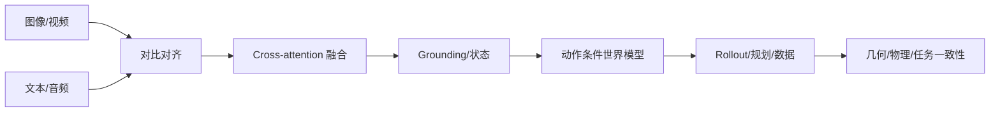

# 08 · 多模态与世界模型

> 一句话点题：多模态表示解决“信息能否相遇”，世界模型还必须回答“动作后世界怎样变化”；视觉逼真不能替代动力学正确。

<div class="lesson-meta"><span>DLF22—DLF23—DLF24</span><span>强化核心</span><span>预计 7 × 45 分钟</span><span>证据截止 2026-08-30</span></div>

## 解锁与跳过

需理解视觉/序列模型、对比学习、条件生成和状态转移。 即使你使用 AI 完成实现，也不能跳过本章的变量定义、反例和评测设计；这些部分决定你是否有能力发现一个“运行正常但结论错误”的系统。

## 本章可观察目标

完成后你能：解释跨模态对齐、融合与 grounding；区分生成世界、可预测状态与可控动力学；用多视角/时间/动作一致性评估世界模型。阅读完成不计掌握；至少需要一次不看答案的解释、一次实际应用和一次边界判断。

## 研究问题：对齐文本、图像、视频和动作时，共享表示真正保留了什么？

CLIP 相似可支持开放词汇识别，却可能依赖背景捷径；图文模型能描述物体，不代表知道抓取后的接触变化。视频生成看似真实，仍可能穿透、反重力或跨视角漂移。世界模型用于规划时，微小动力学偏差会被长轨迹放大。

问题必须被写成“输入、状态、动作/输出、损失、约束、证据和停止条件”的组合。只写“提升效果”会把数据、算法、交互与业务结果混在一起，也无法设计反事实或消融。

## 三个知识节点怎样连接

| 节点 | 核心对象 | 最小充分解释 | 必须支持的决策 |
|---|---|---|---|
| DLF22 | 跨模态对齐 | 把配对文本、图像、音频等映射到可比较表示 | 共享空间能支持哪些检索与迁移 |
| DLF23 | 多模态融合 | 以交叉注意或统一 token 交换细粒度信息 | 何时早融合、晚融合或工具化 |
| DLF24 | 世界模型 | 预测状态/观察在动作条件下如何演化 | 用于规划、数据、评测还是想象 |

三者不是并列名词：第一个节点通常建立对象和假设，第二个节点解释机制，第三个节点把机制放进测量或交付边界。缺任何一层，都容易把局部指标误当成系统结论。

## 核心机制：对比对齐、交叉融合与动作条件预测

对比学习拉近配对样本并推远 batch 内负例，获得粗粒度共享空间；cross-attention 让一种模态查询另一模态 token，支持细粒度 grounding。世界模型学习 $p(s_{t+1}|s_t,a_t)$ 或未来观察序列，可在潜空间 rollout 供规划/策略训练。机器人场景还需要多视角几何一致、接触和控制条件。

理解机制时要区分三种量：**被设计者直接控制的变量**、**环境或数据生成过程决定的变量**、**只能通过代理指标观测的潜变量**。可靠实验一次只改变主要因子，其余配置进入版本化运行记录。

## 关键公式、假设与推导

对称对比损失的一侧为

$$
\mathcal L_{i\to t}=-\frac1N\sum_i\log\frac{\exp(z_i^Iv_i^T/\tau)}{\sum_j\exp(z_i^Iv_j^T/\tau)}.
$$

动作条件世界模型最大化

$$
\sum_t\log p_\theta(o_{t+1}\mid o_{\le t},a_{\le t}),
$$

但像素似然高不保证任务相关状态和物理约束正确。

公式不是装饰。逐项检查：

- 负例可能包含语义相同样本
- 对齐空间的相似度不等于可组合推理
- 世界模型需要区分观测随机性与动力学不确定性
- 长 rollout 必须测误差累积和策略利用模型漏洞

若假设不成立，正确做法不是继续套公式，而是换估计量、改采样/实验设计、缩小结论或明确拒绝自动决策。

## 证据拆解1：Learning Transferable Visual Models From Natural Language Supervision

### 研究问题

互联网图文对能否训练可零样本迁移的视觉表示？

### 核心机制、实验与指标

CLIP 在 4 亿图文对上用双编码器对比学习，类别文本提示可作为零样本分类权重。

论文跨 30+ 数据集展示强零样本迁移，同时报告分布偏移、OCR 和社会偏差等限制。

### 真正贡献、局限与适用边界

贡献是把自然语言监督变成开放视觉接口。 互联网数据偏差、粗粒度配对和提示敏感性限制 grounding；不是物理世界理解证明。

## 证据拆解2：World Model for Robot Learning: A Comprehensive Survey

### 研究问题

机器人世界模型在规划、策略、仿真、评测和数据生成中分别扮演什么角色？

### 核心机制、实验与指标

综述按架构、功能和具身应用整理预测模型，并连接视频世界模型、model-based planning、机器人学习与基准。

作者指出世界模型已从想象式生成走向可控、结构化和基础模型规模，同时保留动力学、评测与耦合难题。

### 真正贡献、局限与适用边界

贡献是提供 2026 年统一问题地图和持续更新资源。 综述不是新算法的独立性能证据，且快速领域中的覆盖会过时。

## 证据拆解3：PAIWorld

### 研究问题

机器人多摄像头世界模型怎样保持跨视角三维一致？

### 核心机制、实验与指标

方法在 DiT 中加入几何感知跨视角注意、编码相机射线/外参的旋转位置表示和 3D 表征蒸馏。

作者报告在 WorldArena 等多视角基准领先并支持规划、数据和策略后训练。

### 真正贡献、局限与适用边界

贡献是把显式几何通信引入多视角世界基础模型。 预印本排行榜与生成指标仍需真实策略和跨硬件独立复现。

## 从论文或标准到产品主张：证据审计

| 日期 | 一手来源 | 它真正回答的问题 | 不能据此外推什么 |
|---|---|---|---|
| 2021-02-26 | Learning Transferable Visual Models From Natural Language Supervision | 互联网图文对能否训练可零样本迁移的视觉表示？ | 互联网数据偏差、粗粒度配对和提示敏感性限制 grounding；不是物理世界理解证明。 |
| 2026-04-30 | World Model for Robot Learning: A Comprehensive Survey | 机器人世界模型在规划、策略、仿真、评测和数据生成中分别扮演什么角色？ | 综述不是新算法的独立性能证据，且快速领域中的覆盖会过时。 |
| 2026-06-16 | PAIWorld | 机器人多摄像头世界模型怎样保持跨视角三维一致？ | 预印本排行榜与生成指标仍需真实策略和跨硬件独立复现。 |

阅读来源时按四步记录：先抄下研究对象、比较基线、数据/场景和预算，再定位结果表或正式条文；随后区分作者直接观察、由结果支持的解释和你准备迁移到项目的推论；最后为推论写一个能推翻它的反例。**来源新并不等于证据强**：预印本、公司技术报告、正式标准、法规和独立复现承担的证明责任不同。数字必须连同分母、置信区间、硬件/本体、语言/人群与失败样本一起保存。

如果来源只证明组件指标改善，不得自动升级成端到端任务、真实用户价值、物理安全或合规结论。迁移到自己的项目时至少保留一个原方法基线、一个更简单基线和一个不使用该能力的基线；结果冲突时，优先检查任务定义、样本污染、资源预算、评价器偏差和运行边界，而不是挑选最符合预期的一项。

## 机制图：从输入到可验证结果



图中每条边都应能对应日志、数据版本、物理状态或人工记录；无法观测的边必须标为假设，不允许用模型的一段解释代替真实状态。

## 贯穿案例：仓库机器人多视角预测

顶置、腕部和第一视角摄像头观察同一抓取。共享表示先做物体/指令 grounding，世界模型接收相机外参和动作，预测多视角未来。评测分像素、3D 位置、接触事件、动作响应和下游规划成功；若视频好看但物体在视角间漂移，不能用于安全规划，只能作为有限数据增强。

案例的重点不是跑出最高分，而是保存“为什么选择这条路径”的证据：基线是什么、哪个假设最危险、失败怎样分层、什么条件触发降级或人工接管。

## 复现任务：最小因果链

1. 训练小型图文对比模型并检查 hard negatives
2. 加入跨注意力做指代 grounding
3. 构造动作条件视频/状态预测
4. 比较单视角与多视角，并测 rollout 误差和策略成功

复现不是成功运行作者代码。你必须固定数据/环境、预算和评价器，至少重复三次，报告均值、离散程度、失败样本和资源消耗；若只能跑一次，要把结论降级为演示证据。

## 三轮实验与消融路线

**第一轮：测量链校准。** 只运行最简单基线，检查输入单位、时间/坐标/权限、随机种子、日志和评价器。抽取成功与失败样本人工复核；若真值或测量本身不稳定，停止模型比较。输出必须能回答“同一次运行能否被另一人重放”。

**第二轮：机制消融。** 在同一数据、预算、硬件或运行条件下，一次只加入一个关键机制；对每次变化写预期影响、未变化项和失败阈值。除了主指标，还要检查最坏切片、过程约束、P95/P99、资源与人工成本。若提升只在一个方便切片出现，应缩小能力声明。

**第三轮：边界与迁移。** 有计划地改变本章公式假设或 ODD：时间、人群、语言、对象、气象、本体、延迟、权限或供应商至少选择两项；注入缺失、冲突和失效。记录系统是正确拒绝/降级/接管，还是带着错误自信继续。最终产物不是“最佳分数”，而是一个可复核的能力范围、反例集和下一次变更会触发的回归集合。

## 实验与指标

| 维度 | 至少记录什么 | 为什么 |
|---|---|---|
| 任务质量 | 主指标、切片、置信区间与失败样本 | 确认改进是否稳定且可解释 |
| 训练 | loss、梯度/激活、吞吐、显存、数据量、FLOPs | 区分算法收益和更多计算 |
| 推理 | 首 Token、每 Token、P50/P95、吞吐、峰值内存 | 模型参数量不等于用户体验 |
| 风险 | 校准、偏移、攻击、记忆/污染与能耗 | 把能力放入真实部署边界 |

同时保留一个简单基线和一个“什么都不做/人工流程”基线。复杂方案只有在质量、成本、时延、风险或可扩展性至少一个维度形成可重复净收益时才晋级。

## 对产品、系统或研究架构的影响

- 共享表示、grounding 和动力学分别评测
- 世界模型输入显式包含动作与传感器标定
- 生成数据标记 synthetic provenance
- 用于规划前需通过物理/任务闭环而非视觉评分

这些决策应进入 PRD、实验卡、接口契约、安全案例或 ADR，而不只留在学习笔记。模型、数据、提示、硬件、环境与评价器任何一个升级，都要能触发有范围的回归测试。

## 会死在哪里

- 把 CLIP 相似当空间 grounding
- 未加入动作却称世界模型
- 只测一步预测
- 多视角拼 token 不编码几何
- 策略利用世界模型不真实漏洞

失败分析要写“触发条件—可观测信号—影响—检测—缓解—残余风险”。只写“模型可能出错”没有工程价值。

## 与 AI 协作模板

```text
请拆分多模态系统的对齐、融合、grounding 和动作条件世界模型。分别定义检索、定位、跨视角几何、一步/长程动力学和下游策略指标；记录相机/传感器标定与 synthetic provenance；设计物理不可能、跨视角漂移和模型漏洞测试。
```

使用模板后仍需检查 AI 是否虚构来源、混用时间口径、悄悄改变任务定义，或把模拟结果外推到真实系统。

## 练习：区分看起来对与物理上对

构造三个视觉逼真但物理错误的视频案例（穿透、跨视角漂移、动作无因果响应），为每类定义机器可测指标和下游后果。

提交物必须包含一个反例或失败样本。只有成功案例会让你误以为已经掌握；边界证据才能说明你知道方法何时不该用。

## 常见误区

共享 embedding 等于完整理解；图文对齐自动产生 3D；视频逼真就是世界模型；一步误差低就能长程规划；合成数据没有分布风险。共同根因是把一个条件成立时的局部结论，扩张成不带条件的能力判断。

## 自测

<Quiz question="一个视频模型不接收动作，为什么不能直接作为控制世界模型？" :options='["视频太长","无法预测不同动作对未来的因果条件变化","不能使用 GPU"]' :answer="1" explanation="控制需要动作条件动力学，而非无条件未来外观。" />

## 本章小结

- 对齐、融合、grounding 是不同层
- 世界模型需显式条件化动作
- 几何和物理一致独立于视觉质量
- 规划价值必须由闭环任务验证

<EvidenceTracker lesson="field-deep-learning-08-multimodal-world-models" />

## 本章完成标准

不看正文解释 多模态对齐与世界模型的差别；完成 一个多视角动作条件评测；能指出 视觉生成指标无法证明的物理性质。最近相关题平均至少 7/10 才标记为 basic；跨日期完成变式任务并达到 8.5/10，才标记为 proficient。

<div class="source-note">主要来源（证据截止 2026-08-30）：<a href="https://arxiv.org/abs/2103.00020">CLIP</a>、<a href="https://arxiv.org/abs/2605.00080">World Model Survey 2026</a>、<a href="https://arxiv.org/abs/2606.18375">PAIWorld</a>。数字只描述来源中的实验设置；标准、法规与产品能力均按页面版本和适用范围解释。</div>
