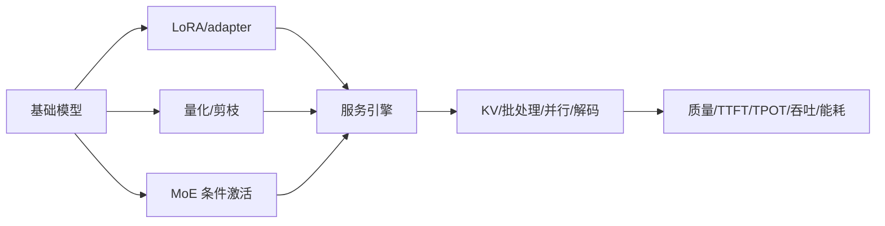

# 09 · 稀疏化、量化与高效推理

> 一句话点题：“模型更小”只是一个静态属性；生产效率由权重、激活、KV cache、内存带宽、批量、解码和目标硬件共同决定。

<div class="lesson-meta"><span>DLF25—DLF26—DLF27</span><span>强化核心</span><span>预计 7 × 45 分钟</span><span>证据截止 2026-08-30</span></div>

## 解锁与跳过

需理解 Transformer/生成模型结构、张量形状和目标硬件测量。 即使你使用 AI 完成实现，也不能跳过本章的变量定义、反例和评测设计；这些部分决定你是否有能力发现一个“运行正常但结论错误”的系统。

## 本章可观察目标

完成后你能：区分参数、激活、KV、带宽和算力瓶颈；解释 LoRA、量化、MoE 与推测解码；建立质量—延迟—吞吐—内存—能耗 Pareto。阅读完成不计掌握；至少需要一次不看答案的解释、一次实际应用和一次边界判断。

## 研究问题：模型参数少、激活少与实际延迟低为何不是同义词？

4-bit 权重减少存储，但算子反量化或不匹配硬件可能不降延迟；MoE 每 token 激活参数少，却有专家通信与负载不均；LoRA 训练便宜但多适配器服务有路由/合并成本；推测解码只有小模型提案与大模型接受率足够高时获益。

问题必须被写成“输入、状态、动作/输出、损失、约束、证据和停止条件”的组合。只写“提升效果”会把数据、算法、交互与业务结果混在一起，也无法设计反事实或消融。

## 三个知识节点怎样连接

| 节点 | 核心对象 | 最小充分解释 | 必须支持的决策 |
|---|---|---|---|
| DLF25 | 参数高效适配 | 冻结主体并训练低秩/适配参数 | 存储、数据和任务隔离如何权衡 |
| DLF26 | 压缩与稀疏 | 降低位宽或每 token 激活计算 | 误差、路由和硬件内核是否匹配 |
| DLF27 | 推理系统 | 批处理、缓存、并行和解码决定端到端服务 | 用户延迟与容量怎样配置 |

三者不是并列名词：第一个节点通常建立对象和假设，第二个节点解释机制，第三个节点把机制放进测量或交付边界。缺任何一层，都容易把局部指标误当成系统结论。

## 核心机制：低秩增量、数值压缩与条件计算

LoRA 把权重更新限制为 $BA$ 低秩矩阵。PTQ/QAT 以 scale/zero-point 把连续值映射到低位整数，误差由离群值、分组和校准数据决定。MoE router 为每个 token 选择少数专家，以总参数换激活计算但引入 all-to-all。推测解码用 draft 并行提出多个 token，再由 target 一次验证并保持目标分布。

理解机制时要区分三种量：**被设计者直接控制的变量**、**环境或数据生成过程决定的变量**、**只能通过代理指标观测的潜变量**。可靠实验一次只改变主要因子，其余配置进入版本化运行记录。

## 关键公式、假设与推导

LoRA：

$$
W'=W+\Delta W=W+BA,\quad r\ll\min(d_{in},d_{out}).
$$

均匀量化近似为

$$
q=\operatorname{clip}(\operatorname{round}(x/s)+z),\quad \hat x=s(q-z).
$$

MoE 输出 $y=\sum_{i\in TopK(g(x))}p_i(x)E_i(x)$。

公式不是装饰。逐项检查：

- 低秩假设不保证所有任务适配有效
- 量化误差需按层/通道和真实输入校准
- 稀疏 FLOPs 不等于低通信或低延迟
- 吞吐最大化通常增加单请求排队延迟

若假设不成立，正确做法不是继续套公式，而是换估计量、改采样/实验设计、缩小结论或明确拒绝自动决策。

## 证据拆解1：LoRA

### 研究问题

大模型适配是否可限制在低秩权重增量而保持质量？

### 核心机制、实验与指标

LoRA 冻结预训练权重，在注意力等矩阵旁训练低秩分解，部署时可合并增量，不增加额外序列延迟。

论文在 GPT/DeBERTa 等模型报告大幅减少可训练参数并与全量微调竞争。

### 真正贡献、局限与适用边界

贡献是形成参数高效适配的基础范式。 最优 rank/层依任务；多适配器、灾难性覆盖和数据质量仍需评估。

## 证据拆解2：DeepSeek-V3

### 研究问题

MoE、MLA 与 FP8 能否联合降低大模型训练/推理成本？

### 核心机制、实验与指标

报告用 671B 总参数、37B 激活的 MoE，MLA 压缩 attention 状态，并采用 FP8 混合精度和专家并行系统。

作者报告强基准结果与特定 H800 训练成本。

### 真正贡献、局限与适用边界

贡献是展示稀疏模型、KV/attention 压缩和系统工程的协同。 总/激活参数与真实延迟不能脱离通信拓扑、并发和内核比较。

## 证据拆解3：Mixture-of-Experts Flow Matching for Faster Language Inference

### 研究问题

非自回归 flow 语言模型能否用专家速度场在少步内生成？

### 核心机制、实验与指标

工作提出 MoE-FM，并以 Transformer/Mamba 实例构建 YAN，在潜空间分解局部速度场。

作者报告质量接近 AR/扩散基线，最少三步采样，在其设置中对 AR 最高约 40 倍加速。

### 真正贡献、局限与适用边界

贡献是探索 AR 之外少步语言生成的效率路径。 单篇预印本、任务与延迟口径特定；并行生成的可控性和开放部署仍需复现。

## 从论文或标准到产品主张：证据审计

| 日期 | 一手来源 | 它真正回答的问题 | 不能据此外推什么 |
|---|---|---|---|
| 2021-10-16 | LoRA | 大模型适配是否可限制在低秩权重增量而保持质量？ | 最优 rank/层依任务；多适配器、灾难性覆盖和数据质量仍需评估。 |
| 2024-12-27 | DeepSeek-V3 | MoE、MLA 与 FP8 能否联合降低大模型训练/推理成本？ | 总/激活参数与真实延迟不能脱离通信拓扑、并发和内核比较。 |
| 2026-04-16 | Mixture-of-Experts Flow Matching for Faster Language Inference | 非自回归 flow 语言模型能否用专家速度场在少步内生成？ | 单篇预印本、任务与延迟口径特定；并行生成的可控性和开放部署仍需复现。 |

阅读来源时按四步记录：先抄下研究对象、比较基线、数据/场景和预算，再定位结果表或正式条文；随后区分作者直接观察、由结果支持的解释和你准备迁移到项目的推论；最后为推论写一个能推翻它的反例。**来源新并不等于证据强**：预印本、公司技术报告、正式标准、法规和独立复现承担的证明责任不同。数字必须连同分母、置信区间、硬件/本体、语言/人群与失败样本一起保存。

如果来源只证明组件指标改善，不得自动升级成端到端任务、真实用户价值、物理安全或合规结论。迁移到自己的项目时至少保留一个原方法基线、一个更简单基线和一个不使用该能力的基线；结果冲突时，优先检查任务定义、样本污染、资源预算、评价器偏差和运行边界，而不是挑选最符合预期的一项。

## 机制图：从输入到可验证结果



图中每条边都应能对应日志、数据版本、物理状态或人工记录；无法观测的边必须标为假设，不允许用模型的一段解释代替真实状态。

## 贯穿案例：本地部署领域助手

候选为 8B dense 16-bit、4-bit PTQ、LoRA 适配版和云端 MoE。使用真实长度/并发负载，分别测 TTFT、TPOT、P95、tokens/s、峰值 RAM/VRAM、功耗和领域回归。量化若平均准确不变但关键数字抽取失败，不能通过；云端吞吐高但敏感数据不允许，则约束优先于性能。

案例的重点不是跑出最高分，而是保存“为什么选择这条路径”的证据：基线是什么、哪个假设最危险、失败怎样分层、什么条件触发降级或人工接管。

## 复现任务：最小因果链

1. 对同一模型做 16/8/4-bit 量化并按层观察误差
2. 训练不同 rank 的 LoRA 与全量微调对照
3. 在单请求和多并发下测完整服务
4. 改变输入/输出长度，分解 prefill 与 decode 瓶颈

复现不是成功运行作者代码。你必须固定数据/环境、预算和评价器，至少重复三次，报告均值、离散程度、失败样本和资源消耗；若只能跑一次，要把结论降级为演示证据。

## 三轮实验与消融路线

**第一轮：测量链校准。** 只运行最简单基线，检查输入单位、时间/坐标/权限、随机种子、日志和评价器。抽取成功与失败样本人工复核；若真值或测量本身不稳定，停止模型比较。输出必须能回答“同一次运行能否被另一人重放”。

**第二轮：机制消融。** 在同一数据、预算、硬件或运行条件下，一次只加入一个关键机制；对每次变化写预期影响、未变化项和失败阈值。除了主指标，还要检查最坏切片、过程约束、P95/P99、资源与人工成本。若提升只在一个方便切片出现，应缩小能力声明。

**第三轮：边界与迁移。** 有计划地改变本章公式假设或 ODD：时间、人群、语言、对象、气象、本体、延迟、权限或供应商至少选择两项；注入缺失、冲突和失效。记录系统是正确拒绝/降级/接管，还是带着错误自信继续。最终产物不是“最佳分数”，而是一个可复核的能力范围、反例集和下一次变更会触发的回归集合。

## 实验与指标

| 维度 | 至少记录什么 | 为什么 |
|---|---|---|
| 任务质量 | 主指标、切片、置信区间与失败样本 | 确认改进是否稳定且可解释 |
| 训练 | loss、梯度/激活、吞吐、显存、数据量、FLOPs | 区分算法收益和更多计算 |
| 推理 | 首 Token、每 Token、P50/P95、吞吐、峰值内存 | 模型参数量不等于用户体验 |
| 风险 | 校准、偏移、攻击、记忆/污染与能耗 | 把能力放入真实部署边界 |

同时保留一个简单基线和一个“什么都不做/人工流程”基线。复杂方案只有在质量、成本、时延、风险或可扩展性至少一个维度形成可重复净收益时才晋级。

## 对产品、系统或研究架构的影响

- 模型卡同时列静态大小与目标硬件动态指标
- 量化校准集覆盖真实长度和关键切片
- 多 adapter 有隔离、路由和回滚版本
- 容量计划用并发/长度分布而非单 benchmark

这些决策应进入 PRD、实验卡、接口契约、安全案例或 ADR，而不只留在学习笔记。模型、数据、提示、硬件、环境与评价器任何一个升级，都要能触发有范围的回归测试。

## 会死在哪里

- 4-bit 文件小就称 4 倍快
- 只测 tokens/s 不测 TTFT/P95
- MoE 忽略 all-to-all
- LoRA rank 越高越好
- 校准集不含关键领域样本

失败分析要写“触发条件—可观测信号—影响—检测—缓解—残余风险”。只写“模型可能出错”没有工程价值。

## 与 AI 协作模板

```text
请为目标硬件建立模型效率 Pareto。分解权重、激活、KV、带宽、计算和通信；比较 dense、量化、LoRA、MoE/云服务；在真实输入输出长度和并发下报告质量切片、TTFT、TPOT、P95、吞吐、峰值内存、功耗和费用；给出回退条件。
```

使用模板后仍需检查 AI 是否虚构来源、混用时间口径、悄悄改变任务定义，或把模拟结果外推到真实系统。

## 练习：同一模型测出三种相反结论

在 batch=1 低延迟、batch 大吞吐和长上下文三种负载测 FP16/INT4；解释为何文件大小、吞吐和用户延迟的排名可能不同。

提交物必须包含一个反例或失败样本。只有成功案例会让你误以为已经掌握；边界证据才能说明你知道方法何时不该用。

## 常见误区

量化位数等于加速倍数；激活参数少等于低延迟；LoRA 不会改变基础能力；tokens/s 足以描述服务；参数量决定全部显存。共同根因是把一个条件成立时的局部结论，扩张成不带条件的能力判断。

## 自测

<Quiz question="4-bit 模型未提速最可能还需检查什么？" :options='["模型名字","硬件内核、反量化、内存带宽和负载形状","训练集标签颜色"]' :answer="1" explanation="压缩只有被实际执行路径利用才转化为延迟收益。" />

## 本章小结

- 效率是模型与系统联合属性
- LoRA 限制适配更新秩
- 量化/稀疏收益依硬件实现
- 服务必须同时测质量、尾延迟、容量和能耗

<EvidenceTracker lesson="field-deep-learning-09-efficient-inference" />

## 本章完成标准

不看正文解释 参数大小、FLOPs 与真实延迟为何不同；完成 一个目标硬件端到端 Pareto 对照；能指出 量化或 MoE 不带来速度收益的条件。最近相关题平均至少 7/10 才标记为 basic；跨日期完成变式任务并达到 8.5/10，才标记为 proficient。

<div class="source-note">主要来源（证据截止 2026-08-30）：<a href="https://arxiv.org/abs/2106.09685">LoRA</a>、<a href="https://arxiv.org/abs/2412.19437">DeepSeek-V3</a>、<a href="https://arxiv.org/abs/2604.15009">MoE Flow Matching</a>。数字只描述来源中的实验设置；标准、法规与产品能力均按页面版本和适用范围解释。</div>
