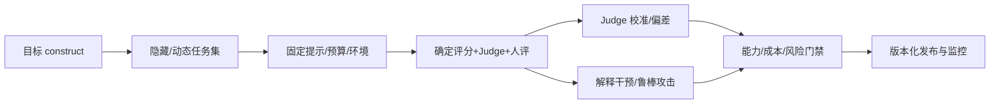

# 10 · 前沿评测、解释与安全

> 一句话点题：前沿模型最容易在评测上自欺：基准可能被见过，Judge 可能共享偏差，解释可能不忠实，平均成绩可能掩盖高风险失败。

<div class="lesson-meta"><span>DLF28—DLF29—DLF30</span><span>综合交付</span><span>预计 7 × 45 分钟</span><span>证据截止 2026-08-30</span></div>

## 解锁与跳过

需完成训练、序列、生成与效率章节，并能设计冻结评测集和统计比较。 即使你使用 AI 完成实现，也不能跳过本章的变量定义、反例和评测设计；这些部分决定你是否有能力发现一个“运行正常但结论错误”的系统。

## 本章可观察目标

完成后你能：区分模型能力、数据污染、提示和 Judge 影响；建立跨任务/切片/成本的评测卡；把解释、校准、攻击与模型行为写入发布门禁。阅读完成不计掌握；至少需要一次不看答案的解释、一次实际应用和一次边界判断。

## 研究问题：当基准被污染、Judge 有偏且模型会适应测试时，如何测量进步？

模型版本、系统提示、采样、工具、精度和硬件都会改成绩。公开 benchmark 进入预训练后不再独立；LLM Judge 可能偏好长答案、同家族表达或参考答案措辞。神经元/attention 可视化产生故事不等于对输出有因果作用。可靠评测要包含隐藏/动态集、确定判定、人评校准与资源。

问题必须被写成“输入、状态、动作/输出、损失、约束、证据和停止条件”的组合。只写“提升效果”会把数据、算法、交互与业务结果混在一起，也无法设计反事实或消融。

## 三个知识节点怎样连接

| 节点 | 核心对象 | 最小充分解释 | 必须支持的决策 |
|---|---|---|---|
| DLF28 | 能力评测 | 在版本化任务、提示、预算和环境下测量模型行为 | 改进来自何处且能否复现 |
| DLF29 | 解释与审计 | 用干预、探针和归因描述内部/输出行为并验证忠实性 | 解释能否支持调试而非安慰 |
| DLF30 | 风险门禁 | 把偏移、攻击、记忆、隐私和危害纳入发布 | 发布、限制、监控或停止 |

三者不是并列名词：第一个节点通常建立对象和假设，第二个节点解释机制，第三个节点把机制放进测量或交付边界。缺任何一层，都容易把局部指标误当成系统结论。

## 核心机制：版本化评测、因果解释与多层安全

评测先定义 construct：知识、推理、鲁棒、交互还是风险；再冻结样本、提示、工具、预算和 scoring。污染通过时间、相似度和 canary 检查；Judge 用人工 gold 估计精确/召回和偏差。解释方法需通过删除/替换/激活干预检验忠实性。安全门禁覆盖正常任务、对抗输入、越权、隐私与最坏切片，并持续监控。

理解机制时要区分三种量：**被设计者直接控制的变量**、**环境或数据生成过程决定的变量**、**只能通过代理指标观测的潜变量**。可靠实验一次只改变主要因子，其余配置进入版本化运行记录。

## 关键公式、假设与推导

有限样本成功率 $\hat p=k/n$ 应报告不确定区间；模型差异可用配对样本变量

$$
d_i=s_A(x_i)-s_B(x_i),\quad \bar d\pm t\frac{s_d}{\sqrt n}.
$$

Judge 与人类 gold 的一致性应报告 confusion matrix/F1，而不只是相关。多次选择后的最大分数还需考虑选择偏差。

公式不是装饰。逐项检查：

- 样本是否代表目标 construct 与用户分布
- 模型是否可能在训练中见过题/答案
- Judge 独立性、顺序和长度偏差
- 差异是否超过随机采样、环境和版本噪声

若假设不成立，正确做法不是继续套公式，而是换估计量、改采样/实验设计、缩小结论或明确拒绝自动决策。

## 证据拆解1：Holistic Evaluation of Language Models

### 研究问题

怎样把准确、校准、鲁棒、公平、毒性、效率等维度放入透明场景评测？

### 核心机制、实验与指标

HELM 将 scenario、adaptation、metric 与模型组合，记录标准化运行并跨多个维度报告，避免只用一个排行榜。

论文执行大规模多模型评测并展示不同指标的权衡与信息缺口。

### 真正贡献、局限与适用边界

贡献是评测透明度、场景化和多指标报告框架。 场景与模型会过时；统一适配也可能不等于每个模型的最佳使用方式。

## 证据拆解2：Verify with Caution

### 研究问题

自动事实性评价器是否足够稳定地替代人类验证？

### 核心机制、实验与指标

研究在摘要、RAG 和 QA 的 11 个数据集重新评估五种事实指标，比较彼此和人工标签，并分析改写/远距证据偏差。

作者发现评价器互不一致且会误估系统事实性，对大幅改写和远处证据存在偏差。

### 真正贡献、局限与适用边界

贡献是把评价器可靠性本身变成必须本地验证的对象。 事实性只是模型质量一维；结论也随新 Judge 发展而需更新。

## 证据拆解3：Selective Underfitting in Diffusion Models

### 研究问题

扩散模型泛化能否用输入空间中区域性拟合差异解释？

### 核心机制、实验与指标

论文提出 selective underfitting 并以干预实验识别更准确/欠拟合的 score 区域。

结果支持生成模型不是均匀拟合或均匀欠拟合经验分布。

### 真正贡献、局限与适用边界

贡献是给泛化解释提出可干预、可证伪机制。 解释仍是特定模型/数据证据，不应扩张成所有生成模型的普遍内部真相。

## 从论文或标准到产品主张：证据审计

| 日期 | 一手来源 | 它真正回答的问题 | 不能据此外推什么 |
|---|---|---|---|
| 2023-08-28 | Holistic Evaluation of Language Models | 怎样把准确、校准、鲁棒、公平、毒性、效率等维度放入透明场景评测？ | 场景与模型会过时；统一适配也可能不等于每个模型的最佳使用方式。 |
| 2025-07-27 | Verify with Caution | 自动事实性评价器是否足够稳定地替代人类验证？ | 事实性只是模型质量一维；结论也随新 Judge 发展而需更新。 |
| 2026-02-11 | Selective Underfitting in Diffusion Models | 扩散模型泛化能否用输入空间中区域性拟合差异解释？ | 解释仍是特定模型/数据证据，不应扩张成所有生成模型的普遍内部真相。 |

阅读来源时按四步记录：先抄下研究对象、比较基线、数据/场景和预算，再定位结果表或正式条文；随后区分作者直接观察、由结果支持的解释和你准备迁移到项目的推论；最后为推论写一个能推翻它的反例。**来源新并不等于证据强**：预印本、公司技术报告、正式标准、法规和独立复现承担的证明责任不同。数字必须连同分母、置信区间、硬件/本体、语言/人群与失败样本一起保存。

如果来源只证明组件指标改善，不得自动升级成端到端任务、真实用户价值、物理安全或合规结论。迁移到自己的项目时至少保留一个原方法基线、一个更简单基线和一个不使用该能力的基线；结果冲突时，优先检查任务定义、样本污染、资源预算、评价器偏差和运行边界，而不是挑选最符合预期的一项。

## 机制图：从输入到可验证结果



图中每条边都应能对应日志、数据版本、物理状态或人工记录；无法观测的边必须标为假设，不允许用模型的一段解释代替真实状态。

## 贯穿案例：多模态模型季度发布评审

新模型必须在冻结内部集、上季度真实失败、动态新题和红队集运行；所有提示、图片预处理、采样与精度固定。客观任务用程序判定，开放答案 Judge 先在人标子集校准并交换答案顺序。报告能力、校准、拒绝、关键人群/语言、攻击、隐私记忆、TTFT/费用。任何高风险红线不可用平均收益抵消。

案例的重点不是跑出最高分，而是保存“为什么选择这条路径”的证据：基线是什么、哪个假设最危险、失败怎样分层、什么条件触发降级或人工接管。

## 复现任务：最小因果链

1. 建立 100 项小型隐藏评测，记录版本与来源时间
2. 比较确定 scorer、两个 Judge 和人工 gold
3. 对答案顺序、长度、措辞做 Judge 偏差实验
4. 对一个解释结论做激活/输入干预验证其忠实性

复现不是成功运行作者代码。你必须固定数据/环境、预算和评价器，至少重复三次，报告均值、离散程度、失败样本和资源消耗；若只能跑一次，要把结论降级为演示证据。

## 三轮实验与消融路线

**第一轮：测量链校准。** 只运行最简单基线，检查输入单位、时间/坐标/权限、随机种子、日志和评价器。抽取成功与失败样本人工复核；若真值或测量本身不稳定，停止模型比较。输出必须能回答“同一次运行能否被另一人重放”。

**第二轮：机制消融。** 在同一数据、预算、硬件或运行条件下，一次只加入一个关键机制；对每次变化写预期影响、未变化项和失败阈值。除了主指标，还要检查最坏切片、过程约束、P95/P99、资源与人工成本。若提升只在一个方便切片出现，应缩小能力声明。

**第三轮：边界与迁移。** 有计划地改变本章公式假设或 ODD：时间、人群、语言、对象、气象、本体、延迟、权限或供应商至少选择两项；注入缺失、冲突和失效。记录系统是正确拒绝/降级/接管，还是带着错误自信继续。最终产物不是“最佳分数”，而是一个可复核的能力范围、反例集和下一次变更会触发的回归集合。

## 实验与指标

| 维度 | 至少记录什么 | 为什么 |
|---|---|---|
| 任务质量 | 主指标、切片、置信区间与失败样本 | 确认改进是否稳定且可解释 |
| 训练 | loss、梯度/激活、吞吐、显存、数据量、FLOPs | 区分算法收益和更多计算 |
| 推理 | 首 Token、每 Token、P50/P95、吞吐、峰值内存 | 模型参数量不等于用户体验 |
| 风险 | 校准、偏移、攻击、记忆/污染与能耗 | 把能力放入真实部署边界 |

同时保留一个简单基线和一个“什么都不做/人工流程”基线。复杂方案只有在质量、成本、时延、风险或可扩展性至少一个维度形成可重复净收益时才晋级。

## 对产品、系统或研究架构的影响

- 评测数据与训练数据权利/时间隔离
- 发布报告绑定完整运行配置和原始输出
- Judge 需要 gold 校准和分任务误差
- 高风险失败设不可加权红线与回滚

这些决策应进入 PRD、实验卡、接口契约、安全案例或 ADR，而不只留在学习笔记。模型、数据、提示、硬件、环境与评价器任何一个升级，都要能触发有范围的回归测试。

## 会死在哪里

- 用公开榜单当唯一发布门禁
- 同模型生成并唯一评分
- 多次调提示只报最好
- attention 热图当因果解释
- 用平均分抵消严重安全失败

失败分析要写“触发条件—可观测信号—影响—检测—缓解—残余风险”。只写“模型可能出错”没有工程价值。

## 与 AI 协作模板

```text
请设计前沿模型发布评测。先定义 construct 与目标用户；组合冻结内部、时间外、动态、失败回放和红队集；固定提示、工具、预算、采样和精度；客观任务用确定 scorer，主观 Judge 用人类 gold 校准并测顺序/长度/家族偏差；报告置信区间、成本和不可加权安全红线。
```

使用模板后仍需检查 AI 是否虚构来源、混用时间口径、悄悄改变任务定义，或把模拟结果外推到真实系统。

## 练习：审判一个 Judge

准备 50 个有人类标签的成对答案，交换顺序、匹配长度、改变措辞，测 Judge confusion matrix；写出它能评分和必须人工复核的边界。

提交物必须包含一个反例或失败样本。只有成功案例会让你误以为已经掌握；边界证据才能说明你知道方法何时不该用。

## 常见误区

benchmark 分数等于通用智能；LLM Judge 比人稳定就无需校准；可视化等于解释；更多维度可简单加权成总分；安全是模型训练后最后一项。共同根因是把一个条件成立时的局部结论，扩张成不带条件的能力判断。

## 自测

<Quiz question="Judge 与总体人工相关很高，仍需看什么？" :options='["只看相关即可","任务/切片 confusion、顺序长度偏差和严重错误","模型参数量"]' :answer="1" explanation="总体相关会掩盖关键切片和系统偏差。" />

## 本章小结

- 评测必须绑定 construct 和运行配置
- 污染与选择偏差会制造虚假进步
- Judge 是待校准模型
- 解释需通过干预，安全红线不能被平均

<EvidenceTracker lesson="field-deep-learning-10-frontier-evaluation-safety" />

## 本章完成标准

不看正文解释 模型能力、评测配置和 Judge 误差的分层；完成 一份含 Judge 校准的发布评测；能指出 平均 benchmark 无法支持的安全结论。最近相关题平均至少 7/10 才标记为 basic；跨日期完成变式任务并达到 8.5/10，才标记为 proficient。

<div class="source-note">主要来源（证据截止 2026-08-30）：<a href="https://arxiv.org/abs/2211.09110">HELM</a>、<a href="https://aclanthology.org/2025.findings-acl.1175/">Verify with Caution</a>、<a href="https://openreview.net/forum?id=yqTajvdkjv">Selective Underfitting</a>。数字只描述来源中的实验设置；标准、法规与产品能力均按页面版本和适用范围解释。</div>
