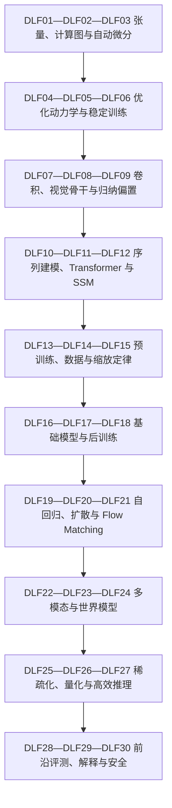

# 深度学习学习路线与知识图谱

> 默认 20 周，每周三次、每次 45—60 分钟。时间不足时缩小实验，不删除解释、应用和边界证据。

## 依赖图

顺序表达的是阻塞前置，不是职业等级。你可以围绕项目跳到后续章，但需要先完成它依赖的概念检查和风险说明。

## 20 周主路线

| 周 | 节点 | 主题 | 最小产物 |
|---|---|---|---|
| 1—2 | DLF01—DLF02—DLF03 | 张量、计算图与自动微分 | 手算反传、数值梯度检查与计算图剖析 |
| 2—3 | DLF04—DLF05—DLF06 | 优化动力学与稳定训练 | 优化器/批量/学习率消融与损失尖峰诊断 |
| 3—4 | DLF07—DLF08—DLF09 | 卷积、视觉骨干与归纳偏置 | CNN/ViT 数据规模对照与特征可视化 |
| 4—5 | DLF10—DLF11—DLF12 | 序列建模、Transformer 与 SSM | Attention/SSM 的质量、吞吐和记忆对照 |
| 5—6 | DLF13—DLF14—DLF15 | 预训练、数据与缩放定律 | 算力预算、数据配比、缩放拟合与训练卡 |
| 6—7 | DLF16—DLF17—DLF18 | 基础模型与后训练 | SFT/DPO/RL 目标函数与行为回归集 |
| 7—8 | DLF19—DLF20—DLF21 | 自回归、扩散与 Flow Matching | 三类生成目标推导与采样速度/质量对照 |
| 8—9 | DLF22—DLF23—DLF24 | 多模态与世界模型 | 对比学习、跨模态 grounding 与预测一致性评测 |
| 9—10 | DLF25—DLF26—DLF27 | 稀疏化、量化与高效推理 | 显存—吞吐—延迟—质量 Pareto 曲线 |
| 10—11 | DLF28—DLF29—DLF30 | 前沿评测、解释与安全 | 数据污染审计、独立评测与能力/风险模型卡 |

## 三层掌握目标

- **认识**：能辨认术语、对象和输入输出，不计为完成。
- **basic**：不看答案解释机制，完成基础应用，最近证据平均至少 7/10。
- **proficient**：跨日期解决变式，说明适用条件与失败边界，最近证据平均至少 8.5/10。

## 项目驱动的分支规则

- 做一般模型训练时按 01→02→对应骨干推进，不先跳后训练。
- 做 LLM/NLP 时，序列、预训练缩放、后训练与效率构成最短主线。
- 做图像/视频生成时，视觉骨干、生成模型、多模态与评测形成闭环。
- 任何计划进入真实用户或物理系统的模型，效率和安全评测均为阻塞前置。

## 复习节奏

新学或低分 1 天后复习；首次稳定通过 3 天；第二次 7 天；连续稳定 14 天；能迁移后 30 天。复习以主动回忆、反例和小型变式为主，不重读整章。

## 证据边界

路线版本的资料截止为 2026-08-30。基础公式可能早于三年窗口；新近能力主张、法规与标准必须进入 [证据账本](./evidence)，并在更新时保留旧结论和冲突原因。
