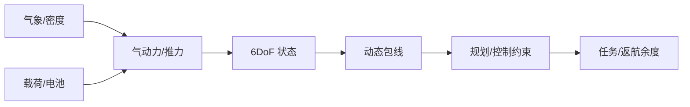

# 02 · 飞行原理、气象与性能包线

> 一句话点题：算法不能创造升力、能量或控制裕度；飞行智能的第一约束是本体在当前气象和载荷下真实可达的性能包线。

<div class="lesson-meta"><span>LAF04—LAF05—LAF06</span><span>核心主线</span><span>预计 6 × 45 分钟</span><span>证据截止 2026-08-30</span></div>

## 解锁与跳过

完成 LAF01—03，具备向量、三角函数和基本微分方程直觉。 即使你使用 AI 完成实现，也不能跳过本章的变量定义、反例和评测设计；这些部分决定你是否有能力发现一个“运行正常但结论错误”的系统。

## 本章可观察目标

完成后你能：建立六自由度受力与姿态模型；计算风、密度、载荷对性能的影响；用包线和能量余度限制规划器。阅读完成不计掌握；至少需要一次不看答案的解释、一次实际应用和一次边界判断。

## 研究问题：升力、推力、风场和载荷怎样限制算法能做的动作？

巡检路径几何上最短，却逆风返航时电量不足；控制器在仿真稳定，真实阵风使电机饱和。必须把风场、质量、SOC、推力余量和传感可见度纳入状态与放行。

问题必须被写成“输入、状态、动作/输出、损失、约束、证据和停止条件”的组合。只写“提升效果”会把数据、算法、交互与业务结果混在一起，也无法设计反事实或消融。

## 三个知识节点怎样连接

| 节点 | 核心对象 | 最小充分解释 | 必须支持的决策 |
|---|---|---|---|
| LAF04 | 六自由度飞行 | 位置/速度与姿态/角速度由力和力矩耦合演化 | 模型需要何种保真度 |
| LAF05 | 气象环境 | 风、阵风、温度、密度、降水与能见度改变气动和传感 | 哪些天气进入拒飞门槛 |
| LAF06 | 性能包线 | 速度、姿态、载荷、功率和结构限制构成可行动作集合 | 规划轨迹是否有物理余度 |

三者不是并列名词：第一个节点通常建立对象和假设，第二个节点解释机制，第三个节点把机制放进测量或交付边界。缺任何一层，都容易把局部指标误当成系统结论。

## 核心机制：受力、姿态与能量闭环

刚体平动由合力决定，转动由惯量和力矩决定；多旋翼总推力控制竖直加速度，差分推力控制姿态。风改变相对空速和地速，密度改变推力效率。包线不是常数表，而是随载荷、电池、温度和故障缩小的动态可行域。

理解机制时要区分三种量：**被设计者直接控制的变量**、**环境或数据生成过程决定的变量**、**只能通过代理指标观测的潜变量**。可靠实验一次只改变主要因子，其余配置进入版本化运行记录。

## 关键公式、假设与推导

$m\dot v=R(q)f_b+mg+f_{aero}$，$J\dot\omega=\tau-\omega\times J\omega$；续航粗估 $t=E_{usable}/P(v,wind,payload)$。任何轨迹需满足 $x(t)\in\mathcal X, u(t)\in\mathcal U$ 并留返航/备降余度。

公式不是装饰。逐项检查：

- 坐标系、四元数顺序和单位一致
- 气动模型是否覆盖目标雷诺数/构型
- 电池可用能量随温度和老化变化
- 包线边界是否有实飞/台架证据

若假设不成立，正确做法不是继续套公式，而是换估计量、改采样/实验设计、缩小结论或明确拒绝自动决策。

## 证据拆解1：NASA Advanced Air Mobility

### 研究问题

AAM 研究为何同时包含飞行器、空域和社区？

### 核心机制、实验与指标

NASA AAM 项目围绕安全、自动化、飞行器、运行与社区集成开展研究。

官方任务展示物理性能只是整体系统的一层。

### 真正贡献、局限与适用边界

提供公开研究与试验入口。 NASA 场景与美国监管不能直接等同中国商业批准。

## 证据拆解2：FAA Pilot’s Handbook of Aeronautical Knowledge

### 研究问题

飞行性能与气象的稳定基础从哪里学习？

### 核心机制、实验与指标

FAA 手册系统解释空气动力、重量平衡、天气和决策。

可作为公式与运行直觉的权威入门。

### 真正贡献、局限与适用边界

把 AI 学习锚定航空基础。 以有人航空为主，需按 UAV/eVTOL 构型补充验证。

## 从论文或标准到产品主张：证据审计

| 日期 | 一手来源 | 它真正回答的问题 | 不能据此外推什么 |
|---|---|---|---|
| 2026-08-30 | NASA Advanced Air Mobility | AAM 研究为何同时包含飞行器、空域和社区？ | NASA 场景与美国监管不能直接等同中国商业批准。 |
| 2026-08-30 | FAA Pilot’s Handbook of Aeronautical Knowledge | 飞行性能与气象的稳定基础从哪里学习？ | 以有人航空为主，需按 UAV/eVTOL 构型补充验证。 |

阅读来源时按四步记录：先抄下研究对象、比较基线、数据/场景和预算，再定位结果表或正式条文；随后区分作者直接观察、由结果支持的解释和你准备迁移到项目的推论；最后为推论写一个能推翻它的反例。**来源新并不等于证据强**：预印本、公司技术报告、正式标准、法规和独立复现承担的证明责任不同。数字必须连同分母、置信区间、硬件/本体、语言/人群与失败样本一起保存。

如果来源只证明组件指标改善，不得自动升级成端到端任务、真实用户价值、物理安全或合规结论。迁移到自己的项目时至少保留一个原方法基线、一个更简单基线和一个不使用该能力的基线；结果冲突时，优先检查任务定义、样本污染、资源预算、评价器偏差和运行边界，而不是挑选最符合预期的一项。

## 机制图：从输入到可验证结果



图中每条边都应能对应日志、数据版本、物理状态或人工记录；无法观测的边必须标为假设，不允许用模型的一段解释代替真实状态。

## 贯穿案例：逆风巡检返航能量

用 6DoF 简化模型和电池放电曲线仿真顺/逆风，注入 P95 阵风与单电机降额。规划器约束最小 SOC、最大倾角和推力余度；任务放行使用保守天气预报，飞行中用实测功率滚动更新返航点。

案例的重点不是跑出最高分，而是保存“为什么选择这条路径”的证据：基线是什么、哪个假设最危险、失败怎样分层、什么条件触发降级或人工接管。

## 复现任务：最小因果链

1. 建立单位清晰的 6DoF 与能量模型
2. 用悬停/阶跃/定速数据辨识参数
3. 扫风速、载荷、温度和 SOC 形成包线
4. 注入阵风/降额并验证拒飞与备降

复现不是成功运行作者代码。你必须固定数据/环境、预算和评价器，至少重复三次，报告均值、离散程度、失败样本和资源消耗；若只能跑一次，要把结论降级为演示证据。

## 三轮实验与消融路线

**第一轮：测量链校准。** 只运行最简单基线，检查输入单位、时间/坐标/权限、随机种子、日志和评价器。抽取成功与失败样本人工复核；若真值或测量本身不稳定，停止模型比较。输出必须能回答“同一次运行能否被另一人重放”。

**第二轮：机制消融。** 在同一数据、预算、硬件或运行条件下，一次只加入一个关键机制；对每次变化写预期影响、未变化项和失败阈值。除了主指标，还要检查最坏切片、过程约束、P95/P99、资源与人工成本。若提升只在一个方便切片出现，应缩小能力声明。

**第三轮：边界与迁移。** 有计划地改变本章公式假设或 ODD：时间、人群、语言、对象、气象、本体、延迟、权限或供应商至少选择两项；注入缺失、冲突和失效。记录系统是正确拒绝/降级/接管，还是带着错误自信继续。最终产物不是“最佳分数”，而是一个可复核的能力范围、反例集和下一次变更会触发的回归集合。

## 实验与指标

| 维度 | 至少记录什么 | 为什么 |
|---|---|---|
| 飞行任务 | 任务成功、航迹/时间/载荷与拒绝率 | 完成任务但越界不算成功 |
| 安全裕度 | 最小间隔、能量/控制余度、告警与失效覆盖 | 平均性能不能证明包线边缘安全 |
| 系统性能 | 定位/感知/C2 延迟、P95/P99、可用性 | 闭环由最慢和最弱链路决定 |
| 运行经济 | 每航次成本、机队利用、人工、维护与事故暴露 | 单机演示不能证明可持续运营 |

同时保留一个简单基线和一个“什么都不做/人工流程”基线。复杂方案只有在质量、成本、时延、风险或可扩展性至少一个维度形成可重复净收益时才晋级。

## 对产品、系统或研究架构的影响

- 规划接口只暴露包线内动作
- 气象门槛进入独立放行器
- 剩余航程使用不确定上界
- 模型辨识版本绑定航空器序列号/配置

这些决策应进入 PRD、实验卡、接口契约、安全案例或 ADR，而不只留在学习笔记。模型、数据、提示、硬件、环境与评价器任何一个升级，都要能触发有范围的回归测试。

## 会死在哪里

- 用无风标称续航
- 忽略电机饱和和热降额
- 欧拉角奇异未处理
- 仿真参数未实测
- 用平均天气替代尾部阵风

失败分析要写“触发条件—可观测信号—影响—检测—缓解—残余风险”。只写“模型可能出错”没有工程价值。

## 与 AI 协作模板

```text
审查飞行任务的物理可行性：列受力/姿态/能量方程、参数证据、风/温度/载荷/SOC 扫描、控制饱和与返航余度；输出动态包线和拒飞条件。
```

使用模板后仍需检查 AI 是否虚构来源、混用时间口径、悄悄改变任务定义，或把模拟结果外推到真实系统。

## 练习：画一张可验证性能包线

对多旋翼建立简化模型，扫 4 档风速×3 档载荷，报告续航、最大倾角/推力余度和最小安全返航 SOC。

提交物必须包含一个反例或失败样本。只有成功案例会让你误以为已经掌握；边界证据才能说明你知道方法何时不该用。

## 常见误区

航程是固定规格；最短路径最省电；仿真稳定就实飞稳定；平均风足够；AI 可补偿任何物理不足。共同根因是把一个条件成立时的局部结论，扩张成不带条件的能力判断。

## 自测

<Quiz question="逆风任务最危险的规划错误是什么？" :options='["路径颜色不佳","按无风标称续航且不留返航余度","相机分辨率高"]' :answer="1" explanation="地速和功耗受风影响，必须用保守动态能量预算。" />

## 本章小结

- 6DoF 连接动作与状态
- 气象缩放性能包线
- 能量余度必须滚动估计
- 规划服从可达性

<EvidenceTracker lesson="field-low-altitude-02-flight-aerodynamics" />

## 本章完成标准

不看正文解释 风与载荷怎样改变飞行包线；完成 一张风载性能扫描；能指出 控制器无法弥补的物理限制。最近相关题平均至少 7/10 才标记为 basic；跨日期完成变式任务并达到 8.5/10，才标记为 proficient。

<div class="source-note">主要来源（证据截止 2026-08-30）：<a href="https://www.nasa.gov/mission/advanced-air-mobility/">NASA AAM</a>、<a href="https://www.faa.gov/regulations_policies/handbooks_manuals/aviation/phak">FAA PHAK</a>。数字只描述来源中的实验设置；标准、法规与产品能力均按页面版本和适用范围解释。</div>
