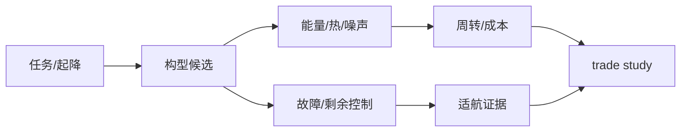

# 03 · UAV/eVTOL 构型、推进与能源

> 一句话点题：构型选择是任务、失效安全和单位经济的联合优化；eVTOL 的悬停、转换与巡航优势必须用复杂度、热和认证成本购买。

<div class="lesson-meta"><span>LAF07—LAF08—LAF09</span><span>核心主线</span><span>预计 6 × 45 分钟</span><span>证据截止 2026-08-30</span></div>

## 解锁与跳过

掌握飞行包线与任务 ODD。 即使你使用 AI 完成实现，也不能跳过本章的变量定义、反例和评测设计；这些部分决定你是否有能力发现一个“运行正常但结论错误”的系统。

## 本章可观察目标

完成后你能：比较多旋翼、固定翼和动力提升构型；建立推进、能源和热管理预算；用单点失效与冗余分析选架构。阅读完成不计掌握；至少需要一次不看答案的解释、一次实际应用和一次边界判断。

## 研究问题：多旋翼、固定翼和倾转/动力提升构型如何改变安全与经济性？

同一 20 km 物流任务，多旋翼起降灵活但巡航效率低，固定翼需跑道/回收，倾转构型效率高却有转换和机构故障。不能只比航程宣传数字。

问题必须被写成“输入、状态、动作/输出、损失、约束、证据和停止条件”的组合。只写“提升效果”会把数据、算法、交互与业务结果混在一起，也无法设计反事实或消融。

## 三个知识节点怎样连接

| 节点 | 核心对象 | 最小充分解释 | 必须支持的决策 |
|---|---|---|---|
| LAF07 | 飞行构型 | 旋翼/机翼/转换机构决定悬停、巡航与复杂度 | 任务需要怎样的升力路径 |
| LAF08 | 推进能源 | 电机、桨、逆变、电池/混动形成效率与热链 | 航程、载荷和周转如何平衡 |
| LAF09 | 冗余与故障 | 故障检测、隔离和剩余控制能力决定安全降级 | 哪些单点失效不可接受 |

三者不是并列名词：第一个节点通常建立对象和假设，第二个节点解释机制，第三个节点把机制放进测量或交付边界。缺任何一层，都容易把局部指标误当成系统结论。

## 核心机制：任务能量与冗余架构

诱导功率使悬停昂贵，机翼巡航利用升阻比；分布式电推进提高控制自由度也增加部件和共因失效。安全分析从功能失效出发，识别电源、总线、软件、冷却等共因；冗余只有隔离且具剩余控制权才有效。

理解机制时要区分三种量：**被设计者直接控制的变量**、**环境或数据生成过程决定的变量**、**只能通过代理指标观测的潜变量**。可靠实验一次只改变主要因子，其余配置进入版本化运行记录。

## 关键公式、假设与推导

悬停诱导功率近似 $P_i=T^{3/2}/\sqrt{2\rho A}$；巡航所需功率约 $P=DV/\eta$。任务能量 $E=\int P(t)dt+reserve$，可靠性不能简单用部件独立乘积忽略共因。

公式不是装饰。逐项检查：

- 桨盘面积和噪声约束
- 电芯 C-rate、温度、SOC/健康
- 转换段和单发失效包线
- 维修可达性和周转时间

若假设不成立，正确做法不是继续套公式，而是换估计量、改采样/实验设计、缩小结论或明确拒绝自动决策。

## 证据拆解1：AC-21-AA-2026-47 正常类动力提升无人驾驶航空器

### 研究问题

中国动力提升无人驾驶航空器适航审定有哪些当前指导？

### 核心机制、实验与指标

民航局 2026 年发布咨询通告，面向正常类动力提升无人驾驶航空器适航审定。

提供截至证据截止日的官方审定方法入口。

### 真正贡献、局限与适用边界

构型与安全目标需要从设计早期进入证据计划。 咨询通告适用范围和具体项目专用条件需由适航专业人员确认。

## 证据拆解2：NASA RAVEN

### 研究问题

新型垂直起降与自动化怎样通过飞行研究验证？

### 核心机制、实验与指标

NASA RAVEN 研究平台用于自主垂直飞行相关技术的集成与试验。

官方项目说明分阶段地面/飞行证据的重要性。

### 真正贡献、局限与适用边界

提供从部件到集成试验的方法参考。 研究平台结果不能直接等同产品适航符合性。

## 从论文或标准到产品主张：证据审计

| 日期 | 一手来源 | 它真正回答的问题 | 不能据此外推什么 |
|---|---|---|---|
| 2026-04-17 | AC-21-AA-2026-47 正常类动力提升无人驾驶航空器 | 中国动力提升无人驾驶航空器适航审定有哪些当前指导？ | 咨询通告适用范围和具体项目专用条件需由适航专业人员确认。 |
| 2026-08-30 | NASA RAVEN | 新型垂直起降与自动化怎样通过飞行研究验证？ | 研究平台结果不能直接等同产品适航符合性。 |

阅读来源时按四步记录：先抄下研究对象、比较基线、数据/场景和预算，再定位结果表或正式条文；随后区分作者直接观察、由结果支持的解释和你准备迁移到项目的推论；最后为推论写一个能推翻它的反例。**来源新并不等于证据强**：预印本、公司技术报告、正式标准、法规和独立复现承担的证明责任不同。数字必须连同分母、置信区间、硬件/本体、语言/人群与失败样本一起保存。

如果来源只证明组件指标改善，不得自动升级成端到端任务、真实用户价值、物理安全或合规结论。迁移到自己的项目时至少保留一个原方法基线、一个更简单基线和一个不使用该能力的基线；结果冲突时，优先检查任务定义、样本污染、资源预算、评价器偏差和运行边界，而不是挑选最符合预期的一项。

## 机制图：从输入到可验证结果



图中每条边都应能对应日志、数据版本、物理状态或人工记录；无法观测的边必须标为假设，不允许用模型的一段解释代替真实状态。

## 贯穿案例：20 km 医疗样本运输构型权衡

按载荷、起降面积、噪声、气象和备降要求比较三构型；仿真悬停/巡航/转换能量，做电机、电源和通信单故障分析。结果不是选最高航程，而是选满足安全余度与每日周转的未被支配方案。

案例的重点不是跑出最高分，而是保存“为什么选择这条路径”的证据：基线是什么、哪个假设最危险、失败怎样分层、什么条件触发降级或人工接管。

## 复现任务：最小因果链

1. 冻结任务剖面和 ODD
2. 建立部件效率/热/质量预算
3. 列单点与共因失效及剩余控制
4. 台架—HIL—系留—受限飞行逐级验证

复现不是成功运行作者代码。你必须固定数据/环境、预算和评价器，至少重复三次，报告均值、离散程度、失败样本和资源消耗；若只能跑一次，要把结论降级为演示证据。

## 三轮实验与消融路线

**第一轮：测量链校准。** 只运行最简单基线，检查输入单位、时间/坐标/权限、随机种子、日志和评价器。抽取成功与失败样本人工复核；若真值或测量本身不稳定，停止模型比较。输出必须能回答“同一次运行能否被另一人重放”。

**第二轮：机制消融。** 在同一数据、预算、硬件或运行条件下，一次只加入一个关键机制；对每次变化写预期影响、未变化项和失败阈值。除了主指标，还要检查最坏切片、过程约束、P95/P99、资源与人工成本。若提升只在一个方便切片出现，应缩小能力声明。

**第三轮：边界与迁移。** 有计划地改变本章公式假设或 ODD：时间、人群、语言、对象、气象、本体、延迟、权限或供应商至少选择两项；注入缺失、冲突和失效。记录系统是正确拒绝/降级/接管，还是带着错误自信继续。最终产物不是“最佳分数”，而是一个可复核的能力范围、反例集和下一次变更会触发的回归集合。

## 实验与指标

| 维度 | 至少记录什么 | 为什么 |
|---|---|---|
| 飞行任务 | 任务成功、航迹/时间/载荷与拒绝率 | 完成任务但越界不算成功 |
| 安全裕度 | 最小间隔、能量/控制余度、告警与失效覆盖 | 平均性能不能证明包线边缘安全 |
| 系统性能 | 定位/感知/C2 延迟、P95/P99、可用性 | 闭环由最慢和最弱链路决定 |
| 运行经济 | 每航次成本、机队利用、人工、维护与事故暴露 | 单机演示不能证明可持续运营 |

同时保留一个简单基线和一个“什么都不做/人工流程”基线。复杂方案只有在质量、成本、时延、风险或可扩展性至少一个维度形成可重复净收益时才晋级。

## 对产品、系统或研究架构的影响

- 构型 trade study 与安全目标共同评审
- 电池健康进入放行和寿命成本
- 冗余链跨电源/通信/软件隔离
- 转换段作为独立高风险工况

这些决策应进入 PRD、实验卡、接口契约、安全案例或 ADR，而不只留在学习笔记。模型、数据、提示、硬件、环境与评价器任何一个升级，都要能触发有范围的回归测试。

## 会死在哪里

- 用标称航程比较构型
- 冗余部件共享单电源
- 忽略热与周转
- 研究演示当适航证据
- 只测正常飞行

失败分析要写“触发条件—可观测信号—影响—检测—缓解—残余风险”。只写“模型可能出错”没有工程价值。

## 与 AI 协作模板

```text
对任务做构型 trade study：多旋翼/固定翼/动力提升，比较悬停巡航能量、起降、噪声、载荷、转换、热、单点/共因失效、维修与适航证据。
```

使用模板后仍需检查 AI 是否虚构来源、混用时间口径、悄悄改变任务定义，或把模拟结果外推到真实系统。

## 练习：做一次三构型权衡

为给定航程载荷建立能量表和失效表，画 Pareto 并写一页选型 ADR，至少包含一个让宣传航程失效的条件。

提交物必须包含一个反例或失败样本。只有成功案例会让你误以为已经掌握；边界证据才能说明你知道方法何时不该用。

## 常见误区

旋翼越多越安全；冗余等于复制；电池比能决定全部航程；eVTOL 只是大无人机；适航在设计后补。共同根因是把一个条件成立时的局部结论，扩张成不带条件的能力判断。

## 自测

<Quiz question="双电机冗余却共用单一电源总线，主要问题？" :options='["颜色","共因失效使冗余不独立","桨太多"]' :answer="1" explanation="共享关键链路可同时击穿复制部件。" />

## 本章小结

- 构型决定能量与失效路径
- 任务剖面优于规格表
- 冗余需隔离与剩余控制
- 适航证据从架构期开始

<EvidenceTracker lesson="field-low-altitude-03-vehicle-propulsion" />

## 本章完成标准

不看正文解释 三类构型 trade-off；完成 构型能量/失效权衡表；能指出 伪冗余的共因条件。最近相关题平均至少 7/10 才标记为 basic；跨日期完成变式任务并达到 8.5/10，才标记为 proficient。

<div class="source-note">主要来源（证据截止 2026-08-30）：<a href="https://www.caac.gov.cn/PHONE/XXGK_17/XXGK/GFXWJ/202604/t20260417_230570.html">CAAC AC-21-AA-2026-47</a>、<a href="https://www.nasa.gov/raven/">NASA RAVEN</a>。数字只描述来源中的实验设置；标准、法规与产品能力均按页面版本和适用范围解释。</div>
