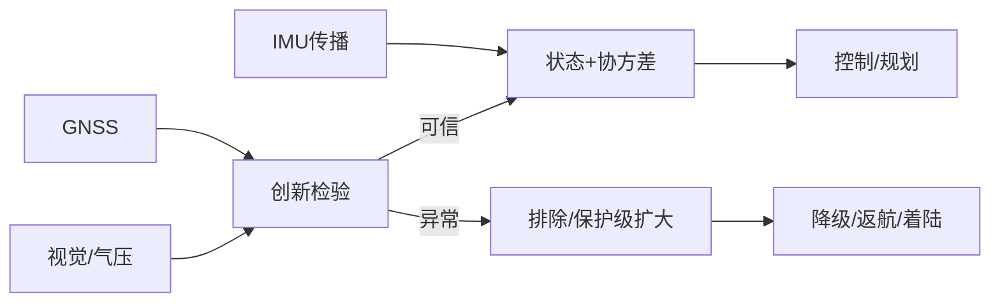

# 05 · 定位、导航与状态估计

> 一句话点题：导航不是输出一个位置，而是输出带不确定度、可观测性和健康状态的估计；控制器必须知道何时不能再相信它。

<div class="lesson-meta"><span>LAF13—LAF14—LAF15</span><span>核心主线</span><span>预计 6 × 45 分钟</span><span>证据截止 2026-08-30</span></div>

## 解锁与跳过

具备传感误差、坐标变换与线性代数基础。 即使你使用 AI 完成实现，也不能跳过本章的变量定义、反例和评测设计；这些部分决定你是否有能力发现一个“运行正常但结论错误”的系统。

## 本章可观察目标

完成后你能：建立 IMU/GNSS/视觉融合状态；解释可观测性和协方差一致性；设计 GNSS 降级、欺骗检测与安全模式。阅读完成不计掌握；至少需要一次不看答案的解释、一次实际应用和一次边界判断。

## 研究问题：GNSS 受扰、城市峡谷和高速机动时怎样维持可观测状态？

GNSS 欺骗造成位置平滑漂移，传统合理性检查不报警；视觉在水面/夜间退化，IMU 偏置继续累积。仅增加传感器会产生错误自信，需创新统计、跨源一致和地理/动力学约束。

问题必须被写成“输入、状态、动作/输出、损失、约束、证据和停止条件”的组合。只写“提升效果”会把数据、算法、交互与业务结果混在一起，也无法设计反事实或消融。

## 三个知识节点怎样连接

| 节点 | 核心对象 | 最小充分解释 | 必须支持的决策 |
|---|---|---|---|
| LAF13 | 状态估计 | 从噪声/偏置传感观测位置、速度、姿态与偏置 | 估计是否一致可信 |
| LAF14 | VIO/GNSS 融合 | 惯性短期连续、视觉/卫星提供漂移校正 | 城市峡谷/纹理弱如何切换 |
| LAF15 | 导航韧性 | 检测干扰、欺骗和传感失效并保持有界状态 | 何时降级返航/着陆 |

三者不是并列名词：第一个节点通常建立对象和假设，第二个节点解释机制，第三个节点把机制放进测量或交付边界。缺任何一层，都容易把局部指标误当成系统结论。

## 核心机制：误差状态滤波与健康门禁

IMU 高频传播名义状态与误差协方差，GNSS/视觉/气压计更新；创新残差与协方差检测异常。VIO 通过特征/光度约束估计相对运动，但尺度、纹理和动态物体影响可观测。独立健康管理决定排除观测、扩大保护级或进入安全模式。

理解机制时要区分三种量：**被设计者直接控制的变量**、**环境或数据生成过程决定的变量**、**只能通过代理指标观测的潜变量**。可靠实验一次只改变主要因子，其余配置进入版本化运行记录。

## 关键公式、假设与推导

EKF：$x^-_k=f(x_{k-1},u), P^-=FPF^T+Q$；创新 $r=z-h(x^-)$，$S=HP^-H^T+R$，NIS $r^TS^{-1}r$ 用于一致性检验。保护级应覆盖真实误差概率，不能只看 RMSE。

公式不是装饰。逐项检查：

- IMU 偏置/时间同步是否入状态
- 滤波 Q/R 是否由数据辨识
- 线性化和非高斯/多模态条件
- 真值系统精度和坐标基准

若假设不成立，正确做法不是继续套公式，而是换估计量、改采样/实验设计、缩小结论或明确拒绝自动决策。

## 证据拆解1：NASA AVIATE/autonomy research

### 研究问题

航空自主研究如何处理感知、导航与运行集成？

### 核心机制、实验与指标

NASA 自主系统研究强调验证、集成和运行场景。

提供导航韧性与自治验证的研究入口。

### 真正贡献、局限与适用边界

支持把定位健康从算法扩展到运行决策。 具体滤波/指标需使用相应技术报告和本地试验。

## 证据拆解2：NASA AAM Autonomy Tutorial

### 研究问题

AAM 自主系统的关键能力和挑战怎样组织？

### 核心机制、实验与指标

NASA 技术报告/tutorial 汇总 AAM 自主、感知、决策、验证与认证问题。

截至 2026 仍为系统学习的近期权威材料。

### 真正贡献、局限与适用边界

连接状态估计与更高层安全架构。 教程是综述性材料，不能替代设计符合性证据。

## 从论文或标准到产品主张：证据审计

| 日期 | 一手来源 | 它真正回答的问题 | 不能据此外推什么 |
|---|---|---|---|
| 2026-08-30 | NASA AVIATE/autonomy research | 航空自主研究如何处理感知、导航与运行集成？ | 具体滤波/指标需使用相应技术报告和本地试验。 |
| 2025-05-01 | NASA AAM Autonomy Tutorial | AAM 自主系统的关键能力和挑战怎样组织？ | 教程是综述性材料，不能替代设计符合性证据。 |

阅读来源时按四步记录：先抄下研究对象、比较基线、数据/场景和预算，再定位结果表或正式条文；随后区分作者直接观察、由结果支持的解释和你准备迁移到项目的推论；最后为推论写一个能推翻它的反例。**来源新并不等于证据强**：预印本、公司技术报告、正式标准、法规和独立复现承担的证明责任不同。数字必须连同分母、置信区间、硬件/本体、语言/人群与失败样本一起保存。

如果来源只证明组件指标改善，不得自动升级成端到端任务、真实用户价值、物理安全或合规结论。迁移到自己的项目时至少保留一个原方法基线、一个更简单基线和一个不使用该能力的基线；结果冲突时，优先检查任务定义、样本污染、资源预算、评价器偏差和运行边界，而不是挑选最符合预期的一项。

## 机制图：从输入到可验证结果



图中每条边都应能对应日志、数据版本、物理状态或人工记录；无法观测的边必须标为假设，不允许用模型的一段解释代替真实状态。

## 贯穿案例：城市峡谷 GNSS 欺骗降级

仿真和回放注入阶跃、缓慢拖拽、多路径及视觉纹理退化。比较 GNSS-only、EKF 和多源健康门禁；报告定位误差、NEES/NIS、一致覆盖、告警延迟、误警和安全模式进入时的航迹。

案例的重点不是跑出最高分，而是保存“为什么选择这条路径”的证据：基线是什么、哪个假设最危险、失败怎样分层、什么条件触发降级或人工接管。

## 复现任务：最小因果链

1. 建立传感误差/时间同步模型
2. 用独立真值回放正常与异常
3. 检查 RMSE 同时检查协方差一致性
4. HIL 验证排除观测和降级状态机

复现不是成功运行作者代码。你必须固定数据/环境、预算和评价器，至少重复三次，报告均值、离散程度、失败样本和资源消耗；若只能跑一次，要把结论降级为演示证据。

## 三轮实验与消融路线

**第一轮：测量链校准。** 只运行最简单基线，检查输入单位、时间/坐标/权限、随机种子、日志和评价器。抽取成功与失败样本人工复核；若真值或测量本身不稳定，停止模型比较。输出必须能回答“同一次运行能否被另一人重放”。

**第二轮：机制消融。** 在同一数据、预算、硬件或运行条件下，一次只加入一个关键机制；对每次变化写预期影响、未变化项和失败阈值。除了主指标，还要检查最坏切片、过程约束、P95/P99、资源与人工成本。若提升只在一个方便切片出现，应缩小能力声明。

**第三轮：边界与迁移。** 有计划地改变本章公式假设或 ODD：时间、人群、语言、对象、气象、本体、延迟、权限或供应商至少选择两项；注入缺失、冲突和失效。记录系统是正确拒绝/降级/接管，还是带着错误自信继续。最终产物不是“最佳分数”，而是一个可复核的能力范围、反例集和下一次变更会触发的回归集合。

## 实验与指标

| 维度 | 至少记录什么 | 为什么 |
|---|---|---|
| 飞行任务 | 任务成功、航迹/时间/载荷与拒绝率 | 完成任务但越界不算成功 |
| 安全裕度 | 最小间隔、能量/控制余度、告警与失效覆盖 | 平均性能不能证明包线边缘安全 |
| 系统性能 | 定位/感知/C2 延迟、P95/P99、可用性 | 闭环由最慢和最弱链路决定 |
| 运行经济 | 每航次成本、机队利用、人工、维护与事故暴露 | 单机演示不能证明可持续运营 |

同时保留一个简单基线和一个“什么都不做/人工流程”基线。复杂方案只有在质量、成本、时延、风险或可扩展性至少一个维度形成可重复净收益时才晋级。

## 对产品、系统或研究架构的影响

- 估计接口携带协方差与健康标志
- 保护级超阈值禁止继续任务
- GNSS 恢复需多源一致和滞回
- 欺骗/干扰样本进入回归

这些决策应进入 PRD、实验卡、接口契约、安全案例或 ADR，而不只留在学习笔记。模型、数据、提示、硬件、环境与评价器任何一个升级，都要能触发有范围的回归测试。

## 会死在哪里

- 只看平均 RMSE
- 协方差过小造成错误自信
- 所有传感共享 GNSS 时间却称独立
- 失效后立即自动恢复
- 真值精度不够

失败分析要写“触发条件—可观测信号—影响—检测—缓解—残余风险”。只写“模型可能出错”没有工程价值。

## 与 AI 协作模板

```text
为导航系统设计状态、过程/观测模型、创新门限、保护级和健康状态机；注入 GNSS 拒止/欺骗、视觉退化、IMU 偏置和时间错位，报告一致性与安全降级。
```

使用模板后仍需检查 AI 是否虚构来源、混用时间口径、悄悄改变任务定义，或把模拟结果外推到真实系统。

## 练习：实现一个带健康门禁的融合回放

用简化二维 EKF 融合 IMU/GNSS，注入缓慢欺骗；比较仅 RMSE 与 NIS 门禁，提交告警/误警和降级轨迹。

提交物必须包含一个反例或失败样本。只有成功案例会让你误以为已经掌握；边界证据才能说明你知道方法何时不该用。

## 常见误区

传感融合总会更准；轨迹平滑就是可信；RMSE 低等于协方差校准；GNSS 恢复即可立即信任；视觉里程计永不漂移。共同根因是把一个条件成立时的局部结论，扩张成不带条件的能力判断。

## 自测

<Quiz question="估计误差偶尔很大但滤波协方差一直很小，说明什么？" :options='["更可靠","估计不一致且风险被低估","只需提高刷新率"]' :answer="1" explanation="协方差必须覆盖真实误差，否则门禁会错误放行。" />

## 本章小结

- 状态估计输出不确定性和健康
- 可观测性决定能否校正漂移
- 一致性比轨迹平滑重要
- 导航失效需显式降级

<EvidenceTracker lesson="field-low-altitude-05-localization-navigation" />

## 本章完成标准

不看正文解释 RMSE 与一致性的差异；完成 一个异常注入融合实验；能指出 状态不可观测时的安全动作。最近相关题平均至少 7/10 才标记为 basic；跨日期完成变式任务并达到 8.5/10，才标记为 proficient。

<div class="source-note">主要来源（证据截止 2026-08-30）：<a href="https://www.nasa.gov/aeronautics/autonomous-systems/">NASA Autonomy</a>、<a href="https://ntrs.nasa.gov/citations/20250005043">AAM Autonomy Tutorial</a>。数字只描述来源中的实验设置；标准、法规与产品能力均按页面版本和适用范围解释。</div>
