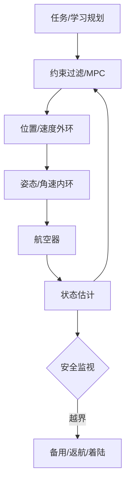

# 06 · 飞控、轨迹规划与自主决策

> 一句话点题：学习规划器可以提出动作，但不应拥有无边界控制权；安全关键飞行依靠分层控制、硬约束和独立恢复形成防线。

<div class="lesson-meta"><span>LAF16—LAF17—LAF18</span><span>核心主线</span><span>预计 6 × 45 分钟</span><span>证据截止 2026-08-30</span></div>

## 解锁与跳过

掌握状态估计与性能包线。 即使你使用 AI 完成实现，也不能跳过本章的变量定义、反例和评测设计；这些部分决定你是否有能力发现一个“运行正常但结论错误”的系统。

## 本章可观察目标

完成后你能：分层理解姿态、速度、位置和任务控制；比较 PID/LQR/NMPC 与学习策略；用可达性、地理围栏和 HIL 约束自主规划。阅读完成不计掌握；至少需要一次不看答案的解释、一次实际应用和一次边界判断。

## 研究问题：学习策略怎样与可验证控制器、地理围栏和应急逻辑共存？

端到端策略在训练城市成功绕障，遇到未见吊线输出激进转向并进入推力饱和。需要 verified envelope、运行时 assurance 和应急着陆候选，而不是只加训练数据。

问题必须被写成“输入、状态、动作/输出、损失、约束、证据和停止条件”的组合。只写“提升效果”会把数据、算法、交互与业务结果混在一起，也无法设计反事实或消融。

## 三个知识节点怎样连接

| 节点 | 核心对象 | 最小充分解释 | 必须支持的决策 |
|---|---|---|---|
| LAF16 | 分层飞控 | 快内环稳定本体，慢外环跟踪与规划 | 哪些环必须确定、可验证 |
| LAF17 | 约束规划 | 轨迹同时满足动力学、障碍、空域和能量 | 最优性何时让位安全可行 |
| LAF18 | 自主安全壳 | 独立监视器覆盖模型/规划器失效并触发恢复 | 学习策略能做哪些动作 |

三者不是并列名词：第一个节点通常建立对象和假设，第二个节点解释机制，第三个节点把机制放进测量或交付边界。缺任何一层，都容易把局部指标误当成系统结论。

## 核心机制：优化控制与 runtime assurance

内环 PID/LQR 保姿态，外环位置/速度跟踪；NMPC 在滚动时域优化动力学与约束。高层学习策略输出目标/航点，安全过滤器预测可达集或控制 barrier，越界时切换 verified backup。状态机覆盖失链、低能量、导航降级和避让。

理解机制时要区分三种量：**被设计者直接控制的变量**、**环境或数据生成过程决定的变量**、**只能通过代理指标观测的潜变量**。可靠实验一次只改变主要因子，其余配置进入版本化运行记录。

## 关键公式、假设与推导

LQR 最小化 $J=\sum x^TQx+u^TRu$；MPC 在 $N$ 步满足 $x_{k+1}=f(x_k,u_k),g(x,u)\le0$。控制 barrier 条件 $\dot h(x,u)+\alpha h(x)\ge0$ 维持安全集 $h(x)\ge0$。

公式不是装饰。逐项检查：

- 线性/动力学模型适用包线
- 求解器最坏时延与不可行处理
- 安全集是否含估计不确定和延迟
- 备用控制器在故障状态仍可用

若假设不成立，正确做法不是继续套公式，而是换估计量、改采样/实验设计、缩小结论或明确拒绝自动决策。

## 证据拆解1：NASA AAM Autonomy Tutorial

### 研究问题

AAM 自主决策与验证的系统挑战是什么？

### 核心机制、实验与指标

材料把感知、规划、控制、人机和认证组织为联合问题。

强调高自主运行必须有验证与运行保证。

### 真正贡献、局限与适用边界

支持运行时安全架构。 综述不能替代具体控制律证明/试验。

## 证据拆解2：NASA RAVEN

### 研究问题

自主垂直飞行如何逐级集成试验？

### 核心机制、实验与指标

RAVEN 平台面向自主垂直飞行技术开展研究和飞行验证。

展示仿真、地面与受控飞行证据链。

### 真正贡献、局限与适用边界

支持 HIL 和受限包线逐级扩展。 研究进展不等于商业型号批准。

## 从论文或标准到产品主张：证据审计

| 日期 | 一手来源 | 它真正回答的问题 | 不能据此外推什么 |
|---|---|---|---|
| 2025-05-01 | NASA AAM Autonomy Tutorial | AAM 自主决策与验证的系统挑战是什么？ | 综述不能替代具体控制律证明/试验。 |
| 2026-08-30 | NASA RAVEN | 自主垂直飞行如何逐级集成试验？ | 研究进展不等于商业型号批准。 |

阅读来源时按四步记录：先抄下研究对象、比较基线、数据/场景和预算，再定位结果表或正式条文；随后区分作者直接观察、由结果支持的解释和你准备迁移到项目的推论；最后为推论写一个能推翻它的反例。**来源新并不等于证据强**：预印本、公司技术报告、正式标准、法规和独立复现承担的证明责任不同。数字必须连同分母、置信区间、硬件/本体、语言/人群与失败样本一起保存。

如果来源只证明组件指标改善，不得自动升级成端到端任务、真实用户价值、物理安全或合规结论。迁移到自己的项目时至少保留一个原方法基线、一个更简单基线和一个不使用该能力的基线；结果冲突时，优先检查任务定义、样本污染、资源预算、评价器偏差和运行边界，而不是挑选最符合预期的一项。

## 机制图：从输入到可验证结果



图中每条边都应能对应日志、数据版本、物理状态或人工记录；无法观测的边必须标为假设，不允许用模型的一段解释代替真实状态。

## 贯穿案例：城市巡检 runtime assurance

学习规划器只输出短时航点；NMPC 检查障碍、推力、倾角、空域与 SOC。独立监视器用保守可达管判断未来 3 秒，违例切备用悬停/返航。SIL→HIL 注入求解超时、状态跳变和障碍突现。

案例的重点不是跑出最高分，而是保存“为什么选择这条路径”的证据：基线是什么、哪个假设最危险、失败怎样分层、什么条件触发降级或人工接管。

## 复现任务：最小因果链

1. 分离任务/规划/控制/安全层接口
2. 验证 baseline 控制器包线
3. 给学习输出加约束过滤和超时
4. SIL/HIL/系留逐级注入故障

复现不是成功运行作者代码。你必须固定数据/环境、预算和评价器，至少重复三次，报告均值、离散程度、失败样本和资源消耗；若只能跑一次，要把结论降级为演示证据。

## 三轮实验与消融路线

**第一轮：测量链校准。** 只运行最简单基线，检查输入单位、时间/坐标/权限、随机种子、日志和评价器。抽取成功与失败样本人工复核；若真值或测量本身不稳定，停止模型比较。输出必须能回答“同一次运行能否被另一人重放”。

**第二轮：机制消融。** 在同一数据、预算、硬件或运行条件下，一次只加入一个关键机制；对每次变化写预期影响、未变化项和失败阈值。除了主指标，还要检查最坏切片、过程约束、P95/P99、资源与人工成本。若提升只在一个方便切片出现，应缩小能力声明。

**第三轮：边界与迁移。** 有计划地改变本章公式假设或 ODD：时间、人群、语言、对象、气象、本体、延迟、权限或供应商至少选择两项；注入缺失、冲突和失效。记录系统是正确拒绝/降级/接管，还是带着错误自信继续。最终产物不是“最佳分数”，而是一个可复核的能力范围、反例集和下一次变更会触发的回归集合。

## 实验与指标

| 维度 | 至少记录什么 | 为什么 |
|---|---|---|
| 飞行任务 | 任务成功、航迹/时间/载荷与拒绝率 | 完成任务但越界不算成功 |
| 安全裕度 | 最小间隔、能量/控制余度、告警与失效覆盖 | 平均性能不能证明包线边缘安全 |
| 系统性能 | 定位/感知/C2 延迟、P95/P99、可用性 | 闭环由最慢和最弱链路决定 |
| 运行经济 | 每航次成本、机队利用、人工、维护与事故暴露 | 单机演示不能证明可持续运营 |

同时保留一个简单基线和一个“什么都不做/人工流程”基线。复杂方案只有在质量、成本、时延、风险或可扩展性至少一个维度形成可重复净收益时才晋级。

## 对产品、系统或研究架构的影响

- 学习策略不直接输出电机命令
- 安全监视独立进程/电源边界按风险设计
- 求解超时有确定降级
- 包线扩张需新回归与飞行卡

这些决策应进入 PRD、实验卡、接口契约、安全案例或 ADR，而不只留在学习笔记。模型、数据、提示、硬件、环境与评价器任何一个升级，都要能触发有范围的回归测试。

## 会死在哪里

- 仿真 reward 当安全证明
- 备用控制器从未在故障状态测试
- 地理围栏只在云端
- 忽略求解器尾延迟
- 学习与安全监视共享同一故障

失败分析要写“触发条件—可观测信号—影响—检测—缓解—残余风险”。只写“模型可能出错”没有工程价值。

## 与 AI 协作模板

```text
为自主飞行画四层控制架构，列状态/动作/频率/约束；设计 runtime assurance、安全集、备用模式和 SIL/HIL 故障注入，报告最坏时延与约束违例。
```

使用模板后仍需检查 AI 是否虚构来源、混用时间口径、悄悄改变任务定义，或把模拟结果外推到真实系统。

## 练习：给学习规划器加安全壳

在二维无人机仿真中让启发式/学习规划器提航点，用 barrier 或速度障碍过滤；注入延迟和突发障碍，比较成功与最小间隔。

提交物必须包含一个反例或失败样本。只有成功案例会让你误以为已经掌握；边界证据才能说明你知道方法何时不该用。

## 常见误区

端到端控制最先进所以更安全；MPC 优化即可保证可行；地理围栏等于避障；备用存在就可靠；平均求解时间足够。共同根因是把一个条件成立时的局部结论，扩张成不带条件的能力判断。

## 自测

<Quiz question="学习规划器提出超出推力包线航点，哪层应阻止？" :options='["营销层","独立约束过滤/控制安全壳","相机 UI"]' :answer="1" explanation="高层建议必须经过动力学与安全约束。" />

## 本章小结

- 飞控分层匹配时间尺度
- 规划必须物理可行
- 学习策略受独立安全壳约束
- 故障注入验证恢复

<EvidenceTracker lesson="field-low-altitude-06-control-planning" />

## 本章完成标准

不看正文解释 学习规划与 verified backup 的关系；完成 一个 runtime assurance 原型；能指出 端到端策略不得直接控制的动作。最近相关题平均至少 7/10 才标记为 basic；跨日期完成变式任务并达到 8.5/10，才标记为 proficient。

<div class="source-note">主要来源（证据截止 2026-08-30）：<a href="https://ntrs.nasa.gov/citations/20250005043">AAM Autonomy Tutorial</a>、<a href="https://www.nasa.gov/raven/">NASA RAVEN</a>。数字只描述来源中的实验设置；标准、法规与产品能力均按页面版本和适用范围解释。</div>
