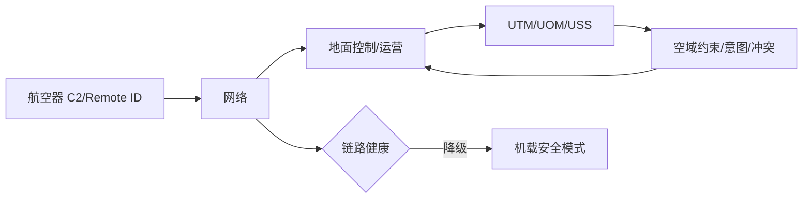

# 07 · C2 通信、运行识别与低空交通管理

> 一句话点题：高密度超视距的瓶颈不是飞一架，而是可信交换身份、意图和约束，并在通信/服务失效时仍保持分离。

<div class="lesson-meta"><span>LAF19—LAF20—LAF21</span><span>核心主线</span><span>预计 6 × 45 分钟</span><span>证据截止 2026-08-30</span></div>

## 解锁与跳过

完成系统、导航和控制章节。 即使你使用 AI 完成实现，也不能跳过本章的变量定义、反例和评测设计；这些部分决定你是否有能力发现一个“运行正常但结论错误”的系统。

## 本章可观察目标

完成后你能：建立 C2 链路预算和失链状态机；理解运行识别、UTM/U-space 服务和意图交换；验证高密度 BVLOS 的冲突与服务降级。阅读完成不计掌握；至少需要一次不看答案的解释、一次实际应用和一次边界判断。

## 研究问题：高密度 BVLOS 运行需要交换哪些意图、身份、约束和冲突信息？

4G 覆盖图显示信号，却无法保证低时延、上行容量和漫游切换；多家运营平台对同一空域有不同意图视图。必须定义 end-to-end C2 SLO、Remote ID、UOM/USS 一致性和失联降级。

问题必须被写成“输入、状态、动作/输出、损失、约束、证据和停止条件”的组合。只写“提升效果”会把数据、算法、交互与业务结果混在一起，也无法设计反事实或消融。

## 三个知识节点怎样连接

| 节点 | 核心对象 | 最小充分解释 | 必须支持的决策 |
|---|---|---|---|
| LAF19 | C2 通信 | 遥控/监视链在覆盖、延迟、完整性和安全上满足运行需求 | 失链何时触发何种动作 |
| LAF20 | 运行识别 | 航空器/运营信息按规则对授权主体可见 | 身份、隐私和可信怎样平衡 |
| LAF21 | UTM/UOM 服务 | 航线意图、约束、动态空域和冲突通过服务协同 | 服务失效时谁维持安全 |

三者不是并列名词：第一个节点通常建立对象和假设，第二个节点解释机制，第三个节点把机制放进测量或交付边界。缺任何一层，都容易把局部指标误当成系统结论。

## 核心机制：链路预算、状态机与协同服务

C2 从航空器—接入网—核心网—控制站全链路测量 RSRP/SINR、丢包、RTT、抖动和可用性。运行识别提供身份/位置等最小必要信息。UTM/U-space 用服务交换运行计划、空域约束、监视和冲突；机载 DAA 与地面服务是互补防线。

理解机制时要区分三种量：**被设计者直接控制的变量**、**环境或数据生成过程决定的变量**、**只能通过代理指标观测的潜变量**。可靠实验一次只改变主要因子，其余配置进入版本化运行记录。

## 关键公式、假设与推导

链路余量 $M=P_t+G_t+G_r-L_{path}-L_{misc}-Sensitivity$；可靠运行关注 $P(latency<L,availability>A)$ 和连续中断长度。冲突概率/间隔必须考虑意图更新延迟和位置协方差。

公式不是装饰。逐项检查：

- 覆盖图与目标高度/上行差异
- 运营商/卫星切换与共因
- 身份数据的访问/留存
- UTM 服务不可用时的运行最小能力

若假设不成立，正确做法不是继续套公式，而是换估计量、改采样/实验设计、缩小结论或明确拒绝自动决策。

## 证据拆解1：GB/T 47575-2026 低空交通管理服务相关国家标准

### 研究问题

中国低空交通管理服务标准有什么最新节点？

### 核心机制、实验与指标

国家标准页面显示 GB/T 47575-2026 于 2026-07-02 发布，2026-09-01 实施。

在 2026-08-30 证据截止日它已发布但尚未实施。

### 真正贡献、局限与适用边界

必须明确区分发布和生效，提前做接口差距分析。 正式适用范围、条文和配套标准需逐项读取；不得写成已实施。

## 证据拆解2：EASA U-space

### 研究问题

欧洲 U-space 如何组织高密度无人机服务？

### 核心机制、实验与指标

EASA 官方页面说明 U-space 空域与网络识别、地理感知、飞行授权、交通信息等服务。

提供已运行监管体系的服务分类参考。

### 真正贡献、局限与适用边界

帮助对照 UTM/UOM 状态和接口。 欧盟框架不能替代中国规则，角色和数据要求不同。

## 证据拆解3：ICAO UTM Guidance

### 研究问题

UTM 全球互操作需要哪些共同概念？

### 核心机制、实验与指标

ICAO 材料组织 UTM 原则、服务与传统 ATM 协同。

支持跨平台意图/约束交换的共同语义。

### 真正贡献、局限与适用边界

提供国际比较基线。 指导性材料不直接批准某一 BVLOS 运行。

## 从论文或标准到产品主张：证据审计

| 日期 | 一手来源 | 它真正回答的问题 | 不能据此外推什么 |
|---|---|---|---|
| 2026-07-02 | GB/T 47575-2026 低空交通管理服务相关国家标准 | 中国低空交通管理服务标准有什么最新节点？ | 正式适用范围、条文和配套标准需逐项读取；不得写成已实施。 |
| 2026-08-30 | EASA U-space | 欧洲 U-space 如何组织高密度无人机服务？ | 欧盟框架不能替代中国规则，角色和数据要求不同。 |
| 2026-08-30 | ICAO UTM Guidance | UTM 全球互操作需要哪些共同概念？ | 指导性材料不直接批准某一 BVLOS 运行。 |

阅读来源时按四步记录：先抄下研究对象、比较基线、数据/场景和预算，再定位结果表或正式条文；随后区分作者直接观察、由结果支持的解释和你准备迁移到项目的推论；最后为推论写一个能推翻它的反例。**来源新并不等于证据强**：预印本、公司技术报告、正式标准、法规和独立复现承担的证明责任不同。数字必须连同分母、置信区间、硬件/本体、语言/人群与失败样本一起保存。

如果来源只证明组件指标改善，不得自动升级成端到端任务、真实用户价值、物理安全或合规结论。迁移到自己的项目时至少保留一个原方法基线、一个更简单基线和一个不使用该能力的基线；结果冲突时，优先检查任务定义、样本污染、资源预算、评价器偏差和运行边界，而不是挑选最符合预期的一项。

## 机制图：从输入到可验证结果



图中每条边都应能对应日志、数据版本、物理状态或人工记录；无法观测的边必须标为假设，不允许用模型的一段解释代替真实状态。

## 贯穿案例：多运营人 BVLOS 走廊

两家平台共享走廊，提交四维意图并接收动态限制。沿高度/位置/运营商实测上行和中断；注入 UTM 延迟、冲突计划和 Remote ID 不一致。失链按持续时间进入继续/返航/备降，服务中断停止新放行。

案例的重点不是跑出最高分，而是保存“为什么选择这条路径”的证据：基线是什么、哪个假设最危险、失败怎样分层、什么条件触发降级或人工接管。

## 复现任务：最小因果链

1. 按任务高度路线实测 C2 分布而非地面覆盖图
2. 定义链路/识别/UTM 状态机和时间预算
3. 多运营人仿真冲突、迟到和不一致
4. 演练服务不可用与机载独立保持间隔

复现不是成功运行作者代码。你必须固定数据/环境、预算和评价器，至少重复三次，报告均值、离散程度、失败样本和资源消耗；若只能跑一次，要把结论降级为演示证据。

## 三轮实验与消融路线

**第一轮：测量链校准。** 只运行最简单基线，检查输入单位、时间/坐标/权限、随机种子、日志和评价器。抽取成功与失败样本人工复核；若真值或测量本身不稳定，停止模型比较。输出必须能回答“同一次运行能否被另一人重放”。

**第二轮：机制消融。** 在同一数据、预算、硬件或运行条件下，一次只加入一个关键机制；对每次变化写预期影响、未变化项和失败阈值。除了主指标，还要检查最坏切片、过程约束、P95/P99、资源与人工成本。若提升只在一个方便切片出现，应缩小能力声明。

**第三轮：边界与迁移。** 有计划地改变本章公式假设或 ODD：时间、人群、语言、对象、气象、本体、延迟、权限或供应商至少选择两项；注入缺失、冲突和失效。记录系统是正确拒绝/降级/接管，还是带着错误自信继续。最终产物不是“最佳分数”，而是一个可复核的能力范围、反例集和下一次变更会触发的回归集合。

## 实验与指标

| 维度 | 至少记录什么 | 为什么 |
|---|---|---|
| 飞行任务 | 任务成功、航迹/时间/载荷与拒绝率 | 完成任务但越界不算成功 |
| 安全裕度 | 最小间隔、能量/控制余度、告警与失效覆盖 | 平均性能不能证明包线边缘安全 |
| 系统性能 | 定位/感知/C2 延迟、P95/P99、可用性 | 闭环由最慢和最弱链路决定 |
| 运行经济 | 每航次成本、机队利用、人工、维护与事故暴露 | 单机演示不能证明可持续运营 |

同时保留一个简单基线和一个“什么都不做/人工流程”基线。复杂方案只有在质量、成本、时延、风险或可扩展性至少一个维度形成可重复净收益时才晋级。

## 对产品、系统或研究架构的影响

- GB/T 47575 标注 2026-09-01 才实施
- C2 SLO 绑定失链动作
- 身份数据最小权限和留存
- UTM 不作为机载最后安全防线

这些决策应进入 PRD、实验卡、接口契约、安全案例或 ADR，而不只留在学习笔记。模型、数据、提示、硬件、环境与评价器任何一个升级，都要能触发有范围的回归测试。

## 会死在哪里

- 信号格数当可靠性
- 下行好等于上行好
- 把待实施标准写成已实施
- 服务延迟不进冲突预测
- Remote ID 数据无限公开

失败分析要写“触发条件—可观测信号—影响—检测—缓解—残余风险”。只写“模型可能出错”没有工程价值。

## 与 AI 协作模板

```text
为 BVLOS 运行设计 C2/Remote ID/UTM：端到端链路预算、P95/P99/连续中断、身份最小字段、意图/约束状态机、服务失效和机载后备；标每个标准发布/实施日期。
```

使用模板后仍需检查 AI 是否虚构来源、混用时间口径、悄悄改变任务定义，或把模拟结果外推到真实系统。

## 练习：做一个低空服务失效仿真

模拟 20 架航空器四维意图，注入 2—10 秒网络延迟和服务中断；报告冲突告警、最小间隔、停止放行和恢复条件。

提交物必须包含一个反例或失败样本。只有成功案例会让你误以为已经掌握；边界证据才能说明你知道方法何时不该用。

## 常见误区

5G 覆盖即 C2 合格；UTM 等于传统塔台；Remote ID 无隐私权衡；计划去冲突即可无需 DAA；发布标准即已实施。共同根因是把一个条件成立时的局部结论，扩张成不带条件的能力判断。

## 自测

<Quiz question="GB/T 47575-2026 在 2026-08-30 的正确状态？" :options='["尚未发布","已发布，2026-09-01 实施","已实施多年"]' :answer="1" explanation="必须精确区分发布日期与实施日期。" />

## 本章小结

- C2 需端到端尾部指标
- 识别连接信任与隐私
- UTM 交换意图约束但非唯一防线
- 标准日期决定合规表述

<EvidenceTracker lesson="field-low-altitude-07-c2-network-utm" />

## 本章完成标准

不看正文解释 C2、Remote ID 与 UTM 的分工；完成 一份失链/服务状态机；能指出 地面服务不可用时不得继续的运行。最近相关题平均至少 7/10 才标记为 basic；跨日期完成变式任务并达到 8.5/10，才标记为 proficient。

<div class="source-note">主要来源（证据截止 2026-08-30）：<a href="https://openstd.samr.gov.cn/bzgk/std/newGbInfo?hcno=F5C4C49E2761CC5EAB22130B73F14229">GB/T 47575-2026</a>、<a href="https://www.easa.europa.eu/en/domains/air-traffic-management/u-space">EASA U-space</a>、<a href="https://www.icao.int/utm-guidance">ICAO UTM</a>。数字只描述来源中的实验设置；标准、法规与产品能力均按页面版本和适用范围解释。</div>
