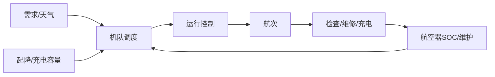

# 08 · 起降设施、机队与运行体系

> 一句话点题：单架样机能飞不代表机队能运营；规模化由周转、维修、天气相关性、地面保障和组织纪律共同决定。

<div class="lesson-meta"><span>LAF22—LAF23—LAF24</span><span>核心主线</span><span>预计 6 × 45 分钟</span><span>证据截止 2026-08-30</span></div>

## 解锁与跳过

能把单机任务放入空域、通信与安全状态机。 即使你使用 AI 完成实现，也不能跳过本章的变量定义、反例和评测设计；这些部分决定你是否有能力发现一个“运行正常但结论错误”的系统。

## 本章可观察目标

完成后你能：建模起降点、充换电和维修约束；计算机队容量、利用率与韧性；建立运行控制、人员和地面保障 SOP。阅读完成不计掌握；至少需要一次不看答案的解释、一次实际应用和一次边界判断。

## 研究问题：单架飞得起来为什么不等于机队能可靠运营？

十架无人机理论每天 100 航次，实际充电排队、同一风暴停飞、备件不足与起降点容量使完成率不到一半。提高单机速度可能增加充电和维护峰值。

问题必须被写成“输入、状态、动作/输出、损失、约束、证据和停止条件”的组合。只写“提升效果”会把数据、算法、交互与业务结果混在一起，也无法设计反事实或消融。

## 三个知识节点怎样连接

| 节点 | 核心对象 | 最小充分解释 | 必须支持的决策 |
|---|---|---|---|
| LAF22 | 起降基础设施 | 场地、障碍、消防、能源、噪声和周边人流共同限制运行 | 节点能否安全周转 |
| LAF23 | 机队调度 | 任务、航路、SOC、维护和天气组成资源约束优化 | 延误/备机怎样配置 |
| LAF24 | 持续适航/运行 | 检查、维修、配置、人员和事件维持长期安全 | 单机状态是否可放行 |

三者不是并列名词：第一个节点通常建立对象和假设，第二个节点解释机制，第三个节点把机制放进测量或交付边界。缺任何一层，都容易把局部指标误当成系统结论。

## 核心机制：资源网络与持续运行控制

把航空器、起降点、充电器、航路、人员和维修槽作为资源；任务有时间窗、载荷和 ODD。调度器只能分配当前 configuration/maintenance/energy 合格的航空器。运行控制监视天气、空域、C2 与机队健康，异常有延误、替换、取消和恢复流程。

理解机制时要区分三种量：**被设计者直接控制的变量**、**环境或数据生成过程决定的变量**、**只能通过代理指标观测的潜变量**。可靠实验一次只改变主要因子，其余配置进入版本化运行记录。

## 关键公式、假设与推导

利用率 $U=busy/(available)$，Little $L=\lambda W$ 估排队；但天气造成相关停机需离散事件/蒙特卡洛。每航次成本含折旧、能源、人员、维护、基础设施、失败和保险，不用飞行时间单价替代。

公式不是装饰。逐项检查：

- 充电/换电的热与寿命限制
- 起降点同时容量和周边风险
- 维护间隔按小时/循环/状态
- 天气故障相关而非独立

若假设不成立，正确做法不是继续套公式，而是换估计量、改采样/实验设计、缩小结论或明确拒绝自动决策。

## 证据拆解1：NASA HDV / Autonomous Vehicle Applications

### 研究问题

高密度自主运行怎样考虑人和运行系统？

### 核心机制、实验与指标

NASA 研究将自主车辆、操作员、任务控制和验证联结。

说明规模化自治需要人因与运行控制。

### 真正贡献、局限与适用边界

支持机队而非单机优化。 研究环境与商业 KPI 仍需本地建模。

## 证据拆解2：FAA Advanced Air Mobility

### 研究问题

AAM 商业运行涉及哪些基础设施/运行层？

### 核心机制、实验与指标

FAA 官方入口汇集航空器、运营、空域和基础设施信息。

显示 vertiport/air taxi 不是单一飞行器审批。

### 真正贡献、局限与适用边界

提供国际比较与术语入口。 美国规则不直接适用于中国项目。

## 从论文或标准到产品主张：证据审计

| 日期 | 一手来源 | 它真正回答的问题 | 不能据此外推什么 |
|---|---|---|---|
| 2026-08-30 | NASA HDV / Autonomous Vehicle Applications | 高密度自主运行怎样考虑人和运行系统？ | 研究环境与商业 KPI 仍需本地建模。 |
| 2026-08-30 | FAA Advanced Air Mobility | AAM 商业运行涉及哪些基础设施/运行层？ | 美国规则不直接适用于中国项目。 |

阅读来源时按四步记录：先抄下研究对象、比较基线、数据/场景和预算，再定位结果表或正式条文；随后区分作者直接观察、由结果支持的解释和你准备迁移到项目的推论；最后为推论写一个能推翻它的反例。**来源新并不等于证据强**：预印本、公司技术报告、正式标准、法规和独立复现承担的证明责任不同。数字必须连同分母、置信区间、硬件/本体、语言/人群与失败样本一起保存。

如果来源只证明组件指标改善，不得自动升级成端到端任务、真实用户价值、物理安全或合规结论。迁移到自己的项目时至少保留一个原方法基线、一个更简单基线和一个不使用该能力的基线；结果冲突时，优先检查任务定义、样本污染、资源预算、评价器偏差和运行边界，而不是挑选最符合预期的一项。

## 机制图：从输入到可验证结果



图中每条边都应能对应日志、数据版本、物理状态或人工记录；无法观测的边必须标为假设，不允许用模型的一段解释代替真实状态。

## 贯穿案例：十机河道巡检运营日

建立 15 分钟粒度离散事件模型，含天气窗、充电、飞前检查、故障和备机。比较快充/换电/多起降点；指标是按时完成、取消、航机利用、电池损耗、人工和每成功航次成本。

案例的重点不是跑出最高分，而是保存“为什么选择这条路径”的证据：基线是什么、哪个假设最危险、失败怎样分层、什么条件触发降级或人工接管。

## 复现任务：最小因果链

1. 记录真实周转与维护时间分布
2. 建立资源/时间窗离散事件仿真
3. 注入相关天气和部件故障
4. 写放行、取消、替换和恢复 SOP

复现不是成功运行作者代码。你必须固定数据/环境、预算和评价器，至少重复三次，报告均值、离散程度、失败样本和资源消耗；若只能跑一次，要把结论降级为演示证据。

## 三轮实验与消融路线

**第一轮：测量链校准。** 只运行最简单基线，检查输入单位、时间/坐标/权限、随机种子、日志和评价器。抽取成功与失败样本人工复核；若真值或测量本身不稳定，停止模型比较。输出必须能回答“同一次运行能否被另一人重放”。

**第二轮：机制消融。** 在同一数据、预算、硬件或运行条件下，一次只加入一个关键机制；对每次变化写预期影响、未变化项和失败阈值。除了主指标，还要检查最坏切片、过程约束、P95/P99、资源与人工成本。若提升只在一个方便切片出现，应缩小能力声明。

**第三轮：边界与迁移。** 有计划地改变本章公式假设或 ODD：时间、人群、语言、对象、气象、本体、延迟、权限或供应商至少选择两项；注入缺失、冲突和失效。记录系统是正确拒绝/降级/接管，还是带着错误自信继续。最终产物不是“最佳分数”，而是一个可复核的能力范围、反例集和下一次变更会触发的回归集合。

## 实验与指标

| 维度 | 至少记录什么 | 为什么 |
|---|---|---|
| 飞行任务 | 任务成功、航迹/时间/载荷与拒绝率 | 完成任务但越界不算成功 |
| 安全裕度 | 最小间隔、能量/控制余度、告警与失效覆盖 | 平均性能不能证明包线边缘安全 |
| 系统性能 | 定位/感知/C2 延迟、P95/P99、可用性 | 闭环由最慢和最弱链路决定 |
| 运行经济 | 每航次成本、机队利用、人工、维护与事故暴露 | 单机演示不能证明可持续运营 |

同时保留一个简单基线和一个“什么都不做/人工流程”基线。复杂方案只有在质量、成本、时延、风险或可扩展性至少一个维度形成可重复净收益时才晋级。

## 对产品、系统或研究架构的影响

- 任务承诺基于服务分位数
- 机队配置含维护/天气冗余
- 基础设施变更触发 ConOps 更新
- 每航次保存配置和放行证据

这些决策应进入 PRD、实验卡、接口契约、安全案例或 ADR，而不只留在学习笔记。模型、数据、提示、硬件、环境与评价器任何一个升级，都要能触发有范围的回归测试。

## 会死在哪里

- 单机航次×数量估容量
- 忽略地面人员和充电排队
- 天气按独立故障模拟
- 延迟时挤压安全检查
- 利用率越高越好

失败分析要写“触发条件—可观测信号—影响—检测—缓解—残余风险”。只写“模型可能出错”没有工程价值。

## 与 AI 协作模板

```text
为低空机队建立离散事件模型：任务到达、航机/起降/充电/人员/维护资源、天气相关停机、备机、取消；报告服务分位、利用率和每成功航次成本。
```

使用模板后仍需检查 AI 是否虚构来源、混用时间口径、悄悄改变任务定义，或把模拟结果外推到真实系统。

## 练习：模拟一天机队运行

用表格或代码模拟 10 架飞机 100 个任务，加入随机故障和两小时风停；比较两种调度/充电策略并提交瓶颈。

提交物必须包含一个反例或失败样本。只有成功案例会让你误以为已经掌握；边界证据才能说明你知道方法何时不该用。

## 常见误区

样机成功可线性扩机；高利用率必然好；快充无寿命成本；运行人员可被全自动替代；维修只是故障后修。共同根因是把一个条件成立时的局部结论，扩张成不带条件的能力判断。

## 自测

<Quiz question="机队利用率 99% 是否一定优秀？" :options='["是","否，可能无备机与恢复余度，导致尾部服务和安全恶化","只看航程"]' :answer="1" explanation="安全关键服务需要容量和恢复裕度。" />

## 本章小结

- 规模化瓶颈常在地面与维修
- 容量需要随机/相关事件模型
- 持续适航进入放行
- 单位经济以成功航次计

<EvidenceTracker lesson="field-low-altitude-08-fleet-infrastructure" />

## 本章完成标准

不看正文解释 单机能力与机队服务的差异；完成 一个离散事件容量模型；能指出 高利用率破坏韧性的条件。最近相关题平均至少 7/10 才标记为 basic；跨日期完成变式任务并达到 8.5/10，才标记为 proficient。

<div class="source-note">主要来源（证据截止 2026-08-30）：<a href="https://www.nasa.gov/human-systems-integration-division/integration-and-evaluation/autonomous-vehicle-applications/">NASA Autonomous Vehicle Applications</a>、<a href="https://www.faa.gov/air-taxis">FAA AAM</a>。数字只描述来源中的实验设置；标准、法规与产品能力均按页面版本和适用范围解释。</div>
