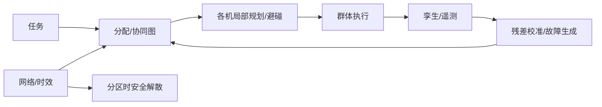

# 09 · 集群、自主协同与数字孪生

> 一句话点题：集群增加覆盖和并行，也增加网络、共识和级联失效；数字孪生的价值是系统扫描与反例生成，不是替代真实校准。

<div class="lesson-meta"><span>LAF25—LAF26—LAF27</span><span>核心主线</span><span>预计 6 × 45 分钟</span><span>证据截止 2026-08-30</span></div>

## 解锁与跳过

掌握单机闭环、通信与机队运行。 即使你使用 AI 完成实现，也不能跳过本章的变量定义、反例和评测设计；这些部分决定你是否有能力发现一个“运行正常但结论错误”的系统。

## 本章可观察目标

完成后你能：比较集中、分布和领导者协同拓扑；建模通信、碰撞和任务分配失效；用数字孪生做覆盖而非替代实飞证据。阅读完成不计掌握；至少需要一次不看答案的解释、一次实际应用和一次边界判断。

## 研究问题：多机协同何时增加任务能力，何时放大通信与碰撞风险？

十机编队在低延迟仿真漂亮，真实网络分区后两组都认为拥有同一航段；一个错误定位广播造成级联避让。需要局部机载分离、租约/时效语义和安全解散。

问题必须被写成“输入、状态、动作/输出、损失、约束、证据和停止条件”的组合。只写“提升效果”会把数据、算法、交互与业务结果混在一起，也无法设计反事实或消融。

## 三个知识节点怎样连接

| 节点 | 核心对象 | 最小充分解释 | 必须支持的决策 |
|---|---|---|---|
| LAF25 | 多机协同 | 任务分解、状态共享和冲突消解产生群体行为 | 协同是否带来净能力 |
| LAF26 | 数字孪生 | 版本化虚拟体映射航空器、环境和运行状态 | 仿真与真实差距如何校准 |
| LAF27 | 故障注入 | 通信分区、拜占庭信息、单机失控和级联被系统测试 | 集群怎样安全解散/降级 |

三者不是并列名词：第一个节点通常建立对象和假设，第二个节点解释机制，第三个节点把机制放进测量或交付边界。缺任何一层，都容易把局部指标误当成系统结论。

## 核心机制：协同图、时效状态与孪生校准

航空器为图节点，通信/相对观测为边；集中式全局最优依赖单点，分布式鲁棒但信息不一致。任务分配用拍卖/优化，避碰保持局部独立。孪生包含物理、传感、网络和运营模型，其参数用实飞更新并追踪仿真—现实残差。

理解机制时要区分三种量：**被设计者直接控制的变量**、**环境或数据生成过程决定的变量**、**只能通过代理指标观测的潜变量**。可靠实验一次只改变主要因子，其余配置进入版本化运行记录。

## 关键公式、假设与推导

一致协议 $x_i^{t+1}=x_i^t+\epsilon\sum_{j\in N_i}(x_j-x_i)$ 依赖图连通与时延；任务分配最小化 $\sum c_{ij}z_{ij}$。验证同时扫节点失效率、丢包、延迟和共同环境。

公式不是装饰。逐项检查：

- 消息时间戳/坐标/置信和租约
- 网络图断开条件
- 局部避碰不依赖全局共识
- 孪生参数后验与未建模残差

若假设不成立，正确做法不是继续套公式，而是换估计量、改采样/实验设计、缩小结论或明确拒绝自动决策。

## 证据拆解1：NASA AAM Autonomy Tutorial

### 研究问题

高自主、多主体 AAM 需要怎样的验证？

### 核心机制、实验与指标

教程覆盖自治、协调、验证与运行挑战。

支持分层、场景化和故障注入方法。

### 真正贡献、局限与适用边界

把集群置于安全论证而非演示。 具体集群算法仍需原论文和本地试验。

## 证据拆解2：ICAO UTM Guidance

### 研究问题

多运营主体如何共享意图和约束？

### 核心机制、实验与指标

ICAO UTM 材料强调服务、互操作和传统空管衔接。

为集群/多机与更广空域参与者划边界。

### 真正贡献、局限与适用边界

避免把私有集群协议当全空域协调。 各国实现存在差异。

## 从论文或标准到产品主张：证据审计

| 日期 | 一手来源 | 它真正回答的问题 | 不能据此外推什么 |
|---|---|---|---|
| 2025-05-01 | NASA AAM Autonomy Tutorial | 高自主、多主体 AAM 需要怎样的验证？ | 具体集群算法仍需原论文和本地试验。 |
| 2026-08-30 | ICAO UTM Guidance | 多运营主体如何共享意图和约束？ | 各国实现存在差异。 |

阅读来源时按四步记录：先抄下研究对象、比较基线、数据/场景和预算，再定位结果表或正式条文；随后区分作者直接观察、由结果支持的解释和你准备迁移到项目的推论；最后为推论写一个能推翻它的反例。**来源新并不等于证据强**：预印本、公司技术报告、正式标准、法规和独立复现承担的证明责任不同。数字必须连同分母、置信区间、硬件/本体、语言/人群与失败样本一起保存。

如果来源只证明组件指标改善，不得自动升级成端到端任务、真实用户价值、物理安全或合规结论。迁移到自己的项目时至少保留一个原方法基线、一个更简单基线和一个不使用该能力的基线；结果冲突时，优先检查任务定义、样本污染、资源预算、评价器偏差和运行边界，而不是挑选最符合预期的一项。

## 机制图：从输入到可验证结果



图中每条边都应能对应日志、数据版本、物理状态或人工记录；无法观测的边必须标为假设，不允许用模型的一段解释代替真实状态。

## 贯穿案例：多机灾情测绘

集中分配区域，各机局部避碰。注入 30% 丢包、网络分区、一机定位偏差和共享地图污染；分区后停止跨组航段变更并转局部安全扇区。比较单机、集中、分布方案的覆盖时间、最小间隔、重复和恢复。

案例的重点不是跑出最高分，而是保存“为什么选择这条路径”的证据：基线是什么、哪个假设最危险、失败怎样分层、什么条件触发降级或人工接管。

## 复现任务：最小因果链

1. 定义消息 schema/时效/置信和所有权
2. 建立单机与无协同基线
3. 扫网络和单机故障矩阵
4. 用少量实飞校准孪生残差

复现不是成功运行作者代码。你必须固定数据/环境、预算和评价器，至少重复三次，报告均值、离散程度、失败样本和资源消耗；若只能跑一次，要把结论降级为演示证据。

## 三轮实验与消融路线

**第一轮：测量链校准。** 只运行最简单基线，检查输入单位、时间/坐标/权限、随机种子、日志和评价器。抽取成功与失败样本人工复核；若真值或测量本身不稳定，停止模型比较。输出必须能回答“同一次运行能否被另一人重放”。

**第二轮：机制消融。** 在同一数据、预算、硬件或运行条件下，一次只加入一个关键机制；对每次变化写预期影响、未变化项和失败阈值。除了主指标，还要检查最坏切片、过程约束、P95/P99、资源与人工成本。若提升只在一个方便切片出现，应缩小能力声明。

**第三轮：边界与迁移。** 有计划地改变本章公式假设或 ODD：时间、人群、语言、对象、气象、本体、延迟、权限或供应商至少选择两项；注入缺失、冲突和失效。记录系统是正确拒绝/降级/接管，还是带着错误自信继续。最终产物不是“最佳分数”，而是一个可复核的能力范围、反例集和下一次变更会触发的回归集合。

## 实验与指标

| 维度 | 至少记录什么 | 为什么 |
|---|---|---|
| 飞行任务 | 任务成功、航迹/时间/载荷与拒绝率 | 完成任务但越界不算成功 |
| 安全裕度 | 最小间隔、能量/控制余度、告警与失效覆盖 | 平均性能不能证明包线边缘安全 |
| 系统性能 | 定位/感知/C2 延迟、P95/P99、可用性 | 闭环由最慢和最弱链路决定 |
| 运行经济 | 每航次成本、机队利用、人工、维护与事故暴露 | 单机演示不能证明可持续运营 |

同时保留一个简单基线和一个“什么都不做/人工流程”基线。复杂方案只有在质量、成本、时延、风险或可扩展性至少一个维度形成可重复净收益时才晋级。

## 对产品、系统或研究架构的影响

- 安全分离不依赖中心在线
- 过期共享状态自动失效
- 集群收益必须扣通信/协调成本
- 孪生证据标明已校准 ODD

这些决策应进入 PRD、实验卡、接口契约、安全案例或 ADR，而不只留在学习笔记。模型、数据、提示、硬件、环境与评价器任何一个升级，都要能触发有范围的回归测试。

## 会死在哪里

- 仿真网络零延迟
- 默认节点诚实准确
- 中心失效无备用
- 集群成功率掩盖最小间隔
- 把合成覆盖当实飞证明

失败分析要写“触发条件—可观测信号—影响—检测—缓解—残余风险”。只写“模型可能出错”没有工程价值。

## 与 AI 协作模板

```text
为多机任务设计集中/分布拓扑、消息时效/置信、局部避碰和分区降级；构造网络×节点×环境故障矩阵，并说明数字孪生如何用实飞残差校准。
```

使用模板后仍需检查 AI 是否虚构来源、混用时间口径、悄悄改变任务定义，或把模拟结果外推到真实系统。

## 练习：注入一次网络分区

在多智能体仿真中比较集中与分布任务分配，注入分区和错误位置广播，报告覆盖、碰撞/间隔和安全解散。

提交物必须包含一个反例或失败样本。只有成功案例会让你误以为已经掌握；边界证据才能说明你知道方法何时不该用。

## 常见误区

多机必然更快；全局规划可替代局部避碰；数字孪生等于真实世界；更多消息更安全；平均集群成功掩盖单机危险。共同根因是把一个条件成立时的局部结论，扩张成不带条件的能力判断。

## 自测

<Quiz question="网络分区时最重要的独立能力？" :options='["继续全局最优","每机局部分离与安全解散/降级","增加动画"]' :answer="1" explanation="全局状态不一致时必须维持局部安全。" />

## 本章小结

- 协同收益伴随新失效面
- 消息需时效与置信语义
- 安全局部化抵抗分区
- 孪生由真实残差校准

<EvidenceTracker lesson="field-low-altitude-09-swarm-digital-twin" />

## 本章完成标准

不看正文解释 集中与分布协同的失效差异；完成 一个网络故障注入实验；能指出 数字孪生不能替代的证据。最近相关题平均至少 7/10 才标记为 basic；跨日期完成变式任务并达到 8.5/10，才标记为 proficient。

<div class="source-note">主要来源（证据截止 2026-08-30）：<a href="https://ntrs.nasa.gov/citations/20250005043">AAM Autonomy Tutorial</a>、<a href="https://www.icao.int/utm-guidance">ICAO UTM</a>。数字只描述来源中的实验设置；标准、法规与产品能力均按页面版本和适用范围解释。</div>
