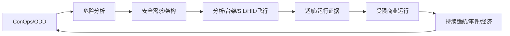

# 10 · 适航、安全论证与场景商业化

> 一句话点题：低空商业化不是把 Demo 乘以架数，而是把每个安全主张变成可追溯证据，并在批准范围内形成可保险、可维护的航次经济。

<div class="lesson-meta"><span>LAF28—LAF29—LAF30</span><span>核心主线</span><span>预计 6 × 45 分钟</span><span>证据截止 2026-08-30</span></div>

## 解锁与跳过

完成前九章并选定具体运营场景。 即使你使用 AI 完成实现，也不能跳过本章的变量定义、反例和评测设计；这些部分决定你是否有能力发现一个“运行正常但结论错误”的系统。

## 本章可观察目标

完成后你能：组织适航/运行符合性与安全案例；用危险分析追踪控制和验证；计算每航次经济与审批/保险约束。阅读完成不计掌握；至少需要一次不看答案的解释、一次实际应用和一次边界判断。

## 研究问题：怎样从 Demo 走到可批准、可保险、可持续的低空运营？

项目有飞行视频和订单意向，却没有型号/运行批准路径、失效安全目标、持续适航、噪声/社区沟通和事故成本。融资规模不能填补安全证据缺口。

问题必须被写成“输入、状态、动作/输出、损失、约束、证据和停止条件”的组合。只写“提升效果”会把数据、算法、交互与业务结果混在一起，也无法设计反事实或消融。

## 三个知识节点怎样连接

| 节点 | 核心对象 | 最小充分解释 | 必须支持的决策 |
|---|---|---|---|
| LAF28 | 适航/符合性 | 设计满足适用安全要求并以认可方法证明 | 证据怎样从需求追到试验 |
| LAF29 | 安全论证 | 主张—论据—证据连接危险、控制和残余风险 | 为何可以在该 ODD 运行 |
| LAF30 | 场景商业化 | 需求、许可、保险、容量和单位航次经济共同决定扩张 | Demo 到可持续服务差什么 |

三者不是并列名词：第一个节点通常建立对象和假设，第二个节点解释机制，第三个节点把机制放进测量或交付边界。缺任何一层，都容易把局部指标误当成系统结论。

## 核心机制：危险分析—符合性—运营安全案例

从 FHA/STPA 等识别功能危险与严重度，分配安全目标到架构；FMEA/FTA/故障注入验证控制。需求—设计—分析—试验形成追溯矩阵。运营安全案例限定 ConOps/ODD、人员/维修/空域/服务，变更影响分析决定重新验证范围。商业模型以批准场景真实容量计。

理解机制时要区分三种量：**被设计者直接控制的变量**、**环境或数据生成过程决定的变量**、**只能通过代理指标观测的潜变量**。可靠实验一次只改变主要因子，其余配置进入版本化运行记录。

## 关键公式、假设与推导

故障树顶事件由 AND/OR 组合基本事件，稀有独立近似可算概率但共因需单独建模。每成功航次贡献 $CM=revenue-energy-maintenance-labor-infra-insurance-failure$；容量受天气、许可和周转而非理论飞行小时。

公式不是装饰。逐项检查：

- 安全目标/概率口径适用类别
- 符合性方法是否获主管认可
- 供应链和软件配置可追溯
- 保险/社区/噪声成本是否计入

若假设不成立，正确做法不是继续套公式，而是换估计量、改采样/实验设计、缩小结论或明确拒绝自动决策。

## 证据拆解1：CAAC AC-21-AA-2026-47

### 研究问题

正常类动力提升无人驾驶航空器如何组织适航审定？

### 核心机制、实验与指标

民航局官方咨询通告提供当前审定指导。

表明新构型的符合性需要系统化要求和证据。

### 真正贡献、局限与适用边界

直接影响中国动力提升项目路线。 必须按项目类别与审定当局解释，不能凭课程自判合规。

## 证据拆解2：低空经济标准体系建设指南（2025年版）

### 研究问题

中国低空标准体系怎样跨部门组织？

### 核心机制、实验与指标

官方消息介绍多部门印发建设指南，覆盖基础、航空器、基础设施、空管、监管和应用。

2026 年公开节点显示标准化正在系统推进。

### 真正贡献、局限与适用边界

支持全栈标准缺口图。 指南是建设路线，不等于所有标准已发布/实施。

## 证据拆解3：FAA Drone Normalization Strategy 2026

### 研究问题

美国无人机常态化/BVLOS 近期路线如何变化？

### 核心机制、实验与指标

FAA 2026 更新报告汇总监管、空域和 BVLOS 等推进计划。

为国际商业化比较提供同期官方材料。

### 真正贡献、局限与适用边界

帮助辨认常态运行所需制度与基础设施。 目标/计划不等于已经生效的最终规则。

## 从论文或标准到产品主张：证据审计

| 日期 | 一手来源 | 它真正回答的问题 | 不能据此外推什么 |
|---|---|---|---|
| 2026-04-17 | CAAC AC-21-AA-2026-47 | 正常类动力提升无人驾驶航空器如何组织适航审定？ | 必须按项目类别与审定当局解释，不能凭课程自判合规。 |
| 2026-02-05 | 低空经济标准体系建设指南（2025年版） | 中国低空标准体系怎样跨部门组织？ | 指南是建设路线，不等于所有标准已发布/实施。 |
| 2026-07-06 | FAA Drone Normalization Strategy 2026 | 美国无人机常态化/BVLOS 近期路线如何变化？ | 目标/计划不等于已经生效的最终规则。 |

阅读来源时按四步记录：先抄下研究对象、比较基线、数据/场景和预算，再定位结果表或正式条文；随后区分作者直接观察、由结果支持的解释和你准备迁移到项目的推论；最后为推论写一个能推翻它的反例。**来源新并不等于证据强**：预印本、公司技术报告、正式标准、法规和独立复现承担的证明责任不同。数字必须连同分母、置信区间、硬件/本体、语言/人群与失败样本一起保存。

如果来源只证明组件指标改善，不得自动升级成端到端任务、真实用户价值、物理安全或合规结论。迁移到自己的项目时至少保留一个原方法基线、一个更简单基线和一个不使用该能力的基线；结果冲突时，优先检查任务定义、样本污染、资源预算、评价器偏差和运行边界，而不是挑选最符合预期的一项。

## 机制图：从输入到可验证结果



图中每条边都应能对应日志、数据版本、物理状态或人工记录；无法观测的边必须标为假设，不允许用模型的一段解释代替真实状态。

## 贯穿案例：巡检数字样机到受限运营

交付 ConOps、ODD、危险日志、需求追踪、模型/软件配置、SIL/HIL/飞行证据和运营手册；只在批准走廊与天气窗运行。经济模型用实际取消、人工、维护和保险；每扩一地区/载荷/夜航先做变更影响。

案例的重点不是跑出最高分，而是保存“为什么选择这条路径”的证据：基线是什么、哪个假设最危险、失败怎样分层、什么条件触发降级或人工接管。

## 复现任务：最小因果链

1. 从 ConOps 做 FHA/STPA 并分配控制
2. 建立需求—证据追溯矩阵
3. 逐级试验含异常与恢复
4. 用真实运行容量重算单位航次经济

复现不是成功运行作者代码。你必须固定数据/环境、预算和评价器，至少重复三次，报告均值、离散程度、失败样本和资源消耗；若只能跑一次，要把结论降级为演示证据。

## 三轮实验与消融路线

**第一轮：测量链校准。** 只运行最简单基线，检查输入单位、时间/坐标/权限、随机种子、日志和评价器。抽取成功与失败样本人工复核；若真值或测量本身不稳定，停止模型比较。输出必须能回答“同一次运行能否被另一人重放”。

**第二轮：机制消融。** 在同一数据、预算、硬件或运行条件下，一次只加入一个关键机制；对每次变化写预期影响、未变化项和失败阈值。除了主指标，还要检查最坏切片、过程约束、P95/P99、资源与人工成本。若提升只在一个方便切片出现，应缩小能力声明。

**第三轮：边界与迁移。** 有计划地改变本章公式假设或 ODD：时间、人群、语言、对象、气象、本体、延迟、权限或供应商至少选择两项；注入缺失、冲突和失效。记录系统是正确拒绝/降级/接管，还是带着错误自信继续。最终产物不是“最佳分数”，而是一个可复核的能力范围、反例集和下一次变更会触发的回归集合。

## 实验与指标

| 维度 | 至少记录什么 | 为什么 |
|---|---|---|
| 飞行任务 | 任务成功、航迹/时间/载荷与拒绝率 | 完成任务但越界不算成功 |
| 安全裕度 | 最小间隔、能量/控制余度、告警与失效覆盖 | 平均性能不能证明包线边缘安全 |
| 系统性能 | 定位/感知/C2 延迟、P95/P99、可用性 | 闭环由最慢和最弱链路决定 |
| 运行经济 | 每航次成本、机队利用、人工、维护与事故暴露 | 单机演示不能证明可持续运营 |

同时保留一个简单基线和一个“什么都不做/人工流程”基线。复杂方案只有在质量、成本、时延、风险或可扩展性至少一个维度形成可重复净收益时才晋级。

## 对产品、系统或研究架构的影响

- 演示、研究、符合性和商业证据分级
- 任何安全主张标 owner/证据/限制
- 场景扩张走正式变更控制
- 投资里程碑绑定证据而非视频

这些决策应进入 PRD、实验卡、接口契约、安全案例或 ADR，而不只留在学习笔记。模型、数据、提示、硬件、环境与评价器任何一个升级，都要能触发有范围的回归测试。

## 会死在哪里

- 飞过即证明安全
- 计划标准当现行要求
- 故障概率假设独立
- 只算能源不算运营全成本
- 批准一个场景外推全国

失败分析要写“触发条件—可观测信号—影响—检测—缓解—残余风险”。只写“模型可能出错”没有工程价值。

## 与 AI 协作模板

```text
把低空项目改写为安全案例：ConOps/ODD、危险/严重度、控制、验证、适航与运行批准、持续适航；再按批准容量计算每成功航次经济，明确研究/计划/现行规则边界。
```

使用模板后仍需检查 AI 是否虚构来源、混用时间口径、悄悄改变任务定义，或把模拟结果外推到真实系统。

## 练习：提交一份最小安全案例

为巡检任务写 5 个顶层主张、10 个危险及证据追踪；建立 1000 航次情景的天气/故障/成本模型，给 go/no-go 和不可外推边界。

提交物必须包含一个反例或失败样本。只有成功案例会让你误以为已经掌握；边界证据才能说明你知道方法何时不该用。

## 常见误区

标准体系指南等于全部标准生效；事故率低即可忽略严重度；适航等于运营许可；保险替代安全控制；订单证明单位经济。共同根因是把一个条件成立时的局部结论，扩张成不带条件的能力判断。

## 自测

<Quiz question="低空标准体系指南发布后，能否把规划中的标准全部写成已实施？" :options='["能","不能，逐项核对标准发布/实施和适用范围","只要业内常用即可"]' :answer="1" explanation="路线指南与已生效标准是不同证据等级。" />

## 本章小结

- 安全案例连接主张与证据
- 符合性路径早于产品冻结
- 运营批准与适航不同
- 商业模型服从批准 ODD 与真实容量

<EvidenceTracker lesson="field-low-altitude-10-airworthiness-safety-business" />

## 本章完成标准

不看正文解释 适航、运行批准和安全案例的区别；完成 一份危险—证据追踪矩阵；能指出 Demo 和规划文件不能支持的商业主张。最近相关题平均至少 7/10 才标记为 basic；跨日期完成变式任务并达到 8.5/10，才标记为 proficient。

<div class="source-note">主要来源（证据截止 2026-08-30）：<a href="https://www.caac.gov.cn/PHONE/XXGK_17/XXGK/GFXWJ/202604/t20260417_230570.html">CAAC AC-21-AA-2026-47</a>、<a href="https://www.mot.gov.cn/xinwen/jiaotongyaowen/202602/t20260205_4199749.html">低空标准体系指南</a>、<a href="https://www.faa.gov/uas/resources/Drone_Normalization_Strategy_Report_Update_2026.pdf">FAA 2026 Strategy</a>。数字只描述来源中的实验设置；标准、法规与产品能力均按页面版本和适用范围解释。</div>
