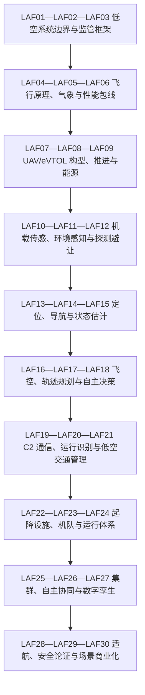

# 物理 AI · 低空智能学习路线与知识图谱

> 默认 20 周，每周三次、每次 45—60 分钟。时间不足时缩小实验，不删除解释、应用和边界证据。

## 依赖图

顺序表达的是阻塞前置，不是职业等级。你可以围绕项目跳到后续章，但需要先完成它依赖的概念检查和风险说明。

## 20 周主路线

| 周 | 节点 | 主题 | 最小产物 |
|---|---|---|---|
| 1—2 | LAF01—LAF02—LAF03 | 低空系统边界与监管框架 | 航空器—运营人—空域—服务—监管责任图 |
| 2—3 | LAF04—LAF05—LAF06 | 飞行原理、气象与性能包线 | 六自由度模型、气象边界和能量余度 |
| 3—4 | LAF07—LAF08—LAF09 | UAV/eVTOL 构型、推进与能源 | 任务—构型—推进—冗余 trade-off |
| 4—5 | LAF10—LAF11—LAF12 | 机载传感、环境感知与探测避让 | 传感器覆盖图、感知 ODD 与误检/漏检预算 |
| 5—6 | LAF13—LAF14—LAF15 | 定位、导航与状态估计 | 多传感融合、协方差门禁与失效降级 |
| 6—7 | LAF16—LAF17—LAF18 | 飞控、轨迹规划与自主决策 | 分层飞控、可达集、应急着陆与 HIL 测试 |
| 7—8 | LAF19—LAF20—LAF21 | C2 通信、运行识别与低空交通管理 | C2 链路预算、Remote ID 与 UOM/USS 状态机 |
| 8—9 | LAF22—LAF23—LAF24 | 起降设施、机队与运行体系 | 航线容量、充换电、维修和地面保障模型 |
| 9—10 | LAF25—LAF26—LAF27 | 集群、自主协同与数字孪生 | 协同拓扑、仿真证据与故障注入 |
| 10—11 | LAF28—LAF29—LAF30 | 适航、安全论证与场景商业化 | ConOps、危险分析、安全案例和单位航次经济 |

## 三层掌握目标

- **认识**：能辨认术语、对象和输入输出，不计为完成。
- **basic**：不看答案解释机制，完成基础应用，最近证据平均至少 7/10。
- **proficient**：跨日期解决变式，说明适用条件与失败边界，最近证据平均至少 8.5/10。

## 项目驱动的分支规则

- LAF01—03 是所有路线强制前置
- 做航空器先学 04—18，做平台先学 19—27
- 任何 BVLOS 项目必须补 C2/DAA/UTM
- 商业判断必须完成 LAF28—30

## 复习节奏

新学或低分 1 天后复习；首次稳定通过 3 天；第二次 7 天；连续稳定 14 天；能迁移后 30 天。复习以主动回忆、反例和小型变式为主，不重读整章。

## 证据边界

路线版本的资料截止为 2026-08-30。基础公式可能早于三年窗口；新近能力主张、法规与标准必须进入 [证据账本](./evidence)，并在更新时保留旧结论和冲突原因。
