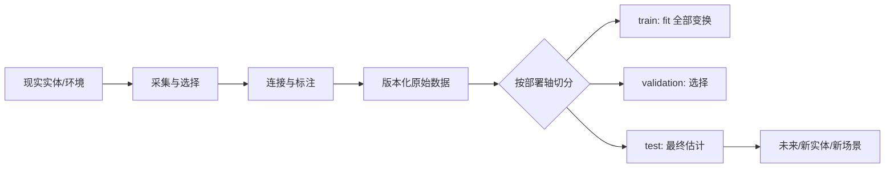

# 02 · 数据生成、切分与泄漏

> 一句话点题：数据泄漏不是一列明显的答案字段，而是任何让训练流程提前接触未来、同实体或测试分布的信息路径。

<div class="lesson-meta"><span>MLF04—MLF05—MLF06</span><span>核心主线</span><span>预计 6 × 45 分钟</span><span>证据截止 2026-08-30</span></div>

## 解锁与跳过

先完成 MLF01—03，能够明确样本单位、预测时点和评测目标。 即使你使用 AI 完成实现，也不能跳过本章的变量定义、反例和评测设计；这些部分决定你是否有能力发现一个“运行正常但结论错误”的系统。

## 本章可观察目标

完成后你能：画出数据从现实过程到训练表的谱系；为实体、时间和场景选择正确切分；识别目标泄漏、重复、选择偏差与标注偏差。阅读完成不计掌握；至少需要一次不看答案的解释、一次实际应用和一次边界判断。

## 研究问题：训练集看似很大时，为什么测试结果仍可能完全失真？

医学图像、门店销量、用户事件和设备传感都具有层级与时间依赖。若按行随机切分，同一患者、门店、用户或设备的近邻样本会跨集合；模型记住实体特征即可得高分，却无法泛化到新实体或未来。预处理器在全量数据上 fit、用测试集挑阈值、人工清洗时看见标签，也属于泄漏。

问题必须被写成“输入、状态、动作/输出、损失、约束、证据和停止条件”的组合。只写“提升效果”会把数据、算法、交互与业务结果混在一起，也无法设计反事实或消融。

## 三个知识节点怎样连接

| 节点 | 核心对象 | 最小充分解释 | 必须支持的决策 |
|---|---|---|---|
| MLF04 | 数据生成过程 | 观测由采样、测量、政策和用户行为共同产生 | 数据能代表哪个目标总体 |
| MLF05 | 切分协议 | 按未来部署方式隔离训练、选择与最终评测 | 随机、时间、群组或空间切分 |
| MLF06 | 泄漏与谱系 | 任何不应在决策时可用或跨集合共享的信息通道 | 特征/变换/调参是否污染测试 |

三者不是并列名词：第一个节点通常建立对象和假设，第二个节点解释机制，第三个节点把机制放进测量或交付边界。缺任何一层，都容易把局部指标误当成系统结论。

## 核心机制：实体—时间—场景三轴切分

先画生成图：现实实体产生原始事件，事件经采集、连接、标注和特征管道成为样本。再沿未来部署的变化轴切分：要预测新时间，用滚动时间窗；要服务新客户，用 group split；要迁移新医院/地区，用 domain holdout。验证集用于选择，测试集只用于最终一次无偏估计；预处理、插补、特征选择和阈值都只能在训练/验证内部拟合。

理解机制时要区分三种量：**被设计者直接控制的变量**、**环境或数据生成过程决定的变量**、**只能通过代理指标观测的潜变量**。可靠实验一次只改变主要因子，其余配置进入版本化运行记录。

## 关键公式、假设与推导

设实体为 $g$、时间为 $t$，泄漏安全切分要求关键依赖块不跨集合：

$$
G_{train}\cap G_{test}=\varnothing\quad\text{或}\quad \max T_{train}<\min T_{test},
$$

具体选择取决于部署目标。分布差异可用

$$
D_{TV}(P,Q)=\sup_A|P(A)-Q(A)|
$$

描述，但任何单一漂移统计量都不能告诉你性能一定下降。

公式不是装饰。逐项检查：

- 独立单位是行、会话、用户、设备还是机构
- 标签是否在预测窗口结束后才成熟
- 特征流水线是否在切分前看过全量统计
- 测试场景是否对应真正未来而非方便的随机子集

若假设不成立，正确做法不是继续套公式，而是换估计量、改采样/实验设计、缩小结论或明确拒绝自动决策。

## 证据拆解1：WILDS: A Benchmark of in-the-Wild Distribution Shifts

### 研究问题

标准 IID 随机切分是否低估真实部署中的医院、地区、相机和时间变化？

### 核心机制、实验与指标

WILDS 组织十个来自真实应用的分布偏移数据集，明确训练和测试域差异，并提供统一接口与强基线。它把域标识和最坏组表现纳入评测，而非只看随机测试均值。

原始结果显示多种专为分布外泛化设计的方法并未稳定优于标准 ERM，说明算法标签不等于真实收益。

### 真正贡献、局限与适用边界

它让真实偏移成为可重复实验对象，也挑战“换一个 OOD 算法即可解决”的想象。 十个数据集仍不能覆盖每个业务的反馈回路；基准域标签也可能比现实更清楚。

## 证据拆解2：Leakage-Aware Comparative Benchmark

### 研究问题

患者级依赖对医学图像模型排名和校准有多大影响？

### 核心机制、实验与指标

作者重建患者级切分并比较机器学习、深度学习与 Transformer，强调同一患者的细胞图像不能跨训练和测试。

患者级协议显著降低虚高表现，并暴露不同模型在校准上的差异。

### 真正贡献、局限与适用边界

贡献是把泄漏假设显式变成可复现的实验变量。 单疾病、单数据集的具体排名不能作为通用医疗 AI 采购依据。

## 从论文或标准到产品主张：证据审计

| 日期 | 一手来源 | 它真正回答的问题 | 不能据此外推什么 |
|---|---|---|---|
| 2021-10-13 | WILDS: A Benchmark of in-the-Wild Distribution Shifts | 标准 IID 随机切分是否低估真实部署中的医院、地区、相机和时间变化？ | 十个数据集仍不能覆盖每个业务的反馈回路；基准域标签也可能比现实更清楚。 |
| 2026-06-23 | Leakage-Aware Comparative Benchmark | 患者级依赖对医学图像模型排名和校准有多大影响？ | 单疾病、单数据集的具体排名不能作为通用医疗 AI 采购依据。 |

阅读来源时按四步记录：先抄下研究对象、比较基线、数据/场景和预算，再定位结果表或正式条文；随后区分作者直接观察、由结果支持的解释和你准备迁移到项目的推论；最后为推论写一个能推翻它的反例。**来源新并不等于证据强**：预印本、公司技术报告、正式标准、法规和独立复现承担的证明责任不同。数字必须连同分母、置信区间、硬件/本体、语言/人群与失败样本一起保存。

如果来源只证明组件指标改善，不得自动升级成端到端任务、真实用户价值、物理安全或合规结论。迁移到自己的项目时至少保留一个原方法基线、一个更简单基线和一个不使用该能力的基线；结果冲突时，优先检查任务定义、样本污染、资源预算、评价器偏差和运行边界，而不是挑选最符合预期的一项。

## 机制图：从输入到可验证结果



图中每条边都应能对应日志、数据版本、物理状态或人工记录；无法观测的边必须标为假设，不允许用模型的一段解释代替真实状态。

## 贯穿案例：连锁门店销量预测

若目标是给新开门店排库存，按日期随机切分老门店无效；模型会依赖门店固定效应。应同时保留时间外和门店外测试：第一项测未来波动，第二项测冷启动。促销活动是计划时已知特征，实际销量和事后折扣则不可用。天气预报要保存当时版本，不能用事后修订的实况替代。

案例的重点不是跑出最高分，而是保存“为什么选择这条路径”的证据：基线是什么、哪个假设最危险、失败怎样分层、什么条件触发降级或人工接管。

## 复现任务：最小因果链

1. 画出实体、事件、采集、标注和特征转换的数据谱系
2. 分别做随机、时间、群组切分，比较均值与关键切片
3. 把插补和标准化故意放在切分前后各跑一次，量化污染影响
4. 建立泄漏测试：重复实体、未来字段、标签近义字段和全量 fit 检查

复现不是成功运行作者代码。你必须固定数据/环境、预算和评价器，至少重复三次，报告均值、离散程度、失败样本和资源消耗；若只能跑一次，要把结论降级为演示证据。

## 三轮实验与消融路线

**第一轮：测量链校准。** 只运行最简单基线，检查输入单位、时间/坐标/权限、随机种子、日志和评价器。抽取成功与失败样本人工复核；若真值或测量本身不稳定，停止模型比较。输出必须能回答“同一次运行能否被另一人重放”。

**第二轮：机制消融。** 在同一数据、预算、硬件或运行条件下，一次只加入一个关键机制；对每次变化写预期影响、未变化项和失败阈值。除了主指标，还要检查最坏切片、过程约束、P95/P99、资源与人工成本。若提升只在一个方便切片出现，应缩小能力声明。

**第三轮：边界与迁移。** 有计划地改变本章公式假设或 ODD：时间、人群、语言、对象、气象、本体、延迟、权限或供应商至少选择两项；注入缺失、冲突和失效。记录系统是正确拒绝/降级/接管，还是带着错误自信继续。最终产物不是“最佳分数”，而是一个可复核的能力范围、反例集和下一次变更会触发的回归集合。

## 实验与指标

| 维度 | 至少记录什么 | 为什么 |
|---|---|---|
| 任务 | 主指标、切片指标、无效/拒绝比例 | 避免平均分掩盖关键用户或条件 |
| 可靠性 | 校准、方差、置信区间、最坏切片 | 知道预测何时不可直接行动 |
| 资源 | 训练/推理时间、内存、能耗或费用 | 确认提升不是无限预算换来的 |
| 运维 | 漂移、缺失、延迟、人工接管和回滚 | 把离线模型放回真实系统 |

同时保留一个简单基线和一个“什么都不做/人工流程”基线。复杂方案只有在质量、成本、时延、风险或可扩展性至少一个维度形成可重复净收益时才晋级。

## 对产品、系统或研究架构的影响

- 数据版本必须记录抽取时间、查询和上游快照
- 切分键作为代码与数据合同，不靠分析者记忆
- 训练流水线将 fit/transform 边界写进测试
- 测试集使用次数和每次决策进入实验账本

这些决策应进入 PRD、实验卡、接口契约、安全案例或 ADR，而不只留在学习笔记。模型、数据、提示、硬件、环境与评价器任何一个升级，都要能触发有范围的回归测试。

## 会死在哪里

- 同一用户多会话随机分行
- 时间序列随机打乱
- 在全量数据上做标准化或目标编码
- 依据测试误差反复挑特征和阈值
- 删除困难样本却不记录选择机制

失败分析要写“触发条件—可观测信号—影响—检测—缓解—残余风险”。只写“模型可能出错”没有工程价值。

## 与 AI 协作模板

```text
请审计这份数据集的生成与切分。先识别实体、时间、机构/地区和标签成熟窗口；再枚举直接泄漏、代理泄漏、跨集合依赖、全量预处理和人工选择通道。为随机、时间、群组、领域外切分分别说明它测量的部署问题，并输出可自动化的泄漏测试。
```

使用模板后仍需检查 AI 是否虚构来源、混用时间口径、悄悄改变任务定义，或把模拟结果外推到真实系统。

## 练习：制造并抓住一次泄漏

在一个公开数据集上添加行 ID 的派生特征或在切分前做目标编码，展示指标虚高；随后修复管道并解释为什么下降反而提高了证据质量。

提交物必须包含一个反例或失败样本。只有成功案例会让你误以为已经掌握；边界证据才能说明你知道方法何时不该用。

## 常见误区

删掉标签列就没有泄漏；随机切分适用于所有监督学习；交叉验证自动修复时间依赖；数据量大能抵消选择偏差；测试集只要不训练梯度就不会被污染。共同根因是把一个条件成立时的局部结论，扩张成不带条件的能力判断。

## 自测

<Quiz question="预测新患者风险时，同一患者的多张图像应怎样切分？" :options='["按图像随机","以患者为组，保证患者不跨集合","只增加测试集图片数量"]' :answer="1" explanation="决策与泛化单位是患者；图像级随机切分会泄漏患者特征。" />

## 本章小结

- 切分必须模拟未来部署
- 谱系揭示行之外的信息通道
- 所有数据依赖变换都应在训练折内 fit
- 分布外算法仍需强 ERM 基线和真实域评测

<EvidenceTracker lesson="field-machine-learning-02-data-splits-leakage" />

## 本章完成标准

不看正文解释 实体、时间和场景切分分别估计什么；完成 一份含自动泄漏检查的数据谱系；能指出 随机交叉验证无效的真实情形。最近相关题平均至少 7/10 才标记为 basic；跨日期完成变式任务并达到 8.5/10，才标记为 proficient。

<div class="source-note">主要来源（证据截止 2026-08-30）：<a href="https://arxiv.org/abs/2012.07421">WILDS</a>、<a href="https://arxiv.org/abs/1803.09010">Datasheets for Datasets</a>、<a href="https://arxiv.org/abs/2606.24944">Leakage-Aware Benchmark</a>。数字只描述来源中的实验设置；标准、法规与产品能力均按页面版本和适用范围解释。</div>
