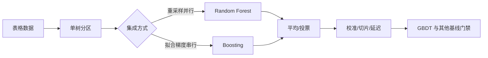

# 04 · 决策树、集成与梯度提升

> 一句话点题：树模型强在对表格数据的缺失、非线性和交互具有合适归纳偏置，但特征重要性、概率和分布外行为仍需单独验证。

<div class="lesson-meta"><span>MLF10—MLF11—MLF12</span><span>核心主线</span><span>预计 6 × 45 分钟</span><span>证据截止 2026-08-30</span></div>

## 解锁与跳过

需要掌握无泄漏切分、分类/回归损失与简单概率基线。 即使你使用 AI 完成实现，也不能跳过本章的变量定义、反例和评测设计；这些部分决定你是否有能力发现一个“运行正常但结论错误”的系统。

## 本章可观察目标

完成后你能：解释树的递归划分与叶节点估计；区分 bagging 与 boosting 的误差机制；对 XGBoost/CatBoost 做公平、受预算约束的比较。阅读完成不计掌握；至少需要一次不看答案的解释、一次实际应用和一次边界判断。

## 研究问题：树模型为什么仍是表格数据的强基线，何时又会失败？

表格业务数据混合连续、类别、缺失和阈值规则。树能在不标准化的情况下表达非线性交互，boosting 又把许多弱树叠成强模型。但高基数 ID、未来代理变量和稳定的实体特征会让树更容易记忆；默认 feature importance 还会偏爱可分裂次数多的变量。

问题必须被写成“输入、状态、动作/输出、损失、约束、证据和停止条件”的组合。只写“提升效果”会把数据、算法、交互与业务结果混在一起，也无法设计反事实或消融。

## 三个知识节点怎样连接

| 节点 | 核心对象 | 最小充分解释 | 必须支持的决策 |
|---|---|---|---|
| MLF10 | 决策树 | 以分裂规则递归划分特征空间并在叶子估计 | 规则交互是否适合轴对齐分区 |
| MLF11 | Bagging | 对重采样模型平均以降低高方差 | 稳定性收益是否值得并行成本 |
| MLF12 | Boosting | 逐步拟合梯度/残差以构造加法模型 | 偏差降低、过拟合与延迟如何平衡 |

三者不是并列名词：第一个节点通常建立对象和假设，第二个节点解释机制，第三个节点把机制放进测量或交付边界。缺任何一层，都容易把局部指标误当成系统结论。

## 核心机制：递归分区、方差降低与函数梯度下降

单树选择使纯度或损失下降最大的切分，并在叶节点输出均值/概率。随机森林通过样本与特征随机性降低树间相关，从而降低方差。梯度提升维护加法模型 $F_m$，每轮用新树拟合当前损失对预测的负梯度；学习率、树深、叶样本和轮数共同控制容量。CatBoost 的有序目标统计用于降低类别目标编码泄漏。

理解机制时要区分三种量：**被设计者直接控制的变量**、**环境或数据生成过程决定的变量**、**只能通过代理指标观测的潜变量**。可靠实验一次只改变主要因子，其余配置进入版本化运行记录。

## 关键公式、假设与推导

回归树分裂可写为

$$
\min_{j,s}\left[\sum_{x_i^j\le s}(y_i-c_1)^2+\sum_{x_i^j>s}(y_i-c_2)^2\right].
$$

梯度提升更新：

$$
F_m(x)=F_{m-1}(x)+\eta h_m(x),\quad
h_m\approx-\frac{\partial \ell(y,F)}{\partial F}\bigg|_{F_{m-1}}.
$$

公式不是装饰。逐项检查：

- 贪心分裂不是全局最优树
- bagging 只有在基学习器误差不完全相关时有效
- boosting 的迭代轮数与学习率不能分别孤立解释
- 类别统计必须严格保持时间/折内因果顺序

若假设不成立，正确做法不是继续套公式，而是换估计量、改采样/实验设计、缩小结论或明确拒绝自动决策。

## 证据拆解1：XGBoost: A Scalable Tree Boosting System

### 研究问题

怎样把正则化树提升做成能处理稀疏数据并高效扩展的系统？

### 核心机制、实验与指标

XGBoost 使用二阶损失近似、结构正则、稀疏感知分裂、加权分位数草图和缓存友好实现。论文同时讨论算法目标与系统优化，而不是只给模型公式。

作者在多类公开任务展示准确性与规模优势，并报告系统层吞吐。

### 真正贡献、局限与适用边界

贡献是把 boosting 的目标、缺失方向和工程并行结合成可复用系统。 原论文年代较早；现代 CatBoost、LightGBM 和表格基础模型需要在同一预算下重测。

## 证据拆解2：Beyond IID: How General Are Tabular Foundation Models, Really?

### 研究问题

表格基础模型在非 IID、大样本和高维任务是否仍稳定领先树模型？

### 核心机制、实验与指标

BeyondArena 汇集 IID、时间、群组、多特征类型与规模变化的 142 个数据集，比较 11 个模型，并配套 Data Foundry 统一元数据和运行协议。

作者报告基础模型在小到中型 IID 数据强，但传统树/深度模型在非 IID、大规模和高维场景仍占优。

### 真正贡献、局限与适用边界

贡献是把基准从基础模型擅长的区域扩到真实困难区域。 预印本和统一框架可能无法包含每个模型的最优领域调参；排名不能替代本地任务对照。

## 从论文或标准到产品主张：证据审计

| 日期 | 一手来源 | 它真正回答的问题 | 不能据此外推什么 |
|---|---|---|---|
| 2016-06-10 | XGBoost: A Scalable Tree Boosting System | 怎样把正则化树提升做成能处理稀疏数据并高效扩展的系统？ | 原论文年代较早；现代 CatBoost、LightGBM 和表格基础模型需要在同一预算下重测。 |
| 2026-06-29 | Beyond IID: How General Are Tabular Foundation Models, Really? | 表格基础模型在非 IID、大样本和高维任务是否仍稳定领先树模型？ | 预印本和统一框架可能无法包含每个模型的最优领域调参；排名不能替代本地任务对照。 |

阅读来源时按四步记录：先抄下研究对象、比较基线、数据/场景和预算，再定位结果表或正式条文；随后区分作者直接观察、由结果支持的解释和你准备迁移到项目的推论；最后为推论写一个能推翻它的反例。**来源新并不等于证据强**：预印本、公司技术报告、正式标准、法规和独立复现承担的证明责任不同。数字必须连同分母、置信区间、硬件/本体、语言/人群与失败样本一起保存。

如果来源只证明组件指标改善，不得自动升级成端到端任务、真实用户价值、物理安全或合规结论。迁移到自己的项目时至少保留一个原方法基线、一个更简单基线和一个不使用该能力的基线；结果冲突时，优先检查任务定义、样本污染、资源预算、评价器偏差和运行边界，而不是挑选最符合预期的一项。

## 机制图：从输入到可验证结果



图中每条边都应能对应日志、数据版本、物理状态或人工记录；无法观测的边必须标为假设，不允许用模型的一段解释代替真实状态。

## 贯穿案例：客户续费概率

数据包含套餐、使用量、工单、合同期限和地区。逻辑回归先提供可解释基线；CatBoost 处理高基数类别，XGBoost 使用显式编码。时间切分模拟下月续费，客户 ID 永不作为特征。比较不仅看 AUC，还看概率校准、前 5% 营销容量内增益、推理 P95、模型大小和重要性在不同时间窗的稳定性。

案例的重点不是跑出最高分，而是保存“为什么选择这条路径”的证据：基线是什么、哪个假设最危险、失败怎样分层、什么条件触发降级或人工接管。

## 复现任务：最小因果链

1. 固定训练/验证/测试与总调参次数
2. 比较单树、随机森林、XGBoost/CatBoost 和线性模型
3. 画随树数/深度变化的学习曲线与训练时间
4. 比较 gain、permutation 和 SHAP 排名，并对相关特征构造反例

复现不是成功运行作者代码。你必须固定数据/环境、预算和评价器，至少重复三次，报告均值、离散程度、失败样本和资源消耗；若只能跑一次，要把结论降级为演示证据。

## 三轮实验与消融路线

**第一轮：测量链校准。** 只运行最简单基线，检查输入单位、时间/坐标/权限、随机种子、日志和评价器。抽取成功与失败样本人工复核；若真值或测量本身不稳定，停止模型比较。输出必须能回答“同一次运行能否被另一人重放”。

**第二轮：机制消融。** 在同一数据、预算、硬件或运行条件下，一次只加入一个关键机制；对每次变化写预期影响、未变化项和失败阈值。除了主指标，还要检查最坏切片、过程约束、P95/P99、资源与人工成本。若提升只在一个方便切片出现，应缩小能力声明。

**第三轮：边界与迁移。** 有计划地改变本章公式假设或 ODD：时间、人群、语言、对象、气象、本体、延迟、权限或供应商至少选择两项；注入缺失、冲突和失效。记录系统是正确拒绝/降级/接管，还是带着错误自信继续。最终产物不是“最佳分数”，而是一个可复核的能力范围、反例集和下一次变更会触发的回归集合。

## 实验与指标

| 维度 | 至少记录什么 | 为什么 |
|---|---|---|
| 任务 | 主指标、切片指标、无效/拒绝比例 | 避免平均分掩盖关键用户或条件 |
| 可靠性 | 校准、方差、置信区间、最坏切片 | 知道预测何时不可直接行动 |
| 资源 | 训练/推理时间、内存、能耗或费用 | 确认提升不是无限预算换来的 |
| 运维 | 漂移、缺失、延迟、人工接管和回滚 | 把离线模型放回真实系统 |

同时保留一个简单基线和一个“什么都不做/人工流程”基线。复杂方案只有在质量、成本、时延、风险或可扩展性至少一个维度形成可重复净收益时才晋级。

## 对产品、系统或研究架构的影响

- 表格任务默认保留 GBDT 强基线
- 模型选择使用预算相同的嵌套验证而非各跑默认值
- 类别编码、缺失方向和单调约束进入模型合同
- 解释性结论必须附相关特征和扰动稳定性

这些决策应进入 PRD、实验卡、接口契约、安全案例或 ADR，而不只留在学习笔记。模型、数据、提示、硬件、环境与评价器任何一个升级，都要能触发有范围的回归测试。

## 会死在哪里

- 把高基数 ID 当正常类别
- 验证集上无限早停/调参
- 用 impurity importance 声称因果重要
- 只比较默认线性模型与精调 boosting
- 忽略树模型概率同样可能失准

失败分析要写“触发条件—可观测信号—影响—检测—缓解—残余风险”。只写“模型可能出错”没有工程价值。

## 与 AI 协作模板

```text
请为这份表格任务设计线性、单树、随机森林、XGBoost/CatBoost 的公平对照。固定切分与总搜索预算，说明缺失和类别处理；报告区分、校准、关键切片、训练/推理资源；用 permutation 和相关特征反例审计重要性，不把 SHAP 写成因果。
```

使用模板后仍需检查 AI 是否虚构来源、混用时间口径、悄悄改变任务定义，或把模拟结果外推到真实系统。

## 练习：解释排名为什么会翻转

在一个包含相关特征的数据集上训练 boosting，分别计算 gain、permutation 和 SHAP；删除或复制一个强相关变量后观察排名变化，写出不能从重要性推出的结论。

提交物必须包含一个反例或失败样本。只有成功案例会让你误以为已经掌握；边界证据才能说明你知道方法何时不该用。

## 常见误区

树不需要任何数据治理；随机森林一定不会过拟合；boosting 轮数越多越好；SHAP 等于因果贡献；最新基础模型已经淘汰 GBDT。共同根因是把一个条件成立时的局部结论，扩张成不带条件的能力判断。

## 自测

<Quiz question="两个高度相关特征中一个的 SHAP 很低，最严谨的解释是什么？" :options='["它对结果没有任何影响","贡献可能在相关特征间重新分配，需要扰动和领域验证","必须删除该特征"]' :answer="1" explanation="依赖特征下的归因不是唯一因果分解。" />

## 本章小结

- 单树、bagging 和 boosting解决不同误差来源
- 表格模型比较必须包含预算与非 IID 场景
- 重要性是模型行为描述而非因果结论
- 树模型仍需校准、切片和生产验证

<EvidenceTracker lesson="field-machine-learning-04-trees-boosting" />

## 本章完成标准

不看正文解释 bagging 与 boosting 的误差机制；完成 一份四类模型的预算公平对照；能指出 特征重要性无法回答的因果问题。最近相关题平均至少 7/10 才标记为 basic；跨日期完成变式任务并达到 8.5/10，才标记为 proficient。

<div class="source-note">主要来源（证据截止 2026-08-30）：<a href="https://arxiv.org/abs/1603.02754">XGBoost</a>、<a href="https://arxiv.org/abs/1706.09516">CatBoost</a>、<a href="https://arxiv.org/abs/2606.30410">BeyondArena</a>。数字只描述来源中的实验设置；标准、法规与产品能力均按页面版本和适用范围解释。</div>
