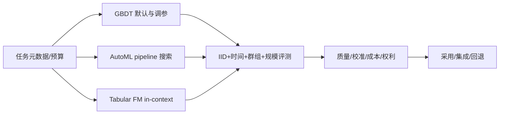

# 07 · AutoML 与表格基础模型

> 一句话点题：表格基础模型把调参成本前移到预训练，但没有取消数据假设；最强策略通常是受约束的阶梯比较，而不是追逐模型类别。

<div class="lesson-meta"><span>MLF19—MLF20—MLF21</span><span>强化核心</span><span>预计 6 × 45 分钟</span><span>证据截止 2026-08-30</span></div>

## 解锁与跳过

需要掌握 GBDT、无泄漏调参、概率校准和非 IID 切分。 即使你使用 AI 完成实现，也不能跳过本章的变量定义、反例和评测设计；这些部分决定你是否有能力发现一个“运行正常但结论错误”的系统。

## 本章可观察目标

完成后你能：解释 AutoML 的搜索对象和元学习；解释 TabPFN 的 prior-data fitted / in-context 推断；在相同预算与真实偏移下选择 GBDT、AutoML 或表格基础模型。阅读完成不计掌握；至少需要一次不看答案的解释、一次实际应用和一次边界判断。

## 研究问题：预训练表格模型何时替代调参，何时仍输给树与领域特征？

TabPFN 类模型可以在新表上不做梯度训练完成预测，容易被理解为“一个模型适合所有表格”。但其上下文规模、特征类型、先验任务分布和硬件不同于 GBDT。AutoML 则可能用更大的搜索时间换成绩。若不统一总时限、数据访问和评测场景，排名没有决策意义。

问题必须被写成“输入、状态、动作/输出、损失、约束、证据和停止条件”的组合。只写“提升效果”会把数据、算法、交互与业务结果混在一起，也无法设计反事实或消融。

## 三个知识节点怎样连接

| 节点 | 核心对象 | 最小充分解释 | 必须支持的决策 |
|---|---|---|---|
| MLF19 | AutoML | 自动组合预处理、模型、超参和集成的选择流程 | 自动搜索是否胜过稳定手工基线 |
| MLF20 | 表格基础模型 | 在大量合成/真实任务上预训练并对新表格上下文推断 | 任务是否落在预训练先验与规模包线内 |
| MLF21 | 公平门禁 | 以相同数据、预算、硬件和偏移场景比较完整系统 | 何时采用、回退或组合 |

三者不是并列名词：第一个节点通常建立对象和假设，第二个节点解释机制，第三个节点把机制放进测量或交付边界。缺任何一层，都容易把局部指标误当成系统结论。

## 核心机制：摊销贝叶斯推断与算法选择

AutoML 把 pipeline 当组合搜索空间，利用验证性能与资源约束选择或集成。TabPFN 在由结构因果模型等先验生成的许多任务上预训练，让 Transformer 读取训练样本并输出查询标签分布，可视作把反复推断摊销进参数。两者都依赖元分布：历史任务或合成先验与当前任务越接近，迁移越可能成功。

理解机制时要区分三种量：**被设计者直接控制的变量**、**环境或数据生成过程决定的变量**、**只能通过代理指标观测的潜变量**。可靠实验一次只改变主要因子，其余配置进入版本化运行记录。

## 关键公式、假设与推导

Prior-data fitted network 试图近似后验预测：

$$
q_\theta(y_*\mid x_*,D)\approx\int p(y_*\mid x_*,\phi)p(\phi\mid D)d\phi.
$$

受预算的算法选择可写为

$$
\max_{a\in\mathcal A}\;U(a,D)\quad\text{s.t.}\quad
T_a\le T_{max},\;M_a\le M_{max},\;R_a\le R_{max}.
$$

公式不是装饰。逐项检查：

- 合成先验 $p(phi)$ 是否覆盖现实生成机制
- in-context 样本数和特征数是否超出模型训练包线
- AutoML 比较需包含搜索和集成总成本
- 预训练数据污染与现实数据权利需单独审计

若假设不成立，正确做法不是继续套公式，而是换估计量、改采样/实验设计、缩小结论或明确拒绝自动决策。

## 证据拆解1：Accurate Predictions on Small Data with TabPFN

### 研究问题

一个预训练 Transformer 能否在小表格任务上替代逐任务训练与调参？

### 核心机制、实验与指标

TabPFN v2 在合成任务先验上学习后验预测，新任务的训练表成为上下文；论文在最多 10,000 样本范围与强基线比较。

作者报告广泛领先并显著减少逐任务训练时间，同时展示密度估计、嵌入等扩展。

### 真正贡献、局限与适用边界

贡献是证明摊销的任务级预训练可成为表格学习新范式。 论文适用规模、GPU条件和基准组成明确；不能外推到任意大表、时间偏移和高维文本字段。

## 证据拆解2：Beyond IID

### 研究问题

标准基准是否系统遗漏表格基础模型困难的任务？

### 核心机制、实验与指标

BeyondArena 用 Data Foundry 统一 142 个数据集，覆盖 IID、时间、群组、规模、高维、高基数和文本特征，比较 11 个模型。

结果显示表格基础模型在小中型 IID 强，但树与传统深度模型在非 IID、大型和高维仍占优。

### 真正贡献、局限与适用边界

它把“基础模型是否通用”改为按任务形态分区的实证问题。 预印本会随模型版本快速变化；本地数据仍需复测，不能只引用总体平均排名。

## 证据拆解3：High Performance, Low Reliability

### 研究问题

领先点预测是否伴随可靠不确定性？

### 核心机制、实验与指标

作者在 112 个 TALENT 数据集比较基础模型、GBDT 和经典方法的 AUC 与 conformal 条件覆盖。

报告显示基础模型在预测表现占优但 SSCS 条件覆盖较弱。

### 真正贡献、局限与适用边界

贡献是给选型增加可靠性轴，而非只追逐平均分。 条件覆盖指标和 conformal 构造有特定假设，不能把结论泛化成基础模型永远不校准。

## 从论文或标准到产品主张：证据审计

| 日期 | 一手来源 | 它真正回答的问题 | 不能据此外推什么 |
|---|---|---|---|
| 2025-01-09 | Accurate Predictions on Small Data with TabPFN | 一个预训练 Transformer 能否在小表格任务上替代逐任务训练与调参？ | 论文适用规模、GPU条件和基准组成明确；不能外推到任意大表、时间偏移和高维文本字段。 |
| 2026-06-29 | Beyond IID | 标准基准是否系统遗漏表格基础模型困难的任务？ | 预印本会随模型版本快速变化；本地数据仍需复测，不能只引用总体平均排名。 |
| 2026-05-27 | High Performance, Low Reliability | 领先点预测是否伴随可靠不确定性？ | 条件覆盖指标和 conformal 构造有特定假设，不能把结论泛化成基础模型永远不校准。 |

阅读来源时按四步记录：先抄下研究对象、比较基线、数据/场景和预算，再定位结果表或正式条文；随后区分作者直接观察、由结果支持的解释和你准备迁移到项目的推论；最后为推论写一个能推翻它的反例。**来源新并不等于证据强**：预印本、公司技术报告、正式标准、法规和独立复现承担的证明责任不同。数字必须连同分母、置信区间、硬件/本体、语言/人群与失败样本一起保存。

如果来源只证明组件指标改善，不得自动升级成端到端任务、真实用户价值、物理安全或合规结论。迁移到自己的项目时至少保留一个原方法基线、一个更简单基线和一个不使用该能力的基线；结果冲突时，优先检查任务定义、样本污染、资源预算、评价器偏差和运行边界，而不是挑选最符合预期的一项。

## 机制图：从输入到可验证结果



图中每条边都应能对应日志、数据版本、物理状态或人工记录；无法观测的边必须标为假设，不允许用模型的一段解释代替真实状态。

## 贯穿案例：中小企业应收账款风险

只有 6,000 条训练记录、80 个混合特征，且季度政策变化明显。先跑逻辑回归和 CatBoost；AutoML 总时限固定一小时；TabPFN 在同一可见训练表、同一硬件上评估。除随机折外增加季度外推和新行业群组测试。若 TabPFN 平均 AUC 高但高金额账款条件覆盖差，产品可以用其排序、保留 CatBoost 概率或进入人工复核，而非一刀切选冠军。

案例的重点不是跑出最高分，而是保存“为什么选择这条路径”的证据：基线是什么、哪个假设最危险、失败怎样分层、什么条件触发降级或人工接管。

## 复现任务：最小因果链

1. 冻结三个真实/公开表格任务与硬件时限
2. 比较 GBDT 默认、受限 AutoML、TabPFN，包含全部预处理时间
3. 分别做 IID、时间和群组切分并重复运行
4. 加入校准、覆盖、内存、能耗/费用和许可检查，画 Pareto 前沿

复现不是成功运行作者代码。你必须固定数据/环境、预算和评价器，至少重复三次，报告均值、离散程度、失败样本和资源消耗；若只能跑一次，要把结论降级为演示证据。

## 三轮实验与消融路线

**第一轮：测量链校准。** 只运行最简单基线，检查输入单位、时间/坐标/权限、随机种子、日志和评价器。抽取成功与失败样本人工复核；若真值或测量本身不稳定，停止模型比较。输出必须能回答“同一次运行能否被另一人重放”。

**第二轮：机制消融。** 在同一数据、预算、硬件或运行条件下，一次只加入一个关键机制；对每次变化写预期影响、未变化项和失败阈值。除了主指标，还要检查最坏切片、过程约束、P95/P99、资源与人工成本。若提升只在一个方便切片出现，应缩小能力声明。

**第三轮：边界与迁移。** 有计划地改变本章公式假设或 ODD：时间、人群、语言、对象、气象、本体、延迟、权限或供应商至少选择两项；注入缺失、冲突和失效。记录系统是正确拒绝/降级/接管，还是带着错误自信继续。最终产物不是“最佳分数”，而是一个可复核的能力范围、反例集和下一次变更会触发的回归集合。

## 实验与指标

| 维度 | 至少记录什么 | 为什么 |
|---|---|---|
| 任务 | 主指标、切片指标、无效/拒绝比例 | 避免平均分掩盖关键用户或条件 |
| 可靠性 | 校准、方差、置信区间、最坏切片 | 知道预测何时不可直接行动 |
| 资源 | 训练/推理时间、内存、能耗或费用 | 确认提升不是无限预算换来的 |
| 运维 | 漂移、缺失、延迟、人工接管和回滚 | 把离线模型放回真实系统 |

同时保留一个简单基线和一个“什么都不做/人工流程”基线。复杂方案只有在质量、成本、时延、风险或可扩展性至少一个维度形成可重复净收益时才晋级。

## 对产品、系统或研究架构的影响

- 建立任务形态路由而非统一默认模型
- 基础模型版本、权重来源和上下文上限进入模型卡
- AutoML 保存完整搜索轨迹和失败 trial
- 任何冠军必须通过非 IID、概率与资源门禁

这些决策应进入 PRD、实验卡、接口契约、安全案例或 ADR，而不只留在学习笔记。模型、数据、提示、硬件、环境与评价器任何一个升级，都要能触发有范围的回归测试。

## 会死在哪里

- 给基础模型更多预训练知识却称数据相同
- 忽略 GPU 与总搜索时间
- 只用其擅长的小 IID 基准
- 把一次前向称为零成本
- 基础模型更新后不重跑本地回归

失败分析要写“触发条件—可观测信号—影响—检测—缓解—残余风险”。只写“模型可能出错”没有工程价值。

## 与 AI 协作模板

```text
请为表格任务做 GBDT、受限 AutoML、TabPFN 的公平选型。固定可见数据、硬件、总墙钟和调参预算；覆盖 IID、时间、群组、规模和高维切片；报告区分、校准、conformal 覆盖、P95、内存、费用和许可。输出采用、集成与回退条件，不依据单一排行榜。
```

使用模板后仍需检查 AI 是否虚构来源、混用时间口径、悄悄改变任务定义，或把模拟结果外推到真实系统。

## 练习：建立模型类别路由器

选三个规模/偏移不同的数据集，为每个模型记录相同指标；写出一个只根据任务元数据和门禁决定候选集的路由规则，并用反例证明规则不是绝对真理。

提交物必须包含一个反例或失败样本。只有成功案例会让你误以为已经掌握；边界证据才能说明你知道方法何时不该用。

## 常见误区

基础模型等于任何数据都通用；不做梯度训练等于没有计算成本；AutoML 消除了实验设计；总体平均排名可直接采购；点预测最强就最可靠。共同根因是把一个条件成立时的局部结论，扩张成不带条件的能力判断。

## 自测

<Quiz question="TabPFN 在随机切分领先、时间外测试落后，最合理的结论是什么？" :options='["随机切分才公平","当前任务的时间偏移超出其相对优势，选型应按部署场景","增加模型参数必能修复"]' :answer="1" explanation="部署分布决定有效证据；模型类别不存在无条件冠军。" />

## 本章小结

- AutoML 自动化的是选择流程而非问题定义
- 表格基础模型是摊销任务级推断
- 真实选型需覆盖偏移、可靠性和资源
- 采用条件必须随模型版本持续重测

<EvidenceTracker lesson="field-machine-learning-07-automl-tabular-foundation" />

## 本章完成标准

不看正文解释 TabPFN 与逐任务训练的机制差异；完成 一份三类系统的公平 Pareto 对照；能指出 表格基础模型不应默认采用的任务区间。最近相关题平均至少 7/10 才标记为 basic；跨日期完成变式任务并达到 8.5/10，才标记为 proficient。

<div class="source-note">主要来源（证据截止 2026-08-30）：<a href="https://doi.org/10.1038/s41586-024-08328-6">TabPFN</a>、<a href="https://arxiv.org/abs/2606.30410">Beyond IID</a>、<a href="https://arxiv.org/abs/2605.28554">TFM Uncertainty</a>。数字只描述来源中的实验设置；标准、法规与产品能力均按页面版本和适用范围解释。</div>
