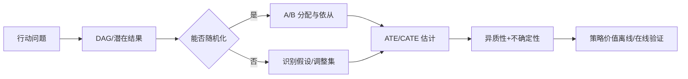

# 08 · 因果推断与实验

> 一句话点题：机器学习能灵活拟合条件期望，却不能从相关数据自动创造因果识别；因果结论的核心资产是设计和假设。

<div class="lesson-meta"><span>MLF22—MLF23—MLF24</span><span>强化核心</span><span>预计 6 × 45 分钟</span><span>证据截止 2026-08-30</span></div>

## 解锁与跳过

先掌握预测问题、概率、数据生成和实验切分；最好有经济学中的反事实直觉。 即使你使用 AI 完成实现，也不能跳过本章的变量定义、反例和评测设计；这些部分决定你是否有能力发现一个“运行正常但结论错误”的系统。

## 本章可观察目标

完成后你能：区分预测、干预与反事实问题；用 DAG 表达混杂、碰撞点和中介；说明 A/B、双重机器学习和异质效应的识别假设。阅读完成不计掌握；至少需要一次不看答案的解释、一次实际应用和一次边界判断。

## 研究问题：预测谁会购买与干预谁会因此购买为什么是两类问题？

流失模型找出最可能离开的用户，不代表优惠券对他们最有效：本来就会留下的高价值用户可能被模型高估，极高风险用户也可能不可挽回。产品需要的是增量效应 $Y(1)-Y(0)$，但每个人只能观察一个潜在结果。混杂、干预依从、溢出和选择退出都会破坏简单对照。

问题必须被写成“输入、状态、动作/输出、损失、约束、证据和停止条件”的组合。只写“提升效果”会把数据、算法、交互与业务结果混在一起，也无法设计反事实或消融。

## 三个知识节点怎样连接

| 节点 | 核心对象 | 最小充分解释 | 必须支持的决策 |
|---|---|---|---|
| MLF22 | 因果问题 | 比较同一单位在不同干预下不可同时观测的潜在结果 | 目标是预测还是选择行动 |
| MLF23 | 识别与实验 | 用随机化或可辩护假设把因果量连接到观测分布 | 什么数据足以估计效应 |
| MLF24 | 因果机器学习 | 用 ML 估计 nuisance/异质性但保留正交化与推断 | 给谁干预及不确定性多大 |

三者不是并列名词：第一个节点通常建立对象和假设，第二个节点解释机制，第三个节点把机制放进测量或交付边界。缺任何一层，都容易把局部指标误当成系统结论。

## 核心机制：潜在结果、DAG 与正交估计

随机实验用分配机制打断处理与潜在结果的关联；观察数据则需明确一致性、可交换性和正值性。DAG 帮助判断应调整哪些共同原因，避免控制碰撞点或处理后的中介。Double ML 把结果模型和倾向模型作为 nuisance，用交叉拟合与正交得分降低其估计误差对目标效应的一阶影响，但仍不能修复未观测混杂。

理解机制时要区分三种量：**被设计者直接控制的变量**、**环境或数据生成过程决定的变量**、**只能通过代理指标观测的潜变量**。可靠实验一次只改变主要因子，其余配置进入版本化运行记录。

## 关键公式、假设与推导

个体效应 $\tau_i=Y_i(1)-Y_i(0)$ 不可同时观测；平均处理效应

$$
ATE=\mathbb E[Y(1)-Y(0)].
$$

部分线性模型的正交矩条件可写为

$$
\mathbb E[(D-m(X))(Y-g(X)-\theta(D-m(X)))]=0,
$$

交叉拟合用于减少过拟合 nuisance 带来的偏差。

公式不是装饰。逐项检查：

- SUTVA/一致性是否被多版本干预或网络溢出破坏
- 所有共同原因是否可观测并正确测量
- 每类 $X$ 是否都有接受/未接受干预的正概率
- 异质效应探索是否经过多重比较和独立验证

若假设不成立，正确做法不是继续套公式，而是换估计量、改采样/实验设计、缩小结论或明确拒绝自动决策。

## 证据拆解1：Double/Debiased Machine Learning

### 研究问题

高维 nuisance 由机器学习估计时，怎样仍对低维因果参数做有效推断？

### 核心机制、实验与指标

DML 使用 Neyman-orthogonal score 和 sample splitting/cross-fitting，使 nuisance 的小误差对目标估计一阶不敏感，并允许随机森林、boosting 等灵活模型。

论文给出理论与多个计量示例，建立机器学习与半参数推断的接口。

### 真正贡献、局限与适用边界

贡献是把预测器作为因果估计组件而非因果结论本身。 它依赖识别、收敛率和正值性等条件；不能处理任意未观测混杂。

## 证据拆解2：Causal Chambers as a Real-world Physical Testbed

### 研究问题

因果发现和 OOD 方法能否在可实际干预、又比合成数据真实的系统中评测？

### 核心机制、实验与指标

研究构建两个可控物理装置，允许真实干预并生成带已知机制的数据，用于因果发现、变化点、OOD、ICA 与符号回归。

案例显示物理测试台能揭示只在合成基准上难观察的误差与可扩展性问题。

### 真正贡献、局限与适用边界

贡献是把真实干预和可重复地面真值引入算法评测。 小型受控装置仍与社会、医疗等开放系统差距大，不能证明跨领域外部有效性。

## 证据拆解3：CausalBench

### 研究问题

真实大规模单细胞干预数据会如何改变因果网络方法排名？

### 核心机制、实验与指标

CausalBench 使用两个公开扰动实验、超过 20 万干预数据点和生物相关指标，统一多种网络推断基线。

初始评测发现方法扩展性不足，使用干预信息的方法并未像合成基准那样自然领先。

### 真正贡献、局限与适用边界

贡献是用真实干预数据挑战合成基准的乐观排序。 基因网络的测量噪声、部分干预和领域指标不等同于一般产品 A/B 因果问题。

## 从论文或标准到产品主张：证据审计

| 日期 | 一手来源 | 它真正回答的问题 | 不能据此外推什么 |
|---|---|---|---|
| 2018-01-25 | Double/Debiased Machine Learning | 高维 nuisance 由机器学习估计时，怎样仍对低维因果参数做有效推断？ | 它依赖识别、收敛率和正值性等条件；不能处理任意未观测混杂。 |
| 2025-01-15 | Causal Chambers as a Real-world Physical Testbed | 因果发现和 OOD 方法能否在可实际干预、又比合成数据真实的系统中评测？ | 小型受控装置仍与社会、医疗等开放系统差距大，不能证明跨领域外部有效性。 |
| 2025-03-11 | CausalBench | 真实大规模单细胞干预数据会如何改变因果网络方法排名？ | 基因网络的测量噪声、部分干预和领域指标不等同于一般产品 A/B 因果问题。 |

阅读来源时按四步记录：先抄下研究对象、比较基线、数据/场景和预算，再定位结果表或正式条文；随后区分作者直接观察、由结果支持的解释和你准备迁移到项目的推论；最后为推论写一个能推翻它的反例。**来源新并不等于证据强**：预印本、公司技术报告、正式标准、法规和独立复现承担的证明责任不同。数字必须连同分母、置信区间、硬件/本体、语言/人群与失败样本一起保存。

如果来源只证明组件指标改善，不得自动升级成端到端任务、真实用户价值、物理安全或合规结论。迁移到自己的项目时至少保留一个原方法基线、一个更简单基线和一个不使用该能力的基线；结果冲突时，优先检查任务定义、样本污染、资源预算、评价器偏差和运行边界，而不是挑选最符合预期的一项。

## 机制图：从输入到可验证结果



图中每条边都应能对应日志、数据版本、物理状态或人工记录；无法观测的边必须标为假设，不允许用模型的一段解释代替真实状态。

## 贯穿案例：优惠券的增量留存

先把干预固定为具体金额、渠道和时点。随机将合格用户分配 treatment/control，按意向处理估计总体效应；若资源有限，再用历史实验做 CATE，但把分群规则锁定后在新实验验证。报告 uplift 曲线之外，还要报告置信区间、未送达、跨用户分享、成本和长期毛利。预测高流失不作为发券理由。

案例的重点不是跑出最高分，而是保存“为什么选择这条路径”的证据：基线是什么、哪个假设最危险、失败怎样分层、什么条件触发降级或人工接管。

## 复现任务：最小因果链

1. 把一个预测需求改写成干预与潜在结果
2. 画 DAG 并列出最小调整集、碰撞点和中介
3. 用合成数据加入一个未观测混杂，展示 DML 仍会偏
4. 设计小型随机实验验证一个预注册异质性假设

复现不是成功运行作者代码。你必须固定数据/环境、预算和评价器，至少重复三次，报告均值、离散程度、失败样本和资源消耗；若只能跑一次，要把结论降级为演示证据。

## 三轮实验与消融路线

**第一轮：测量链校准。** 只运行最简单基线，检查输入单位、时间/坐标/权限、随机种子、日志和评价器。抽取成功与失败样本人工复核；若真值或测量本身不稳定，停止模型比较。输出必须能回答“同一次运行能否被另一人重放”。

**第二轮：机制消融。** 在同一数据、预算、硬件或运行条件下，一次只加入一个关键机制；对每次变化写预期影响、未变化项和失败阈值。除了主指标，还要检查最坏切片、过程约束、P95/P99、资源与人工成本。若提升只在一个方便切片出现，应缩小能力声明。

**第三轮：边界与迁移。** 有计划地改变本章公式假设或 ODD：时间、人群、语言、对象、气象、本体、延迟、权限或供应商至少选择两项；注入缺失、冲突和失效。记录系统是正确拒绝/降级/接管，还是带着错误自信继续。最终产物不是“最佳分数”，而是一个可复核的能力范围、反例集和下一次变更会触发的回归集合。

## 实验与指标

| 维度 | 至少记录什么 | 为什么 |
|---|---|---|
| 任务 | 主指标、切片指标、无效/拒绝比例 | 避免平均分掩盖关键用户或条件 |
| 可靠性 | 校准、方差、置信区间、最坏切片 | 知道预测何时不可直接行动 |
| 资源 | 训练/推理时间、内存、能耗或费用 | 确认提升不是无限预算换来的 |
| 运维 | 漂移、缺失、延迟、人工接管和回滚 | 把离线模型放回真实系统 |

同时保留一个简单基线和一个“什么都不做/人工流程”基线。复杂方案只有在质量、成本、时延、风险或可扩展性至少一个维度形成可重复净收益时才晋级。

## 对产品、系统或研究架构的影响

- 因果 estimand、干预版本和时间窗进入实验合同
- 随机化、依从和排除记录不可被模型日志替代
- 异质策略必须在独立实验验证净价值
- 无法识别时输出预测或描述，不包装成因果

这些决策应进入 PRD、实验卡、接口契约、安全案例或 ADR，而不只留在学习笔记。模型、数据、提示、硬件、环境与评价器任何一个升级，都要能触发有范围的回归测试。

## 会死在哪里

- 把特征重要性当干预杠杆
- 控制处理后变量
- 用倾向分数掩盖未观测混杂
- 从探索分群挑最好子组
- 忽略网络溢出和多版本干预

失败分析要写“触发条件—可观测信号—影响—检测—缓解—残余风险”。只写“模型可能出错”没有工程价值。

## 与 AI 协作模板

```text
请把这个业务目标区分为预测、干预和反事实问题。定义处理、潜在结果、estimand、时间窗和目标总体；画 DAG，检查一致性、可交换性、正值性与溢出；优先给随机实验，否则写清识别假设。若用 DML/CATE，设计交叉拟合、置信区间和独立策略验证。
```

使用模板后仍需检查 AI 是否虚构来源、混用时间口径、悄悄改变任务定义，或把模拟结果外推到真实系统。

## 练习：证明一个高风险用户不一定值得干预

构造四类用户：必留、可挽回、不可挽回、会被优惠伤害。给出相同流失风险但不同处理效应的例子，比较风险排序与 uplift 排序的策略价值。

提交物必须包含一个反例或失败样本。只有成功案例会让你误以为已经掌握；边界证据才能说明你知道方法何时不该用。

## 常见误区

预测准确即可指导干预；DAG 可从数据唯一学出；控制变量越多越安全；Double ML 消除未观测混杂；子组效果高就能立即个性化。共同根因是把一个条件成立时的局部结论，扩张成不带条件的能力判断。

## 自测

<Quiz question="为什么高流失风险用户未必是最优发券对象？" :options='["因为模型不够大","风险是自然结果概率，策略需要处理造成的增量差异","因为 AUC 不能计算"]' :answer="1" explanation="干预目标是反事实效应而非未处理风险。" />

## 本章小结

- 预测与因果回答不同问题
- 识别来自设计与假设
- 机器学习可灵活估计 nuisance 和异质性
- 真实干预与独立验证决定策略证据

<EvidenceTracker lesson="field-machine-learning-08-causal-experimentation" />

## 本章完成标准

不看正文解释 风险预测与处理效应的区别；完成 一张 DAG 和一个可执行实验方案；能指出 DML 无法解决的未观测混杂。最近相关题平均至少 7/10 才标记为 basic；跨日期完成变式任务并达到 8.5/10，才标记为 proficient。

<div class="source-note">主要来源（证据截止 2026-08-30）：<a href="https://academic.oup.com/ectj/article/21/1/C1/5056401">Double ML</a>、<a href="https://www.nature.com/articles/s42256-024-00964-x">Causal Chambers</a>、<a href="https://www.nature.com/articles/s42003-025-07764-y">CausalBench</a>。数字只描述来源中的实验设置；标准、法规与产品能力均按页面版本和适用范围解释。</div>
