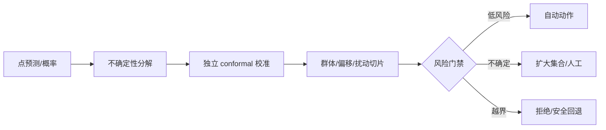

# 09 · 不确定性、公平与鲁棒性

> 一句话点题：可靠机器学习不是给每个样本一个更自信的数字，而是知道哪些错误可量化、哪些保证依赖分布、哪些情况必须拒绝。

<div class="lesson-meta"><span>MLF25—MLF26—MLF27</span><span>强化核心</span><span>预计 6 × 45 分钟</span><span>证据截止 2026-08-30</span></div>

## 解锁与跳过

需掌握概率、校准、非 IID 切分和成本敏感决策。 即使你使用 AI 完成实现，也不能跳过本章的变量定义、反例和评测设计；这些部分决定你是否有能力发现一个“运行正常但结论错误”的系统。

## 本章可观察目标

完成后你能：区分 aleatoric、epistemic 与分布外不确定性；构造并验证 conformal 预测集；把公平、鲁棒和拒绝策略写进同一决策门禁。阅读完成不计掌握；至少需要一次不看答案的解释、一次实际应用和一次边界判断。

## 研究问题：准确率相同时，怎样判断哪个模型更值得被信任？

平均准确率相同的两个模型可能一个在关键少数群体失效，另一个在数据偏移时极度过信。公平指标之间也可能数学上冲突，且受基准率与标签质量影响。conformal 给出的边际覆盖需要交换性；时间漂移或群体条件下仍可能严重失覆盖。

问题必须被写成“输入、状态、动作/输出、损失、约束、证据和停止条件”的组合。只写“提升效果”会把数据、算法、交互与业务结果混在一起，也无法设计反事实或消融。

## 三个知识节点怎样连接

| 节点 | 核心对象 | 最小充分解释 | 必须支持的决策 |
|---|---|---|---|
| MLF25 | 不确定性 | 区分不可约噪声、知识不足与数据偏移 | 预测、扩充数据还是拒绝 |
| MLF26 | Conformal | 在交换性等条件下用校准分位数构造覆盖集 | 以集合宽度换覆盖保证 |
| MLF27 | 公平与鲁棒 | 按群体、扰动和最坏条件测量风险与权衡 | 何种约束和残余风险可接受 |

三者不是并列名词：第一个节点通常建立对象和假设，第二个节点解释机制，第三个节点把机制放进测量或交付边界。缺任何一层，都容易把局部指标误当成系统结论。

## 核心机制：从点预测到风险集合与拒绝

概率校准描述长期频率；Bayesian/ensemble 等方法估计模型不确定性；conformal 使用独立校准集的非一致性分数分位数，把任意基础模型包装为预测集。公平审计按相关群体和交叉切片计算错误、校准与选择，鲁棒审计用真实扰动/域偏移。最终策略允许扩大集合、拒答、人工复核或切换保守模型。

理解机制时要区分三种量：**被设计者直接控制的变量**、**环境或数据生成过程决定的变量**、**只能通过代理指标观测的潜变量**。可靠实验一次只改变主要因子，其余配置进入版本化运行记录。

## 关键公式、假设与推导

Split conformal 取校准分数 $s_i$ 的分位数

$$
q=\operatorname{Quantile}_{\lceil(n+1)(1-\alpha)\rceil/n}(s_1,\dots,s_n),
$$

构造 $C(x)=\{y:s(x,y)\le q\}$，在交换性下有边际保证

$$
P\{Y_{n+1}\in C(X_{n+1})\}\ge1-\alpha.
$$

公式不是装饰。逐项检查：

- 保证是边际还是条件覆盖
- 校准与测试样本是否交换
- 集合宽度/拒绝率是否仍具产品价值
- 群体标签是否合法、稳定且不制造额外伤害

若假设不成立，正确做法不是继续套公式，而是换估计量、改采样/实验设计、缩小结论或明确拒绝自动决策。

## 证据拆解1：Diagnosing Conformal Prediction Failures Under Distribution Shift

### 研究问题

部署前能否诊断哪些模型的 conformal 覆盖会在 COVID 时间偏移下失败？

### 核心机制、实验与指标

研究把 conformal 覆盖退化与基础模型、分布变化和可观测诊断联系起来，使用真实 COVID 案例分析非交换数据。

论文显示分布无关的原始保证在偏移下不能照搬，并提出针对失败的诊断视角。

### 真正贡献、局限与适用边界

贡献是把覆盖失败从事后数字变成部署前要测的机制问题。 单一医疗时间序列不能代表全部偏移；诊断也不自动恢复形式保证。

## 证据拆解2：High Performance, Low Reliability

### 研究问题

表格基础模型的预测领先是否伴随条件覆盖领先？

### 核心机制、实验与指标

作者在 112 个 TALENT 数据集上用 AUC 与 SSCS 同时比较 TFMs、GBDT 和经典方法，并用合成数据分析何时权衡加剧。

报告发现基础模型平均 AUC 更高但条件覆盖较弱。

### 真正贡献、局限与适用边界

贡献是提供性能—可靠性的二维证据。 预印本、特定 conformal score 与基准集合不允许外推为所有 TFM 的永久排序。

## 证据拆解3：NIST Generative AI Profile

### 研究问题

组织怎样把测量、治理和风险处置连接到 AI 生命周期？

### 核心机制、实验与指标

NIST AI 600-1 扩展 AI RMF 的 Govern/Map/Measure/Manage，列出生成式 AI 特有风险与建议行动，并强调在部署前后持续 TEVV。

它不是模型排行榜，而是跨角色的风险结果与行动框架。

### 真正贡献、局限与适用边界

贡献是把技术指标放回影响、责任和持续治理。 自愿框架不是法律合规证明，也不能替代领域法规和具体测试阈值。

## 从论文或标准到产品主张：证据审计

| 日期 | 一手来源 | 它真正回答的问题 | 不能据此外推什么 |
|---|---|---|---|
| 2026-08-12 | Diagnosing Conformal Prediction Failures Under Distribution Shift | 部署前能否诊断哪些模型的 conformal 覆盖会在 COVID 时间偏移下失败？ | 单一医疗时间序列不能代表全部偏移；诊断也不自动恢复形式保证。 |
| 2026-05-27 | High Performance, Low Reliability | 表格基础模型的预测领先是否伴随条件覆盖领先？ | 预印本、特定 conformal score 与基准集合不允许外推为所有 TFM 的永久排序。 |
| 2024-07-26 | NIST Generative AI Profile | 组织怎样把测量、治理和风险处置连接到 AI 生命周期？ | 自愿框架不是法律合规证明，也不能替代领域法规和具体测试阈值。 |

阅读来源时按四步记录：先抄下研究对象、比较基线、数据/场景和预算，再定位结果表或正式条文；随后区分作者直接观察、由结果支持的解释和你准备迁移到项目的推论；最后为推论写一个能推翻它的反例。**来源新并不等于证据强**：预印本、公司技术报告、正式标准、法规和独立复现承担的证明责任不同。数字必须连同分母、置信区间、硬件/本体、语言/人群与失败样本一起保存。

如果来源只证明组件指标改善，不得自动升级成端到端任务、真实用户价值、物理安全或合规结论。迁移到自己的项目时至少保留一个原方法基线、一个更简单基线和一个不使用该能力的基线；结果冲突时，优先检查任务定义、样本污染、资源预算、评价器偏差和运行边界，而不是挑选最符合预期的一项。

## 机制图：从输入到可验证结果



图中每条边都应能对应日志、数据版本、物理状态或人工记录；无法观测的边必须标为假设，不允许用模型的一段解释代替真实状态。

## 贯穿案例：急诊分诊辅助

系统输出风险范围而不是唯一等级。校准集按医院与时间独立保留；分别报告总体和年龄/性别/医院交叉切片覆盖、集合宽度与延误成本。若新医院覆盖低于门槛，系统只能作为信息展示并强制人工；不得用总体 90% 覆盖掩盖某群体 60%。公平审计还需检查标签本身是否受历史资源分配影响。

案例的重点不是跑出最高分，而是保存“为什么选择这条路径”的证据：基线是什么、哪个假设最危险、失败怎样分层、什么条件触发降级或人工接管。

## 复现任务：最小因果链

1. 为任意分类器实现 split conformal
2. 在 IID 测试验证边际覆盖与集合大小
3. 人为制造时间/群体偏移并观察失覆盖
4. 设计按风险触发扩大集合、人工与拒绝的策略，计算剩余风险

复现不是成功运行作者代码。你必须固定数据/环境、预算和评价器，至少重复三次，报告均值、离散程度、失败样本和资源消耗；若只能跑一次，要把结论降级为演示证据。

## 三轮实验与消融路线

**第一轮：测量链校准。** 只运行最简单基线，检查输入单位、时间/坐标/权限、随机种子、日志和评价器。抽取成功与失败样本人工复核；若真值或测量本身不稳定，停止模型比较。输出必须能回答“同一次运行能否被另一人重放”。

**第二轮：机制消融。** 在同一数据、预算、硬件或运行条件下，一次只加入一个关键机制；对每次变化写预期影响、未变化项和失败阈值。除了主指标，还要检查最坏切片、过程约束、P95/P99、资源与人工成本。若提升只在一个方便切片出现，应缩小能力声明。

**第三轮：边界与迁移。** 有计划地改变本章公式假设或 ODD：时间、人群、语言、对象、气象、本体、延迟、权限或供应商至少选择两项；注入缺失、冲突和失效。记录系统是正确拒绝/降级/接管，还是带着错误自信继续。最终产物不是“最佳分数”，而是一个可复核的能力范围、反例集和下一次变更会触发的回归集合。

## 实验与指标

| 维度 | 至少记录什么 | 为什么 |
|---|---|---|
| 任务 | 主指标、切片指标、无效/拒绝比例 | 避免平均分掩盖关键用户或条件 |
| 可靠性 | 校准、方差、置信区间、最坏切片 | 知道预测何时不可直接行动 |
| 资源 | 训练/推理时间、内存、能耗或费用 | 确认提升不是无限预算换来的 |
| 运维 | 漂移、缺失、延迟、人工接管和回滚 | 把离线模型放回真实系统 |

同时保留一个简单基线和一个“什么都不做/人工流程”基线。复杂方案只有在质量、成本、时延、风险或可扩展性至少一个维度形成可重复净收益时才晋级。

## 对产品、系统或研究架构的影响

- 概率、预测集、拒绝原因分别记录
- 风险门禁使用覆盖与最坏切片而非平均准确率
- 公平指标选择写明价值判断和冲突
- 偏移后先降级，再重新校准/验证而非静默继续

这些决策应进入 PRD、实验卡、接口契约、安全案例或 ADR，而不只留在学习笔记。模型、数据、提示、硬件、环境与评价器任何一个升级，都要能触发有范围的回归测试。

## 会死在哪里

- 把 90% 边际覆盖说成每个群体都 90%
- 用测试集选择 nonconformity score
- 集合巨大仍宣传保证有效
- 只优化一个公平指标
- 把敏感属性删除当公平

失败分析要写“触发条件—可观测信号—影响—检测—缓解—残余风险”。只写“模型可能出错”没有工程价值。

## 与 AI 协作模板

```text
请为该模型建立可靠性门禁：区分噪声、模型和分布外不确定性；用独立校准构造 conformal 集；报告总体、关键群体、交叉切片和偏移下覆盖/集合宽度；列出公平指标冲突；设计自动、人工、拒绝和回退状态，不把边际保证表述成条件保证。
```

使用模板后仍需检查 AI 是否虚构来源、混用时间口径、悄悄改变任务定义，或把模拟结果外推到真实系统。

## 练习：让 90% 覆盖在一个群体失败

构造两个噪声水平不同的群体，使总体 conformal 覆盖接近 90% 但高噪声组显著不足；比较分组校准、扩大集合和拒绝策略的代价。

提交物必须包含一个反例或失败样本。只有成功案例会让你误以为已经掌握；边界证据才能说明你知道方法何时不该用。

## 常见误区

概率高就是认知确定；conformal 对任何偏移都分布无关；边际覆盖等于个体保证；删除敏感属性即可公平；鲁棒性可以用随机噪声完全代表。共同根因是把一个条件成立时的局部结论，扩张成不带条件的能力判断。

## 自测

<Quiz question="交换性被时间漂移破坏后，原始 split conformal 的 90% 保证应怎样表述？" :options='["仍严格成立","保证条件已破坏，必须实测、适配或降级","只要模型 AUC 高就成立"]' :answer="1" explanation="形式覆盖依赖校准与测试交换性。" />

## 本章小结

- 不同不确定性对应不同动作
- conformal 保证有明确数据条件
- 公平和鲁棒需按关键条件切片
- 可靠系统必须允许拒绝和安全回退

<EvidenceTracker lesson="field-machine-learning-09-uncertainty-robustness" />

## 本章完成标准

不看正文解释 边际覆盖、条件覆盖和分布偏移；完成 一个含群体压力测试的 conformal 门禁；能指出 形式保证失效的交换性条件。最近相关题平均至少 7/10 才标记为 basic；跨日期完成变式任务并达到 8.5/10，才标记为 proficient。

<div class="source-note">主要来源（证据截止 2026-08-30）：<a href="https://proceedings.mlr.press/v337/lee26g.html">Conformal Shift Diagnosis</a>、<a href="https://arxiv.org/abs/2605.28554">TFM Uncertainty</a>、<a href="https://www.nist.gov/publications/artificial-intelligence-risk-management-framework-generative-artificial-intelligence">NIST GAI Profile</a>。数字只描述来源中的实验设置；标准、法规与产品能力均按页面版本和适用范围解释。</div>
