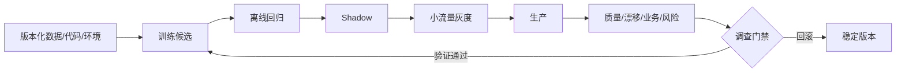

# 10 · 生产机器学习与持续评测

> 一句话点题：上线不是模型生命周期的终点，而是第一次真正接触目标分布；生产机器学习的核心是可追溯决策与可恢复变化。

<div class="lesson-meta"><span>MLF28—MLF29—MLF30</span><span>综合交付</span><span>预计 6 × 45 分钟</span><span>证据截止 2026-08-30</span></div>

## 解锁与跳过

应已完成前九章或拥有等价证据：无泄漏数据、强基线、概率/不确定性、偏移与决策门禁。 即使你使用 AI 完成实现，也不能跳过本章的变量定义、反例和评测设计；这些部分决定你是否有能力发现一个“运行正常但结论错误”的系统。

## 本章可观察目标

完成后你能：版本化数据、特征、模型和阈值；设计漂移、质量、业务与风险监控；演练 shadow、灰度、回滚与再训练审批。阅读完成不计掌握；至少需要一次不看答案的解释、一次实际应用和一次边界判断。

## 研究问题：模型上线以后，什么证据能证明它仍在解决原问题？

标签往往延迟数周，输入漂移并不必然导致性能下降，性能稳定也可能掩盖公平或业务伤害。自动再训练如果没有标签成熟、回归门禁和政策审批，会把反馈回路和攻击数据学回系统。服务 SLO、模型质量、决策影响和合规证据必须分层。

问题必须被写成“输入、状态、动作/输出、损失、约束、证据和停止条件”的组合。只写“提升效果”会把数据、算法、交互与业务结果混在一起，也无法设计反事实或消融。

## 三个知识节点怎样连接

| 节点 | 核心对象 | 最小充分解释 | 必须支持的决策 |
|---|---|---|---|
| MLF28 | 可复现管道 | 代码、数据、环境、特征和随机性共同确定模型 | 能否重建任意线上预测 |
| MLF29 | 持续测量 | 监测输入、预测、结果、服务和影响的变化 | 何时报警、降级或调查 |
| MLF30 | 安全演进 | 以 shadow/灰度/回滚和审批控制模型变化 | 何时发布与重新训练 |

三者不是并列名词：第一个节点通常建立对象和假设，第二个节点解释机制，第三个节点把机制放进测量或交付边界。缺任何一层，都容易把局部指标误当成系统结论。

## 核心机制：从离线产物到持续决策系统

每次预测携带 request、feature snapshot、model、threshold/policy 和 trace ID。训练由不可变快照和 pipeline 生成候选，先离线回归，再 shadow 比较线上输入，随后小流量灰度并监控护栏。漂移分数据质量、协变量、预测、标签/性能和决策影响；只有诊断说明原因且候选通过门禁，才触发再训练或政策调整。

理解机制时要区分三种量：**被设计者直接控制的变量**、**环境或数据生成过程决定的变量**、**只能通过代理指标观测的潜变量**。可靠实验一次只改变主要因子，其余配置进入版本化运行记录。

## 关键公式、假设与推导

总体风险可分解为环境状态的加权风险：

$$
R_t=\sum_g P_t(G=g)\,\mathbb E_t[\ell\mid G=g].
$$

仅监测 $P_t(X)$ 无法决定 $R_t$。序贯告警还需控制误报，例如以控制图标准化：

$$
z_t=\frac{m_t-\mu_0}{\sigma_0},
$$

并预先定义调查阈值、持续窗口和多指标合并规则。

公式不是装饰。逐项检查：

- 标签延迟和缺失会让性能估计有选择偏差
- 模型阈值或上游策略变化会改变观测分布
- 大量监控指标会制造多重告警
- 再训练数据可能包含旧模型造成的反馈

若假设不成立，正确做法不是继续套公式，而是换估计量、改采样/实验设计、缩小结论或明确拒绝自动决策。

## 证据拆解1：The ML Test Score

### 研究问题

怎样系统评估一个 ML 系统是否具备生产就绪证据？

### 核心机制、实验与指标

文章提出覆盖数据、模型、基础设施和监控的测试清单，并用分级 rubric 强调测试债务；重点是模型周围系统，而非单一离线分数。

框架来自大量生产经验，帮助团队把隐性要求变成自动测试。

### 真正贡献、局限与适用边界

贡献是建立 ML 生产成熟度的共同语言。 2017 清单需补充现代基础模型、安全与法规要求；评分也不能替代领域风险判断。

## 证据拆解2：Data Cascades in High-Stakes AI

### 研究问题

上游数据问题怎样在组织中积累并传播为下游系统失败？

### 核心机制、实验与指标

研究通过高风险 AI 实践者访谈提出 data cascade：被低估的数据工作、角色边界和反馈不足导致复合技术债。

报告展示数据问题并非单个清洗 bug，而是组织激励和流程结果。

### 真正贡献、局限与适用边界

贡献是把数据治理纳入系统与组织设计。 质性研究不提供普遍故障率，团队仍需本地量化证据。

## 证据拆解3：Beyond IID

### 研究问题

怎样把时间、群组、规模和特征类型差异纳入统一表格评测？

### 核心机制、实验与指标

Data Foundry 提供数据元数据与统一构建框架，BeyondArena 将非 IID 任务正式纳入比较。

142 数据集结果显示部署形态会改变模型排名。

### 真正贡献、局限与适用边界

贡献是给持续评测提供按任务形态组织数据的范式。 公开基准仍不同于企业特有反馈、延迟标签和政策改变。

## 从论文或标准到产品主张：证据审计

| 日期 | 一手来源 | 它真正回答的问题 | 不能据此外推什么 |
|---|---|---|---|
| 2017-09-28 | The ML Test Score | 怎样系统评估一个 ML 系统是否具备生产就绪证据？ | 2017 清单需补充现代基础模型、安全与法规要求；评分也不能替代领域风险判断。 |
| 2021-11-29 | Data Cascades in High-Stakes AI | 上游数据问题怎样在组织中积累并传播为下游系统失败？ | 质性研究不提供普遍故障率，团队仍需本地量化证据。 |
| 2026-06-29 | Beyond IID | 怎样把时间、群组、规模和特征类型差异纳入统一表格评测？ | 公开基准仍不同于企业特有反馈、延迟标签和政策改变。 |

阅读来源时按四步记录：先抄下研究对象、比较基线、数据/场景和预算，再定位结果表或正式条文；随后区分作者直接观察、由结果支持的解释和你准备迁移到项目的推论；最后为推论写一个能推翻它的反例。**来源新并不等于证据强**：预印本、公司技术报告、正式标准、法规和独立复现承担的证明责任不同。数字必须连同分母、置信区间、硬件/本体、语言/人群与失败样本一起保存。

如果来源只证明组件指标改善，不得自动升级成端到端任务、真实用户价值、物理安全或合规结论。迁移到自己的项目时至少保留一个原方法基线、一个更简单基线和一个不使用该能力的基线；结果冲突时，优先检查任务定义、样本污染、资源预算、评价器偏差和运行边界，而不是挑选最符合预期的一项。

## 机制图：从输入到可验证结果



图中每条边都应能对应日志、数据版本、物理状态或人工记录；无法观测的边必须标为假设，不允许用模型的一段解释代替真实状态。

## 贯穿案例：风险模型季度升级

当前 v12 运行稳定，新候选 v13 使用新数据和 TabPFN/GBDT 集成。每笔线上决策保留 v12/v13 shadow 分数，但只有 v12 执行动作。灰度先覆盖低风险且可人工复核的 5% 流量；护栏包括坏账、误拒、校准、群体差异、P95 和人工复核量。任一越界自动回滚。标签成熟 90 天后才能做最终收益判定，期间不以代理指标宣布成功。

案例的重点不是跑出最高分，而是保存“为什么选择这条路径”的证据：基线是什么、哪个假设最危险、失败怎样分层、什么条件触发降级或人工接管。

## 复现任务：最小因果链

1. 为贯穿项目生成 model/data/feature/policy 四份版本清单
2. 实现 schema、范围、空值、泄漏和训练—服务一致性测试
3. 用历史回放模拟一次输入漂移和标签延迟
4. 执行 shadow→5%灰度→回滚演练并保存时间线

复现不是成功运行作者代码。你必须固定数据/环境、预算和评价器，至少重复三次，报告均值、离散程度、失败样本和资源消耗；若只能跑一次，要把结论降级为演示证据。

## 三轮实验与消融路线

**第一轮：测量链校准。** 只运行最简单基线，检查输入单位、时间/坐标/权限、随机种子、日志和评价器。抽取成功与失败样本人工复核；若真值或测量本身不稳定，停止模型比较。输出必须能回答“同一次运行能否被另一人重放”。

**第二轮：机制消融。** 在同一数据、预算、硬件或运行条件下，一次只加入一个关键机制；对每次变化写预期影响、未变化项和失败阈值。除了主指标，还要检查最坏切片、过程约束、P95/P99、资源与人工成本。若提升只在一个方便切片出现，应缩小能力声明。

**第三轮：边界与迁移。** 有计划地改变本章公式假设或 ODD：时间、人群、语言、对象、气象、本体、延迟、权限或供应商至少选择两项；注入缺失、冲突和失效。记录系统是正确拒绝/降级/接管，还是带着错误自信继续。最终产物不是“最佳分数”，而是一个可复核的能力范围、反例集和下一次变更会触发的回归集合。

## 实验与指标

| 维度 | 至少记录什么 | 为什么 |
|---|---|---|
| 任务 | 主指标、切片指标、无效/拒绝比例 | 避免平均分掩盖关键用户或条件 |
| 可靠性 | 校准、方差、置信区间、最坏切片 | 知道预测何时不可直接行动 |
| 资源 | 训练/推理时间、内存、能耗或费用 | 确认提升不是无限预算换来的 |
| 运维 | 漂移、缺失、延迟、人工接管和回滚 | 把离线模型放回真实系统 |

同时保留一个简单基线和一个“什么都不做/人工流程”基线。复杂方案只有在质量、成本、时延、风险或可扩展性至少一个维度形成可重复净收益时才晋级。

## 对产品、系统或研究架构的影响

- 线上预测可追溯到不可变数据和模型工件
- 漂移报警先诊断，不直接自动再训练
- 发布同时具备离线、shadow、灰度和回滚门禁
- 阈值/政策变化与模型变化分别审批和评估

这些决策应进入 PRD、实验卡、接口契约、安全案例或 ADR，而不只留在学习笔记。模型、数据、提示、硬件、环境与评价器任何一个升级，都要能触发有范围的回归测试。

## 会死在哪里

- 只监测特征均值
- 标签未成熟就宣布模型提升
- 训练/服务特征实现不一致
- 自动再训练吸收反馈污染
- 回滚只回模型不回阈值和特征

失败分析要写“触发条件—可观测信号—影响—检测—缓解—残余风险”。只写“模型可能出错”没有工程价值。

## 与 AI 协作模板

```text
请为这个 ML 系统设计生产生命周期。列出数据、特征、模型、阈值、环境和代码版本；为数据质量、协变量、预测、延迟标签性能、关键群体、服务 SLO 和业务影响定义监控；设计 shadow、灰度、回滚与再训练审批；用一次故障注入验证恢复，不因单一漂移自动训练。
```

使用模板后仍需检查 AI 是否虚构来源、混用时间口径、悄悄改变任务定义，或把模拟结果外推到真实系统。

## 练习：完成一次模型事故演练

模拟上游单位从元变成分、缺失率骤增或类别编码变更。记录检测时间、错误影响、自动门禁、人工决策、回滚范围和防复发测试，形成一份事故复盘。

提交物必须包含一个反例或失败样本。只有成功案例会让你误以为已经掌握；边界证据才能说明你知道方法何时不该用。

## 常见误区

部署后输入分布会自然稳定；检测到漂移就应自动重训；模型 registry 等于可复现；服务可用等于决策正确；回滚一个权重文件即可恢复全部系统。共同根因是把一个条件成立时的局部结论，扩张成不带条件的能力判断。

## 自测

<Quiz question="检测到输入漂移后最稳妥的默认动作是什么？" :options='["立即自动重训并全量发布","按门禁诊断数据、性能与影响，必要时降级/回滚","忽略直到用户投诉"]' :answer="1" explanation="输入漂移与性能损失并非一一对应，先诊断和控制影响。" />

## 本章小结

- 生产模型是版本化决策系统
- 监控分质量、分布、性能、服务和影响
- 标签延迟要求谨慎的代理指标
- 安全升级依赖 shadow、灰度和可恢复回滚

<EvidenceTracker lesson="field-machine-learning-10-production-ml" />

## 本章完成标准

不看正文解释 为什么输入漂移不等于性能漂移；完成 一次有证据的灰度与回滚演练；能指出 自动再训练会放大反馈问题的条件。最近相关题平均至少 7/10 才标记为 basic；跨日期完成变式任务并达到 8.5/10，才标记为 proficient。

<div class="source-note">主要来源（证据截止 2026-08-30）：<a href="https://research.google/pubs/the-ml-test-score-a-rubric-for-ml-production-readiness-and-technical-debt-reduction/">ML Test Score</a>、<a href="https://research.google/pubs/data-cascades-in-high-stakes-ai/">Data Cascades</a>、<a href="https://arxiv.org/abs/2606.30410">Beyond IID</a>。数字只描述来源中的实验设置；标准、法规与产品能力均按页面版本和适用范围解释。</div>
