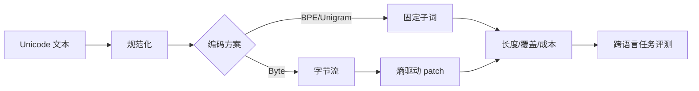

# 02 · 分词、形态与开放词汇

> 一句话点题：Tokenizer 是数据压缩器、计算分配器和语言接口；它不会只影响输入长度，而会改变上下文预算、训练频率、成本与错误形态。

<div class="lesson-meta"><span>NLPF04—NLPF05—NLPF06</span><span>核心主线</span><span>预计 6 × 45 分钟</span><span>证据截止 2026-08-30</span></div>

## 解锁与跳过

完成 NLPF01—03，并能按语种、书写系统和文本来源切片。 即使你使用 AI 完成实现，也不能跳过本章的变量定义、反例和评测设计；这些部分决定你是否有能力发现一个“运行正常但结论错误”的系统。

## 本章可观察目标

完成后你能：解释字符、字节、词片与形态单位的权衡；量化不同语言的 token 膨胀和截断偏差；在开放词汇、成本与下游质量之间做选择。阅读完成不计掌握；至少需要一次不看答案的解释、一次实际应用和一次边界判断。

## 研究问题：Tokenizer 为什么会系统性改变不同语言的成本与能力？

同一份跨境合同，英文 800 tokens、中文 1,100、某低资源语言 2,400。固定 2,048 上下文会让后者更早丢失签名条款，按 token 计费还提高成本。只比较英文下游分数无法发现这类结构性差异。

问题必须被写成“输入、状态、动作/输出、损失、约束、证据和停止条件”的组合。只写“提升效果”会把数据、算法、交互与业务结果混在一起，也无法设计反事实或消融。

## 三个知识节点怎样连接

| 节点 | 核心对象 | 最小充分解释 | 必须支持的决策 |
|---|---|---|---|
| NLPF04 | 切分单位 | 字符、字节、词或子词决定模型看到的基本序列 | 何种单位保留结构且可覆盖新词 |
| NLPF05 | 形态与词汇 | 词形变化、复合词和书写系统形成语言特定边界 | 是否需要形态分析或领域词保护 |
| NLPF06 | Tokenizer 公平性 | 同一语义在不同语言上的长度、成本和截断概率不同 | 词表与 patch 策略是否系统性伤害某些语言 |

三者不是并列名词：第一个节点通常建立对象和假设，第二个节点解释机制，第三个节点把机制放进测量或交付边界。缺任何一层，都容易把局部指标误当成系统结论。

## 核心机制：开放词汇编码与动态 byte patch

BPE 每轮合并频率最高的相邻符号；Unigram 从候选子词集合中选择最大化语料似然的子集；byte 模型彻底消除 OOV，却显著拉长序列。BLT 不固定 token 表，而按字节熵形成动态 patch：可预测片段用大块，稀有/复杂片段用小块，从而把计算分配给信息密集区域。

理解机制时要区分三种量：**被设计者直接控制的变量**、**环境或数据生成过程决定的变量**、**只能通过代理指标观测的潜变量**。可靠实验一次只改变主要因子，其余配置进入版本化运行记录。

## 关键公式、假设与推导

BPE 的贪心目标可写为选择 $a,b$ 使频数 $f(ab)$ 最大；Unigram 近似最大化 $\sum_x\log\sum_{s\in S(x)}\prod_{t\in s}p(t)$。跨语言审计至少报告膨胀率 $r_l=\frac{tokens_l}{characters_l}$、截断率和单位语义成本 $C_l=price\cdot tokens_l/task$。

公式不是装饰。逐项检查：

- Unicode 归一化和空白规则是否改变实体
- 训练词表的语言/领域配比
- 长度比较使用字符、字节还是语义对齐段落
- 特殊 token、注入和反序列化是否安全

若假设不成立，正确做法不是继续套公式，而是换估计量、改采样/实验设计、缩小结论或明确拒绝自动决策。

## 证据拆解1：SentencePiece

### 研究问题

能否直接从原始句子学习语言无关的子词模型？

### 核心机制、实验与指标

SentencePiece 将空格当普通符号，在固定词表下提供 Unigram/BPE 和可逆切分，避免依赖语言特定预分词。

论文在日英翻译等设置展示与传统子词管线相当或更好的结果，并简化多语言处理。

### 真正贡献、局限与适用边界

建立了现代多语言 tokenizer 的可复现基础。 语言无关实现不等于语言公平；训练混合和词表容量仍决定分配。

## 证据拆解2：Byte Latent Transformer

### 研究问题

固定 token 是否是扩展语言模型的必要前提？

### 核心机制、实验与指标

BLT 在字节层建模，以熵阈值形成动态 patch，并在局部 byte 编码器与全局 latent Transformer 之间传递表示。

作者报告在相近训练 FLOPs 下可匹配 token 模型，并在噪声和字符任务上表现出优势。

### 真正贡献、局限与适用边界

提供按信息复杂度而非固定词表分配计算的路线。 结果来自特定规模与训练配方；推理栈、缓存和真实多语言成本仍需独立测量。

## 从论文或标准到产品主张：证据审计

| 日期 | 一手来源 | 它真正回答的问题 | 不能据此外推什么 |
|---|---|---|---|
| 2018-08-21 | SentencePiece | 能否直接从原始句子学习语言无关的子词模型？ | 语言无关实现不等于语言公平；训练混合和词表容量仍决定分配。 |
| 2024-12-13 | Byte Latent Transformer | 固定 token 是否是扩展语言模型的必要前提？ | 结果来自特定规模与训练配方；推理栈、缓存和真实多语言成本仍需独立测量。 |

阅读来源时按四步记录：先抄下研究对象、比较基线、数据/场景和预算，再定位结果表或正式条文；随后区分作者直接观察、由结果支持的解释和你准备迁移到项目的推论；最后为推论写一个能推翻它的反例。**来源新并不等于证据强**：预印本、公司技术报告、正式标准、法规和独立复现承担的证明责任不同。数字必须连同分母、置信区间、硬件/本体、语言/人群与失败样本一起保存。

如果来源只证明组件指标改善，不得自动升级成端到端任务、真实用户价值、物理安全或合规结论。迁移到自己的项目时至少保留一个原方法基线、一个更简单基线和一个不使用该能力的基线；结果冲突时，优先检查任务定义、样本污染、资源预算、评价器偏差和运行边界，而不是挑选最符合预期的一项。

## 机制图：从输入到可验证结果



图中每条边都应能对应日志、数据版本、物理状态或人工记录；无法观测的边必须标为假设，不允许用模型的一段解释代替真实状态。

## 贯穿案例：中英少数语种合同 tokenizer 审计

构造语义对齐的 1,000 段合同，分别统计字符、字节、token、截断位置和实体破碎率。固定语义内容与模型，比较子词和 byte/patch 方案在条款检索、金额抽取、吞吐和费用上的 Pareto；额外加入拼写噪声、混语和罕见公司名。

案例的重点不是跑出最高分，而是保存“为什么选择这条路径”的证据：基线是什么、哪个假设最危险、失败怎样分层、什么条件触发降级或人工接管。

## 复现任务：最小因果链

1. 冻结规范化、词表和模型版本
2. 按语种/文体计算 token 膨胀、实体破碎和截断
3. 在等上下文成本而非等 token 条件评测下游任务
4. 对稀有词、混语、emoji、代码和注入边界做反例集

复现不是成功运行作者代码。你必须固定数据/环境、预算和评价器，至少重复三次，报告均值、离散程度、失败样本和资源消耗；若只能跑一次，要把结论降级为演示证据。

## 三轮实验与消融路线

**第一轮：测量链校准。** 只运行最简单基线，检查输入单位、时间/坐标/权限、随机种子、日志和评价器。抽取成功与失败样本人工复核；若真值或测量本身不稳定，停止模型比较。输出必须能回答“同一次运行能否被另一人重放”。

**第二轮：机制消融。** 在同一数据、预算、硬件或运行条件下，一次只加入一个关键机制；对每次变化写预期影响、未变化项和失败阈值。除了主指标，还要检查最坏切片、过程约束、P95/P99、资源与人工成本。若提升只在一个方便切片出现，应缩小能力声明。

**第三轮：边界与迁移。** 有计划地改变本章公式假设或 ODD：时间、人群、语言、对象、气象、本体、延迟、权限或供应商至少选择两项；注入缺失、冲突和失效。记录系统是正确拒绝/降级/接管，还是带着错误自信继续。最终产物不是“最佳分数”，而是一个可复核的能力范围、反例集和下一次变更会触发的回归集合。

## 实验与指标

| 维度 | 至少记录什么 | 为什么 |
|---|---|---|
| 任务质量 | 主指标、分层指标、置信区间和失败类型 | 平均分不能说明关键场景是否可用 |
| 系统表现 | 端到端时延、成功率、降级/拒绝和人工介入 | 局部模型分数不是用户任务结果 |
| 资源经济 | 训练/推理/标注成本、吞吐、容量与能耗 | 确认改进在真实预算下仍成立 |
| 风险运维 | 漂移、越权、事故、恢复时间和残余风险 | 把一次实验转化成可持续服务 |

同时保留一个简单基线和一个“什么都不做/人工流程”基线。复杂方案只有在质量、成本、时延、风险或可扩展性至少一个维度形成可重复净收益时才晋级。

## 对产品、系统或研究架构的影响

- 上下文窗口按最差语言预算
- 缓存同时保存原文、字符偏移与 token 偏移
- 费用/延迟看每项任务而非每 token 单价
- Tokenizer 更新视为数据接口破坏性变更

这些决策应进入 PRD、实验卡、接口契约、安全案例或 ADR，而不只留在学习笔记。模型、数据、提示、硬件、环境与评价器任何一个升级，都要能触发有范围的回归测试。

## 会死在哪里

- 只报告平均 token 长度
- 把中文字符直接当词
- 训练测试使用不同规范化
- 忽略 offset 对抽取高亮的影响
- 认为无 OOV 就没有语言偏差

失败分析要写“触发条件—可观测信号—影响—检测—缓解—残余风险”。只写“模型可能出错”没有工程价值。

## 与 AI 协作模板

```text
对给定多语言语料做 tokenizer 审计：输出每语种 token/字符、token/字节、P95、截断率、实体跨片率、噪声鲁棒性、任务质量和单位成本；列出最差 20 条并解释机制。
```

使用模板后仍需检查 AI 是否虚构来源、混用时间口径、悄悄改变任务定义，或把模拟结果外推到真实系统。

## 练习：比较子词与字节表示

选择三种语言和一种领域文体，对同一批语义对齐文本比较至少两个 tokenizer；提交分布图、最差样本、下游抽取结果与一条词表/上下文决策。

提交物必须包含一个反例或失败样本。只有成功案例会让你误以为已经掌握；边界证据才能说明你知道方法何时不该用。

## 常见误区

Tokenizer 只是工程预处理；词表越大越好；无 OOV 等于跨语言公平；更少 token 必然更强；换 tokenizer 不影响模型接口。共同根因是把一个条件成立时的局部结论，扩张成不带条件的能力判断。

## 自测

<Quiz question="某语种答案常在长文末尾被漏掉，首先检查什么？" :options='["温度","该语种 token 膨胀与实际截断位置","增加英文训练集"]' :answer="1" explanation="相同字符/语义长度可能消耗不同上下文，先验证表示与截断机制。" />

## 本章小结

- 切分决定序列和计算预算
- 形态与书写系统改变最优粒度
- 公平审计需要语义对齐与下游任务
- Tokenizer 版本属于模型契约

<EvidenceTracker lesson="field-nlp-02-tokenization-morphology" />

## 本章完成标准

不看正文解释 BPE、Unigram 与动态 byte patch 的权衡；完成 一个三语 tokenizer 审计报告；能指出 固定子词方案会系统性失效的输入。最近相关题平均至少 7/10 才标记为 basic；跨日期完成变式任务并达到 8.5/10，才标记为 proficient。

<div class="source-note">主要来源（证据截止 2026-08-30）：<a href="https://aclanthology.org/D18-2012/">SentencePiece</a>、<a href="https://arxiv.org/abs/2412.09871">BLT</a>、<a href="https://aclanthology.org/P16-1162/">BPE NMT</a>。数字只描述来源中的实验设置；标准、法规与产品能力均按页面版本和适用范围解释。</div>
