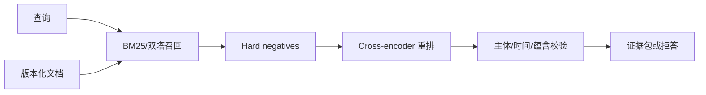

# 03 · 分布语义、向量与检索

> 一句话点题：Embedding 压缩的是训练目标奖励的关系，不是通用‘意义’；高余弦可以表示同主题，也可能把否定、时间和主体差异压平。

<div class="lesson-meta"><span>NLPF07—NLPF08—NLPF09</span><span>核心主线</span><span>预计 6 × 45 分钟</span><span>证据截止 2026-08-30</span></div>

## 解锁与跳过

掌握分词与可靠切分，能构造正例、随机负例和语义相近 hard negative。 即使你使用 AI 完成实现，也不能跳过本章的变量定义、反例和评测设计；这些部分决定你是否有能力发现一个“运行正常但结论错误”的系统。

## 本章可观察目标

完成后你能：区分词义、句义、主题和事实关系；解释对比学习怎样塑造向量空间；建立含 hard negative、校准与领域漂移的检索评测。阅读完成不计掌握；至少需要一次不看答案的解释、一次实际应用和一次边界判断。

## 研究问题：相似度能代表哪些语义，不能代表哪些事实关系？

查询“2026 年合同是否允许自动续期”与段落“2025 年版本允许自动续期”词面极近，却不能作为当前证据。随机负例会让模型只学主题；必须加入年份冲突、否定、不同主体和近义条款 hard negative。

问题必须被写成“输入、状态、动作/输出、损失、约束、证据和停止条件”的组合。只写“提升效果”会把数据、算法、交互与业务结果混在一起，也无法设计反事实或消融。

## 三个知识节点怎样连接

| 节点 | 核心对象 | 最小充分解释 | 必须支持的决策 |
|---|---|---|---|
| NLPF07 | 分布语义 | 词义由上下文分布提供可学习线索但不等于世界事实 | 静态或上下文表示适合什么任务 |
| NLPF08 | 句向量与度量 | 编码器把文本映射到可比较空间 | 相似函数与训练目标是否匹配检索动作 |
| NLPF09 | 检索边界 | 相关、蕴含、同主题和可作为证据并不等价 | 候选召回后需要何种重排与验证 |

三者不是并列名词：第一个节点通常建立对象和假设，第二个节点解释机制，第三个节点把机制放进测量或交付边界。缺任何一层，都容易把局部指标误当成系统结论。

## 核心机制：对比表示、各向异性与两阶段检索

word2vec 通过局部上下文预测学习静态词向量；BERT 产生依赖上下文的 token 表示；Sentence-BERT 用成对/三元组目标把句子放入可直接比较的空间。生产检索常由双塔 ANN 保召回、cross-encoder 重排关系，再由 claim-evidence 校验检查时间、主体和蕴含。

理解机制时要区分三种量：**被设计者直接控制的变量**、**环境或数据生成过程决定的变量**、**只能通过代理指标观测的潜变量**。可靠实验一次只改变主要因子，其余配置进入版本化运行记录。

## 关键公式、假设与推导

InfoNCE 损失 $L_i=-\log\frac{e^{sim(q_i,d_i^+)/\tau}}{e^{sim(q_i,d_i^+)/\tau}+\sum_je^{sim(q_i,d_j^-)/\tau}}$。它高度依赖负例分布；召回用 Recall@$k$，排序用 nDCG/MRR，但证据任务还需 entailment、时间有效率与 answerable coverage。

公式不是装饰。逐项检查：

- 正例是否真能支持查询而非只相关
- batch 内负例有没有假负例
- 余弦、点积和向量归一化是否与索引一致
- 领域、时间和语言漂移是否单独切片

若假设不成立，正确做法不是继续套公式，而是换估计量、改采样/实验设计、缩小结论或明确拒绝自动决策。

## 证据拆解1：Sentence-BERT

### 研究问题

怎样避免 BERT 对所有句对做昂贵交叉编码？

### 核心机制、实验与指标

用孪生/三元组网络产生句向量，使语义搜索可以预编码文档并用余弦比较。

论文报告 STS 与检索效率的大幅改进，形成现代 embedding 检索基本范式。

### 真正贡献、局限与适用边界

把句表示从分类器中间态变成可索引产品接口。 独立编码损失跨文本交互，复杂否定和事实关系仍需重排。

## 证据拆解2：Dense Passage Retrieval

### 研究问题

开放域问答能否用稠密向量替代词法检索？

### 核心机制、实验与指标

分别编码问题和段落，以 in-batch negatives 训练，并在大规模 ANN 索引召回。

在多个问答数据集上显著超过当时 BM25 基线。

### 真正贡献、局限与适用边界

证明监督稠密检索能学习超越词面重叠的匹配。 基准分布、假负例和最新性会影响真实知识库效果；不能省略 lexical/hybrid 基线。

## 从论文或标准到产品主张：证据审计

| 日期 | 一手来源 | 它真正回答的问题 | 不能据此外推什么 |
|---|---|---|---|
| 2019-08-27 | Sentence-BERT | 怎样避免 BERT 对所有句对做昂贵交叉编码？ | 独立编码损失跨文本交互，复杂否定和事实关系仍需重排。 |
| 2020-04-29 | Dense Passage Retrieval | 开放域问答能否用稠密向量替代词法检索？ | 基准分布、假负例和最新性会影响真实知识库效果；不能省略 lexical/hybrid 基线。 |

阅读来源时按四步记录：先抄下研究对象、比较基线、数据/场景和预算，再定位结果表或正式条文；随后区分作者直接观察、由结果支持的解释和你准备迁移到项目的推论；最后为推论写一个能推翻它的反例。**来源新并不等于证据强**：预印本、公司技术报告、正式标准、法规和独立复现承担的证明责任不同。数字必须连同分母、置信区间、硬件/本体、语言/人群与失败样本一起保存。

如果来源只证明组件指标改善，不得自动升级成端到端任务、真实用户价值、物理安全或合规结论。迁移到自己的项目时至少保留一个原方法基线、一个更简单基线和一个不使用该能力的基线；结果冲突时，优先检查任务定义、样本污染、资源预算、评价器偏差和运行边界，而不是挑选最符合预期的一项。

## 机制图：从输入到可验证结果



图中每条边都应能对应日志、数据版本、物理状态或人工记录；无法观测的边必须标为假设，不允许用模型的一段解释代替真实状态。

## 贯穿案例：带版本冲突的政策检索

为 500 个问题标注可支持段落、无答案和版本时效；候选集中加入旧政策、否定条款和相邻地区。比较 BM25、dense、hybrid 与 reranker，除 Recall@20 外报告最终支持率、旧版本误引率、P95 和每查询成本。

案例的重点不是跑出最高分，而是保存“为什么选择这条路径”的证据：基线是什么、哪个假设最危险、失败怎样分层、什么条件触发降级或人工接管。

## 复现任务：最小因果链

1. 建立随机、词面相近、时间冲突和否定四类负例
2. 固定语料快照、分块和索引参数
3. 分别测召回、重排、证据校验并保存掉落原因
4. 在新文档/新领域时间外集合复测

复现不是成功运行作者代码。你必须固定数据/环境、预算和评价器，至少重复三次，报告均值、离散程度、失败样本和资源消耗；若只能跑一次，要把结论降级为演示证据。

## 三轮实验与消融路线

**第一轮：测量链校准。** 只运行最简单基线，检查输入单位、时间/坐标/权限、随机种子、日志和评价器。抽取成功与失败样本人工复核；若真值或测量本身不稳定，停止模型比较。输出必须能回答“同一次运行能否被另一人重放”。

**第二轮：机制消融。** 在同一数据、预算、硬件或运行条件下，一次只加入一个关键机制；对每次变化写预期影响、未变化项和失败阈值。除了主指标，还要检查最坏切片、过程约束、P95/P99、资源与人工成本。若提升只在一个方便切片出现，应缩小能力声明。

**第三轮：边界与迁移。** 有计划地改变本章公式假设或 ODD：时间、人群、语言、对象、气象、本体、延迟、权限或供应商至少选择两项；注入缺失、冲突和失效。记录系统是正确拒绝/降级/接管，还是带着错误自信继续。最终产物不是“最佳分数”，而是一个可复核的能力范围、反例集和下一次变更会触发的回归集合。

## 实验与指标

| 维度 | 至少记录什么 | 为什么 |
|---|---|---|
| 任务质量 | 主指标、分层指标、置信区间和失败类型 | 平均分不能说明关键场景是否可用 |
| 系统表现 | 端到端时延、成功率、降级/拒绝和人工介入 | 局部模型分数不是用户任务结果 |
| 资源经济 | 训练/推理/标注成本、吞吐、容量与能耗 | 确认改进在真实预算下仍成立 |
| 风险运维 | 漂移、越权、事故、恢复时间和残余风险 | 把一次实验转化成可持续服务 |

同时保留一个简单基线和一个“什么都不做/人工流程”基线。复杂方案只有在质量、成本、时延、风险或可扩展性至少一个维度形成可重复净收益时才晋级。

## 对产品、系统或研究架构的影响

- 混合检索保留词法精确匹配
- 索引条目携带版本、权限和有效期
- 检索与答案指标分层
- 错误查询进入 hard-negative 队列

这些决策应进入 PRD、实验卡、接口契约、安全案例或 ADR，而不只留在学习笔记。模型、数据、提示、硬件、环境与评价器任何一个升级，都要能触发有范围的回归测试。

## 会死在哪里

- 把相似当蕴含
- 随机负例过易
- 只测命中文档不测支持句
- 索引更新不留快照
- 向量模型升级不重建基准

失败分析要写“触发条件—可观测信号—影响—检测—缓解—残余风险”。只写“模型可能出错”没有工程价值。

## 与 AI 协作模板

```text
为我的检索任务构造 hard-negative 本体，至少覆盖否定、数字、时间、主体、因果方向和同主题不同答案；设计 BM25/dense/hybrid/reranker 消融和端到端证据支持指标。
```

使用模板后仍需检查 AI 是否虚构来源、混用时间口径、悄悄改变任务定义，或把模拟结果外推到真实系统。

## 练习：做一轮可证伪语义检索

用 50 个查询和 300 段文档构造带版本冲突的评测集；比较两种召回与一种重排，逐层画漏斗并解释 10 个高相似错误。

提交物必须包含一个反例或失败样本。只有成功案例会让你误以为已经掌握；边界证据才能说明你知道方法何时不该用。

## 常见误区

余弦高就是事实一致；向量检索必然优于 BM25；更大 embedding 维度总更好；召回率高即可回答；向量库是永久记忆。共同根因是把一个条件成立时的局部结论，扩张成不带条件的能力判断。

## 自测

<Quiz question="查询与旧版条款余弦最高但结论已废止，系统缺少哪层？" :options='["更多维度","时间/版本约束和蕴含校验","更高温度"]' :answer="1" explanation="语义相似不能替代证据有效性。" />

## 本章小结

- 表示空间由目标与负例塑造
- 相关性不等于支持关系
- 两阶段检索分离效率与精确交互
- 版本和权限必须进入索引契约

<EvidenceTracker lesson="field-nlp-03-semantics-embeddings" />

## 本章完成标准

不看正文解释 对比学习与 hard negative 怎样改变空间；完成 分层检索漏斗与错误本体；能指出 embedding 相似度不应直接驱动的决策。最近相关题平均至少 7/10 才标记为 basic；跨日期完成变式任务并达到 8.5/10，才标记为 proficient。

<div class="source-note">主要来源（证据截止 2026-08-30）：<a href="https://aclanthology.org/D19-1410/">Sentence-BERT</a>、<a href="https://aclanthology.org/2020.emnlp-main.550/">DPR</a>、<a href="https://aclanthology.org/N19-1423/">BERT</a>。数字只描述来源中的实验设置；标准、法规与产品能力均按页面版本和适用范围解释。</div>
