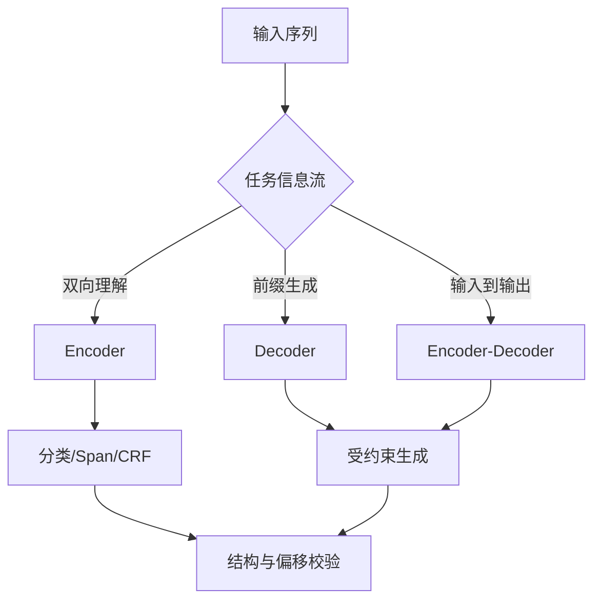

# 04 · 序列、编码器与解码器

> 一句话点题：分类、序列标注与生成不是换一个 prompt 就相同；信息能从哪里流向哪里、输出是否需全局一致，决定架构与评价器。

<div class="lesson-meta"><span>NLPF10—NLPF11—NLPF12</span><span>核心主线</span><span>预计 6 × 45 分钟</span><span>证据截止 2026-08-30</span></div>

## 解锁与跳过

能审计 token 与 embedding，并掌握训练/验证/测试隔离。 即使你使用 AI 完成实现，也不能跳过本章的变量定义、反例和评测设计；这些部分决定你是否有能力发现一个“运行正常但结论错误”的系统。

## 本章可观察目标

完成后你能：按信息流选择 encoder、decoder 或 encoder-decoder；解释 CRF、mask 和因果注意力约束；在统一数据/预算下比较轻量基线与现代编码器。阅读完成不计掌握；至少需要一次不看答案的解释、一次实际应用和一次边界判断。

## 研究问题：为什么分类、抽取和生成需要不同的信息流约束？

合同实体抽取若用自由生成，可能改写公司名、漏字符或产生不存在实体；token 分类能保留偏移却可能生成非法 IOB 序列。需要对照 BiLSTM-CRF、encoder token classifier 与受约束生成，并在相同标注和延迟下选型。

问题必须被写成“输入、状态、动作/输出、损失、约束、证据和停止条件”的组合。只写“提升效果”会把数据、算法、交互与业务结果混在一起，也无法设计反事实或消融。

## 三个知识节点怎样连接

| 节点 | 核心对象 | 最小充分解释 | 必须支持的决策 |
|---|---|---|---|
| NLPF10 | 序列结构 | 标签和输出之间存在顺序、边界与依赖 | 需要独立预测还是结构化解码 |
| NLPF11 | 编码/解码信息流 | 双向理解、因果生成和条件生成使用不同 mask | 模型架构是否匹配输出约束 |
| NLPF12 | 高效编码器 | 现代长序列编码器联合改善吞吐、位置与训练配方 | 何时小型专用模型胜过通用生成模型 |

三者不是并列名词：第一个节点通常建立对象和假设，第二个节点解释机制，第三个节点把机制放进测量或交付边界。缺任何一层，都容易把局部指标误当成系统结论。

## 核心机制：双向编码、因果解码与结构化约束

BiLSTM 汇聚左右上下文，CRF 对整条标签序列归一化并学习转移；BERT 通过 masked LM 获得双向表示；decoder 只能看前缀，适合自回归生成；T5 把任务统一为条件文本生成。ModernBERT 重新设计长上下文 encoder 的位置、注意力和训练配方，说明理解型架构仍有独立价值。

理解机制时要区分三种量：**被设计者直接控制的变量**、**环境或数据生成过程决定的变量**、**只能通过代理指标观测的潜变量**。可靠实验一次只改变主要因子，其余配置进入版本化运行记录。

## 关键公式、假设与推导

线性链 CRF 的 $p(y|x)=\frac{e^{s(x,y)}}{\sum_{y'}e^{s(x,y')}}$，$s$ 包含发射与标签转移；因果注意力令 $M_{ij}=-\infty$ 当 $j>i$。选择应比较结构合法率、exact/span F1、校准、吞吐与内存，而非只看参数量。

公式不是装饰。逐项检查：

- 输出是否依赖未来 token
- 标签之间有哪些硬约束
- 生成文本能否无损映射回原文 offset
- 最大长度与批量吞吐是否符合业务

若假设不成立，正确做法不是继续套公式，而是换估计量、改采样/实验设计、缩小结论或明确拒绝自动决策。

## 证据拆解1：BiLSTM-CRF for Sequence Tagging

### 研究问题

端到端神经表示怎样与标签序列约束结合？

### 核心机制、实验与指标

双向 LSTM 产生上下文发射分数，CRF 联合解码完整标签序列。

在多项序列标注任务上取得当时强结果，并避免手工特征依赖。

### 真正贡献、局限与适用边界

明确区分 token 表示与结构解码两层。 长依赖、预训练和现代硬件效率不是其优势，今天主要作为可解释基线。

## 证据拆解2：ModernBERT

### 研究问题

encoder-only 模型能否用现代配方在长文本和效率上重新竞争？

### 核心机制、实验与指标

工作结合长上下文、旋转位置、局部/全局注意力和现代训练数据/工程。

作者在多种检索、分类和代码任务报告质量—速度优势。

### 真正贡献、局限与适用边界

提醒 NLP 选型不应默认所有任务都用 decoder LLM。 技术报告结果与特定硬件实现需在目标环境复验。

## 从论文或标准到产品主张：证据审计

| 日期 | 一手来源 | 它真正回答的问题 | 不能据此外推什么 |
|---|---|---|---|
| 2016-08-09 | BiLSTM-CRF for Sequence Tagging | 端到端神经表示怎样与标签序列约束结合？ | 长依赖、预训练和现代硬件效率不是其优势，今天主要作为可解释基线。 |
| 2024-12-18 | ModernBERT | encoder-only 模型能否用现代配方在长文本和效率上重新竞争？ | 技术报告结果与特定硬件实现需在目标环境复验。 |

阅读来源时按四步记录：先抄下研究对象、比较基线、数据/场景和预算，再定位结果表或正式条文；随后区分作者直接观察、由结果支持的解释和你准备迁移到项目的推论；最后为推论写一个能推翻它的反例。**来源新并不等于证据强**：预印本、公司技术报告、正式标准、法规和独立复现承担的证明责任不同。数字必须连同分母、置信区间、硬件/本体、语言/人群与失败样本一起保存。

如果来源只证明组件指标改善，不得自动升级成端到端任务、真实用户价值、物理安全或合规结论。迁移到自己的项目时至少保留一个原方法基线、一个更简单基线和一个不使用该能力的基线；结果冲突时，优先检查任务定义、样本污染、资源预算、评价器偏差和运行边界，而不是挑选最符合预期的一项。

## 机制图：从输入到可验证结果



图中每条边都应能对应日志、数据版本、物理状态或人工记录；无法观测的边必须标为假设，不允许用模型的一段解释代替真实状态。

## 贯穿案例：合同实体与关系抽取

同一数据上训练字典+规则、encoder+CRF 和 schema 约束生成。按实体精确边界、嵌套实体、关系方向、非法输出、P95 与人工修订时间评测；法律实体要求保留原文字符偏移和证据句。

案例的重点不是跑出最高分，而是保存“为什么选择这条路径”的证据：基线是什么、哪个假设最危险、失败怎样分层、什么条件触发降级或人工接管。

## 复现任务：最小因果链

1. 按实体/模板来源分组切分
2. 实现字典、序列标注和生成三层基线
3. 验证 IOB/schema/offset 并记录无法解析输出
4. 对长文、嵌套、否定和跨句关系单独压力测试

复现不是成功运行作者代码。你必须固定数据/环境、预算和评价器，至少重复三次，报告均值、离散程度、失败样本和资源消耗；若只能跑一次，要把结论降级为演示证据。

## 三轮实验与消融路线

**第一轮：测量链校准。** 只运行最简单基线，检查输入单位、时间/坐标/权限、随机种子、日志和评价器。抽取成功与失败样本人工复核；若真值或测量本身不稳定，停止模型比较。输出必须能回答“同一次运行能否被另一人重放”。

**第二轮：机制消融。** 在同一数据、预算、硬件或运行条件下，一次只加入一个关键机制；对每次变化写预期影响、未变化项和失败阈值。除了主指标，还要检查最坏切片、过程约束、P95/P99、资源与人工成本。若提升只在一个方便切片出现，应缩小能力声明。

**第三轮：边界与迁移。** 有计划地改变本章公式假设或 ODD：时间、人群、语言、对象、气象、本体、延迟、权限或供应商至少选择两项；注入缺失、冲突和失效。记录系统是正确拒绝/降级/接管，还是带着错误自信继续。最终产物不是“最佳分数”，而是一个可复核的能力范围、反例集和下一次变更会触发的回归集合。

## 实验与指标

| 维度 | 至少记录什么 | 为什么 |
|---|---|---|
| 任务质量 | 主指标、分层指标、置信区间和失败类型 | 平均分不能说明关键场景是否可用 |
| 系统表现 | 端到端时延、成功率、降级/拒绝和人工介入 | 局部模型分数不是用户任务结果 |
| 资源经济 | 训练/推理/标注成本、吞吐、容量与能耗 | 确认改进在真实预算下仍成立 |
| 风险运维 | 漂移、越权、事故、恢复时间和残余风险 | 把一次实验转化成可持续服务 |

同时保留一个简单基线和一个“什么都不做/人工流程”基线。复杂方案只有在质量、成本、时延、风险或可扩展性至少一个维度形成可重复净收益时才晋级。

## 对产品、系统或研究架构的影响

- 高频稳定抽取优先专用 encoder
- 开放 schema 生成必须有语法约束和校验
- 保存原文 offset 与规范化值双表示
- 架构升级以端到端修订成本决策

这些决策应进入 PRD、实验卡、接口契约、安全案例或 ADR，而不只留在学习笔记。模型、数据、提示、硬件、环境与评价器任何一个升级，都要能触发有范围的回归测试。

## 会死在哪里

- 把生成流畅误当精确抽取
- token 与字符 offset 错位
- 随机拆分文档模板
- 忽略非法标签序列
- 只测短句平均 F1

失败分析要写“触发条件—可观测信号—影响—检测—缓解—残余风险”。只写“模型可能出错”没有工程价值。

## 与 AI 协作模板

```text
为该 NLP 任务画 encoder/decoder/encoder-decoder 选型表；比较信息流、结构约束、可追溯 offset、延迟、数据量和失败恢复，并给最小三基线实验。
```

使用模板后仍需检查 AI 是否虚构来源、混用时间口径、悄悄改变任务定义，或把模拟结果外推到真实系统。

## 练习：同任务三架构对照

选一个 5 类分类或实体抽取任务，对照线性/规则、encoder 与受约束生成；提交质量—延迟 Pareto 和至少 20 个按机制归因的错误。

提交物必须包含一个反例或失败样本。只有成功案例会让你误以为已经掌握；边界证据才能说明你知道方法何时不该用。

## 常见误区

decoder LLM 总能替代 encoder；CRF 已完全过时；参数大等于长文本利用好；结构化输出等于 JSON 可解析；token F1 等于实体可用。共同根因是把一个条件成立时的局部结论，扩张成不带条件的能力判断。

## 自测

<Quiz question="实体抽取 JSON 合法但公司名被改写，首要指标是什么？" :options='["BLEU","原文精确边界/offset 与实体 exact match","困惑度"]' :answer="1" explanation="抽取必须忠实指向原文，语法合法不足以证明正确。" />

## 本章小结

- 信息流约束决定架构
- 结构解码保证全局合法性
- 专用 encoder 仍有质量成本优势
- 端到端可用性包含偏移与校验

<EvidenceTracker lesson="field-nlp-04-sequence-encoders-decoders" />

## 本章完成标准

不看正文解释 三类架构的 mask 与输出差异；完成 统一预算的三基线实验；能指出 自由生成不适合的结构化任务。最近相关题平均至少 7/10 才标记为 basic；跨日期完成变式任务并达到 8.5/10，才标记为 proficient。

<div class="source-note">主要来源（证据截止 2026-08-30）：<a href="https://aclanthology.org/P16-1101/">BiLSTM-CRF</a>、<a href="https://aclanthology.org/N19-1423/">BERT</a>、<a href="https://jmlr.org/papers/v21/20-074.html">T5</a>、<a href="https://arxiv.org/abs/2412.13663">ModernBERT</a>。数字只描述来源中的实验设置；标准、法规与产品能力均按页面版本和适用范围解释。</div>
