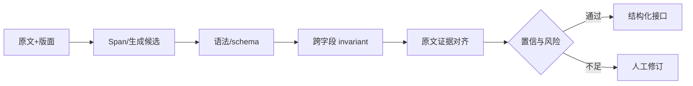

# 06 · 分类、抽取与结构化语言

> 一句话点题：‘输出 JSON’只是句法层；可生产的结构化 NLP 还要保证原文证据、类型约束、实体同一性、关系方向和业务完整性。

<div class="lesson-meta"><span>NLPF16—NLPF17—NLPF18</span><span>核心主线</span><span>预计 6 × 45 分钟</span><span>证据截止 2026-08-30</span></div>

## 解锁与跳过

能选择编码/生成架构并写 JSON Schema 或标注本体。 即使你使用 AI 完成实现，也不能跳过本章的变量定义、反例和评测设计；这些部分决定你是否有能力发现一个“运行正常但结论错误”的系统。

## 本章可观察目标

完成后你能：把实体、关系、事件与标签写成约束 schema；区分 token、span、record 和任务级指标；设计解析、校验、修复和人工升级链。阅读完成不计掌握；至少需要一次不看答案的解释、一次实际应用和一次边界判断。

## 研究问题：怎样让模型输出可校验实体、关系、事件和标签，而非漂亮段落？

发票抽取返回合法 JSON，却把含税总额当未税金额、把供应商与购买方对调。字段级准确看似高，财务入账却错误。需要 schema + cross-field invariant + 原文 span + 任务级 exact record。

问题必须被写成“输入、状态、动作/输出、损失、约束、证据和停止条件”的组合。只写“提升效果”会把数据、算法、交互与业务结果混在一起，也无法设计反事实或消融。

## 三个知识节点怎样连接

| 节点 | 核心对象 | 最小充分解释 | 必须支持的决策 |
|---|---|---|---|
| NLPF16 | 结构化理解 | 从文本定位实体、关系、事件和属性 | 输出本体能否支持下游系统 |
| NLPF17 | 约束生成 | 用语法、类型和业务规则限制可接受输出 | 哪些错误应在解码时阻止 |
| NLPF18 | 错误本体 | 按边界、类型、关系、证据和解析失败归因 | 迭代数据、模型还是规则 |

三者不是并列名词：第一个节点通常建立对象和假设，第二个节点解释机制，第三个节点把机制放进测量或交付边界。缺任何一层，都容易把局部指标误当成系统结论。

## 核心机制：Span、语法约束与语义验证

序列标注定位连续 span，span classifier 支持嵌套，生成模型适合开放 schema。JSON grammar 可在 token 选择时屏蔽非法前缀；Pydantic/JSON Schema 验类型；业务 invariant 检查金额关系和枚举；证据对齐器把每个值绑定原文偏移。修复只处理可机械确定的格式，不让模型静默猜事实。

理解机制时要区分三种量：**被设计者直接控制的变量**、**环境或数据生成过程决定的变量**、**只能通过代理指标观测的潜变量**。可靠实验一次只改变主要因子，其余配置进入版本化运行记录。

## 关键公式、假设与推导

实体边界 F1 基于 exact span；record exact match 要求一整条记录全部正确。若字段正确率均为 $p$, $k$ 个必要字段的独立近似成功仅 $p^k$。业务损失为 $\sum_e C_{type(e)}N_e$，高成本角色互换应单独门禁。

公式不是装饰。逐项检查：

- 是否允许嵌套、重叠和不连续 span
- 规范化值与原文值如何双向追溯
- schema 合法是否仍可能语义冲突
- 部分正确能否安全进入下游

若假设不成立，正确做法不是继续套公式，而是换估计量、改采样/实验设计、缩小结论或明确拒绝自动决策。

## 证据拆解1：CoNLL-2003 Shared Task

### 研究问题

如何形成可比较的命名实体识别任务？

### 核心机制、实验与指标

共享任务固定语料、PER/ORG/LOC/MISC 类型和 exact-span F1。

它成为长期 NER 基准与序列标注教学入口。

### 真正贡献、局限与适用边界

建立精确边界与实体类型的共同语言。 新闻英语/德语和窄类型无法代表嵌套、领域实体与真实系统成本。

## 证据拆解2：Universal Dependencies v2

### 研究问题

多语言句法结构能否使用统一标注框架？

### 核心机制、实验与指标

UD 统一词性、形态特征与依存关系，同时允许语言特定扩展。

项目持续覆盖大量语言并维护指南、树库与验证工具。

### 真正贡献、局限与适用边界

展示 schema、社区治理和自动验证怎样共同支持跨语言资源。 统一标签仍会压平语言特性，树库质量和覆盖差异必须保留。

## 从论文或标准到产品主张：证据审计

| 日期 | 一手来源 | 它真正回答的问题 | 不能据此外推什么 |
|---|---|---|---|
| 2003-01-01 | CoNLL-2003 Shared Task | 如何形成可比较的命名实体识别任务？ | 新闻英语/德语和窄类型无法代表嵌套、领域实体与真实系统成本。 |
| 2020-01-01 | Universal Dependencies v2 | 多语言句法结构能否使用统一标注框架？ | 统一标签仍会压平语言特性，树库质量和覆盖差异必须保留。 |

阅读来源时按四步记录：先抄下研究对象、比较基线、数据/场景和预算，再定位结果表或正式条文；随后区分作者直接观察、由结果支持的解释和你准备迁移到项目的推论；最后为推论写一个能推翻它的反例。**来源新并不等于证据强**：预印本、公司技术报告、正式标准、法规和独立复现承担的证明责任不同。数字必须连同分母、置信区间、硬件/本体、语言/人群与失败样本一起保存。

如果来源只证明组件指标改善，不得自动升级成端到端任务、真实用户价值、物理安全或合规结论。迁移到自己的项目时至少保留一个原方法基线、一个更简单基线和一个不使用该能力的基线；结果冲突时，优先检查任务定义、样本污染、资源预算、评价器偏差和运行边界，而不是挑选最符合预期的一项。

## 机制图：从输入到可验证结果



图中每条边都应能对应日志、数据版本、物理状态或人工记录；无法观测的边必须标为假设，不允许用模型的一段解释代替真实状态。

## 贯穿案例：发票到财务记录

定义供应商、购买方、币种、未税额、税额、总额和日期；每字段保存原文 span、规范化值与置信。验证总额≈未税额+税额、币种一致和主体不互换。评测 exact field、record exact、金额绝对误差、自动通过率与错误入账率。

案例的重点不是跑出最高分，而是保存“为什么选择这条路径”的证据：基线是什么、哪个假设最危险、失败怎样分层、什么条件触发降级或人工接管。

## 复现任务：最小因果链

1. 用真实下游 API 反推 schema 与必填约束
2. 构造版面、OCR、嵌套和角色互换难例
3. 比较规则/encoder 与受约束生成
4. 逐层记录解析、类型、语义、证据和业务错误

复现不是成功运行作者代码。你必须固定数据/环境、预算和评价器，至少重复三次，报告均值、离散程度、失败样本和资源消耗；若只能跑一次，要把结论降级为演示证据。

## 三轮实验与消融路线

**第一轮：测量链校准。** 只运行最简单基线，检查输入单位、时间/坐标/权限、随机种子、日志和评价器。抽取成功与失败样本人工复核；若真值或测量本身不稳定，停止模型比较。输出必须能回答“同一次运行能否被另一人重放”。

**第二轮：机制消融。** 在同一数据、预算、硬件或运行条件下，一次只加入一个关键机制；对每次变化写预期影响、未变化项和失败阈值。除了主指标，还要检查最坏切片、过程约束、P95/P99、资源与人工成本。若提升只在一个方便切片出现，应缩小能力声明。

**第三轮：边界与迁移。** 有计划地改变本章公式假设或 ODD：时间、人群、语言、对象、气象、本体、延迟、权限或供应商至少选择两项；注入缺失、冲突和失效。记录系统是正确拒绝/降级/接管，还是带着错误自信继续。最终产物不是“最佳分数”，而是一个可复核的能力范围、反例集和下一次变更会触发的回归集合。

## 实验与指标

| 维度 | 至少记录什么 | 为什么 |
|---|---|---|
| 任务质量 | 主指标、分层指标、置信区间和失败类型 | 平均分不能说明关键场景是否可用 |
| 系统表现 | 端到端时延、成功率、降级/拒绝和人工介入 | 局部模型分数不是用户任务结果 |
| 资源经济 | 训练/推理/标注成本、吞吐、容量与能耗 | 确认改进在真实预算下仍成立 |
| 风险运维 | 漂移、越权、事故、恢复时间和残余风险 | 把一次实验转化成可持续服务 |

同时保留一个简单基线和一个“什么都不做/人工流程”基线。复杂方案只有在质量、成本、时延、风险或可扩展性至少一个维度形成可重复净收益时才晋级。

## 对产品、系统或研究架构的影响

- 高风险字段不允许无证据自动填充
- schema 与 prompt/model 独立版本化
- 业务 invariant 进入发布门禁
- 人工修订成为标注回流而非覆盖日志

这些决策应进入 PRD、实验卡、接口契约、安全案例或 ADR，而不只留在学习笔记。模型、数据、提示、硬件、环境与评价器任何一个升级，都要能触发有范围的回归测试。

## 会死在哪里

- JSON 合法即认为正确
- 只算字段 micro-F1
- 规范化后丢失原文位置
- 自动修复偷偷改事实
- 训练集缺少完整记录级难例

失败分析要写“触发条件—可观测信号—影响—检测—缓解—残余风险”。只写“模型可能出错”没有工程价值。

## 与 AI 协作模板

```text
为该抽取需求输出 JSON Schema、字段证据 offset、跨字段 invariant、错误本体、风险成本和 exact-record 验收；禁止用默认值掩盖缺失。
```

使用模板后仍需检查 AI 是否虚构来源、混用时间口径、悄悄改变任务定义，或把模拟结果外推到真实系统。

## 练习：实现四层校验器

选一种票据/合同，写 schema、语法校验、两个业务 invariant 和证据对齐；用 20 条难例报告每层拦截量与仍遗漏的高风险错误。

提交物必须包含一个反例或失败样本。只有成功案例会让你误以为已经掌握；边界证据才能说明你知道方法何时不该用。

## 常见误区

可解析等于可用；字段 F1 高则整单可靠；生成模型不需要 offset；修复器越强越好；schema 一经定义不会演化。共同根因是把一个条件成立时的局部结论，扩张成不带条件的能力判断。

## 自测

<Quiz question="JSON 完全合法但总额关系不成立，应归为哪层失败？" :options='["Tokenizer","语义/业务 invariant","网络"]' :answer="1" explanation="句法与类型通过不代表字段组合符合业务事实。" />

## 本章小结

- 结构化输出含语法、类型、语义与证据四层
- record 指标比字段平均更接近任务
- 高风险缺失应拒绝或人工升级
- 错误本体驱动数据与架构选择

<EvidenceTracker lesson="field-nlp-06-understanding-structured-output" />

## 本章完成标准

不看正文解释 span、schema 与 invariant 的层次；完成 一个带证据的四层校验器；能指出 无法安全自动修复的结构错误。最近相关题平均至少 7/10 才标记为 basic；跨日期完成变式任务并达到 8.5/10，才标记为 proficient。

<div class="source-note">主要来源（证据截止 2026-08-30）：<a href="https://aclanthology.org/W03-0419/">CoNLL-2003</a>、<a href="https://aclanthology.org/L18-1289/">Universal Dependencies</a>。数字只描述来源中的实验设置；标准、法规与产品能力均按页面版本和适用范围解释。</div>
