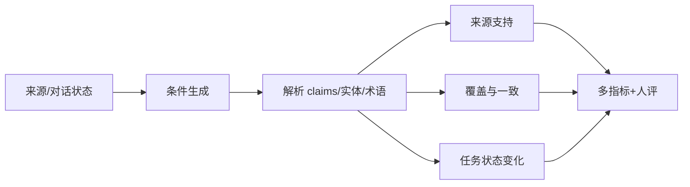

# 07 · 生成、对话、摘要与翻译

> 一句话点题：流畅度最容易被模型和评价器共同优化，却不是摘要忠实、翻译一致或对话成功的充分条件；生成评测必须回到来源与任务状态。

<div class="lesson-meta"><span>NLPF19—NLPF20—NLPF21</span><span>核心主线</span><span>预计 6 × 45 分钟</span><span>证据截止 2026-08-30</span></div>

## 解锁与跳过

掌握条件生成、证据对齐和结构校验。 即使你使用 AI 完成实现，也不能跳过本章的变量定义、反例和评测设计；这些部分决定你是否有能力发现一个“运行正常但结论错误”的系统。

## 本章可观察目标

完成后你能：区分流畅、忠实、覆盖、风格和任务成功；为摘要/翻译/对话选择可解释多指标；评测文档级一致性和真实交互闭环。阅读完成不计掌握；至少需要一次不看答案的解释、一次实际应用和一次边界判断。

## 研究问题：流畅度、忠实度、覆盖率和交互成功为什么会互相冲突？

客服摘要读起来完美，却把“用户询问退款”写成“已退款”；机器翻译每句准确但同一零件名三种译法；对话每轮有礼貌却没有完成改签。三者都要求 source-grounded 与 document/task-level 评价。

问题必须被写成“输入、状态、动作/输出、损失、约束、证据和停止条件”的组合。只写“提升效果”会把数据、算法、交互与业务结果混在一起，也无法设计反事实或消融。

## 三个知识节点怎样连接

| 节点 | 核心对象 | 最小充分解释 | 必须支持的决策 |
|---|---|---|---|
| NLPF19 | 条件生成 | 根据来源、历史或目标语言产生序列 | 生成内容受哪些证据和约束 |
| NLPF20 | 交互状态 | 对话目标、轮次状态、修复与接管共同决定成功 | 单轮好答案能否完成任务 |
| NLPF21 | 文档级一致性 | 术语、实体、指代、时间和篇章跨句保持一致 | 句级高分是否掩盖全篇冲突 |

三者不是并列名词：第一个节点通常建立对象和假设，第二个节点解释机制，第三个节点把机制放进测量或交付边界。缺任何一层，都容易把局部指标误当成系统结论。

## 核心机制：自回归生成、暴露偏差与多层评价

Teacher forcing 训练时以真实前缀预测下一个 token，推理时依赖自身输出，错误会累积。Beam、sampling 和温度改变候选分布；复制/检索能加强来源约束但不保证蕴含。评价应组合表面重叠、语义质量、claim-level 忠实、文档一致与用户任务完成。

理解机制时要区分三种量：**被设计者直接控制的变量**、**环境或数据生成过程决定的变量**、**只能通过代理指标观测的潜变量**。可靠实验一次只改变主要因子，其余配置进入版本化运行记录。

## 关键公式、假设与推导

生成概率 $p(y|x)=\prod_tp(y_t|y_{<t},x)$；ROUGE 主要测 n-gram 覆盖，COMET 学习翻译质量估计。对摘要把输出拆成 claims，忠实率 $F=|claims\ supported|/|claims|$，覆盖率 $C=|source\ facts\ covered|/|required\ facts|$；二者不可互换。

公式不是装饰。逐项检查：

- 参考答案是否唯一且完整
- 评价器是否偏爱长度/模板/同族模型
- 文档术语表和对话状态是否显式输入
- 人工评分是否双盲并测一致

若假设不成立，正确做法不是继续套公式，而是换估计量、改采样/实验设计、缩小结论或明确拒绝自动决策。

## 证据拆解1：ROUGE

### 研究问题

摘要系统能否通过与人工参考的重叠自动比较？

### 核心机制、实验与指标

ROUGE-N/L 等指标计算 n-gram 或最长公共子序列召回。

它支持大规模快速对比并长期成为摘要基准。

### 真正贡献、局限与适用边界

提供稳定低成本信号。 重叠不能判定事实支持、遗漏或新颖表达，不能单独作为发布标准。

## 证据拆解2：TransGraph

### 研究问题

文档翻译怎样测量跨句实体和术语一致性？

### 核心机制、实验与指标

工作把文档中的翻译关系构造成图，围绕跨句实体/术语连接评估全局一致。

EACL 2026 结果显示句级指标会遗漏重要文档级错误。

### 真正贡献、局限与适用边界

把翻译评价从句子平均扩展到篇章结构。 新基准覆盖和语言范围有限，图构造本身也可能带误差。

## 从论文或标准到产品主张：证据审计

| 日期 | 一手来源 | 它真正回答的问题 | 不能据此外推什么 |
|---|---|---|---|
| 2004-07-01 | ROUGE | 摘要系统能否通过与人工参考的重叠自动比较？ | 重叠不能判定事实支持、遗漏或新颖表达，不能单独作为发布标准。 |
| 2026-03-30 | TransGraph | 文档翻译怎样测量跨句实体和术语一致性？ | 新基准覆盖和语言范围有限，图构造本身也可能带误差。 |

阅读来源时按四步记录：先抄下研究对象、比较基线、数据/场景和预算，再定位结果表或正式条文；随后区分作者直接观察、由结果支持的解释和你准备迁移到项目的推论；最后为推论写一个能推翻它的反例。**来源新并不等于证据强**：预印本、公司技术报告、正式标准、法规和独立复现承担的证明责任不同。数字必须连同分母、置信区间、硬件/本体、语言/人群与失败样本一起保存。

如果来源只证明组件指标改善，不得自动升级成端到端任务、真实用户价值、物理安全或合规结论。迁移到自己的项目时至少保留一个原方法基线、一个更简单基线和一个不使用该能力的基线；结果冲突时，优先检查任务定义、样本污染、资源预算、评价器偏差和运行边界，而不是挑选最符合预期的一项。

## 机制图：从输入到可验证结果



图中每条边都应能对应日志、数据版本、物理状态或人工记录；无法观测的边必须标为假设，不允许用模型的一段解释代替真实状态。

## 贯穿案例：多轮客服摘要与跨语翻译

选 100 段含取消、否定和未决事项的会话，要求中文摘要及英文交接。把输出拆 claim，与原轮次绑定；跟踪金额、状态和产品术语跨语言一致。报告 unsupported claim、遗漏关键行动、术语漂移、人工修订时间和交接成功。

案例的重点不是跑出最高分，而是保存“为什么选择这条路径”的证据：基线是什么、哪个假设最危险、失败怎样分层、什么条件触发降级或人工接管。

## 复现任务：最小因果链

1. 冻结来源、参考与必要事实清单
2. 比较规则模板、基础生成和证据约束生成
3. 逐 claim 检查支持并追踪文档实体图
4. 让盲评者按 rubric 评分并计算一致

复现不是成功运行作者代码。你必须固定数据/环境、预算和评价器，至少重复三次，报告均值、离散程度、失败样本和资源消耗；若只能跑一次，要把结论降级为演示证据。

## 三轮实验与消融路线

**第一轮：测量链校准。** 只运行最简单基线，检查输入单位、时间/坐标/权限、随机种子、日志和评价器。抽取成功与失败样本人工复核；若真值或测量本身不稳定，停止模型比较。输出必须能回答“同一次运行能否被另一人重放”。

**第二轮：机制消融。** 在同一数据、预算、硬件或运行条件下，一次只加入一个关键机制；对每次变化写预期影响、未变化项和失败阈值。除了主指标，还要检查最坏切片、过程约束、P95/P99、资源与人工成本。若提升只在一个方便切片出现，应缩小能力声明。

**第三轮：边界与迁移。** 有计划地改变本章公式假设或 ODD：时间、人群、语言、对象、气象、本体、延迟、权限或供应商至少选择两项；注入缺失、冲突和失效。记录系统是正确拒绝/降级/接管，还是带着错误自信继续。最终产物不是“最佳分数”，而是一个可复核的能力范围、反例集和下一次变更会触发的回归集合。

## 实验与指标

| 维度 | 至少记录什么 | 为什么 |
|---|---|---|
| 任务质量 | 主指标、分层指标、置信区间和失败类型 | 平均分不能说明关键场景是否可用 |
| 系统表现 | 端到端时延、成功率、降级/拒绝和人工介入 | 局部模型分数不是用户任务结果 |
| 资源经济 | 训练/推理/标注成本、吞吐、容量与能耗 | 确认改进在真实预算下仍成立 |
| 风险运维 | 漂移、越权、事故、恢复时间和残余风险 | 把一次实验转化成可持续服务 |

同时保留一个简单基线和一个“什么都不做/人工流程”基线。复杂方案只有在质量、成本、时延、风险或可扩展性至少一个维度形成可重复净收益时才晋级。

## 对产品、系统或研究架构的影响

- 高风险摘要默认附原文证据
- 翻译维护版本化术语库
- 对话指标以任务完成/修复而非满意措辞为主
- 自动指标只作筛查并定期校准

这些决策应进入 PRD、实验卡、接口契约、安全案例或 ADR，而不只留在学习笔记。模型、数据、提示、硬件、环境与评价器任何一个升级，都要能触发有范围的回归测试。

## 会死在哪里

- 用 ROUGE 代表忠实
- 逐句翻译忽略篇章
- Judge 看不到来源却评事实
- 长答案因覆盖高被奖励
- 只测成功对话不测修复

失败分析要写“触发条件—可观测信号—影响—检测—缓解—残余风险”。只写“模型可能出错”没有工程价值。

## 与 AI 协作模板

```text
把生成输出拆成原子 claims、必要事实、实体/术语和任务状态；逐项给来源证据、忠实/覆盖/一致性判定及不确定，禁止只给总体好坏。
```

使用模板后仍需检查 AI 是否虚构来源、混用时间口径、悄悄改变任务定义，或把模拟结果外推到真实系统。

## 练习：构造一个生成评测矩阵

为摘要、翻译或对话任务准备 20 个含否定和状态变化的样本；比较至少三种输出，提交 claim 账本、文档一致图和自动指标误判案例。

提交物必须包含一个反例或失败样本。只有成功案例会让你误以为已经掌握；边界证据才能说明你知道方法何时不该用。

## 常见误区

更流畅就更好；参考答案是唯一真值；句级 BLEU/COMET 足够；对话满意度等于任务成功；Judge 可替代来源核验。共同根因是把一个条件成立时的局部结论，扩张成不带条件的能力判断。

## 自测

<Quiz question="摘要把‘尚未退款’写成‘已退款’，ROUGE 仍很高，缺少什么？" :options='["更大 beam","claim-level 来源支持与状态极性检查","更多同义词"]' :answer="1" explanation="词面覆盖无法识别关键事实状态被反转。" />

## 本章小结

- 生成质量是多目标
- claim 支持与覆盖需分开
- 篇章状态不能由句级平均替代
- 交互必须测真实任务闭环

<EvidenceTracker lesson="field-nlp-07-generation-dialogue-translation" />

## 本章完成标准

不看正文解释 流畅、忠实、覆盖与任务成功的冲突；完成 一份 claim-level 生成评测；能指出 自动重叠指标会给高分的严重错误。最近相关题平均至少 7/10 才标记为 basic；跨日期完成变式任务并达到 8.5/10，才标记为 proficient。

<div class="source-note">主要来源（证据截止 2026-08-30）：<a href="https://aclanthology.org/W04-1013/">ROUGE</a>、<a href="https://aclanthology.org/2020.emnlp-main.213/">COMET</a>、<a href="https://aclanthology.org/2026.eacl-long.75/">TransGraph 2026</a>。数字只描述来源中的实验设置；标准、法规与产品能力均按页面版本和适用范围解释。</div>
