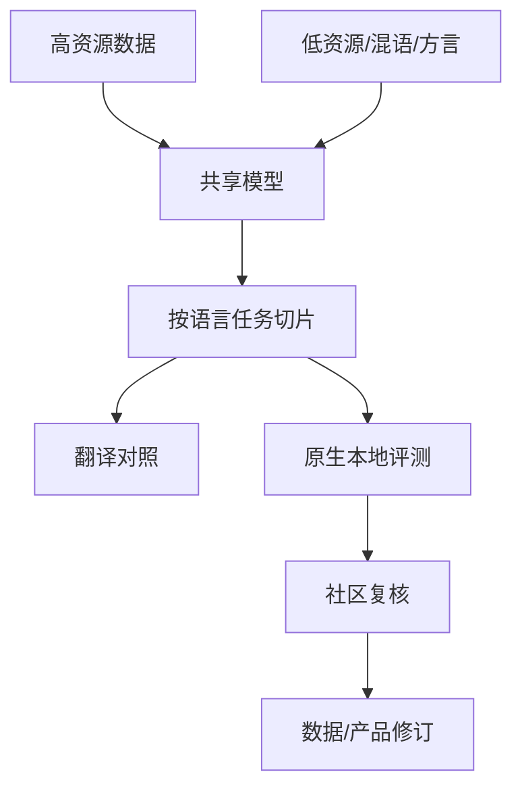

# 08 · 多语言、低资源与文化语境

> 一句话点题：语言支持不是能生成几句话，而是目标社区在自己的文本、任务、文化事实和风险下获得可验证服务，并有权指出和修正错误。

<div class="lesson-meta"><span>NLPF22—NLPF23—NLPF24</span><span>核心主线</span><span>预计 6 × 45 分钟</span><span>证据截止 2026-08-30</span></div>

## 解锁与跳过

能按语言/社群切片并审计 tokenizer 和评价器。 即使你使用 AI 完成实现，也不能跳过本章的变量定义、反例和评测设计；这些部分决定你是否有能力发现一个“运行正常但结论错误”的系统。

## 本章可观察目标

完成后你能：区分翻译迁移、跨语言对齐和本地文化有效性；评测低资源、混语、方言与地域知识；建立社区参与、数据权利与失败升级机制。阅读完成不计掌握；至少需要一次不看答案的解释、一次实际应用和一次边界判断。

## 研究问题：声称支持一种语言与真正服务该语言社区差在哪里？

一个模型在翻译基准表现不错，却把地方机构、亲属称谓和敏感礼貌关系解释错；英文翻译后答对也不说明能直接处理原语言中的混语、方言和本地事实。

问题必须被写成“输入、状态、动作/输出、损失、约束、证据和停止条件”的组合。只写“提升效果”会把数据、算法、交互与业务结果混在一起，也无法设计反事实或消融。

## 三个知识节点怎样连接

| 节点 | 核心对象 | 最小充分解释 | 必须支持的决策 |
|---|---|---|---|
| NLPF22 | 跨语言迁移 | 共享表示把高资源监督迁移到其他语言 | 迁移增益是否伴随负迁移 |
| NLPF23 | 低资源覆盖 | 数据、token 和评测稀缺共同限制能力声明 | 怎样用最小本地证据建立基线 |
| NLPF24 | 文化语境 | 事实常识、礼貌、规范和任务需求随社区变化 | 本地化是否只是翻译 UI |

三者不是并列名词：第一个节点通常建立对象和假设，第二个节点解释机制，第三个节点把机制放进测量或交付边界。缺任何一层，都容易把局部指标误当成系统结论。

## 核心机制：共享参数、语言干扰与本地效度

多语言模型通过共享子词和参数产生迁移，但数据量和梯度竞争导致高资源主导。Translate-test 引入翻译误差并抹去文化信号；直接评测要使用母语编写、当地验证的样本。MuBench 分离语言理解任务，LocQA 聚焦当地知识，二者共同限制‘支持 100 种语言’式声明。

理解机制时要区分三种量：**被设计者直接控制的变量**、**环境或数据生成过程决定的变量**、**只能通过代理指标观测的潜变量**。可靠实验一次只改变主要因子，其余配置进入版本化运行记录。

## 关键公式、假设与推导

对语言 $l$ 的迁移增益 $TG_l=M_l^{multi}-M_l^{mono/base}$，最坏语言 $M_{min}=\min_lM_l$ 比宏平均更能暴露服务缺口。采样常用 $p_l\propto n_l^\alpha$，$\alpha<1$ 提升低资源占比，但可能造成重复过拟合。

公式不是装饰。逐项检查：

- 样本是原生创作还是翻译
- 标注者与目标社群关系
- 平均分是否按语种/任务/地区展开
- 本地知识的时间有效性和争议性

若假设不成立，正确做法不是继续套公式，而是换估计量、改采样/实验设计、缩小结论或明确拒绝自动决策。

## 证据拆解1：MuBench

### 研究问题

大模型的多语言理解能否在足够广语言和任务上比较？

### 核心机制、实验与指标

基准覆盖 61 种语言、多个理解任务和约 390 万样本，按语言与能力维度测量。

作者发现模型之间和语言之间仍存在显著差距，规模不能消除低资源不均衡。

### 真正贡献、局限与适用边界

提供 2026 年大规模多语言诊断底座。 自动/现有数据聚合可能继承质量差异，分数不代表文化与真实服务完整性。

## 证据拆解2：LocQA

### 研究问题

多语言模型是否真正知道语言社区的地方性事实？

### 核心机制、实验与指标

数据由本地语境问题组成，区分可翻译的一般知识与地点/文化相关知识。

结果显示语言流利与当地知识能力明显脱钩。

### 真正贡献、局限与适用边界

把本地效度纳入多语言能力声明。 问答只能覆盖部分文化经验；知识变化和社区内部差异需持续维护。

## 从论文或标准到产品主张：证据审计

| 日期 | 一手来源 | 它真正回答的问题 | 不能据此外推什么 |
|---|---|---|---|
| 2026-05-19 | MuBench | 大模型的多语言理解能否在足够广语言和任务上比较？ | 自动/现有数据聚合可能继承质量差异，分数不代表文化与真实服务完整性。 |
| 2026-05-17 | LocQA | 多语言模型是否真正知道语言社区的地方性事实？ | 问答只能覆盖部分文化经验；知识变化和社区内部差异需持续维护。 |

阅读来源时按四步记录：先抄下研究对象、比较基线、数据/场景和预算，再定位结果表或正式条文；随后区分作者直接观察、由结果支持的解释和你准备迁移到项目的推论；最后为推论写一个能推翻它的反例。**来源新并不等于证据强**：预印本、公司技术报告、正式标准、法规和独立复现承担的证明责任不同。数字必须连同分母、置信区间、硬件/本体、语言/人群与失败样本一起保存。

如果来源只证明组件指标改善，不得自动升级成端到端任务、真实用户价值、物理安全或合规结论。迁移到自己的项目时至少保留一个原方法基线、一个更简单基线和一个不使用该能力的基线；结果冲突时，优先检查任务定义、样本污染、资源预算、评价器偏差和运行边界，而不是挑选最符合预期的一项。

## 机制图：从输入到可验证结果



图中每条边都应能对应日志、数据版本、物理状态或人工记录；无法观测的边必须标为假设，不允许用模型的一段解释代替真实状态。

## 贯穿案例：面向东南亚多语客服

选择中文、英语和两种当地语言，样本由当地客服原生编写，并保留混语。比较直接回答与 translate-test；测意图、实体、当地政策事实、礼貌风险和转人工。发布门槛使用每种语言最低分与严重错误率，不允许平均值补偿。

案例的重点不是跑出最高分，而是保存“为什么选择这条路径”的证据：基线是什么、哪个假设最危险、失败怎样分层、什么条件触发降级或人工接管。

## 复现任务：最小因果链

1. 与目标社群共同定义任务和禁用场景
2. 构造原生、翻译、混语和方言四类集合
3. 对照直接、翻译和少量本地适配
4. 母语评审严重错误并记录社区分歧

复现不是成功运行作者代码。你必须固定数据/环境、预算和评价器，至少重复三次，报告均值、离散程度、失败样本和资源消耗；若只能跑一次，要把结论降级为演示证据。

## 三轮实验与消融路线

**第一轮：测量链校准。** 只运行最简单基线，检查输入单位、时间/坐标/权限、随机种子、日志和评价器。抽取成功与失败样本人工复核；若真值或测量本身不稳定，停止模型比较。输出必须能回答“同一次运行能否被另一人重放”。

**第二轮：机制消融。** 在同一数据、预算、硬件或运行条件下，一次只加入一个关键机制；对每次变化写预期影响、未变化项和失败阈值。除了主指标，还要检查最坏切片、过程约束、P95/P99、资源与人工成本。若提升只在一个方便切片出现，应缩小能力声明。

**第三轮：边界与迁移。** 有计划地改变本章公式假设或 ODD：时间、人群、语言、对象、气象、本体、延迟、权限或供应商至少选择两项；注入缺失、冲突和失效。记录系统是正确拒绝/降级/接管，还是带着错误自信继续。最终产物不是“最佳分数”，而是一个可复核的能力范围、反例集和下一次变更会触发的回归集合。

## 实验与指标

| 维度 | 至少记录什么 | 为什么 |
|---|---|---|
| 任务质量 | 主指标、分层指标、置信区间和失败类型 | 平均分不能说明关键场景是否可用 |
| 系统表现 | 端到端时延、成功率、降级/拒绝和人工介入 | 局部模型分数不是用户任务结果 |
| 资源经济 | 训练/推理/标注成本、吞吐、容量与能耗 | 确认改进在真实预算下仍成立 |
| 风险运维 | 漂移、越权、事故、恢复时间和残余风险 | 把一次实验转化成可持续服务 |

同时保留一个简单基线和一个“什么都不做/人工流程”基线。复杂方案只有在质量、成本、时延、风险或可扩展性至少一个维度形成可重复净收益时才晋级。

## 对产品、系统或研究架构的影响

- 语言能力按任务和地区声明
- 低资源不足时优先安全缩小范围
- UI 翻译与模型本地化分开验收
- 社区反馈有报酬、授权和撤回机制

这些决策应进入 PRD、实验卡、接口契约、安全案例或 ADR，而不只留在学习笔记。模型、数据、提示、硬件、环境与评价器任何一个升级，都要能触发有范围的回归测试。

## 会死在哪里

- 把机器翻译集当本地数据
- 用宏平均掩盖最差语言
- 把国家当单一文化
- Tokenizer 覆盖当语义能力
- 高资源适配造成负迁移不复测

失败分析要写“触发条件—可观测信号—影响—检测—缓解—残余风险”。只写“模型可能出错”没有工程价值。

## 与 AI 协作模板

```text
为目标语言设计本地效度评测：区分原生/翻译、一般/地方知识、标准语/混语/方言，列母语评审流程、每语言门槛、严重错误和能力声明边界。
```

使用模板后仍需检查 AI 是否虚构来源、混用时间口径、悄悄改变任务定义，或把模拟结果外推到真实系统。

## 练习：做一个四象限跨语言试验

选两种语言各 20 条，交叉一般/本地知识与原生/翻译来源；比较直接回答和翻译链，找出至少五个翻译分高而本地效度失败的样本。

提交物必须包含一个反例或失败样本。只有成功案例会让你误以为已经掌握；边界证据才能说明你知道方法何时不该用。

## 常见误区

会翻译等于服务该语言；共享模型必然正迁移；国家等于语言社区；低资源只能等更多数据；平均多语言分能代表公平。共同根因是把一个条件成立时的局部结论，扩张成不带条件的能力判断。

## 自测

<Quiz question="模型翻译准确却持续答错当地办事流程，说明什么？" :options='["仅需增大词表","语言形式能力与地方知识/文化效度脱钩","温度过低"]' :answer="1" explanation="本地服务需要原生任务和社区证据。" />

## 本章小结

- 跨语言迁移可能正也可能负
- 原生本地评测不可被翻译替代
- 最坏语言与严重错误优先于平均分
- 社区参与属于系统机制

<EvidenceTracker lesson="field-nlp-08-multilingual-cultural" />

## 本章完成标准

不看正文解释 语言覆盖与本地效度的差异；完成 原生/翻译四象限实验；能指出 不能声称支持某语言的条件。最近相关题平均至少 7/10 才标记为 basic；跨日期完成变式任务并达到 8.5/10，才标记为 proficient。

<div class="source-note">主要来源（证据截止 2026-08-30）：<a href="https://aclanthology.org/2026.findings-acl.794/">MuBench 2026</a>、<a href="https://aclanthology.org/2026.acl-long.1344/">LocQA 2026</a>、<a href="https://aclanthology.org/2022.tacl-1.30/">FLORES-101</a>。数字只描述来源中的实验设置；标准、法规与产品能力均按页面版本和适用范围解释。</div>
