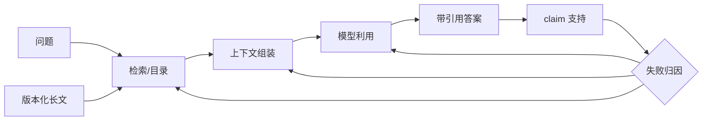

# 09 · 长上下文、检索与知识边界

> 一句话点题：长上下文是资源上限，不是能力保证；只有控制证据位置、长度、语言、密度和干扰，才能分辨找不到、没读懂与生成没遵循。

<div class="lesson-meta"><span>NLPF25—NLPF26—NLPF27</span><span>核心主线</span><span>预计 6 × 45 分钟</span><span>证据截止 2026-08-30</span></div>

## 解锁与跳过

掌握检索漏斗、生成忠实和多语言切片。 即使你使用 AI 完成实现，也不能跳过本章的变量定义、反例和评测设计；这些部分决定你是否有能力发现一个“运行正常但结论错误”的系统。

## 本章可观察目标

完成后你能：区分上下文容量、检索命中与信息利用；构造位置×长度×语言×干扰因子实验；用证据覆盖和消融决定长上下文或 RAG。阅读完成不计掌握；至少需要一次不看答案的解释、一次实际应用和一次边界判断。

## 研究问题：可放入百万 Token 是否等于能够稳定利用它们？

模型能接收 1M tokens，但审查 400 页双语招标书时漏掉中段否决条款。盲目扩大窗口会增加费用和噪声；RAG 也可能因切块丢跨页条件。需要全文、检索、结构化目录和 oracle-evidence 四组。

问题必须被写成“输入、状态、动作/输出、损失、约束、证据和停止条件”的组合。只写“提升效果”会把数据、算法、交互与业务结果混在一起，也无法设计反事实或消融。

## 三个知识节点怎样连接

| 节点 | 核心对象 | 最小充分解释 | 必须支持的决策 |
|---|---|---|---|
| NLPF25 | 上下文容量 | 接口可接收的 token 数不等于可可靠利用的信息量 | 有效长度如何测 |
| NLPF26 | 检索增强 | 外部检索把相关证据压缩进模型条件 | 召回与利用哪个是瓶颈 |
| NLPF27 | 长文诊断 | 位置、密度、顺序、语言和干扰共同影响利用 | 怎样定位失败层 |

三者不是并列名词：第一个节点通常建立对象和假设，第二个节点解释机制，第三个节点把机制放进测量或交付边界。缺任何一层，都容易把局部指标误当成系统结论。

## 核心机制：注意力竞争、检索瓶颈与有效上下文

位置编码允许外推不代表训练分布覆盖；大量干扰文档会争夺注意力。RAG 将问题映射到候选块，瓶颈可分为 corpus、chunk、retrieval、rerank、context assembly 与 answer utilization。Oracle evidence 能把检索误差从利用误差中分离。

理解机制时要区分三种量：**被设计者直接控制的变量**、**环境或数据生成过程决定的变量**、**只能通过代理指标观测的潜变量**。可靠实验一次只改变主要因子，其余配置进入版本化运行记录。

## 关键公式、假设与推导

端到端正确率可分解近似 $P(correct)=P(recall)P(use\ correct|recalled)P(generate\ faithful|used)$。MLRBench 的思路是测有效利用而非声明窗口；实验矩阵令 $Y=f(position,length,language,density,distractor,model)$ 并报告交互效应。

公式不是装饰。逐项检查：

- 证据是否完整落在一个 chunk
- 关键条件是单点还是跨段组合
- 输入长度用各语言真实 token 计量
- Judge 是否也会随长度失效

若假设不成立，正确做法不是继续套公式，而是换估计量、改采样/实验设计、缩小结论或明确拒绝自动决策。

## 证据拆解1：Lost in the Middle

### 研究问题

相关信息在长上下文中的位置会影响使用吗？

### 核心机制、实验与指标

控制相关文档在开头、中间和末尾的位置，测试多文档问答与键值检索。

模型常在开头/末尾更好，中间显著下降，展示非均匀位置利用。

### 真正贡献、局限与适用边界

建立长上下文位置压力测试范式。 模型代际已变化，具体曲线必须在当前模型和真实任务复测。

## 证据拆解2：MLRBench

### 研究问题

现代模型在多语言长上下文中实际利用多少？

### 核心机制、实验与指标

覆盖 7 种语言，通过可控长度、位置和任务测有效阅读而非 API 容量。

研究报告多种模型的有效能力常低于标称上下文的 30%，并存在语言差异。

### 真正贡献、局限与适用边界

提供截至 2026 的多语言长上下文反证。 基准任务与模型列表有限；30% 是实验结果而非所有系统常数。

## 从论文或标准到产品主张：证据审计

| 日期 | 一手来源 | 它真正回答的问题 | 不能据此外推什么 |
|---|---|---|---|
| 2023-07-06 | Lost in the Middle | 相关信息在长上下文中的位置会影响使用吗？ | 模型代际已变化，具体曲线必须在当前模型和真实任务复测。 |
| 2026-03-31 | MLRBench | 现代模型在多语言长上下文中实际利用多少？ | 基准任务与模型列表有限；30% 是实验结果而非所有系统常数。 |

阅读来源时按四步记录：先抄下研究对象、比较基线、数据/场景和预算，再定位结果表或正式条文；随后区分作者直接观察、由结果支持的解释和你准备迁移到项目的推论；最后为推论写一个能推翻它的反例。**来源新并不等于证据强**：预印本、公司技术报告、正式标准、法规和独立复现承担的证明责任不同。数字必须连同分母、置信区间、硬件/本体、语言/人群与失败样本一起保存。

如果来源只证明组件指标改善，不得自动升级成端到端任务、真实用户价值、物理安全或合规结论。迁移到自己的项目时至少保留一个原方法基线、一个更简单基线和一个不使用该能力的基线；结果冲突时，优先检查任务定义、样本污染、资源预算、评价器偏差和运行边界，而不是挑选最符合预期的一项。

## 机制图：从输入到可验证结果



图中每条边都应能对应日志、数据版本、物理状态或人工记录；无法观测的边必须标为假设，不允许用模型的一段解释代替真实状态。

## 贯穿案例：双语招标书否决条款审查

将关键条款系统移动到 10/50/90% 位置，长度从 8K 到目标上限，加入相似旧版干扰。比较全文、RAG、层级摘要和 oracle evidence；按中英分别报告召回、利用、引用支持、P95 和单位文档成本。

案例的重点不是跑出最高分，而是保存“为什么选择这条路径”的证据：基线是什么、哪个假设最危险、失败怎样分层、什么条件触发降级或人工接管。

## 复现任务：最小因果链

1. 构造位置×长度×语言×干扰全因子子集
2. 建立 no-context 与 oracle-evidence 上下界
3. 逐层记录召回、重排、组装、利用和生成
4. 对跨块条件、表格和旧版本做专项难例

复现不是成功运行作者代码。你必须固定数据/环境、预算和评价器，至少重复三次，报告均值、离散程度、失败样本和资源消耗；若只能跑一次，要把结论降级为演示证据。

## 三轮实验与消融路线

**第一轮：测量链校准。** 只运行最简单基线，检查输入单位、时间/坐标/权限、随机种子、日志和评价器。抽取成功与失败样本人工复核；若真值或测量本身不稳定，停止模型比较。输出必须能回答“同一次运行能否被另一人重放”。

**第二轮：机制消融。** 在同一数据、预算、硬件或运行条件下，一次只加入一个关键机制；对每次变化写预期影响、未变化项和失败阈值。除了主指标，还要检查最坏切片、过程约束、P95/P99、资源与人工成本。若提升只在一个方便切片出现，应缩小能力声明。

**第三轮：边界与迁移。** 有计划地改变本章公式假设或 ODD：时间、人群、语言、对象、气象、本体、延迟、权限或供应商至少选择两项；注入缺失、冲突和失效。记录系统是正确拒绝/降级/接管，还是带着错误自信继续。最终产物不是“最佳分数”，而是一个可复核的能力范围、反例集和下一次变更会触发的回归集合。

## 实验与指标

| 维度 | 至少记录什么 | 为什么 |
|---|---|---|
| 任务质量 | 主指标、分层指标、置信区间和失败类型 | 平均分不能说明关键场景是否可用 |
| 系统表现 | 端到端时延、成功率、降级/拒绝和人工介入 | 局部模型分数不是用户任务结果 |
| 资源经济 | 训练/推理/标注成本、吞吐、容量与能耗 | 确认改进在真实预算下仍成立 |
| 风险运维 | 漂移、越权、事故、恢复时间和残余风险 | 把一次实验转化成可持续服务 |

同时保留一个简单基线和一个“什么都不做/人工流程”基线。复杂方案只有在质量、成本、时延、风险或可扩展性至少一个维度形成可重复净收益时才晋级。

## 对产品、系统或研究架构的影响

- 长文默认分层导航加检索
- 标称窗口不进入能力宣传
- 上下文组装保留章节/页码/版本
- 按失败层决定改 chunk、检索还是模型

这些决策应进入 PRD、实验卡、接口契约、安全案例或 ADR，而不只留在学习笔记。模型、数据、提示、硬件、环境与评价器任何一个升级，都要能触发有范围的回归测试。

## 会死在哪里

- 只做 needle 单点检索
- 答案对但引用错仍算成功
- 把 oracle 结果当真实 RAG
- 忽略语言 token 差异
- Judge 与被测模型同样读不完

失败分析要写“触发条件—可观测信号—影响—检测—缓解—残余风险”。只写“模型可能出错”没有工程价值。

## 与 AI 协作模板

```text
设计长上下文压力测试：位置 10/50/90%、至少三档长度、两种语言、相关/旧版干扰、跨块组合；加入 no-context、RAG、全文、oracle，并分解召回—利用—忠实。
```

使用模板后仍需检查 AI 是否虚构来源、混用时间口径、悄悄改变任务定义，或把模拟结果外推到真实系统。

## 练习：测出真实有效上下文

用一份长文构造 24 个控制样本，移动相同证据并加入干扰；画准确率/支持率随位置与长度变化，给出选全文还是 RAG 的决策。

提交物必须包含一个反例或失败样本。只有成功案例会让你误以为已经掌握；边界证据才能说明你知道方法何时不该用。

## 常见误区

窗口大小等于阅读能力；RAG 只要召回率高即可；needle 测试代表复杂推理；更多上下文不会伤害；引用存在就算有依据。共同根因是把一个条件成立时的局部结论，扩张成不带条件的能力判断。

## 自测

<Quiz question="Oracle evidence 正确率高、真实 RAG 低，优先修哪层？" :options='["生成温度","检索/分块/重排链","扩大模型参数"]' :answer="1" explanation="oracle 已证明模型在给定证据时能用，主要瓶颈在证据到达前。" />

## 本章小结

- 容量与有效利用分离
- 位置和语言必须压力测试
- oracle 分离检索与利用瓶颈
- 端到端答案需 claim 证据支持

<EvidenceTracker lesson="field-nlp-09-long-context-retrieval" />

## 本章完成标准

不看正文解释 长上下文三段概率分解；完成 一个全因子压力测试；能指出 标称窗口不能支持的能力声明。最近相关题平均至少 7/10 才标记为 basic；跨日期完成变式任务并达到 8.5/10，才标记为 proficient。

<div class="source-note">主要来源（证据截止 2026-08-30）：<a href="https://aclanthology.org/2024.tacl-1.9/">Lost in the Middle</a>、<a href="https://aclanthology.org/2026.eacl-long.290/">MLRBench 2026</a>、<a href="https://arxiv.org/abs/2005.11401">RAG</a>。数字只描述来源中的实验设置；标准、法规与产品能力均按页面版本和适用范围解释。</div>
