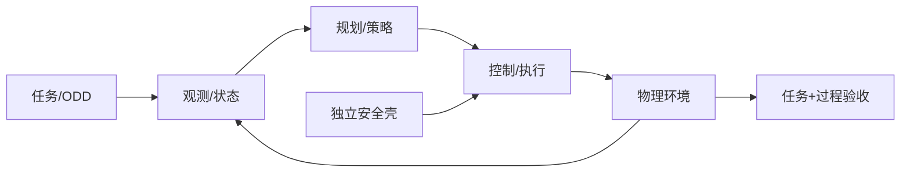

# 01 · 机器人系统、具身与任务闭环

> 一句话点题：机器人能力不是视频中的任务终点，而是在指定本体和环境中，以可重复、过程安全、可恢复的闭环完成任务。

<div class="lesson-meta"><span>RBF01—RBF02—RBF03</span><span>核心主线</span><span>预计 6 × 45 分钟</span><span>证据截止 2026-08-30</span></div>

## 解锁与跳过

选一个可在仿真或安全台架完成的真实任务，不要求先有机器人；先限定本体、环境和危险。 即使你使用 AI 完成实现，也不能跳过本章的变量定义、反例和评测设计；这些部分决定你是否有能力发现一个“运行正常但结论错误”的系统。

## 本章可观察目标

完成后你能：把自然语言目标写成状态、动作、约束和验收；分离本体、智能、环境与安全边界；建立遥控/脚本/经典规划三层基线。阅读完成不计掌握；至少需要一次不看答案的解释、一次实际应用和一次边界判断。

## 研究问题：同一个“收拾桌面”目标怎样落到本体、环境、动作和验收？

‘收拾桌面’需定义哪些物体、放哪里、允许移动什么、人体/宠物出现如何处理、夹持力和碰撞上限。若只给成功/失败，模型可能把易碎物推落后仍因桌面变空获高奖励。

问题必须被写成“输入、状态、动作/输出、损失、约束、证据和停止条件”的组合。只写“提升效果”会把数据、算法、交互与业务结果混在一起，也无法设计反事实或消融。

## 三个知识节点怎样连接

| 节点 | 核心对象 | 最小充分解释 | 必须支持的决策 |
|---|---|---|---|
| RBF01 | 机器人闭环 | 感知—估计—规划—控制—环境反馈持续耦合 | 失败由哪层产生 |
| RBF02 | 具身与可供性 | 本体形态、传感和动作决定可观察/可执行关系 | 同一任务能否跨本体定义 |
| RBF03 | 任务与安全边界 | 目标、ODD、成功、过程约束和终止组成合同 | 哪些状态必须由独立安全系统阻止 |

三者不是并列名词：第一个节点通常建立对象和假设，第二个节点解释机制，第三个节点把机制放进测量或交付边界。缺任何一层，都容易把局部指标误当成系统结论。

## 核心机制：任务闭环与分层责任

任务状态 $s$ 包含机器人、对象、环境、人和安全模式；策略给动作/子目标，控制器执行并反馈。开放学习模块只在 ODD 和动作权限内工作，安全 PLC/监视器独立限制速度、力与区域。基线从人工遥控上界、确定脚本、经典感知规划到学习策略逐层比较。

理解机制时要区分三种量：**被设计者直接控制的变量**、**环境或数据生成过程决定的变量**、**只能通过代理指标观测的潜变量**。可靠实验一次只改变主要因子，其余配置进入版本化运行记录。

## 关键公式、假设与推导

任务定义为 POMDP $(S,A,O,T,R,\gamma)$，但工程验收另加约束 $g_i(s,a)\le0$ 与终止集合。总体成功需报告 $P(success\land safe)$、过程严重事件和置信区间，而非筛选视频。

公式不是装饰。逐项检查：

- 观测与真实状态区分
- 奖励是否存在捷径
- 本体/工具配置是否版本化
- 人或易碎物进入时的独立停止

若假设不成立，正确做法不是继续套公式，而是换估计量、改采样/实验设计、缩小结论或明确拒绝自动决策。

## 证据拆解1：NIST Robotics Test Facility

### 研究问题

机器人怎样通过可重复测试而非演示评价？

### 核心机制、实验与指标

NIST 设施开发标准化测试方法、测量和场景，用于性能与应急/工业机器人评价。

公开测试能力强调任务、环境和测量可复现。

### 真正贡献、局限与适用边界

为课程的基准装置与过程指标提供权威入口。 设施测试并不覆盖所有家庭/开放世界风险，需按 ODD 扩展。

## 证据拆解2：ISO Robotics Sector

### 研究问题

机器人国际标准覆盖哪些安全和性能层？

### 核心机制、实验与指标

ISO 官方页面汇集工业、服务和性能测试等机器人标准，包括 2025/2026 新版本。

显示机器人安全是持续演进的系统标准族。

### 真正贡献、局限与适用边界

支持从第一章即建立标准台账。 概览不能替代购买/阅读适用标准正文。

## 从论文或标准到产品主张：证据审计

| 日期 | 一手来源 | 它真正回答的问题 | 不能据此外推什么 |
|---|---|---|---|
| 2026-08-30 | NIST Robotics Test Facility | 机器人怎样通过可重复测试而非演示评价？ | 设施测试并不覆盖所有家庭/开放世界风险，需按 ODD 扩展。 |
| 2026-08-30 | ISO Robotics Sector | 机器人国际标准覆盖哪些安全和性能层？ | 概览不能替代购买/阅读适用标准正文。 |

阅读来源时按四步记录：先抄下研究对象、比较基线、数据/场景和预算，再定位结果表或正式条文；随后区分作者直接观察、由结果支持的解释和你准备迁移到项目的推论；最后为推论写一个能推翻它的反例。**来源新并不等于证据强**：预印本、公司技术报告、正式标准、法规和独立复现承担的证明责任不同。数字必须连同分母、置信区间、硬件/本体、语言/人群与失败样本一起保存。

如果来源只证明组件指标改善，不得自动升级成端到端任务、真实用户价值、物理安全或合规结论。迁移到自己的项目时至少保留一个原方法基线、一个更简单基线和一个不使用该能力的基线；结果冲突时，优先检查任务定义、样本污染、资源预算、评价器偏差和运行边界，而不是挑选最符合预期的一项。

## 机制图：从输入到可验证结果



图中每条边都应能对应日志、数据版本、物理状态或人工记录；无法观测的边必须标为假设，不允许用模型的一段解释代替真实状态。

## 贯穿案例：桌面分类与收纳

限定 10 类刚性物体、固定桌面和两种容器；成功要求对象正确放置且无超力/碰撞。人在工作区即减速/停止；异常分感知、抓取、规划、控制和恢复。比较遥控、脚本视觉和学习策略各 50 回合。

案例的重点不是跑出最高分，而是保存“为什么选择这条路径”的证据：基线是什么、哪个假设最危险、失败怎样分层、什么条件触发降级或人工接管。

## 复现任务：最小因果链

1. 写任务、ODD、对象/人体和安全终止
2. 建立三层基线与随机种子/配置
3. 至少 30 回合报告 Wilson 区间和过程事件
4. 逐失败回放 trace 并归因到层

复现不是成功运行作者代码。你必须固定数据/环境、预算和评价器，至少重复三次，报告均值、离散程度、失败样本和资源消耗；若只能跑一次，要把结论降级为演示证据。

## 三轮实验与消融路线

**第一轮：测量链校准。** 只运行最简单基线，检查输入单位、时间/坐标/权限、随机种子、日志和评价器。抽取成功与失败样本人工复核；若真值或测量本身不稳定，停止模型比较。输出必须能回答“同一次运行能否被另一人重放”。

**第二轮：机制消融。** 在同一数据、预算、硬件或运行条件下，一次只加入一个关键机制；对每次变化写预期影响、未变化项和失败阈值。除了主指标，还要检查最坏切片、过程约束、P95/P99、资源与人工成本。若提升只在一个方便切片出现，应缩小能力声明。

**第三轮：边界与迁移。** 有计划地改变本章公式假设或 ODD：时间、人群、语言、对象、气象、本体、延迟、权限或供应商至少选择两项；注入缺失、冲突和失效。记录系统是正确拒绝/降级/接管，还是带着错误自信继续。最终产物不是“最佳分数”，而是一个可复核的能力范围、反例集和下一次变更会触发的回归集合。

## 实验与指标

| 维度 | 至少记录什么 | 为什么 |
|---|---|---|
| 任务 | 成功率、完成时间、部分进展与恢复 | 一次漂亮成功不能表示可靠性 |
| 过程 | 碰撞/力/间隔/约束违例和人工接管 | 结果正确也可能过程危险 |
| 泛化 | 对象、场景、语言、本体和扰动切片 | 平均分不说明分布外边界 |
| 系统 | 控制频率、P95、算力、数据/人工和能耗 | 策略必须在真实闭环预算运行 |

同时保留一个简单基线和一个“什么都不做/人工流程”基线。复杂方案只有在质量、成本、时延、风险或可扩展性至少一个维度形成可重复净收益时才晋级。

## 对产品、系统或研究架构的影响

- 自然语言目标必须转成机器验收
- 安全停止不由策略绕过
- 演示视频附完整回合分母
- 本体/场景变化触发范围回归

这些决策应进入 PRD、实验卡、接口契约、安全案例或 ADR，而不只留在学习笔记。模型、数据、提示、硬件、环境与评价器任何一个升级，都要能触发有范围的回归测试。

## 会死在哪里

- 挑选成功视频
- 奖励只看终点
- 不同本体结果直接比较
- 把碰撞后成功算正常
- 人工接管不计成本

失败分析要写“触发条件—可观测信号—影响—检测—缓解—残余风险”。只写“模型可能出错”没有工程价值。

## 与 AI 协作模板

```text
把机器人需求拆成 POMDP/任务合同：本体、工具、环境、对象、人、观测、动作、成功、过程安全、终止、恢复和三层基线；禁止用视频或单回合证明能力。
```

使用模板后仍需检查 AI 是否虚构来源、混用时间口径、悄悄改变任务定义，或把模拟结果外推到真实系统。

## 练习：写一个可复现实验任务卡

为桌面/移动任务定义 20 个初始状态、过程约束和失败本体；即使用仿真也要运行三种基线并提交全部回合。

提交物必须包含一个反例或失败样本。只有成功案例会让你误以为已经掌握；边界证据才能说明你知道方法何时不该用。

## 常见误区

会说就会做；终点成功覆盖过程危险；更多自由度总更强；仿真成功等于真实成功；遥控不算有用基线。共同根因是把一个条件成立时的局部结论，扩张成不带条件的能力判断。

## 自测

<Quiz question="机器人把易碎物推落后完成桌面清空，奖励很高，核心问题？" :options='["控制频率低","任务奖励/过程约束定义错误","相机像素少"]' :answer="1" explanation="任务必须同时编码目标与不可接受过程。" />

## 本章小结

- 能力绑定本体与 ODD
- 任务成功和过程安全并列
- 独立安全壳限制开放策略
- 全回合证据替代演示

<EvidenceTracker lesson="field-robotics-01-embodiment-system" />

## 本章完成标准

不看正文解释 具身任务合同的组成；完成 一份含过程约束的实验卡；能指出 视频无法支持的能力主张。最近相关题平均至少 7/10 才标记为 basic；跨日期完成变式任务并达到 8.5/10，才标记为 proficient。

<div class="source-note">主要来源（证据截止 2026-08-30）：<a href="https://www.nist.gov/laboratories/tools-instruments/robotics-test-facility">NIST Robotics Test Facility</a>、<a href="https://www.iso.org/cms/live/live/en/sites/isoorg/home/sectors/engineering/robotics.html">ISO Robotics</a>。数字只描述来源中的实验设置；标准、法规与产品能力均按页面版本和适用范围解释。</div>
