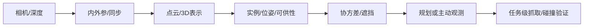

# 04 · 感知、三维表示与状态估计

> 一句话点题：二维识别准确不等于机器人能动作；操作需要度量三维、坐标一致、遮挡下不确定与面向任务的可供性。

<div class="lesson-meta"><span>RBF10—RBF11—RBF12</span><span>核心主线</span><span>预计 6 × 45 分钟</span><span>证据截止 2026-08-30</span></div>

## 解锁与跳过

掌握坐标变换和不确定性。 即使你使用 AI 完成实现，也不能跳过本章的变量定义、反例和评测设计；这些部分决定你是否有能力发现一个“运行正常但结论错误”的系统。

## 本章可观察目标

完成后你能：完成相机/深度/机器人手眼标定；区分检测、三维几何和可操作状态；量化遮挡、域移和位姿协方差。阅读完成不计掌握；至少需要一次不看答案的解释、一次实际应用和一次边界判断。

## 研究问题：二维识别准确为什么不足以支持安全抓取和移动？

检测框稳定但手眼外参偏 8 mm，抓取持续失败；3DGS 渲染逼真却碰撞几何有浮层。必须把感知误差传播到抓取/导航结果。

问题必须被写成“输入、状态、动作/输出、损失、约束、证据和停止条件”的组合。只写“提升效果”会把数据、算法、交互与业务结果混在一起，也无法设计反事实或消融。

## 三个知识节点怎样连接

| 节点 | 核心对象 | 最小充分解释 | 必须支持的决策 |
|---|---|---|---|
| RBF10 | 传感标定 | 内参、外参、时间和手眼变换决定观测坐标 | 像素如何可信落到机器人 frame |
| RBF11 | 三维表示 | 点云、体素、mesh、隐式/高斯表示编码几何/外观 | 任务需要可碰撞还是可渲染表示 |
| RBF12 | 任务状态估计 | 对象位姿、可供性、人体和接触状态带不确定度 | 规划何时应主动观测或拒绝 |

三者不是并列名词：第一个节点通常建立对象和假设，第二个节点解释机制，第三个节点把机制放进测量或交付边界。缺任何一层，都容易把局部指标误当成系统结论。

## 核心机制：从光线到任务状态

标定恢复相机模型和 $T_{base}^{camera}$；深度/多视角产生点云并配准。PointNet 类直接聚合点集，3DGS 优化可微高斯用于新视角渲染。机器人还需实例、6D 位姿、支撑/可抓区域和人体动态；主动感知通过移动相机减少关键不确定。

理解机制时要区分三种量：**被设计者直接控制的变量**、**环境或数据生成过程决定的变量**、**只能通过代理指标观测的潜变量**。可靠实验一次只改变主要因子，其余配置进入版本化运行记录。

## 关键公式、假设与推导

投影 $p\sim K[R|t]P$；手眼 $AX=XB$。位姿协方差经 Jacobian 传播 $\Sigma_y=J\Sigma_xJ^T$。评测除 IoU/mAP，还需 ADD-S、抓取成功、碰撞几何误差和 calibration error。

公式不是装饰。逐项检查：

- 标定与任务工作空间是否一致
- 深度空洞/反光/透明物
- 时间同步对动态人/手影响
- 渲染质量与几何精度分开

若假设不成立，正确做法不是继续套公式，而是换估计量、改采样/实验设计、缩小结论或明确拒绝自动决策。

## 证据拆解1：PointNet

### 研究问题

神经网络如何直接处理无序点集？

### 核心机制、实验与指标

对点独立编码后用对称池化获得置换不变全局表示。

在分类/分割任务展示强基线。

### 真正贡献、局限与适用边界

奠定点云深度学习范式。 全局池化对局部几何有限，任务级位姿/安全仍需专门验证。

## 证据拆解2：3D Gaussian Splatting

### 研究问题

怎样实时渲染高质量辐射场？

### 核心机制、实验与指标

用显式 3D 高斯及可微 splatting 优化场景。

报告高质量实时新视角合成。

### 真正贡献、局限与适用边界

推动机器人世界表示与合成数据。 渲染逼真不保证碰撞、材质或动力学正确。

## 从论文或标准到产品主张：证据审计

| 日期 | 一手来源 | 它真正回答的问题 | 不能据此外推什么 |
|---|---|---|---|
| 2017-04-10 | PointNet | 神经网络如何直接处理无序点集？ | 全局池化对局部几何有限，任务级位姿/安全仍需专门验证。 |
| 2023-08-08 | 3D Gaussian Splatting | 怎样实时渲染高质量辐射场？ | 渲染逼真不保证碰撞、材质或动力学正确。 |

阅读来源时按四步记录：先抄下研究对象、比较基线、数据/场景和预算，再定位结果表或正式条文；随后区分作者直接观察、由结果支持的解释和你准备迁移到项目的推论；最后为推论写一个能推翻它的反例。**来源新并不等于证据强**：预印本、公司技术报告、正式标准、法规和独立复现承担的证明责任不同。数字必须连同分母、置信区间、硬件/本体、语言/人群与失败样本一起保存。

如果来源只证明组件指标改善，不得自动升级成端到端任务、真实用户价值、物理安全或合规结论。迁移到自己的项目时至少保留一个原方法基线、一个更简单基线和一个不使用该能力的基线；结果冲突时，优先检查任务定义、样本污染、资源预算、评价器偏差和运行边界，而不是挑选最符合预期的一项。

## 机制图：从输入到可验证结果



图中每条边都应能对应日志、数据版本、物理状态或人工记录；无法观测的边必须标为假设，不允许用模型的一段解释代替真实状态。

## 贯穿案例：透明/反光物抓取感知

标定手眼后，对普通、透明、反光和遮挡物测试 RGB-D/多视角。报告检测、位姿、协方差覆盖和最终抓取，不可观测时移动相机或拒绝。对 3DGS 渲染与真实碰撞 mesh 分开维护。

案例的重点不是跑出最高分，而是保存“为什么选择这条路径”的证据：基线是什么、哪个假设最危险、失败怎样分层、什么条件触发降级或人工接管。

## 复现任务：最小因果链

1. 做 reprojection/手眼闭环标定
2. 用独立真值测 6D 位姿和协方差
3. 按材质/遮挡/光照/距离切片
4. 将位姿扰动注入规划测任务敏感性

复现不是成功运行作者代码。你必须固定数据/环境、预算和评价器，至少重复三次，报告均值、离散程度、失败样本和资源消耗；若只能跑一次，要把结论降级为演示证据。

## 三轮实验与消融路线

**第一轮：测量链校准。** 只运行最简单基线，检查输入单位、时间/坐标/权限、随机种子、日志和评价器。抽取成功与失败样本人工复核；若真值或测量本身不稳定，停止模型比较。输出必须能回答“同一次运行能否被另一人重放”。

**第二轮：机制消融。** 在同一数据、预算、硬件或运行条件下，一次只加入一个关键机制；对每次变化写预期影响、未变化项和失败阈值。除了主指标，还要检查最坏切片、过程约束、P95/P99、资源与人工成本。若提升只在一个方便切片出现，应缩小能力声明。

**第三轮：边界与迁移。** 有计划地改变本章公式假设或 ODD：时间、人群、语言、对象、气象、本体、延迟、权限或供应商至少选择两项；注入缺失、冲突和失效。记录系统是正确拒绝/降级/接管，还是带着错误自信继续。最终产物不是“最佳分数”，而是一个可复核的能力范围、反例集和下一次变更会触发的回归集合。

## 实验与指标

| 维度 | 至少记录什么 | 为什么 |
|---|---|---|
| 任务 | 成功率、完成时间、部分进展与恢复 | 一次漂亮成功不能表示可靠性 |
| 过程 | 碰撞/力/间隔/约束违例和人工接管 | 结果正确也可能过程危险 |
| 泛化 | 对象、场景、语言、本体和扰动切片 | 平均分不说明分布外边界 |
| 系统 | 控制频率、P95、算力、数据/人工和能耗 | 策略必须在真实闭环预算运行 |

同时保留一个简单基线和一个“什么都不做/人工流程”基线。复杂方案只有在质量、成本、时延、风险或可扩展性至少一个维度形成可重复净收益时才晋级。

## 对产品、系统或研究架构的影响

- 感知输出 frame/time/covariance
- 可渲染与可碰撞资产分层
- 关键遮挡触发主动感知
- 外参变化触发全链回归

这些决策应进入 PRD、实验卡、接口契约、安全案例或 ADR，而不只留在学习笔记。模型、数据、提示、硬件、环境与评价器任何一个升级，都要能触发有范围的回归测试。

## 会死在哪里

- mAP 高就抓得准
- 忽略手眼误差
- 3DGS 当真实几何
- 静态精度外推动态人
- 不确定度无校准

失败分析要写“触发条件—可观测信号—影响—检测—缓解—残余风险”。只写“模型可能出错”没有工程价值。

## 与 AI 协作模板

```text
审计机器人感知链：内参/外参/手眼/同步、3D 表示用途、对象位姿与协方差；按材质/遮挡/光照切片，并把误差传播到抓取/碰撞。
```

使用模板后仍需检查 AI 是否虚构来源、混用时间口径、悄悄改变任务定义，或把模拟结果外推到真实系统。

## 练习：做一次手眼误差传播

给外参添加 1—10 mm/0.5—3° 偏差，仿真或实测抓取点误差和成功率；找出需要重标定的门槛。

提交物必须包含一个反例或失败样本。只有成功案例会让你误以为已经掌握；边界证据才能说明你知道方法何时不该用。

## 常见误区

2D 检测足以操作；渲染逼真等于物理正确；多视角消除所有遮挡；协方差越小越好；标定一次永久有效。共同根因是把一个条件成立时的局部结论，扩张成不带条件的能力判断。

## 自测

<Quiz question="物体检测稳定但抓取有固定方向偏差，首查什么？" :options='["语言模型","手眼/外参与坐标变换","奖励温度"]' :answer="1" explanation="系统性几何偏差常来自标定链。" />

## 本章小结

- 标定连接像素与动作
- 三维表示按用途选择
- 任务状态必须带不确定度
- 感知以最终物理任务验收

<EvidenceTracker lesson="field-robotics-04-perception-state" />

## 本章完成标准

不看正文解释 渲染表示与碰撞几何的差异；完成 手眼误差传播报告；能指出 应主动观测/拒绝的遮挡。最近相关题平均至少 7/10 才标记为 basic；跨日期完成变式任务并达到 8.5/10，才标记为 proficient。

<div class="source-note">主要来源（证据截止 2026-08-30）：<a href="https://arxiv.org/abs/1612.00593">PointNet</a>、<a href="https://arxiv.org/abs/2308.04079">3D Gaussian Splatting</a>。数字只描述来源中的实验设置；标准、法规与产品能力均按页面版本和适用范围解释。</div>
