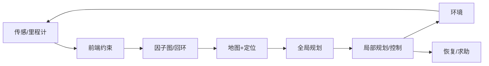

# 05 · SLAM、导航与移动自主

> 一句话点题：导航成功率是感知、估计、地图、规划、控制和恢复的乘积；单次无碰到达掩盖定位漂移与地图污染。

<div class="lesson-meta"><span>RBF13—RBF14—RBF15</span><span>核心主线</span><span>预计 6 × 45 分钟</span><span>证据截止 2026-08-30</span></div>

## 解锁与跳过

完成三维状态估计和反馈控制。 即使你使用 AI 完成实现，也不能跳过本章的变量定义、反例和评测设计；这些部分决定你是否有能力发现一个“运行正常但结论错误”的系统。

## 本章可观察目标

完成后你能：解释前端里程计、后端优化和回环；连接地图/定位/全局局部规划/控制；构造可复位、可恢复导航基准。阅读完成不计掌握；至少需要一次不看答案的解释、一次实际应用和一次边界判断。

## 研究问题：地图、定位、规划和控制的误差如何沿闭环传播？

仓库机器人平均可达率高，但长走廊感知退化后错位，局部规划器在动态叉车旁振荡。若只调一个 costmap 参数，会掩盖 SLAM 与行为树的耦合。

问题必须被写成“输入、状态、动作/输出、损失、约束、证据和停止条件”的组合。只写“提升效果”会把数据、算法、交互与业务结果混在一起，也无法设计反事实或消融。

## 三个知识节点怎样连接

| 节点 | 核心对象 | 最小充分解释 | 必须支持的决策 |
|---|---|---|---|
| RBF13 | SLAM | 联合估计轨迹和地图并管理数据关联 | 地图是否一致且可复定位 |
| RBF14 | 导航栈 | 全局路径、局部避障和控制闭环协同 | 错误在哪层传播 |
| RBF15 | 恢复与主动 SLAM | 系统主动获取信息并从定位/规划失败恢复 | 何时清图、重定位或求助 |

三者不是并列名词：第一个节点通常建立对象和假设，第二个节点解释机制，第三个节点把机制放进测量或交付边界。缺任何一层，都容易把局部指标误当成系统结论。

## 核心机制：因子图、代价地图与恢复状态机

前端产生视觉/激光/轮速约束，后端因子图优化轨迹并用回环纠漂。导航在静态/动态代价地图上全局搜索，局部规划满足动力学；行为树组织清障、重规划、后退、重定位和求助。Active SLAM 兼顾目标进展与信息增益。

理解机制时要区分三种量：**被设计者直接控制的变量**、**环境或数据生成过程决定的变量**、**只能通过代理指标观测的潜变量**。可靠实验一次只改变主要因子，其余配置进入版本化运行记录。

## 关键公式、假设与推导

MAP 估计 $x^*=\arg\min_x\sum_i\|r_i(x)\|_{\Sigma_i}^{2}$；路径代价含距离、碰撞风险、时间和不确定。导航报告 SPL、碰撞/近失、重定位、恢复成功和地图一致。

公式不是装饰。逐项检查：

- 回环假阳性代价
- 动态对象是否进入静态地图
- 里程计/地图 frame 语义
- 重置间任务是否独立

若假设不成立，正确做法不是继续套公式，而是换估计量、改采样/实验设计、缩小结论或明确拒绝自动决策。

## 证据拆解1：ORB-SLAM3

### 研究问题

视觉/惯性 SLAM 如何覆盖多地图和重定位？

### 核心机制、实验与指标

系统整合单目/双目/RGB-D 与视觉惯性，并支持 Atlas 多地图。

论文在多数据集展示强精度与鲁棒性。

### 真正贡献、局限与适用边界

提供现代开源 SLAM 基线。 公开数据不覆盖所有仓库动态/无纹理/长期变化，需本地复测。

## 证据拆解2：Nav2 Documentation

### 研究问题

ROS 2 导航怎样组织规划、控制和恢复？

### 核心机制、实验与指标

官方文档描述 planners、controllers、costmaps、behavior trees 与生命周期节点。

形成可运行模块化导航栈。

### 真正贡献、局限与适用边界

适合做分层消融。 配置示例不是产品安全证明，实时/硬件/人机风险需另验。

## 从论文或标准到产品主张：证据审计

| 日期 | 一手来源 | 它真正回答的问题 | 不能据此外推什么 |
|---|---|---|---|
| 2021-12-13 | ORB-SLAM3 | 视觉/惯性 SLAM 如何覆盖多地图和重定位？ | 公开数据不覆盖所有仓库动态/无纹理/长期变化，需本地复测。 |
| 2026-08-30 | Nav2 Documentation | ROS 2 导航怎样组织规划、控制和恢复？ | 配置示例不是产品安全证明，实时/硬件/人机风险需另验。 |

阅读来源时按四步记录：先抄下研究对象、比较基线、数据/场景和预算，再定位结果表或正式条文；随后区分作者直接观察、由结果支持的解释和你准备迁移到项目的推论；最后为推论写一个能推翻它的反例。**来源新并不等于证据强**：预印本、公司技术报告、正式标准、法规和独立复现承担的证明责任不同。数字必须连同分母、置信区间、硬件/本体、语言/人群与失败样本一起保存。

如果来源只证明组件指标改善，不得自动升级成端到端任务、真实用户价值、物理安全或合规结论。迁移到自己的项目时至少保留一个原方法基线、一个更简单基线和一个不使用该能力的基线；结果冲突时，优先检查任务定义、样本污染、资源预算、评价器偏差和运行边界，而不是挑选最符合预期的一项。

## 机制图：从输入到可验证结果



图中每条边都应能对应日志、数据版本、物理状态或人工记录；无法观测的边必须标为假设，不允许用模型的一段解释代替真实状态。

## 贯穿案例：动态仓库自主导航

固定 30 个起终点与随机叉车/封路；每回合重置并记录地图版本。注入回环假阳性、激光遮挡和轮滑；对照真实定位上界。错误按估计、全局、局部、控制、恢复归因。

案例的重点不是跑出最高分，而是保存“为什么选择这条路径”的证据：基线是什么、哪个假设最危险、失败怎样分层、什么条件触发降级或人工接管。

## 复现任务：最小因果链

1. 建立真值/回放与模块 trace
2. 固定起终点做多次随机动态测试
3. 逐层用 oracle 替换定位/规划定位瓶颈
4. 测试清障、重定位和人工求助

复现不是成功运行作者代码。你必须固定数据/环境、预算和评价器，至少重复三次，报告均值、离散程度、失败样本和资源消耗；若只能跑一次，要把结论降级为演示证据。

## 三轮实验与消融路线

**第一轮：测量链校准。** 只运行最简单基线，检查输入单位、时间/坐标/权限、随机种子、日志和评价器。抽取成功与失败样本人工复核；若真值或测量本身不稳定，停止模型比较。输出必须能回答“同一次运行能否被另一人重放”。

**第二轮：机制消融。** 在同一数据、预算、硬件或运行条件下，一次只加入一个关键机制；对每次变化写预期影响、未变化项和失败阈值。除了主指标，还要检查最坏切片、过程约束、P95/P99、资源与人工成本。若提升只在一个方便切片出现，应缩小能力声明。

**第三轮：边界与迁移。** 有计划地改变本章公式假设或 ODD：时间、人群、语言、对象、气象、本体、延迟、权限或供应商至少选择两项；注入缺失、冲突和失效。记录系统是正确拒绝/降级/接管，还是带着错误自信继续。最终产物不是“最佳分数”，而是一个可复核的能力范围、反例集和下一次变更会触发的回归集合。

## 实验与指标

| 维度 | 至少记录什么 | 为什么 |
|---|---|---|
| 任务 | 成功率、完成时间、部分进展与恢复 | 一次漂亮成功不能表示可靠性 |
| 过程 | 碰撞/力/间隔/约束违例和人工接管 | 结果正确也可能过程危险 |
| 泛化 | 对象、场景、语言、本体和扰动切片 | 平均分不说明分布外边界 |
| 系统 | 控制频率、P95、算力、数据/人工和能耗 | 策略必须在真实闭环预算运行 |

同时保留一个简单基线和一个“什么都不做/人工流程”基线。复杂方案只有在质量、成本、时延、风险或可扩展性至少一个维度形成可重复净收益时才晋级。

## 对产品、系统或研究架构的影响

- 地图有版本/适用时段
- 动态障碍不永久写静态图
- 恢复次数/距离设上限
- 定位不确定超阈值降速/停止

这些决策应进入 PRD、实验卡、接口契约、安全案例或 ADR，而不只留在学习笔记。模型、数据、提示、硬件、环境与评价器任何一个升级，都要能触发有范围的回归测试。

## 会死在哪里

- 一次建图永久使用
- 只报 ATE 不报任务
- 每次失败手工重启不计
- 回环假阳性无检测
- 局部振荡当传感问题

失败分析要写“触发条件—可观测信号—影响—检测—缓解—残余风险”。只写“模型可能出错”没有工程价值。

## 与 AI 协作模板

```text
设计导航分层评测：SLAM/定位、地图、全局/局部规划、控制和恢复；用 oracle 组件消融，注入回环假阳性、动态障碍、轮滑和遮挡，报告任务与过程指标。
```

使用模板后仍需检查 AI 是否虚构来源、混用时间口径、悄悄改变任务定义，或把模拟结果外推到真实系统。

## 练习：构造可复位导航基准

在仿真设 10 对起终点，每对 5 次，加入动态障碍；提交 SPL、碰撞、恢复和按层失败漏斗。

提交物必须包含一个反例或失败样本。只有成功案例会让你误以为已经掌握；边界证据才能说明你知道方法何时不该用。

## 常见误区

ATE 低等于导航好；地图越精细越好；重规划可解决定位错误；动态物体应写入静态地图；成功到达即可忽略近失。共同根因是把一个条件成立时的局部结论，扩张成不带条件的能力判断。

## 自测

<Quiz question="Oracle 定位后导航显著变好，主要瓶颈在哪层？" :options='["UI","SLAM/定位而非规划策略本身","语音"]' :answer="1" explanation="替换实验隔离了状态估计误差。" />

## 本章小结

- SLAM 与导航指标分层
- 回环可纠漂也可毁图
- 恢复是能力组成
- oracle 消融定位瓶颈

<EvidenceTracker lesson="field-robotics-05-slam-navigation" />

## 本章完成标准

不看正文解释 地图/定位误差怎样传到控制；完成 可复位导航失败漏斗；能指出 需要人工求助的恢复上限。最近相关题平均至少 7/10 才标记为 basic；跨日期完成变式任务并达到 8.5/10，才标记为 proficient。

<div class="source-note">主要来源（证据截止 2026-08-30）：<a href="https://arxiv.org/abs/2007.11898">ORB-SLAM3</a>、<a href="https://docs.nav2.org/">Nav2</a>。数字只描述来源中的实验设置；标准、法规与产品能力均按页面版本和适用范围解释。</div>
