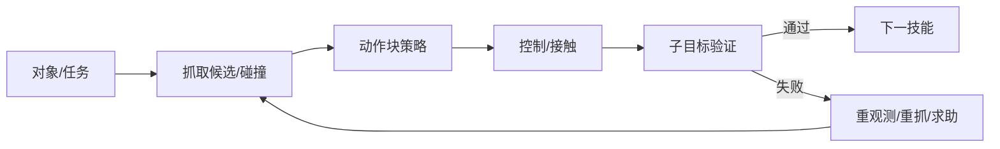

# 06 · 抓取、操作与灵巧手

> 一句话点题：抓住、稳定操纵和完成语义任务是三个层次；长程成功会把每个技能 95% 的可靠性快速相乘成低总成功。

<div class="lesson-meta"><span>RBF16—RBF17—RBF18</span><span>核心主线</span><span>预计 6 × 45 分钟</span><span>证据截止 2026-08-30</span></div>

## 解锁与跳过

完成几何、控制和三维感知。 即使你使用 AI 完成实现，也不能跳过本章的变量定义、反例和评测设计；这些部分决定你是否有能力发现一个“运行正常但结论错误”的系统。

## 本章可观察目标

完成后你能：区分抓取稳定、操作技能和长程语义任务；连接抓取候选、接触反馈和任务规划；用对象/初始状态/扰动切片评测扩散策略。阅读完成不计掌握；至少需要一次不看答案的解释、一次实际应用和一次边界判断。

## 研究问题：抓住物体、稳定接触和完成语义任务为何是三个层次？

策略会拿杯子却不会发现抓在杯沿导致倒水失败；任务由开柜、取杯、关门、放置组成，局部小错误累积。需要接触/状态反馈、子目标验证和恢复，而不是只预测更长动作。

问题必须被写成“输入、状态、动作/输出、损失、约束、证据和停止条件”的组合。只写“提升效果”会把数据、算法、交互与业务结果混在一起，也无法设计反事实或消融。

## 三个知识节点怎样连接

| 节点 | 核心对象 | 最小充分解释 | 必须支持的决策 |
|---|---|---|---|
| RBF16 | 抓取与接触 | 几何、摩擦和夹持力决定力闭合/稳定 | 候选能否在误差下成功 |
| RBF17 | 操作策略 | 视觉/本体历史映射连续动作或轨迹块 | 行为克隆/扩散如何处理多模态 |
| RBF18 | 长程操作 | 子目标、重抓、双臂协同和恢复形成任务链 | 局部技能怎样组合且不累积错误 |

三者不是并列名词：第一个节点通常建立对象和假设，第二个节点解释机制，第三个节点把机制放进测量或交付边界。缺任何一层，都容易把局部指标误当成系统结论。

## 核心机制：抓取几何、轨迹生成与技能组合

抓取候选基于对象几何/可供性，碰撞与力闭合筛选；Diffusion Policy 在动作序列上迭代去噪，表示多模态轨迹并滚动执行；ACT/分块预测缓解误差累积。长程层用状态机/任务规划验证子目标，失败重观测、重抓或求助。

理解机制时要区分三种量：**被设计者直接控制的变量**、**环境或数据生成过程决定的变量**、**只能通过代理指标观测的潜变量**。可靠实验一次只改变主要因子，其余配置进入版本化运行记录。

## 关键公式、假设与推导

摩擦锥与 wrench closure 约束稳定抓取；扩散策略学习 $\epsilon_\theta(a_k,o,k)$ 反向去噪动作块。若 $n$ 个技能独立成功 $p_i$，总成功 $\prod_ip_i$，说明必须测恢复与接口。

公式不是装饰。逐项检查：

- 抓取成功是否含后续操作
- 动作 chunk 长度与闭环频率
- 示范是否覆盖恢复
- 对象/背景/相机捷径

若假设不成立，正确做法不是继续套公式，而是换估计量、改采样/实验设计、缩小结论或明确拒绝自动决策。

## 证据拆解1：Diffusion Policy

### 研究问题

多模态连续机器人动作如何学习？

### 核心机制、实验与指标

以条件扩散生成动作序列，滚动时域执行并用视觉/状态条件。

论文在多项操作任务报告相对行为克隆强结果。

### 真正贡献、局限与适用边界

形成现代通用操作策略基线。 结果依赖示范覆盖、控制栈和任务；扩散采样延迟/安全需目标硬件验证。

## 证据拆解2：ALOHA / ACT

### 研究问题

低成本双臂示范和动作分块能否学习精细操作？

### 核心机制、实验与指标

系统提供低成本双臂遥操作，ACT 用 Transformer 预测动作块。

展示多项精细双臂任务的强模仿结果。

### 真正贡献、局限与适用边界

把数据采集硬件与策略联合设计。 成功演示和有限任务不代表开放家庭泛化；示范/硬件校准很关键。

## 从论文或标准到产品主张：证据审计

| 日期 | 一手来源 | 它真正回答的问题 | 不能据此外推什么 |
|---|---|---|---|
| 2023-03-01 | Diffusion Policy | 多模态连续机器人动作如何学习？ | 结果依赖示范覆盖、控制栈和任务；扩散采样延迟/安全需目标硬件验证。 |
| 2023-04-01 | ALOHA / ACT | 低成本双臂示范和动作分块能否学习精细操作？ | 成功演示和有限任务不代表开放家庭泛化；示范/硬件校准很关键。 |

阅读来源时按四步记录：先抄下研究对象、比较基线、数据/场景和预算，再定位结果表或正式条文；随后区分作者直接观察、由结果支持的解释和你准备迁移到项目的推论；最后为推论写一个能推翻它的反例。**来源新并不等于证据强**：预印本、公司技术报告、正式标准、法规和独立复现承担的证明责任不同。数字必须连同分母、置信区间、硬件/本体、语言/人群与失败样本一起保存。

如果来源只证明组件指标改善，不得自动升级成端到端任务、真实用户价值、物理安全或合规结论。迁移到自己的项目时至少保留一个原方法基线、一个更简单基线和一个不使用该能力的基线；结果冲突时，优先检查任务定义、样本污染、资源预算、评价器偏差和运行边界，而不是挑选最符合预期的一项。

## 机制图：从输入到可验证结果



图中每条边都应能对应日志、数据版本、物理状态或人工记录；无法观测的边必须标为假设，不允许用模型的一段解释代替真实状态。

## 贯穿案例：取杯倒水长程操作

把任务拆门、抓杯、搬运、倾倒、放回；每个子目标用视觉/力验证。训练含正常示范和恢复示范；评测物体、液位、位置和光照分层。报告局部技能、全任务、洒水/峰值力与人工恢复。

案例的重点不是跑出最高分，而是保存“为什么选择这条路径”的证据：基线是什么、哪个假设最危险、失败怎样分层、什么条件触发降级或人工接管。

## 复现任务：最小因果链

1. 定义抓取稳定与最终任务两级标签
2. 收集成功/失败/恢复示范并去轨迹近重复
3. 对照几何规划、BC 与扩散/ACT
4. 逐子目标统计进入/成功/恢复漏斗

复现不是成功运行作者代码。你必须固定数据/环境、预算和评价器，至少重复三次，报告均值、离散程度、失败样本和资源消耗；若只能跑一次，要把结论降级为演示证据。

## 三轮实验与消融路线

**第一轮：测量链校准。** 只运行最简单基线，检查输入单位、时间/坐标/权限、随机种子、日志和评价器。抽取成功与失败样本人工复核；若真值或测量本身不稳定，停止模型比较。输出必须能回答“同一次运行能否被另一人重放”。

**第二轮：机制消融。** 在同一数据、预算、硬件或运行条件下，一次只加入一个关键机制；对每次变化写预期影响、未变化项和失败阈值。除了主指标，还要检查最坏切片、过程约束、P95/P99、资源与人工成本。若提升只在一个方便切片出现，应缩小能力声明。

**第三轮：边界与迁移。** 有计划地改变本章公式假设或 ODD：时间、人群、语言、对象、气象、本体、延迟、权限或供应商至少选择两项；注入缺失、冲突和失效。记录系统是正确拒绝/降级/接管，还是带着错误自信继续。最终产物不是“最佳分数”，而是一个可复核的能力范围、反例集和下一次变更会触发的回归集合。

## 实验与指标

| 维度 | 至少记录什么 | 为什么 |
|---|---|---|
| 任务 | 成功率、完成时间、部分进展与恢复 | 一次漂亮成功不能表示可靠性 |
| 过程 | 碰撞/力/间隔/约束违例和人工接管 | 结果正确也可能过程危险 |
| 泛化 | 对象、场景、语言、本体和扰动切片 | 平均分不说明分布外边界 |
| 系统 | 控制频率、P95、算力、数据/人工和能耗 | 策略必须在真实闭环预算运行 |

同时保留一个简单基线和一个“什么都不做/人工流程”基线。复杂方案只有在质量、成本、时延、风险或可扩展性至少一个维度形成可重复净收益时才晋级。

## 对产品、系统或研究架构的影响

- 长程任务显式子目标检查
- 策略动作经碰撞/力限幅
- 数据优先补失败前状态和恢复
- 不以局部抓取榜代替任务

这些决策应进入 PRD、实验卡、接口契约、安全案例或 ADR，而不只留在学习笔记。模型、数据、提示、硬件、环境与评价器任何一个升级，都要能触发有范围的回归测试。

## 会死在哪里

- 抓起 1 秒算稳定
- 只收专家完美示范
- 动作块过长开环
- 训练测试同一摆放
- 长程失败只归最后一步

失败分析要写“触发条件—可观测信号—影响—检测—缓解—残余风险”。只写“模型可能出错”没有工程价值。

## 与 AI 协作模板

```text
把操作任务拆为抓取/接触/子目标/恢复，定义每段可观测成功；比较规划、BC、扩散/ACT，按对象/姿态/扰动切片并报告长程漏斗与过程安全。
```

使用模板后仍需检查 AI 是否虚构来源、混用时间口径、悄悄改变任务定义，或把模拟结果外推到真实系统。

## 练习：构造一个三技能操作漏斗

在仿真完成抓—移—放，每段记录成功和恢复；改变初始姿态与摩擦，比较脚本与学习策略，解释总成功乘法下降。

提交物必须包含一个反例或失败样本。只有成功案例会让你误以为已经掌握；边界证据才能说明你知道方法何时不该用。

## 常见误区

抓住等于完成操作；更长动作块总更好；完美示范足够；多模态策略自然安全；局部 95% 就能长程可靠。共同根因是把一个条件成立时的局部结论，扩张成不带条件的能力判断。

## 自测

<Quiz question="五个技能各 90% 成功且无恢复，总任务约多少？" :options='["90%","约59%","100%"]' :answer="1" explanation="近似 $0.9^5≈0.59$，接口和恢复决定长程可靠性。" />

## 本章小结

- 抓取、操作、语义任务分层
- 动作生成依赖闭环控制
- 恢复数据是关键资产
- 长程用漏斗而非单分

<EvidenceTracker lesson="field-robotics-06-manipulation-grasping" />

## 本章完成标准

不看正文解释 局部技能到长程成功的乘法；完成 一个子目标/恢复漏斗；能指出 抓取分数不能外推的任务。最近相关题平均至少 7/10 才标记为 basic；跨日期完成变式任务并达到 8.5/10，才标记为 proficient。

<div class="source-note">主要来源（证据截止 2026-08-30）：<a href="https://arxiv.org/abs/2303.04137">Diffusion Policy</a>、<a href="https://arxiv.org/abs/2304.13705">ALOHA/ACT</a>。数字只描述来源中的实验设置；标准、法规与产品能力均按页面版本和适用范围解释。</div>
