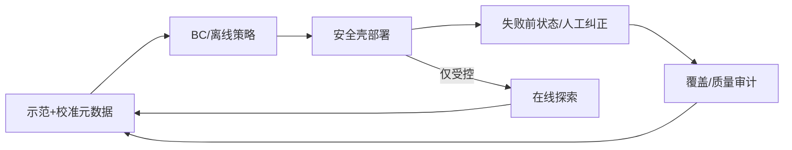

# 07 · 模仿学习、强化学习与数据

> 一句话点题：机器人数据最稀缺的不是成功片段数量，而是覆盖失败前状态、纠正动作和真实闭环分布；无安全探索和数据边界的 RL 不能直接上线。

<div class="lesson-meta"><span>RBF19—RBF20—RBF21</span><span>核心主线</span><span>预计 6 × 45 分钟</span><span>证据截止 2026-08-30</span></div>

## 解锁与跳过

有可复位任务、遥操作/脚本基线和过程安全壳。 即使你使用 AI 完成实现，也不能跳过本章的变量定义、反例和评测设计；这些部分决定你是否有能力发现一个“运行正常但结论错误”的系统。

## 本章可观察目标

完成后你能：理解 BC、DAgger、离线/在线 RL 的分布问题；设计覆盖、质量和时间对齐的数据管线；评测分布外恢复而非训练分布复现。阅读完成不计掌握；至少需要一次不看答案的解释、一次实际应用和一次边界判断。

## 研究问题：遥操作示范、离线数据、仿真奖励和在线探索怎样组合？

BC 在专家轨迹附近很好，首次偏离后误差累积；离线 RL 对数据外动作给虚高价值。若用策略自动筛选好看轨迹，会进一步删除恢复证据。

问题必须被写成“输入、状态、动作/输出、损失、约束、证据和停止条件”的组合。只写“提升效果”会把数据、算法、交互与业务结果混在一起，也无法设计反事实或消融。

## 三个知识节点怎样连接

| 节点 | 核心对象 | 最小充分解释 | 必须支持的决策 |
|---|---|---|---|
| RBF19 | 模仿学习 | 从示范学习策略但执行会进入未见状态 | 怎样减少协变量偏移 |
| RBF20 | 强化/离线学习 | 通过奖励/价值改进动作，受探索和外推误差限制 | 何时允许在线探索 |
| RBF21 | 机器人数据治理 | 多本体传感动作需同步、校准、任务与失败元数据 | 更多轨迹是否真的增加覆盖 |

三者不是并列名词：第一个节点通常建立对象和假设，第二个节点解释机制，第三个节点把机制放进测量或交付边界。缺任何一层，都容易把局部指标误当成系统结论。

## 核心机制：协变量偏移、价值外推与数据覆盖

BC 最大似然拟合专家条件动作，部署状态由自身策略产生；DAgger 让专家标策略访问状态。离线 RL 从固定数据估值，需保守约束减少 OOD 动作；在线探索只能在仿真/安全壳和受控设备。数据单元绑定本体、校准、控制器、延迟、任务、结果和干预。

理解机制时要区分三种量：**被设计者直接控制的变量**、**环境或数据生成过程决定的变量**、**只能通过代理指标观测的潜变量**。可靠实验一次只改变主要因子，其余配置进入版本化运行记录。

## 关键公式、假设与推导

BC $L=-E_{(s,a)\sim D}\log\pi(a|s)$；性能误差可随 horizon 累积。离线 RL Bellman 目标含 $Q(s',a')$，若 $a'$ 不在数据支持会外推。覆盖可用状态/动作密度、最近邻距离和失败切片估计。

公式不是装饰。逐项检查：

- 示范者与策略观测是否一致
- 动作时间戳/控制器语义
- 训练/测试轨迹按场景实体隔离
- 在线探索的硬停止和责任

若假设不成立，正确做法不是继续套公式，而是换估计量、改采样/实验设计、缩小结论或明确拒绝自动决策。

## 证据拆解1：DAgger

### 研究问题

如何缓解模仿学习部署状态偏移？

### 核心机制、实验与指标

迭代运行当前策略，让专家对访问状态标动作并聚合数据。

理论与实验说明可把序列错误累积从平方级改善。

### 真正贡献、局限与适用边界

建立数据在环模仿范式。 需要专家安全介入；真实机器人采集成本/风险很高。

## 证据拆解2：ISO Robotics Standards

### 研究问题

学习策略的数据迭代仍受什么系统安全约束？

### 核心机制、实验与指标

ISO 官方入口列机器人安全与性能标准。

提醒在线学习/探索不豁免机械安全要求。

### 真正贡献、局限与适用边界

把数据飞轮置于控制边界。 标准并不直接给 ML 算法方案，需结合风险分析。

## 从论文或标准到产品主张：证据审计

| 日期 | 一手来源 | 它真正回答的问题 | 不能据此外推什么 |
|---|---|---|---|
| 2011-04-21 | DAgger | 如何缓解模仿学习部署状态偏移？ | 需要专家安全介入；真实机器人采集成本/风险很高。 |
| 2026-08-30 | ISO Robotics Standards | 学习策略的数据迭代仍受什么系统安全约束？ | 标准并不直接给 ML 算法方案，需结合风险分析。 |

阅读来源时按四步记录：先抄下研究对象、比较基线、数据/场景和预算，再定位结果表或正式条文；随后区分作者直接观察、由结果支持的解释和你准备迁移到项目的推论；最后为推论写一个能推翻它的反例。**来源新并不等于证据强**：预印本、公司技术报告、正式标准、法规和独立复现承担的证明责任不同。数字必须连同分母、置信区间、硬件/本体、语言/人群与失败样本一起保存。

如果来源只证明组件指标改善，不得自动升级成端到端任务、真实用户价值、物理安全或合规结论。迁移到自己的项目时至少保留一个原方法基线、一个更简单基线和一个不使用该能力的基线；结果冲突时，优先检查任务定义、样本污染、资源预算、评价器偏差和运行边界，而不是挑选最符合预期的一项。

## 机制图：从输入到可验证结果



图中每条边都应能对应日志、数据版本、物理状态或人工记录；无法观测的边必须标为假设，不允许用模型的一段解释代替真实状态。

## 贯穿案例：仓库抓取恢复数据飞轮

首轮收正常遥操作，再在安全限速下运行 BC，专家接管并保存接管前 5 秒和纠正。测试按新物体/摆放/遮挡隔离；对照只加成功数据与加恢复数据。任何在线 RL 仅仿真和隔离台架。

案例的重点不是跑出最高分，而是保存“为什么选择这条路径”的证据：基线是什么、哪个假设最危险、失败怎样分层、什么条件触发降级或人工接管。

## 复现任务：最小因果链

1. 数据绑定本体/控制/校准/任务版本
2. 场景级去重与时间外切分
3. 测策略访问状态到数据支持距离
4. 采集接管/恢复并做因果对照

复现不是成功运行作者代码。你必须固定数据/环境、预算和评价器，至少重复三次，报告均值、离散程度、失败样本和资源消耗；若只能跑一次，要把结论降级为演示证据。

## 三轮实验与消融路线

**第一轮：测量链校准。** 只运行最简单基线，检查输入单位、时间/坐标/权限、随机种子、日志和评价器。抽取成功与失败样本人工复核；若真值或测量本身不稳定，停止模型比较。输出必须能回答“同一次运行能否被另一人重放”。

**第二轮：机制消融。** 在同一数据、预算、硬件或运行条件下，一次只加入一个关键机制；对每次变化写预期影响、未变化项和失败阈值。除了主指标，还要检查最坏切片、过程约束、P95/P99、资源与人工成本。若提升只在一个方便切片出现，应缩小能力声明。

**第三轮：边界与迁移。** 有计划地改变本章公式假设或 ODD：时间、人群、语言、对象、气象、本体、延迟、权限或供应商至少选择两项；注入缺失、冲突和失效。记录系统是正确拒绝/降级/接管，还是带着错误自信继续。最终产物不是“最佳分数”，而是一个可复核的能力范围、反例集和下一次变更会触发的回归集合。

## 实验与指标

| 维度 | 至少记录什么 | 为什么 |
|---|---|---|
| 任务 | 成功率、完成时间、部分进展与恢复 | 一次漂亮成功不能表示可靠性 |
| 过程 | 碰撞/力/间隔/约束违例和人工接管 | 结果正确也可能过程危险 |
| 泛化 | 对象、场景、语言、本体和扰动切片 | 平均分不说明分布外边界 |
| 系统 | 控制频率、P95、算力、数据/人工和能耗 | 策略必须在真实闭环预算运行 |

同时保留一个简单基线和一个“什么都不做/人工流程”基线。复杂方案只有在质量、成本、时延、风险或可扩展性至少一个维度形成可重复净收益时才晋级。

## 对产品、系统或研究架构的影响

- 失败/接管片段不自动丢弃
- 离线策略 OOD 触发拒绝/求助
- 在线探索限定 sandbox
- 数据权和人员隐私进入治理

这些决策应进入 PRD、实验卡、接口契约、安全案例或 ADR，而不只留在学习笔记。模型、数据、提示、硬件、环境与评价器任何一个升级，都要能触发有范围的回归测试。

## 会死在哪里

- 随机切帧泄漏轨迹
- 只收成功造成覆盖空洞
- 离线 Q 高就相信
- 示范动作与实机控制频率错位
- 探索奖励绕过安全

失败分析要写“触发条件—可观测信号—影响—检测—缓解—残余风险”。只写“模型可能出错”没有工程价值。

## 与 AI 协作模板

```text
审计机器人学习数据：本体/校准/控制/时间同步、任务/场景去重、成功/失败/接管覆盖、OOD 距离；给 BC→DAgger/离线RL→受控探索的晋级门槛。
```

使用模板后仍需检查 AI 是否虚构来源、混用时间口径、悄悄改变任务定义，或把模拟结果外推到真实系统。

## 练习：测一次协变量偏移

训练简单 BC，故意扰动初始状态；记录错误随 horizon 累积，再加入少量纠正轨迹，比较恢复和 OOD 检测。

提交物必须包含一个反例或失败样本。只有成功案例会让你误以为已经掌握；边界证据才能说明你知道方法何时不该用。

## 常见误区

更多成功轨迹等于覆盖；随机切帧可泛化；离线 RL 无安全风险；专家动作是唯一最优；数据飞轮自动形成。共同根因是把一个条件成立时的局部结论，扩张成不带条件的能力判断。

## 自测

<Quiz question="BC 首步小误差后持续恶化，核心机制？" :options='["颜色偏差","协变量偏移与误差累积","损失太低"]' :answer="1" explanation="策略访问了专家数据未覆盖的状态。" />

## 本章小结

- 模仿学习受部署分布影响
- 离线价值有外推风险
- 恢复片段比重复成功更稀缺
- 数据版本包含本体和控制语义

<EvidenceTracker lesson="field-robotics-07-imitation-rl" />

## 本章完成标准

不看正文解释 BC/离线 RL 的两类分布外风险；完成 一次扰动与纠正实验；能指出 不允许在线探索的场景。最近相关题平均至少 7/10 才标记为 basic；跨日期完成变式任务并达到 8.5/10，才标记为 proficient。

<div class="source-note">主要来源（证据截止 2026-08-30）：<a href="https://proceedings.mlr.press/v15/ross11a.html">DAgger</a>、<a href="https://www.iso.org/cms/live/live/en/sites/isoorg/home/sectors/engineering/robotics.html">ISO Robotics</a>。数字只描述来源中的实验设置；标准、法规与产品能力均按页面版本和适用范围解释。</div>
