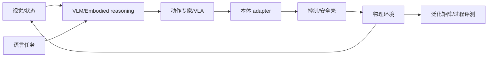

# 08 · VLA 与机器人基础模型

> 一句话点题：VLA 把语言和视觉先验带入动作，但任务成功仍由本体接口、机器人数据覆盖、控制与安全壳决定；语言泛化不自动等于物理泛化。

<div class="lesson-meta"><span>RBF22—RBF23—RBF24</span><span>核心主线</span><span>预计 6 × 45 分钟</span><span>证据截止 2026-08-30</span></div>

## 解锁与跳过

完成操作、数据与适配评测；理解 Transformer/生成策略基础。 即使你使用 AI 完成实现，也不能跳过本章的变量定义、反例和评测设计；这些部分决定你是否有能力发现一个“运行正常但结论错误”的系统。

## 本章可观察目标

完成后你能：解释 VLA 的视觉—语言—动作接口；比较模块化、OpenVLA/π0.5/RT-2 类方案；评测跨任务、本体和语义泛化。阅读完成不计掌握；至少需要一次不看答案的解释、一次实际应用和一次边界判断。

## 研究问题：语言和互联网知识进入动作策略后，泛化究竟来自哪里？

模型听懂‘把玩具放到同颜色盒’，却在新机械臂上动作尺度/坐标不同而撞击。零样本语义成功和跨本体控制是两种证据，必须对模块化基线和目标本体适配。

问题必须被写成“输入、状态、动作/输出、损失、约束、证据和停止条件”的组合。只写“提升效果”会把数据、算法、交互与业务结果混在一起，也无法设计反事实或消融。

## 三个知识节点怎样连接

| 节点 | 核心对象 | 最小充分解释 | 必须支持的决策 |
|---|---|---|---|
| RBF22 | VLA 表示 | 视觉/语言条件映射离散或连续动作 token/chunk | 动作语义怎样对接控制频率 |
| RBF23 | 预训练与后训练 | 互联网语义、机器人多任务和目标本体数据分层贡献 | 泛化究竟来自哪类数据 |
| RBF24 | 跨本体适配 | 不同关节、相机和控制语义需统一/适配接口 | 同权重能否安全迁移 |

三者不是并列名词：第一个节点通常建立对象和假设，第二个节点解释机制，第三个节点把机制放进测量或交付边界。缺任何一层，都容易把局部指标误当成系统结论。

## 核心机制：语义表征到动作块

RT-2 将动作表示成 token 并与视觉语言联合训练；OpenVLA 用开放 VLM 加机器人数据；π0.5 采用 flow/动作专家与多任务数据增强开放世界。Gemini Robotics 2/ER2 把 embodied reasoning、工具/空间理解与动作模型分工。VLA 输出必须经本体 adapter、控制器和安全过滤。

理解机制时要区分三种量：**被设计者直接控制的变量**、**环境或数据生成过程决定的变量**、**只能通过代理指标观测的潜变量**。可靠实验一次只改变主要因子，其余配置进入版本化运行记录。

## 关键公式、假设与推导

策略 $a_{t:t+H}=\pi_\theta(o_{\le t},l,r)$；泛化矩阵按新对象/指令/场景/任务/本体分开。相对提升必须保持相同数据、控制器和动作频率；成功率同时报告过程违例和人工干预。

公式不是装饰。逐项检查：

- 动作 token/连续量反序列化
- 互联网与机器人数据泄漏
- 本体 adapter 训练量与参数
- 评价是否挑选成功回合

若假设不成立，正确做法不是继续套公式，而是换估计量、改采样/实验设计、缩小结论或明确拒绝自动决策。

## 证据拆解1：RT-2

### 研究问题

互联网视觉语言知识能否进入机器人控制？

### 核心机制、实验与指标

将机器人动作表为文本 token，与 VLM 数据共同训练 VLA。

论文报告在新对象/语义指令上的泛化提升。

### 真正贡献、局限与适用边界

证明 web 语义与动作学习可联合。 自报任务/硬件有限，动作离散和控制安全需本地验证。

## 证据拆解2：OpenVLA

### 研究问题

能否开放训练通用 VLA？

### 核心机制、实验与指标

在开放 VLM 基础上用多机器人数据训练 7B VLA。

作者报告相对 RT-2-X 平均绝对成功提升 16.5 个百分点且参数少约 7 倍。

### 真正贡献、局限与适用边界

提供开放权重/训练路线。 数字绑定论文实验，跨本体、安全和真实部署需独立复验。

## 证据拆解3：π0.5

### 研究问题

VLA 如何扩展到开放世界长程任务？

### 核心机制、实验与指标

结合视觉语言预训练、多机器人数据和动作生成，强调异质数据/高级语义。

作者在家庭任务报告更强跨环境泛化。

### 真正贡献、局限与适用边界

代表 2025 通用机器人策略方向。 公司自报设置、任务成功和数据细节限制外推。

## 证据拆解4：Gemini Robotics 2

### 研究问题

2026 具身模型如何扩展到全身和 embodied reasoning？

### 核心机制、实验与指标

官方发布将 ER 2 的空间/工具推理与 Robotics 2 动作能力结合，并展示多本体任务。

是截止日前的重要 2026 能力节点。

### 真正贡献、局限与适用边界

提示 VLA 正从单臂走向全身/推理协同。 官方演示/模型卡不是独立普适安全证据，需目标硬件全回合测试。

## 从论文或标准到产品主张：证据审计

| 日期 | 一手来源 | 它真正回答的问题 | 不能据此外推什么 |
|---|---|---|---|
| 2023-07-28 | RT-2 | 互联网视觉语言知识能否进入机器人控制？ | 自报任务/硬件有限，动作离散和控制安全需本地验证。 |
| 2024-06-13 | OpenVLA | 能否开放训练通用 VLA？ | 数字绑定论文实验，跨本体、安全和真实部署需独立复验。 |
| 2025-04-22 | π0.5 | VLA 如何扩展到开放世界长程任务？ | 公司自报设置、任务成功和数据细节限制外推。 |
| 2026-07-30 | Gemini Robotics 2 | 2026 具身模型如何扩展到全身和 embodied reasoning？ | 官方演示/模型卡不是独立普适安全证据，需目标硬件全回合测试。 |

阅读来源时按四步记录：先抄下研究对象、比较基线、数据/场景和预算，再定位结果表或正式条文；随后区分作者直接观察、由结果支持的解释和你准备迁移到项目的推论；最后为推论写一个能推翻它的反例。**来源新并不等于证据强**：预印本、公司技术报告、正式标准、法规和独立复现承担的证明责任不同。数字必须连同分母、置信区间、硬件/本体、语言/人群与失败样本一起保存。

如果来源只证明组件指标改善，不得自动升级成端到端任务、真实用户价值、物理安全或合规结论。迁移到自己的项目时至少保留一个原方法基线、一个更简单基线和一个不使用该能力的基线；结果冲突时，优先检查任务定义、样本污染、资源预算、评价器偏差和运行边界，而不是挑选最符合预期的一项。

## 机制图：从输入到可验证结果



图中每条边都应能对应日志、数据版本、物理状态或人工记录；无法观测的边必须标为假设，不允许用模型的一段解释代替真实状态。

## 贯穿案例：模块化 vs VLA 桌面整理

固定控制/安全壳，比较检测+规划+脚本、OpenVLA/相似开放模型和目标本体适配。测试新对象、新颜色词、新布局、新任务组合与新本体五轴，禁止混成单一 OOD 分数。报告全回合、碰撞、接管、延迟和适配数据。

案例的重点不是跑出最高分，而是保存“为什么选择这条路径”的证据：基线是什么、哪个假设最危险、失败怎样分层、什么条件触发降级或人工接管。

## 复现任务：最小因果链

1. 统一控制器/动作频率和安全壳
2. 审计训练/测试对象与指令泄漏
3. 逐轴做 ID/OOD/组合/本体矩阵
4. 保存全部回合并对模块化基线消融

复现不是成功运行作者代码。你必须固定数据/环境、预算和评价器，至少重复三次，报告均值、离散程度、失败样本和资源消耗；若只能跑一次，要把结论降级为演示证据。

## 三轮实验与消融路线

**第一轮：测量链校准。** 只运行最简单基线，检查输入单位、时间/坐标/权限、随机种子、日志和评价器。抽取成功与失败样本人工复核；若真值或测量本身不稳定，停止模型比较。输出必须能回答“同一次运行能否被另一人重放”。

**第二轮：机制消融。** 在同一数据、预算、硬件或运行条件下，一次只加入一个关键机制；对每次变化写预期影响、未变化项和失败阈值。除了主指标，还要检查最坏切片、过程约束、P95/P99、资源与人工成本。若提升只在一个方便切片出现，应缩小能力声明。

**第三轮：边界与迁移。** 有计划地改变本章公式假设或 ODD：时间、人群、语言、对象、气象、本体、延迟、权限或供应商至少选择两项；注入缺失、冲突和失效。记录系统是正确拒绝/降级/接管，还是带着错误自信继续。最终产物不是“最佳分数”，而是一个可复核的能力范围、反例集和下一次变更会触发的回归集合。

## 实验与指标

| 维度 | 至少记录什么 | 为什么 |
|---|---|---|
| 任务 | 成功率、完成时间、部分进展与恢复 | 一次漂亮成功不能表示可靠性 |
| 过程 | 碰撞/力/间隔/约束违例和人工接管 | 结果正确也可能过程危险 |
| 泛化 | 对象、场景、语言、本体和扰动切片 | 平均分不说明分布外边界 |
| 系统 | 控制频率、P95、算力、数据/人工和能耗 | 策略必须在真实闭环预算运行 |

同时保留一个简单基线和一个“什么都不做/人工流程”基线。复杂方案只有在质量、成本、时延、风险或可扩展性至少一个维度形成可重复净收益时才晋级。

## 对产品、系统或研究架构的影响

- VLA 不替代本体控制与安全
- 能力声明按泛化轴展开
- adapter/校准是模型版本一部分
- 厂商演示只作为候选证据

这些决策应进入 PRD、实验卡、接口契约、安全案例或 ADR，而不只留在学习笔记。模型、数据、提示、硬件、环境与评价器任何一个升级，都要能触发有范围的回归测试。

## 会死在哪里

- 语义理解当动作成功
- 跨对象外推跨本体
- 控制器不同却比模型
- 只报挑选视频
- VLA 越权直接电机控制

失败分析要写“触发条件—可观测信号—影响—检测—缓解—残余风险”。只写“模型可能出错”没有工程价值。

## 与 AI 协作模板

```text
设计 VLA 评测：模块化基线、模型/数据/adapter/控制器版本；按对象、指令、场景、任务组合、本体分轴，报告全回合成功、过程危险、接管、延迟和适配成本。
```

使用模板后仍需检查 AI 是否虚构来源、混用时间口径、悄悄改变任务定义，或把模拟结果外推到真实系统。

## 练习：做一个 VLA 泛化矩阵

即使无实机，也用小仿真/公开轨迹设计 5 轴矩阵；给每个成功声明写最小证据和不能外推的相邻轴。

提交物必须包含一个反例或失败样本。只有成功案例会让你误以为已经掌握；边界证据才能说明你知道方法何时不该用。

## 常见误区

会语言就会物理推理；同权重等于跨本体即插即用；更大 VLM 自动控制更稳；机器人 demo 是统计证据；VLA 可取消经典栈。共同根因是把一个条件成立时的局部结论，扩张成不带条件的能力判断。

## 自测

<Quiz question="模型在新物体成功，能否声称跨本体泛化？" :options='["能","不能，对象与本体是不同泛化轴","只要语言相同即可"]' :answer="1" explanation="动作空间、坐标和动力学变化需独立适配/证据。" />

## 本章小结

- VLA 联合语义与动作
- 机器人数据和本体接口仍关键
- 泛化按轴分解
- 安全控制独立保留

<EvidenceTracker lesson="field-robotics-08-vla-foundation" />

## 本章完成标准

不看正文解释 语义泛化与物理/本体泛化；完成 一个五轴 VLA 评测矩阵；能指出 官方演示不能支持的主张。最近相关题平均至少 7/10 才标记为 basic；跨日期完成变式任务并达到 8.5/10，才标记为 proficient。

<div class="source-note">主要来源（证据截止 2026-08-30）：<a href="https://arxiv.org/abs/2307.15818">RT-2</a>、<a href="https://arxiv.org/abs/2406.09246">OpenVLA</a>、<a href="https://arxiv.org/abs/2504.16054">π0.5</a>、<a href="https://deepmind.google/blog/gemini-robotics-2-brings-whole-body-intelligence-to-robots/">Gemini Robotics 2</a>。数字只描述来源中的实验设置；标准、法规与产品能力均按页面版本和适用范围解释。</div>
