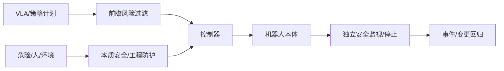

# 10 · 安全、人机协作与部署

> 一句话点题：机器人部署的最终指标是安全地完成并可恢复；任务成功率必须与轨迹级危险、人体影响和独立保护一起验收。

<div class="lesson-meta"><span>RBF28—RBF29—RBF30</span><span>核心主线</span><span>预计 6 × 45 分钟</span><span>证据截止 2026-08-30</span></div>

## 解锁与跳过

完成前九章，系统已有独立安全控制和全回合日志。 即使你使用 AI 完成实现，也不能跳过本章的变量定义、反例和评测设计；这些部分决定你是否有能力发现一个“运行正常但结论错误”的系统。

## 本章可观察目标

完成后你能：按 ISO/任务做危险分析和防护设计；评测任务前瞻风险而非只看终点；验证跨本体/版本部署和人机协作。阅读完成不计掌握；至少需要一次不看答案的解释、一次实际应用和一次边界判断。

## 研究问题：任务成功但过程危险时，机器人应当如何被评价和拦截？

同一权重部署到更重、更快的新本体，语义动作看似相同但停止距离和接触力改变。‘权重没变’不能免除整机验证；模型安全评分也不能替代安全扫描、限速、力限和急停。

问题必须被写成“输入、状态、动作/输出、损失、约束、证据和停止条件”的组合。只写“提升效果”会把数据、算法、交互与业务结果混在一起，也无法设计反事实或消融。

## 三个知识节点怎样连接

| 节点 | 核心对象 | 最小充分解释 | 必须支持的决策 |
|---|---|---|---|
| RBF28 | 机器人安全 | 本体、控制、工作区、人员和生命周期控制危险 | 哪层独立阻止伤害 |
| RBF29 | 过程风险/HRI | 机器人预见动作后果并与人保持可预测协作 | 成功过程是否可接受 |
| RBF30 | 部署与变更 | 模型、权重、adapter、控制和硬件组合需范围回归 | 同权重换机器人是否同能力 |

三者不是并列名词：第一个节点通常建立对象和假设，第二个节点解释机制，第三个节点把机制放进测量或交付边界。缺任何一层，都容易把局部指标误当成系统结论。

## 核心机制：危险控制层级与轨迹前瞻

先通过消除/本质安全、工程防护、监视停止，再到程序/培训。策略层可预测未来轨迹与人/物交互风险，独立安全控制器基于认证传感/规则执行限速、隔离和停机。变更影响矩阵覆盖本体质量、执行器、工具、传感、控制频率、adapter 与软件。

理解机制时要区分三种量：**被设计者直接控制的变量**、**环境或数据生成过程决定的变量**、**只能通过代理指标观测的潜变量**。可靠实验一次只改变主要因子，其余配置进入版本化运行记录。

## 关键公式、假设与推导

停止距离 $d=vT_{reaction}+v^2/(2a_{brake})+margin$；风险轨迹 $R(\tau)=\max_tSeverity(h_t)P(h_t|o_{\le t})$。严重事件用上置信界，零观测不等于零风险。

公式不是装饰。逐项检查：

- ISO 10218:2025 和适用服务机器人标准
- 安全功能独立性与诊断覆盖
- 人体数据/人因多样性
- 模型/硬件变更的回归范围

若假设不成立，正确做法不是继续套公式，而是换估计量、改采样/实验设计、缩小结论或明确拒绝自动决策。

## 证据拆解1：ISO 10218-1:2025

### 研究问题

工业机器人本体安全要求当前版本是什么？

### 核心机制、实验与指标

ISO 页面给出 2025 版工业机器人安全要求。

它是截至 2026 的关键设计基线。

### 真正贡献、局限与适用边界

安全功能必须对照正式标准与集成要求。 标准适用范围有限，服务/医疗等需其他法规标准。

## 证据拆解2：ForesightSafety-VLA

### 研究问题

VLA 能否在执行前预测任务级风险？

### 核心机制、实验与指标

工作面向前瞻安全评测/训练，让模型识别未来动作链中的危险。

预印本报告在构造基准的风险判断改进。

### 真正贡献、局限与适用边界

把安全从即时碰撞扩展到任务后果。 模型预测不能替代独立安全控制，基准覆盖与真实校准待验证。

## 证据拆解3：Same Weights, Different Robot

### 研究问题

相同策略权重迁移不同本体为何会改变安全/性能？

### 核心机制、实验与指标

研究系统比较同权重在不同机器人形态/控制接口上的行为。

结果强调本体与系统栈会显著调节策略表现。

### 真正贡献、局限与适用边界

直接反驳权重中心的能力声明。 预印本平台有限；仍需每个目标本体实测。

## 证据拆解4：HomeSafeBench

### 研究问题

家庭机器人安全如何覆盖日常场景和过程危险？

### 核心机制、实验与指标

基准组织家庭任务中的人、宠物、易碎/危险物和行为风险。

提供 2026 开放环境安全评测方向。

### 真正贡献、局限与适用边界

推动过程风险与任务成功并列。 仿真/基准无法覆盖所有家庭伦理和真实伤害。

## 从论文或标准到产品主张：证据审计

| 日期 | 一手来源 | 它真正回答的问题 | 不能据此外推什么 |
|---|---|---|---|
| 2025-01-01 | ISO 10218-1:2025 | 工业机器人本体安全要求当前版本是什么？ | 标准适用范围有限，服务/医疗等需其他法规标准。 |
| 2026-06-29 | ForesightSafety-VLA | VLA 能否在执行前预测任务级风险？ | 模型预测不能替代独立安全控制，基准覆盖与真实校准待验证。 |
| 2026-06-03 | Same Weights, Different Robot | 相同策略权重迁移不同本体为何会改变安全/性能？ | 预印本平台有限；仍需每个目标本体实测。 |
| 2026-03-12 | HomeSafeBench | 家庭机器人安全如何覆盖日常场景和过程危险？ | 仿真/基准无法覆盖所有家庭伦理和真实伤害。 |

阅读来源时按四步记录：先抄下研究对象、比较基线、数据/场景和预算，再定位结果表或正式条文；随后区分作者直接观察、由结果支持的解释和你准备迁移到项目的推论；最后为推论写一个能推翻它的反例。**来源新并不等于证据强**：预印本、公司技术报告、正式标准、法规和独立复现承担的证明责任不同。数字必须连同分母、置信区间、硬件/本体、语言/人群与失败样本一起保存。

如果来源只证明组件指标改善，不得自动升级成端到端任务、真实用户价值、物理安全或合规结论。迁移到自己的项目时至少保留一个原方法基线、一个更简单基线和一个不使用该能力的基线；结果冲突时，优先检查任务定义、样本污染、资源预算、评价器偏差和运行边界，而不是挑选最符合预期的一项。

## 机制图：从输入到可验证结果



图中每条边都应能对应日志、数据版本、物理状态或人工记录；无法观测的边必须标为假设，不允许用模型的一段解释代替真实状态。

## 贯穿案例：协作机械臂跨本体部署

把同策略从轻型臂迁到重型臂，重新标定 frame/adapter，按速度、载荷、工具和人距扫描停止距离/峰值力。Foresight 模型只辅助识别任务危险，硬件安全扫描和限速独立。每次变更用 100+ 全回合含人员侵入测试。

案例的重点不是跑出最高分，而是保存“为什么选择这条路径”的证据：基线是什么、哪个假设最危险、失败怎样分层、什么条件触发降级或人工接管。

## 复现任务：最小因果链

1. 按标准/任务做 hazard log 和控制层级
2. 测反应/制动/停止距离与故障诊断
3. 按人在场/工具/本体/速度做全因子
4. 演练急停、恢复、事件通知和回滚

复现不是成功运行作者代码。你必须固定数据/环境、预算和评价器，至少重复三次，报告均值、离散程度、失败样本和资源消耗；若只能跑一次，要把结论降级为演示证据。

## 三轮实验与消融路线

**第一轮：测量链校准。** 只运行最简单基线，检查输入单位、时间/坐标/权限、随机种子、日志和评价器。抽取成功与失败样本人工复核；若真值或测量本身不稳定，停止模型比较。输出必须能回答“同一次运行能否被另一人重放”。

**第二轮：机制消融。** 在同一数据、预算、硬件或运行条件下，一次只加入一个关键机制；对每次变化写预期影响、未变化项和失败阈值。除了主指标，还要检查最坏切片、过程约束、P95/P99、资源与人工成本。若提升只在一个方便切片出现，应缩小能力声明。

**第三轮：边界与迁移。** 有计划地改变本章公式假设或 ODD：时间、人群、语言、对象、气象、本体、延迟、权限或供应商至少选择两项；注入缺失、冲突和失效。记录系统是正确拒绝/降级/接管，还是带着错误自信继续。最终产物不是“最佳分数”，而是一个可复核的能力范围、反例集和下一次变更会触发的回归集合。

## 实验与指标

| 维度 | 至少记录什么 | 为什么 |
|---|---|---|
| 任务 | 成功率、完成时间、部分进展与恢复 | 一次漂亮成功不能表示可靠性 |
| 过程 | 碰撞/力/间隔/约束违例和人工接管 | 结果正确也可能过程危险 |
| 泛化 | 对象、场景、语言、本体和扰动切片 | 平均分不说明分布外边界 |
| 系统 | 控制频率、P95、算力、数据/人工和能耗 | 策略必须在真实闭环预算运行 |

同时保留一个简单基线和一个“什么都不做/人工流程”基线。复杂方案只有在质量、成本、时延、风险或可扩展性至少一个维度形成可重复净收益时才晋级。

## 对产品、系统或研究架构的影响

- 同权重换本体视为新系统版本
- 学习安全评分不关闭物理防护
- 任务成功和过程危险双门禁
- 部署保留人工接管与事件证据

这些决策应进入 PRD、实验卡、接口契约、安全案例或 ADR，而不只留在学习笔记。模型、数据、提示、硬件、环境与评价器任何一个升级，都要能触发有范围的回归测试。

## 会死在哪里

- 零事故小样本宣称安全
- 急停从未满载测试
- 安全模型和主策略共因失败
- ISO 证书替代整机风险评估
- 只看终点不看轨迹

失败分析要写“触发条件—可观测信号—影响—检测—缓解—残余风险”。只写“模型可能出错”没有工程价值。

## 与 AI 协作模板

```text
为机器人部署建立 hazard log、ISO/适用标准台账、停止距离/力/人体侵入试验、独立安全功能和变更矩阵；把任务成功与轨迹级危险双门禁，禁止用同权重证明跨本体安全。
```

使用模板后仍需检查 AI 是否虚构来源、混用时间口径、悄悄改变任务定义，或把模拟结果外推到真实系统。

## 练习：完成一次跨本体安全案例

选择两种质量/速度不同本体，计算停止距离并设计 20 个侵入/接触场景；提交 hazard—control—evidence 追踪和 go/no-go。

提交物必须包含一个反例或失败样本。只有成功案例会让你误以为已经掌握；边界证据才能说明你知道方法何时不该用。

## 常见误区

权重相同能力相同；高成功率等于安全；安全 VLA 可替代急停；有 ISO 标识即全部合规；没有事故证明风险低。共同根因是把一个条件成立时的局部结论，扩张成不带条件的能力判断。

## 自测

<Quiz question="同一权重换到更重机器人，需要重新验收吗？" :options='["不需要","需要，本体动力学/控制/停止距离改变系统行为","只改模型名称"]' :answer="1" explanation="机器人能力和安全属于权重×本体×控制×环境系统。" />

## 本章小结

- 安全按控制层级独立实现
- 过程风险与任务成功并列
- 跨本体部署是系统变更
- 标准、测试和事件闭环共同验收

<EvidenceTracker lesson="field-robotics-10-safety-hri-deployment" />

## 本章完成标准

不看正文解释 模型安全与整机安全的差异；完成 一个 hazard—evidence 安全案例；能指出 相同权重不能外推的本体变化。最近相关题平均至少 7/10 才标记为 basic；跨日期完成变式任务并达到 8.5/10，才标记为 proficient。

<div class="source-note">主要来源（证据截止 2026-08-30）：<a href="https://www.iso.org/standard/73933.html">ISO 10218-1:2025</a>、<a href="https://arxiv.org/abs/2606.27079">ForesightSafety-VLA</a>、<a href="https://arxiv.org/abs/2606.03724">Same Weights Different Robot</a>、<a href="https://arxiv.org/abs/2603.11975">HomeSafeBench</a>。数字只描述来源中的实验设置；标准、法规与产品能力均按页面版本和适用范围解释。</div>
