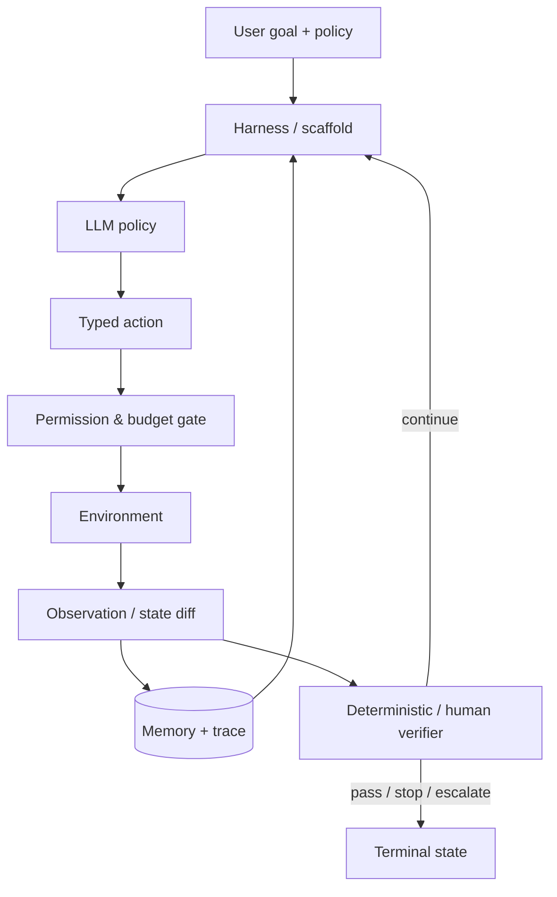

# 01 · Agent 到底是什么：系统边界与研究范式

> 一句话点题：如果把 Agent 等同于“一个会调用工具的模型”，你就无法判断失败来自模型、提示、工具、环境、记忆、预算还是验收器，也无法知道换模型是否真的解决问题。

<div class="lesson-meta"><span>AGF01—AGF03</span><span>近期 active queue</span><span>预计 7 × 45 分钟</span><span>前置：AI09—14</span></div>

## 解锁与跳过

这是整条路线的共同前置，不建议跳过。你可以不先学强化学习推导，但必须能画出一次 Agent 运行中谁观察什么、谁能执行什么、状态在哪里、怎样判定成功以及何时停止。

## 本章可观察目标

完成后你能：区分 model、agent scaffold、environment 与 evaluator；用 POMDP/控制环描述一次运行；为同一任务建立 single-call、workflow、single-agent 三个基线；阅读论文时不再把“系统分数”直接当“模型能力”。

## 研究问题：什么才是可比较的 Agent

最低可用定义是：Agent 在一个会被动作改变的环境中，基于不完整观察和历史状态，多次选择动作来追求目标。工程上还要补充权限、预算、停止和验收。可写成：

$$
\mathcal{A}=(\pi_\theta, H, \mathcal{T}, M, B, G), \quad
a_t \sim \pi_\theta(o_t, m_t, g, h_t)
$$

其中模型策略 $\pi_\theta$ 不是整个 Agent；$H$ 是 harness/scaffold，$\mathcal{T}$ 是工具，$M$ 是记忆，$B$ 是预算/权限边界，$G$ 是验收与停止规则。环境执行 $a_t$ 后得到新状态与观察。论文比较若同时改变模型、工具和预算，就不能把差值只归因于其中一个。



## 核心机制：从单次生成到闭环控制

单次生成只有输入 $x$ 和输出 $y$。Workflow 把已知步骤写成代码，让模型只填不确定槽位。Agent 则在运行时根据观察选择下一步。三者复杂度逐级增加：

| 形态 | 谁决定步骤 | 最适任务 | 主要失败 |
|---|---|---|---|
| single call | 开发者一次性决定 | 分类、抽取、固定格式 | 上下文不足、生成错误 |
| workflow | 代码/状态机决定 | 步骤稳定、可枚举分支 | 规则漏分支、流程僵化 |
| single agent | 模型根据观察决定 | 路径不可预知、需探索/恢复 | 循环、越权、成本失控 |
| multi-agent | 多策略＋协调器 | 真并行/专业权限/隔离 | 重复、死锁、合并错误 |

Agent 的价值来自“环境反馈能改变后续决策”，不是来自 while-loop 本身。若步骤可以预先写清，固定 workflow 通常更便宜、可测、可审计。

## 论文拆解一：LATS 把推理、行动和搜索合起来

### 研究问题

线性 ReAct 一次走一条轨迹，走错后常在局部错误上继续。LATS 问：能否把语言模型同时用作候选生成器、价值估计器和反思器，再借 Monte Carlo Tree Search 在环境中探索多条行动路径？

### 核心机制与关键公式/架构

节点表示交互状态/轨迹，LM 生成候选动作；环境返回真实反馈；LM 对节点打价值并产生 verbal reflection；树搜索在探索与利用之间选择。典型 UCT 选择项可写成：

$$
a^*=\arg\max_a\left[Q(s,a)+c\sqrt{\frac{\ln N(s)}{N(s,a)+\epsilon}}\right]
$$

第一项利用已知高价值分支，第二项探索访问较少分支。关键不在公式新颖，而在把环境反馈和语言反思放入树节点，使“想法”必须经动作结果校验。

### 实验与指标

论文跨 HumanEval、HotPotQA、WebShop、数学任务比较。在其设置中，GPT-4 的 HumanEval pass@1 报告为 92.7%，GPT-3.5 在 WebShop 报告平均 75.9。阅读这些数字必须同时记录：模型版本、采样/搜索预算、每题候选数量、环境是否确定、基线允许多少调用。树搜索多花的 Token/步骤不能从准确率表中消失。

### 真正贡献、局限与产品影响

真正贡献是一个“LM 参与搜索各环节”的通用 scaffold，并展示环境反馈可用于 test-time search。它没有证明树搜索普遍优于线性或固定流程：动作分支大、价值估计不校准、环境调用昂贵时，搜索会指数膨胀；同一个 LM 同时生成和评价也会产生相关错误。产品采用时应先限制分支、深度、预算和可逆动作，并让最终 verifier 尽量独立于生成器。

## 论文拆解二：Building Effective Agents 的最小复杂度原则

### 研究问题与核心机制

Anthropic 的工程报告把系统分成 workflow 与 agent：前者由预定义代码路径编排，后者让模型动态决定过程。常用组合是 prompt chaining、routing、parallelization、orchestrator-workers 和 evaluator-optimizer。它的核心不是一个框架，而是升级顺序：先找最简单的解，只有质量或任务分布证明需要时才增加自治。

### 实验与指标、真正贡献、局限

这不是随机对照论文，没有统一数据集、样本量和置信区间，因此不能拿它证明某种拓扑的平均收益。它的真正贡献是生产设计语言：把“自主”拆成可替换模式，并强调工具接口、反馈和停止条件。对产品架构的影响是建立复杂度梯度，而不是一开始引入多 Agent。

## 论文拆解三：Agentic Automata Learning 检查世界模型发现

### 研究问题

2026 年论文问得更尖锐：一个 tool-calling Agent 能否通过主动查询，推断隐藏环境的状态转移结构，而不只是靠语义先验猜下一步？作者用确定有限自动机（DFA）构造受控世界。

### 核心机制与关键公式/架构

Agent 可以发 membership query（字符串是否属于目标语言）和 equivalence query（候选 DFA 是否等于目标）。经典自动机学习算法提供强基线；任务复杂度可通过状态数、字母表和查询预算控制。它把“世界模型”变成可精确判定的对象：候选 $\hat{D}$ 要在等价查询中通过，而不是写一段貌似合理的环境总结。

### 实验与指标、真正贡献、局限

论文发现 reasoning models 明显强于非 reasoning models，但随 DFA 规模上升性能急跌，轨迹中反复出现查询规划、证据整合和假设构造失败，并远不如经典算法稳健高效。真正贡献是用可控、可扩展、带算法基线的环境隔离“交互发现”。局限是 DFA 远比开放网页简单；结论说明 Agent 在基础结构发现上仍脆弱，不能直接推断其在真实业务一定失败。

## 贯穿案例：客服退款到底需不需要 Agent

假设需求是“处理退款”。先做三层基线：

1. single call：模型抽取订单号、原因、意图；不执行退款；
2. workflow：代码查订单→检查 30 天/品类/金额规则→缺信息追问→人工审批→幂等退款；
3. agent：模型可在多个系统中探索订单、物流、沟通记录，并选择补证据路径。

如果 95% 任务都由固定规则覆盖，Agent 不应接管规则判断；它只处理“去哪里找缺失证据”。评测必须把模型选择路径与最终退款权限分开。这样即使 Agent 被注入，也无法绕过确定 policy engine。

## 复现任务：做一次复杂度阶梯消融

选择 20 个可重复任务，例如仓库 issue 分类与修复建议。固定模型、温度、工具和总调用预算，依次实现 single call、三步 workflow、单 Agent。至少运行每项 3 次，记录成功、方差、Token、wall-clock、工具调用、循环与人工接管。然后移除一个 scaffold 组件，观察差异是否仍存在。

## 对产品架构的影响

- API 将 `goal/policy/budget/allowed_tools/stop` 显式化；
- trace 记录模型、prompt、scaffold、环境镜像、工具版本和每步状态差分；
- verifier 不读取模型的“我完成了”，直接检查最终状态/测试；
- 每个自治升级都有固定流程基线和退出条件；
- 模型升级后重新消融 scaffold，删除已经不再提供收益的支架。

## 会死在哪里

- 只换模型，同时改 prompt/工具/预算，然后宣称模型提升；
- 把自然语言计划当环境状态；
- 让生成器兼任唯一 Judge；
- 没有最大步数、费用、无进展和重复状态停止；
- Agent 能调用工具，却没有最终状态验收；
- 用单次成功展示替代重复运行分布。

## 与 AI 协作模板

```text
请把这个 AI 功能拆成 model / scaffold / tools / environment / memory / evaluator / authority：
1. 先给 single-call 和 deterministic workflow 基线；
2. 说明哪个未知分支必须由 Agent 运行时决定；
3. 固定模型、任务集、预算和环境，只改变一个组件；
4. 输出任务成功、方差、Token、wall-clock、工具失败、循环和人工接管；
5. 对每个自治能力写权限、停止、验收和退回固定流程的条件。
```

## 练习：标注一条真实 trace

从你最近一次 Codex 任务抽 15—30 个关键事件，标出 observation、decision、action、environment transition、verifier、human intervention。找出三处“模型说完成但环境未验证”、两处本可固定编排的动作和一处可能越权的工具调用，写一页改造 ADR。

## 常见误区

Agent=模型；工具越多能力越强；规划文本=可执行计划；反思一定纠错；更多调用只提高准确率；workflow 不算先进；模型自评高就可发布；环境只是测试容器；一次跑通代表可靠。

<Quiz question="同一模型在更强 ACI 和更宽松 CPU 限额下分数提高，最严谨的结论是什么？" :options="['模型推理能力提高了', '完整系统在该配置下提高了，需消融 ACI 与资源才能归因', 'Agent 已经掌握任务']" :answer="1" explanation="Agentic eval 是端到端系统测量；同时变化的 scaffold 和环境会混入模型能力。" />

## 本章小结

- Agent 是闭环系统，模型策略只是一个组件。
- workflow 与 agent 的区别在于谁决定路径，不在是否调用 LLM。
- LATS 展示 test-time search 的可能，Agentless 类证据提醒先保留简单基线。
- 世界模型、环境反馈和 verifier 必须成为结构化状态，而不是一段自我叙述。
- 所有能力主张都要绑定模型、scaffold、工具、环境、预算与版本。

<EvidenceTracker lesson="frontier-agent-01-paradigm" />

## 本章完成标准

不看正文准确解释 model/scaffold/environment/evaluator；完成三层基线和一次单变量消融；能指出一个论文结果不能外推的边界。最近相关题平均至少 7/10，才把 AGF01—03 标为 basic。

<div class="source-note">主要来源（截止 2026-08-30）：<a href="https://arxiv.org/abs/2310.04406">LATS</a>、<a href="https://www.anthropic.com/engineering/building-effective-agents">Building Effective Agents</a>、<a href="https://arxiv.org/abs/2606.16576">Agentic Automata Learning</a>。论文指标均只描述其报告设置。</div>
