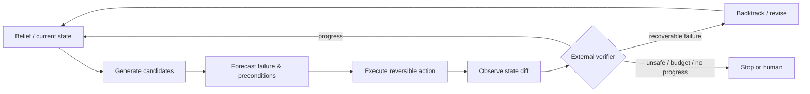

# 02 · 推理、规划、反思与 Test-time Search

> 一句话点题：规划不是让模型先写一张漂亮清单，而是在不完整信息和真实反馈下，持续选择、验证、回退并控制搜索预算。

<div class="lesson-meta"><span>AGF04—AGF06</span><span>强化核心</span><span>预计 8 × 45 分钟</span><span>前置：AGF01—03</span></div>

## 解锁与跳过

当任务存在不可预知分支、失败可恢复、环境能给可靠反馈时解锁。若步骤固定、动作昂贵或不可逆，先用状态机；不要把树搜索用在付款、生产删除或缺乏 verifier 的任务。

## 本章可观察目标

你能区分 plan generation、plan execution、replanning、reflection、search 与 learned policy；解释价值估计为什么会错；为线性 ReAct、行动前反思和树搜索设计同预算对照；用重复状态和环境差分检测“看似思考、实际没进展”。

## 研究问题：为什么一条思维链不等于规划

在部分可观测环境里，Agent 只能看到 $o_t$，真实状态 $s_t$ 不完全可见。规划要估计一串动作的后果：

$$
\pi^*=\arg\max_\pi\;\mathbb{E}\left[\sum_{t=0}^{T}\gamma^t r(s_t,a_t)-\lambda C(a_t)\right]
$$

其中成本 $C$ 包括 Token、工具时间、金钱和风险。长文本计划若不随 $o_{t+1}$ 更新，只是一次预测；反思若没有新证据，只是在同一错误分布里重新采样。



## 核心机制：五种常被混叫“推理”的东西

| 机制 | 改变了什么 | 需要的反馈 | 主要风险 |
|---|---|---|---|
| chain-of-thought | 单次生成内部计算 | 无 | 自洽但错、不可验证 |
| decomposition | 把目标拆成子任务 | 子任务验收 | 早期分解错会级联 |
| reflection | 从失败轨迹生成语言经验 | 明确失败信号 | 反思本身幻觉 |
| replanning | 观察变化后更新路径 | 最新环境状态 | 频繁抖动/忘记约束 |
| tree/search | 同时保留多个候选分支 | 价值/环境评分 | 分支爆炸、Judge 偏差 |

选择机制先看反馈质量：有编译器/测试/游戏得分时可搜索；只有模型自评时，扩大搜索可能只是扩大高置信错误。

## 论文拆解一：LATS 的 MCTS 控制环

### 研究问题与核心机制

LATS 不把第一个动作当最终决定，而是执行 selection→expansion→evaluation→backpropagation。LM 生成多个行动候选和反思，环境提供反馈，节点价值回传。与普通 Tree-of-Thought 不同，节点包含真实行动结果，而不只是文本思路。

### 关键公式/架构

搜索选择兼顾平均价值和探索奖励。无论实现用哪种 UCT 变体，都要追踪 $N(s)$、$N(s,a)$、累计回报与终止状态。若 LM 价值 $\hat V$ 与真实回报 $R$ 混用，应在 trace 中区分，否则无法知道提升来自提前猜测还是实际环境验证。

### 实验与指标、真正贡献、局限

论文跨代码、QA、网页和数学报告增益，说明这个 scaffold 能跨动作空间复用。真正贡献是把 reasoning/acting/planning 接成 test-time search。局限包括搜索预算不易公平、价值模型与策略同源、环境反馈可能稀疏、动作空间大时分支爆炸。产品上只对可逆、便宜、可验收的决策展开搜索。

## 论文拆解二：Devil's Advocate 的行动前反思

### 研究问题

常规 reflection 要先完整失败，再总结一个错误；Web 任务重跑昂贵。论文提出在动作执行前预判潜在错误和备用方案，再在动作后对齐子目标，结束后综合复盘。

### 核心机制与关键公式/架构

它可理解为三层检查：

1. pre-action：列动作前置、可能失败与替代；
2. post-action：比较观察是否满足子目标，否则回退；
3. post-plan：把跨步骤经验写入下一轮策略。

这不是预测所有未来，而是把风险高的分支先暴露。系统实现应让“预判”输出结构化 `precondition/risk/fallback/expected_diff`，之后用真实 diff 评分。

### 实验与指标、真正贡献、局限

论文在 WebArena 的零样本设置报告 23.5% 成功率，较当时零样本方法高 3.5 个百分点，并报告计划修订/试验数降低 45%。贡献是把反思从事后移到行动前后两个局部控制点。局限是单 benchmark、特定 prompt/模型，且“预判正确率”本身未等价于任务成功；高频反思也会显著增 Token。

## 论文拆解三：ARC-AGI-3 把适应性放进未知环境

### 研究问题

ARC-AGI-3 不给静态问答，而让 Agent 在未知交互式游戏环境中行动、观察、学习规则。技术报告关注样本效率、探索与迁移：Agent 是否能用少量交互发现动力学和目标，而非靠训练记忆识别题型。

### 核心机制、实验与指标

环境提供帧/状态观察与离散动作，成功取决于跨步推断隐藏机制。官方技术报告称人类能解决全部环境，而截至 2026-03 的前沿 AI 低于 1%。这不是说模型“一般智力 <1%”，而是说明在该协议、预算和未知环境中，主动探索与世界模型更新仍是明显缺口。

### 真正贡献、局限与产品影响

贡献是设计一个难被静态训练饱和的交互能力探针。局限是游戏和现实业务差异大；人的操作先验也不完全受控。产品影响是把“探索阶段”显式化：新环境先做低风险探测，再扩大权限，且记录每个假设被哪次观察支持/推翻。

## 贯穿案例：网页表单 Agent 为什么反复点同一个按钮

任务是从供应商门户下载对账单。Agent 点击“导出”后没有下载，截图变化很小，于是重复点击。真正问题可能是弹窗被浏览器拦截、后台任务未完成、权限不足或文件已生成。

改造：动作前声明 `expected_diff`；动作后检查 DOM/下载目录/网络状态；同一状态哈希＋同一动作出现两次即触发恢复；三次无进展停止并交人。树搜索只允许探索“刷新任务状态、检查下载目录、重新认证”这些可逆分支，不重复产生导出副作用。

## 复现任务：同预算比较三种规划器

准备 30 个带中间反馈的任务（代码修复或模拟网页）。固定模型、最大 12 次模型调用和最大 20 个环境动作：A 线性 ReAct；B pre/post reflection；C 宽度 3、深度受限的搜索。运行至少 3 个种子，报告 success、环境动作数、模型调用、无进展循环、错误回退和总成本。再把 verifier 换成模型自评，观察搜索结论是否反转。

## 对产品架构的影响

- 计划节点使用 `goal/preconditions/action/expected_diff/fallback/status`，不用纯 Markdown checklist；
- 环境观察保留结构化 diff 与证据引用；
- 搜索预算同时限制宽度、深度、总工具副作用和费用；
- 价值估计与最终验收分开，最好由程序、测试或不同证据源完成；
- 高风险动作不参与自由探索，只能作为审批后的单次提交。

## 会死在哪里

- 把更长 CoT 当更好的 plan；
- 每一步都反思，Token 上升但观察没有新增；
- 用同一个模型生成、评分、反思，误差高度相关；
- 只限制模型轮数，不限制工具副作用；
- 回退没有环境快照，所谓 backtrack 只改文字；
- 搜索分支共享外部状态，互相污染；
- 没有状态哈希/进度信号，陷入改写同一计划。

## 与 AI 协作模板

```text
请为该任务设计线性、行动前反思、受限树搜索三种规划器：
- 每个动作写 precondition / expected_state_diff / fallback / side_effect；
- 只允许可逆动作进入探索，写最大宽度、深度、费用和无进展条件；
- 生成器价值与外部 verifier 分离；
- 同预算运行多次，报告 success、动作、调用、循环、回退与成本分布；
- 若复杂规划无显著收益，给出退回 workflow 的 ADR。
```

## 练习：构造一个会诱发错误反思的任务

让环境随机返回一次过时观察，模型会合理但错误地总结“工具不可用”。要求系统保存 observation version，在新观察到达后撤销旧反思。检查 memory 中过时结论是否被 supersede，而不是永久污染后续计划。

## 常见误区

反思=学习；计划越详细越可靠；树越大越聪明；模型自评分就是价值函数；回退只需说“重新尝试”；未知环境可以直接高权限探索；搜索准确率可不计成本；环境反馈天然正确。

<Quiz question="什么时候增加搜索宽度最可能只放大错误？" :options="['有确定测试且动作可逆时', '价值评估与生成同源、缺少外部反馈时', '分支数很小时']" :answer="1" explanation="相关的生成与自评错误会让更多候选都围绕错误假设展开。" />

## 本章小结

- 规划是带反馈和成本的闭环，不是一次性列步骤。
- Reflection 只有绑定真实失败信号和可撤销经验时才有价值。
- Tree search 购买更多候选探索，同时支付调用、状态隔离和 Judge 偏差。
- ARC-AGI-3 与 automata 类研究把世界模型发现变成可测问题。
- 不可逆动作不进入自由搜索；无进展必须可检测并终止。

<EvidenceTracker lesson="frontier-agent-02-reasoning-planning" />

## 本章完成标准

完成同预算三种规划器实验；能不看答案解释搜索、反思、重规划差异；展示一次 verifier 改变导致的结论变化，并写清采用/跳过搜索的边界。最近平均至少 7/10。

<div class="source-note">主要来源：<a href="https://arxiv.org/abs/2310.04406">LATS</a>、<a href="https://arxiv.org/abs/2405.16334">Devil's Advocate</a>、<a href="https://arcprize.org/media/ARC_AGI_3_Technical_Report.pdf">ARC-AGI-3 Technical Report</a>、<a href="https://arxiv.org/abs/2606.16576">Agentic Automata Learning</a>；核验截止 2026-08-30。</div>
