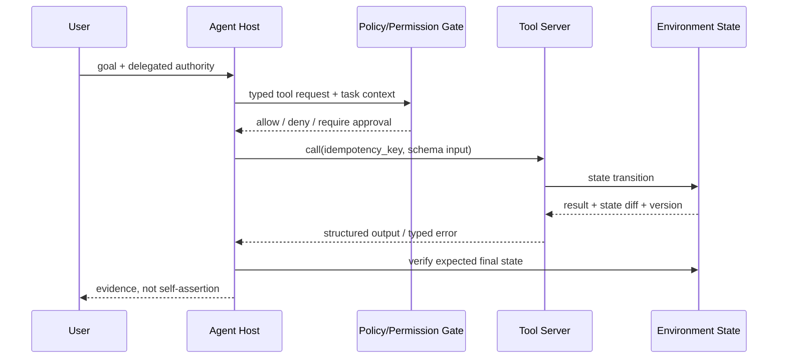

# 03 · Tool Use、MCP 与有状态交互

> 一句话点题：工具调用的难点不是把函数名写进 prompt，而是让模型在会变化的世界里，按类型、权限、业务规则和当前状态做出可验收动作。

<div class="lesson-meta"><span>AGF07—AGF09</span><span>强化核心</span><span>预计 8 × 45 分钟</span><span>前置：AGF01—03、AI09—11</span></div>

## 解锁与跳过

只要 Agent 会读取外部数据或产生写操作，本章就是必修。若只是本地无副作用的计算器，可先做最小 schema；一旦涉及邮件、日历、工单、付款、部署或私人数据，权限与状态验收必须先于更多工具接入。

## 本章可观察目标

你能设计输入/输出 schema、错误语义、幂等键和状态差分；解释 MCP 解决的是互操作而非授权；复现 ToolSandbox/τ-bench 的有状态难点；区分 task success、policy compliance 与 conversation quality。

## 研究问题：为什么 function calling 跑通仍会失败

模型可能选对函数却传错实体、顺序、单位或时间；工具返回成功但业务状态不对；用户中途修改目标；外部内容夹带恶意指令。真正的执行契约是：

$$
\text{valid action}=\text{schema}\land\text{precondition}\land\text{authorization}\land\text{policy}\land\text{idempotency}
$$

而成功应按最终环境状态定义，不按模型是否说“完成”。



## 核心机制：工具契约的六层

1. **语法层**：JSON Schema、必填、枚举、格式；
2. **语义层**：金额单位、时区、实体唯一标识、前置条件；
3. **状态层**：版本、读写集合、最终 state diff；
4. **错误层**：可重试/不可重试、冲突、权限、信息不足；
5. **授权层**：最终用户委派、作用域、审批、过期；
6. **审计层**：谁在何任务、基于何证据、改变了什么。

工具描述主要帮助模型选择，不是安全边界。服务端必须再次验证身份、策略和参数。

## 论文拆解一：ToolSandbox 的状态依赖

### 研究问题

传统 function-calling benchmark 多是单轮、无状态 API 或离线既定轨迹。ToolSandbox 问：当工具有隐式状态依赖、用户会继续对话、信息可能不足时，模型能否在真实交互中完成任务？

### 核心机制与关键公式/架构

环境维护可变状态，用户模拟器根据 Agent 动作在线响应；评测不要求复刻唯一轨迹，而是在任意轨迹上检查中间和最终里程碑。关键类别包括 state dependency、canonicalization 与 insufficient information：例如先开定位权限才能取位置；“明天上午”要结合当前时间规范化；缺少收件人时应追问而非猜。

### 实验与指标、真正贡献、局限

论文报告开源与闭源模型仍有明显差距，复杂状态类任务即使对强模型也困难。贡献是让工具评测从“参数匹配”转成“有状态对话中的轨迹/里程碑”。局限是用户模拟器和合成状态不等于真人/企业系统；工具集合与政策仍受设计者覆盖限制。

## 论文拆解二：τ-bench 的状态差分与 pass^k

### 研究问题

真实客服 Agent 不仅要调用 API，还要和用户协商，同时服从退款/改签等域规则。一次成功不足以衡量可部署性，系统还要重复稳定。

### 核心机制与关键公式/架构

τ-bench 用 LLM 模拟用户、给 Agent 域政策和工具，并比较对话结束数据库状态与标注目标状态。`pass^k` 关注同一任务多次运行全部成功；在独立同分布近似下直觉为 $p^k$，所以 80% 单次成功到 8 次全成只有约 16.8%。实际估计应基于重复采样，不把独立假设当事实。

### 实验与指标、真正贡献、局限

论文中当时的 GPT-4o 工具 Agent 在任务成功上仍低于 50%，零售 `pass^8` 低于 25%。贡献是把 policy following、用户交互、最终状态和重复可靠性放进同一个 benchmark。局限是模拟用户可能比真人更一致/更不自然；数据库目标状态也未覆盖语气、公平和长期后果。

## 规范拆解：MCP 解决什么、不解决什么

### 核心机制与关键架构

MCP 采用 Host—Client—Server：Host 管理用户体验、上下文和安全边界；Client 与某个 Server 建立会话；Server 暴露 tools/resources/prompts 等能力。初始化协商 `protocolVersion` 与 capabilities；消息基于 JSON-RPC，schema 的 TypeScript 定义是规范真源，JSON Schema 用于验证。

2025-11-25 规范还包括 HTTP authorization 框架，以及当时标为 experimental 的 tasks：用持久状态机表示长任务、轮询/取消和延迟结果。必须区分协议 capability 与业务 authority：Server 宣布有 `tools/call` 不代表当前用户被授权执行“删除客户”。

### 真正贡献、局限与产品影响

贡献是减少每个 Agent host 对每个数据源的定制连接，并让工具/资源发现、版本协商和传输规范化。局限是恶意 Server、工具投毒、OAuth 错绑、过宽 scope、返回内容注入仍需 Host 处理。MCP 不是“装上即安全”的插件总线。

## 贯穿案例：日历 Agent 的“成功”错觉

用户说“把和李明的会移到明天下午，他有空就行”。错误 Agent 猜 15:00、创建新日程却没取消旧日程，然后回答完成。可靠流程应：解析唯一联系人→查双方忙闲→若多个空档追问偏好→带旧 event version 更新→检查参与人/时区/旧事件状态→返回 state diff。若用户只有读权限，协议连接成功也必须拒绝写入。

## 复现任务：搭一个最小有状态工具沙箱

实现 `get_order`、`request_refund`、`cancel_refund` 三个类型化工具和 20 个任务。加入版本冲突、重复请求、金额单位错误、信息不足、用户中途改意图、工具返回 prompt injection。评测只检查最终订单/退款状态和违规动作；同一任务跑 8 次，报告 success、`pass^k`、重复副作用与追问正确率。

## 对产品架构的影响

- 工具输入使用稳定 ID，不让模型用显示名隐式选实体；
- 每个写工具接收 idempotency key、expected version 和 reason；
- typed error 区分 retryable、conflict、denied、needs_user；
- policy/permission gate 位于工具服务端，不能只在 system prompt；
- Host 隔离不可信工具返回，把数据与指令分通道；
- 验收器读取最终状态 diff，trace 关联 user→task→tool→side effect。

## 会死在哪里

- schema 合法就认为业务合法；
- 工具返回 200 就认为任务成功；
- 用工具 description 承担权限；
- 重试写操作却没有幂等键；
- MCP Server 的 instructions 无条件进系统上下文；
- OAuth token scope 远大于任务；
- 只测 happy path，不测信息不足、冲突和用户改意图；
- 对话评分很好，却没检查最终数据库。

## 与 AI 协作模板

```text
为这个工具 Agent 输出：
1. 每个 tool 的 JSON Schema、语义约束、前置/后置状态、typed errors；
2. user identity、delegation、scope、approval 与 token expiry；
3. idempotency、expected version、retry/compensation；
4. 最终 state-diff evaluator，不接受“模型说完成”；
5. 信息不足、用户改意图、并发冲突、注入、重复副作用测试；
6. 同任务多次运行的 pass^k、成本和失败分类。
```

## 练习：审查一个 MCP Server

列出它暴露的 tools/resources、传输、auth、token 保存、日志和外部网络；选择一个写工具，构造越权、参数注入、重复调用、返回内容注入和客户端断线。写出 Host、Client、Server 三侧各自必须阻断什么。

## 常见误区

function calling=可靠工具使用；MCP=Agent；支持 capability=获得 authority；只要参数过 schema 就安全；自然语言错误足以稳定恢复；所有工具结果可信；重试总能修复；对话自然就是任务成功。

<Quiz question="MCP Server 宣布支持一个删除工具，Host 最先能得出什么结论？" :options="['当前用户有删除权限', '协议上可发现该能力，但仍需任务级身份、授权与审批', '工具输出一定可信']" :answer="1" explanation="能力发现解决互操作，业务授权必须独立验证。" />

## 本章小结

- Tool use 是有状态事务，不只是函数名和参数。
- ToolSandbox 强调状态依赖/信息不足，τ-bench 强调最终状态与重复可靠性。
- MCP 标准化连接与能力协商，但不替代授权、策略和内容信任边界。
- 最终状态差分比轨迹模仿和自我声明更可靠。
- 写动作必须有幂等、版本、审批、补偿和审计。

<EvidenceTracker lesson="frontier-agent-03-tools-protocols" />

## 本章完成标准

实现有状态沙箱并通过冲突、重复、信息不足、注入测试；能解释 protocol capability 与 user authority；提交 8 次重复运行的可靠性报告。最近平均至少 7/10。

<div class="source-note">主要来源：<a href="https://arxiv.org/abs/2408.04682">ToolSandbox</a>、<a href="https://arxiv.org/abs/2406.12045">τ-bench</a>、<a href="https://modelcontextprotocol.io/specification/2025-11-25">MCP 2025-11-25 Specification</a>；核验截止 2026-08-30。</div>
