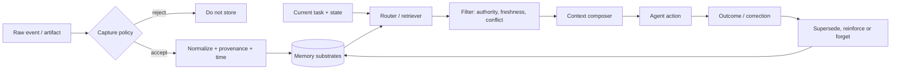

# 04 · Memory、Context Engineering 与长时状态

> 一句话点题：Agent 记忆不是“把历史都塞进向量库”，而是一个决定什么可写、怎样修订、何时检索、如何进入有限注意力预算、何时遗忘的状态管理系统。

<div class="lesson-meta"><span>AGF10—AGF12</span><span>强化核心</span><span>预计 9 × 45 分钟</span><span>前置：AGF01—03、AGF07—09</span></div>

## 解锁与跳过

任务跨多轮/多日、需要恢复、个性化或长期 policy 时解锁。单次短任务先用显式输入；不要因“可能以后有用”就永久保存全部对话，更不要在没有删除、冲突和隐私规则时接入长期记忆。

## 本章可观察目标

你能区分 working、episodic、semantic、procedural 与 artifact memory；设计 capture→normalize→store→retrieve→compose→supersede/forget 生命周期；比较 full context、summary、sparse/dense/graph/hierarchical 介质；构造时间冲突、错误写入和 attention dilution 测试。

## 研究问题：记住更多为什么可能更差

检索不仅有召回收益，也占据上下文和注意力。一个工程化路由目标可以写成：

$$
m^*=\arg\max_{m\in\mathcal{M}} \big(\Delta U_{task}(m)-\lambda_1 C_{token}-\lambda_2 C_{latency}-\lambda_3 R_{privacy}-\lambda_4 R_{conflict}\big)
$$

它不是某篇论文的训练目标，而是决策提醒：某条记忆即使相关，也可能过时、敏感、冲突或干扰当前动作。检索 `top-k` 只是候选生成，不是把全部候选直接注入 prompt 的理由。



## 核心机制：记忆的对象与操作分开

| 对象 | 例子 | 常见介质 | 关键操作 |
|---|---|---|---|
| working state | 当前子任务、未决问题、工具结果 | typed state / scratchpad | 覆盖、检查点、恢复 |
| episodic | 某次尝试及结果 | append-only event log | 按时间/任务检索、归因 |
| semantic | 用户偏好、业务事实 | KV/文档/图 | 合并、冲突、失效 |
| procedural | SOP、技能、政策 | 版本化文件/规则 | 优先级、适用范围、审批 |
| artifact | 代码、报告、数据集 | 对象存储/Git | 内容寻址、引用、验证 |

“短期/长期”只描述时间，不说明语义。生产系统首先要知道某条内容是什么、谁写的、何时有效、能否覆盖别的内容。

## 论文拆解一：MemGPT 的虚拟上下文

### 研究问题

2023 年模型上下文有限，长文档与多会话聊天无法全部放入 prompt。MemGPT 借操作系统虚拟内存类比，问：能否让模型主动在快速上下文与慢速外部存储之间搬运信息，获得“更大上下文”的使用体验？

### 核心机制与关键公式/架构

系统把 context window 当 main memory，把 archival/recall storage 当 secondary storage；模型通过函数调用读写不同层，并用 system events/interrupts 管理控制流。关键架构不是摘要，而是让“换页”成为 Agent 动作：模型观察内存压力、选择写出/检索，再继续推理。

### 实验与指标、真正贡献、局限

论文在超长文档分析和多会话聊天展示比基础上下文策略更好的长期使用能力。真正贡献是把 context management 提升为 Agent 可控制的系统操作。局限是模型自己决定写/读会遗漏关键事实或把错误固化；OS 类比也不意味着它拥有精确地址、缓存一致性或确定替换策略。产品上要让 capture policy 和冲突处理部分程序化。

## 论文拆解二：Mem0 的抽取、整合与图记忆

### 研究问题

全量历史上下文成本高，普通 RAG 又可能把对话切成缺乏语义的块。Mem0 研究能否从对话动态抽取显著事实，和既有记忆合并/更新，再按查询取回；扩展版用图表达实体关系。

### 核心机制与关键公式/架构

写入不是简单 append：新事实与候选旧记忆比较，选择 ADD、UPDATE、DELETE 或 NOOP；检索后再给模型。图版本把人物、偏好、事件及关系结构化以支持多跳。核心变量是“抽取器/更新器是否正确”，不是向量库品牌。

### 实验与指标、真正贡献、局限

论文在 LOCOMO 上与六类基线比较，报告 Mem0 的 LLM-as-a-Judge 指标相对 OpenAI memory 提升 26%，p95 延迟降低 91%、Token 成本节省超过 90%；graph 版本总分约再高 2%。这些是其模型/实现/数据集下的结果。真正贡献是把生产内存的准确率、延迟、成本放在同一评测。局限包括 LLM Judge、单一对话 benchmark、抽取错误传播和隐私/删除语义未被充分覆盖。

## 论文拆解三：Harness the Memory 的介质路由

### 研究问题

到 2026 年，问题从“要不要 memory”变成“不同 operating regime 应选什么 substrate”。论文在统一 harness 下比较 dense/sparse index、文本记录、结构化/分层存储、refinement memory、参数更新与 activation-compatible context。

### 核心机制、实验与指标

作者在 3 个 backbone、4 组 benchmark、用户问答与 Agent 决策上记录 26 项性能/效率指标。核心结论不是一个赢家：广召回帮助长上下文事实 QA，但过量检索会把注意力从行动关键上下文移开，伤害序列决策；历史规模增长还会让部分介质成本或脆弱性上升。

### 真正贡献、局限与产品影响

贡献是把 memory substrate 作为可路由变量，挑战“一套记忆系统覆盖全部任务”。截至截止日代码声明待接收后发布，完全独立复现仍受限。产品影响是为不同任务配置策略：事实回忆偏广召回，动作决策偏短且状态相关，长期政策需要版本/优先级而非相似度。

## 贯穿案例：用户偏好和公司 policy 冲突

记忆里有“用户喜欢自动发送邮件”，公司新 policy 要求外发附件必须审批。相似度检索可能优先取回旧偏好，Agent 直接发送。正确模型：个人偏好是 semantic memory；公司 policy 是高优先级 procedural memory，有版本和生效日期；当前任务 state 包含附件敏感级别。context composer 应按 authority 排序，偏好不能覆盖 policy；旧 policy 被 supersede 但保留审计历史。

## 复现任务：四种介质的同任务对照

生成 200 条跨 6 周事件，其中 20% 被后续事实更正、10% 属于不应保存的敏感内容、30 个问题不存在答案。比较 full history、滚动摘要、BM25/dense top-k、结构化事实表/图。分别测事实 QA 与序列决策：正确率、拒答、冲突解析、敏感泄露、Token、p95、写入/检索成本。改变历史长度和 k，画出排名是否交叉。

## 对产品架构的影响

- 每条记忆保存 `type/source/subject/time/valid_from/to/confidence/authority/supersedes/privacy`；
- 原始事件 append-only，派生事实可重建；
- 写入先过 consent/data-minimization，检索再过任务权限；
- context composer 按任务、状态、authority、freshness 组合，不只按 cosine；
- 记忆命中记录 provenance，错误结论可定位到哪次写入；
- 支持查看、更正、删除和重新索引；删除不只删向量，还处理缓存/派生数据。

## 会死在哪里

- 所有对话永久向量化；
- 新事实直接覆盖旧事实，丢失时间和来源；
- top-k 越大越好；
- 让模型自由决定敏感数据写入；
- summary 反复摘要导致语义漂移；
- procedure 与个人偏好同权；
- 只测 QA，不测动作被旧记忆误导；
- 删除主记录却保留 embedding、缓存和 prompt trace。

## 与 AI 协作模板

```text
请为该 Agent 设计 memory lifecycle：
- 区分 working / episodic / semantic / procedural / artifact；
- 定义 capture、normalize、store、retrieve、compose、supersede、forget；
- 每条记录带 provenance、时间、authority、privacy、冲突关系；
- 比较 full/summary/sparse/dense/structured，分别测试 QA 与序列决策；
- 注入过时、冲突、无答案、敏感信息和长历史；
- 报告 accuracy、refusal、leakage、token、p95 和 ranking crossover。
```

## 练习：构造一次“正确召回、错误行动”

让系统准确召回“上次测试环境可直接部署”，但当前目标是生产。检查动作规划是否因为语义相关而越过当前环境权限。修复应发生在 memory type/authority/context composition，而不是简单降低相似度。

## 常见误区

长上下文=长期记忆；向量库=memory；召回准确=行动正确；摘要天然无损；旧事实覆盖即可；图一定优于文本；更多 context 总有帮助；模型能自行处理隐私；一次 QA benchmark 可选定所有介质。

<Quiz question="为什么事实 QA 上更高召回的记忆方案可能让 Agent 决策变差？" :options="['检索一定会随机删除答案', '过多非行动关键内容会稀释当前状态与约束的注意力', '因为向量库不能存文本']" :answer="1" explanation="2026 年介质对照表明任务形态会改变召回收益与注意力成本的平衡。" />

## 本章小结

- Memory 是生命周期和权限问题，不是一个数据库选型。
- MemGPT 让上下文换页成为动作，Mem0 强调抽取/整合，2026 研究强调介质路由。
- 事实回忆和序列决策的最优检索策略可能相反。
- provenance、时间、authority、supersede 和删除必须进入数据模型。
- 记忆系统要同时评测正确、成本、干扰、冲突与隐私。

<EvidenceTracker lesson="frontier-agent-04-memory-context" />

## 本章完成标准

完成四种介质/两类任务对照；正确处理冲突、无答案和敏感删除；能解释为什么不存在通用最佳 memory。最近平均至少 7/10。

<div class="source-note">主要来源：<a href="https://arxiv.org/abs/2310.08560">MemGPT</a>、<a href="https://arxiv.org/abs/2504.19413">Mem0</a>、<a href="https://arxiv.org/abs/2608.15008">Harness the Memory</a>；核验截止 2026-08-30。</div>
