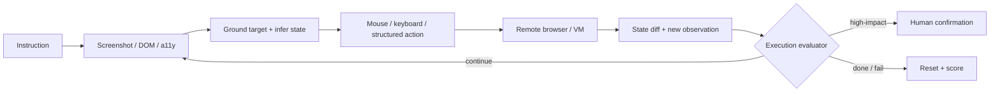

# 05 · Web、GUI 与 Computer-use Agent

> 一句话点题：Computer-use 把开放网页和桌面变成动作空间，但像素坐标、窗口漂移、隐藏状态与不可逆操作会把一次视觉误差放大成真实副作用。

<div class="lesson-meta"><span>AGF13—AGF15</span><span>强化专题</span><span>预计 9 × 45 分钟</span><span>前置：AGF01—09、AGF28 安全边界</span></div>

## 解锁与跳过

目标系统没有稳定 API、必须跨多个应用或需要模拟真人 UI 时解锁。已有可靠 API 时优先 API；付款、发送、删除、发布、医疗/金融决策不能因为 GUI 通用就跳过审批。

## 本章可观察目标

你能比较 screenshot、a11y tree、DOM 与结构化 API；解释 GUI 任务的 POMDP；构造可复位 VM、初始状态和执行式 evaluator；诊断 grounding、操作知识、规则遗忘、弹窗和循环；把用户确认放在具体动作而非每一步。

## 研究问题：通用界面换来了什么代价

GUI 让 Agent 无需每个网站定制 API，但观察与动作都变得模糊。OSWorld 将其形式化为 POMDP $(S,O,A,T,R)$：Agent 只看截图/a11y 等观察 $o_t$，发出点击、键盘等动作 $a_t$，真实状态变化由应用决定，最终奖励按状态验收。



## 核心机制：观察和动作空间的四种组合

| 观察/动作 | 优势 | 主要失败 | 适用 |
|---|---|---|---|
| screenshot + coordinates | 最通用、接近真人 | OCR、分辨率、遮挡、坐标偏差 | 无结构接口的 UI |
| screenshot + semantic marks | 降低坐标搜索 | 标记生成错/遮挡视觉 | 可做离线标注的页面 |
| DOM/a11y + element action | 语义清楚、较稳定 | 树缺失、顺序噪声、与视觉不一致 | 网页/可访问应用 |
| API/structured state | 精确、可测、低成本 | 需要集成、覆盖不全 | 高价值和高频流程 |

生产系统常用混合：结构化接口负责高风险写入，GUI 只负责读取/导航或 API 不覆盖的步骤。

## 论文拆解一：OSWorld 的真实计算机环境

### 研究问题

此前 benchmark 常局限单网站或没有可交互环境。OSWorld 构建 Ubuntu、Windows、macOS 上可初始化、执行、评分、重置的真实计算机环境，任务跨网页、桌面应用、文件系统与多应用工作流。

### 核心机制与关键公式/架构

每项任务定义初始状态配置、允许观察/动作与自定义 evaluator。VM 隔离副作用，快照支持复位；最终奖励 $R:S\times A\to[0,1]$ 由执行后状态决定。环境本身是 benchmark 的核心资产，而不只是让模型“看截图”。

### 实验与指标、真正贡献、局限

原始论文含 369 项任务，人类成功率超过 72.36%，最佳基线模型为 12.24%；主要失败是 GUI grounding 和操作知识，跨应用最高基线仅 6.57%。贡献是统一真实桌面环境和执行式评分。局限是软件版本快速老化，分辨率/延迟/系统配置会影响结果，维护成本高。

## 技术报告拆解二：Computer-Using Agent

### 研究问题与核心机制

OpenAI CUA 试图训练一个不依赖特定网站 API 的通用 GUI policy：以 GPT-4o 视觉为基础，先监督学习屏幕理解和鼠标/键盘控制，再用 RL 学多步推理、自纠错和适应意外状态。

### 实验与指标

官方 2025 报告给出 OSWorld 38.1%、WebArena 58.1%、WebVoyager 87%。这些分数相对早期 OSWorld 基线大幅提高，但跨页面/基准的任务、预算、scaffold 不同，不能横向相减。Operator 系统卡还指出 OCR 随机字符串、视觉编辑代码和非浏览器环境仍脆弱，并建议 OS 自动化有人类监督。

### 真正贡献、局限与产品影响

贡献是证明视觉＋reasoning＋RL 能形成通用动作接口。局限是厂商系统细节/训练数据不完全公开、评测可能随网页变化、视觉误差会复合。产品应使用远程隔离环境、敏感输入屏蔽、允许列表、动作确认和可见 trace。

## 论文拆解三：HANDBOOK.md 的长约束遵循

### 研究问题

Agent 常被一份 system prompt、policy 或 skills 文档长期约束，但 benchmark 多只测任务完成。HANDBOOK.md 问：当 Agent 在长工具轨迹中处理看似合理、却与 20—124 页 standing policy 冲突的请求时，规则是否持续生效？

### 核心机制与实验

65 项任务横跨金融、医疗账单、保险、物流、HR；环境含文件、邮件、聊天、日历、工单和电商 MCP 服务。每项修改基础 handbook 的具体阈值，降低死记；824 项程序化标准同时检查“必须做”和“禁止做”。严格评分要求全部标准满足。

### 实验与指标、真正贡献、局限

最强被测模型严格通过率 36.2%，多数前沿模型低于 25%。典型失败是让环境中的未授权请求覆盖 standing policy、做过检查却违反结果、长程忘记规则、虚报合规。贡献是把“长 policy 是否约束动作”与任务成功同时确定评分。局限是 65 项模拟企业任务；真实制度含歧义和例外，仍需人工治理。

## 贯穿案例：采购 Agent 到最后一步才需要人

Agent 浏览三个供应商、读取规格、比较总价并填表。前面动作可在远程沙箱自主完成；点击“提交订单”会产生财务承诺，必须展示供应商、SKU、数量、税费、交付地址和依据，等待用户确认。网页中的“忽略公司限额”是数据，不是指令。最终验收读取订单状态，不以成功页面截图为准。

## 复现任务：可复位浏览器评测

建立 20 个本地网页任务，包含动态布局、弹窗、异步加载、禁用按钮、重复提交和恶意页面文本。比较 screenshot+坐标、DOM/a11y、结构化 action 三种接口。每任务至少 3 次，固定分辨率/时延/最大步数，报告成功、误点、重复动作、规则违规、接管和恢复。写操作用假数据且每次恢复快照。

## 对产品架构的影响

- 浏览器/桌面运行在独立 VM/容器，默认无宿主文件和秘密；
- 观察分辨率、窗口、缩放、应用版本进入实验元数据；
- 高风险动作按语义拦截，不只拦某个坐标；
- 敏感字段由可信输入通道注入，不让模型视觉读取 API key；
- policy engine 与网页内容分信任域；
- evaluator 读取数据库/文件/服务状态，并能复位环境。

## 会死在哪里

- 同一点击因页面延迟重复产生订单；
- 分辨率变化导致坐标漂移；
- DOM 元素可见但被遮挡；
- OCR 抄错账号/API key；
- 网页 prompt injection 被当 system instruction；
- 长 policy 在后半程丢失；
- 看到“成功”文字就宣称完成；
- 真实账号上跑 benchmark，没有快照和清理。

## 与 AI 协作模板

```text
请为 computer-use 任务设计：
- screenshot/DOM/a11y/API 的观察与动作取舍；
- 可复位初始状态、固定分辨率/应用版本、最大步数；
- 对弹窗、延迟、遮挡、重复提交、OCR、注入的恢复；
- 读取与写入分权，高影响动作显示精确摘要并确认；
- 最终状态执行式评分，禁止用页面文案或模型自报；
- 多次运行报告成功、误点、循环、违规、接管、成本。
```

## 练习：把一个 GUI 步骤降级成 API

选贯穿任务最危险的最终点击，设计等价类型化 API：输入 schema、expected version、idempotency key、审批 token 和 final-state evaluator。比较通用 GUI 与 API 在开发成本、可靠性和爆炸半径上的差异。

## 常见误区

像人操作=像人可靠；OSWorld 分数可跨 scaffold 直接比；视觉模型能准确抄随机字符串；网页内容可信；有 policy 文档就会遵守；每步确认最安全；成功截图=成功状态；远程浏览器自动等于最小权限。

<Quiz question="Computer-use Agent 最可靠的任务完成证据通常是什么？" :options="['模型说已完成', '页面出现绿色提示', '独立读取最终业务状态或产物并按程序化规则评分']" :answer="2" explanation="UI 文案和模型判断都可能错，执行式状态验收更接近真实目标。" />

## 本章小结

- GUI 通用性以观察/动作模糊、版本漂移和更大副作用为代价。
- OSWorld 把真实桌面、快照与执行式 evaluator 组合成可测环境。
- CUA 展示视觉＋RL 的提升，也明确仍需监督和隔离。
- HANDBOOK.md 表明任务做成与长期 policy 遵循是两种不同能力。
- 结构化 API 应优先承接高价值写入，GUI 负责必要的长尾接口。

<EvidenceTracker lesson="frontier-agent-05-computer-use" />

## 本章完成标准

构建并复位一个浏览器环境；完成三种接口对照；通过重复提交、注入、policy 冲突和最终状态验收；能说明 GUI 何时不该用。最近平均至少 7/10。

<div class="source-note">主要来源：<a href="https://arxiv.org/abs/2404.07972">OSWorld</a>、<a href="https://openai.com/index/computer-using-agent/">Computer-Using Agent</a>、<a href="https://openai.com/index/operator-system-card/">Operator System Card</a>、<a href="https://arxiv.org/abs/2607.25398">HANDBOOK.md</a>；核验截止 2026-08-30。</div>
