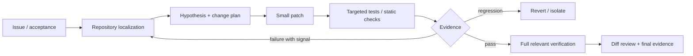

# 06 · Coding Agent 与长程软件工程

> 一句话点题：Coding Agent 的核心不是生成更多代码，而是能在真实仓库里定位、修改、运行、验证、恢复；模型只是整个软件执行环境中的一个决策器。

<div class="lesson-meta"><span>AGF16—AGF18</span><span>高价值专题</span><span>预计 10 × 45 分钟</span><span>前置：AGF01—09、SW01—16、Q01—15</span></div>

## 解锁与跳过

如果你正在长期使用 Codex/Claude Code，本章直接关联你的工作。只问代码片段可先不学完整 harness；一旦允许 Agent 修改仓库、安装依赖、运行命令或提交 PR，沙箱、测试、diff 和回滚成为必需前置。

## 本章可观察目标

你能拆解 repo localization、patch generation、execution feedback、validation；比较 Agent 与 Agentless；复现 ACI 对行为的影响；识别 SWE-bench 的数据/镜像/测试/资源混淆；建立适合自己项目的长任务任务板和恢复点。

## 研究问题与关键公式：代码生成为什么不是软件工程

真实修复的目标不是最大化代码相似度，而是让仓库从初始状态 $s_0$ 变为满足验收 $G$ 的状态 $s_T$：

$$
\text{success}=\mathbf{1}[tests_{fail\to pass}=1 \land tests_{pass\to pass}=1 \land policy=1]
$$

还要报告测试覆盖不到的行为、安全和可维护性。Agent 的动作包括搜索、读文件、编辑、运行、安装、回退；ACI 决定它能否高效表达这些动作。



## 核心机制：Harness 与 ACI 各做什么

Harness 决定任务分解、上下文、预算、检查点和角色；ACI 决定 Agent 怎样观察/操作计算机。一个高质量 ACI 会给稳定的文件定位、范围查看、精确编辑、快速测试和简洁错误，而不是把整个 IDE 屏幕当唯一接口。

| 层 | 可控变量 | 典型测量 |
|---|---|---|
| model | checkpoint、reasoning、temperature | 同 scaffold 的 success |
| prompt/policy | 指令、AGENTS.md、工具说明 | 规则遵循、步骤分布 |
| ACI/tools | search/edit/test 语义 | 工具失败、Token、定位速度 |
| environment | image、CPU/RAM、network | infra error、超时、方差 |
| evaluator | tests/rubric/judge | false pass/false fail |

## 论文拆解一：SWE-bench 定义真实仓库任务

### 研究问题

传统代码生成题上下文短、函数级、答案容易验证。SWE-bench 从真实 GitHub issue 与对应 PR 构造 2,294 项任务，要求模型理解仓库并编辑多个文件，再用测试验证。

### 核心机制与实验

每项提供代码库与 issue 描述，评测在固定仓库版本执行补丁和测试。当时最佳 Claude 2 只解决 1.96%，说明早期模型在长上下文、定位和跨文件协调上远未成熟。贡献是把软件工程变成可执行、可持续扩展的 Agent benchmark。

### 真正贡献、局限与产品影响

局限包括环境构建失败、测试不完备、issue/patch 泄漏、真实 PR 可能包含非必要修改。SWE-bench Verified 改善人工核验，但任何排行榜仍绑定数据版本和 harness。产品上应复制“任务初态＋确定验收”，不是复制一个总分。

## 论文拆解二：SWE-agent 证明接口设计重要

### 研究问题与核心机制

SWE-agent 提出 Agent-computer interface：为模型设计专用命令和反馈，使其更容易导航仓库、查看适量代码、编辑和运行测试。它把 Agent 当一类新的计算机用户，研究接口设计对行为的因果影响。

### 实验与指标

论文在 SWE-bench 和 HumanEvalFix 报告 pass@1 12.5% 与 87.7%，显著超过当时非交互方法。关键解读是“相同/相近模型在更合适 ACI 中更有效”，不是“自治一定比固定流程好”。

### 真正贡献、局限与产品影响

贡献是把 ACI 从实现细节变为研究变量，并公开系统/轨迹。局限是 tool prompt、模型版本、预算和 benchmark 都会影响绝对分。对你的工作，`rg`、局部读取、结构化 patch、可定位测试输出往往比更长 prompt 更有复利价值。

## 论文拆解三：Agentless 挑战自治必要性

### 研究问题与核心机制

Agentless 问：复杂自治循环真的必需吗？它使用固定三阶段——localization、repair、patch validation——让模型在每阶段生成候选，而不自主选择任意下一工具。

### 实验与指标

在 SWE-bench Lite，论文报告 32.00%（96 个修复）和约 0.70 美元/任务，优于当时开源 Agent；作者还人工分析有精确 ground-truth patch 或 issue 描述不足的问题，并构造 Lite-S。

### 真正贡献、局限与产品影响

真正贡献是强基线和数据集审计：复杂性必须证明增量。局限是固定流程可能不覆盖探索性重构、跨服务调试；Lite 规模也不同于完整 benchmark。产品应让 Agent 只接管固定流程无法表达的分支。

## 论文拆解四：SWE-Lancer 把任务价值纳入评测

### 研究问题与核心机制

SWE-Lancer 收集 1,400+ 个 Upwork 软件任务，总真实支付价值 100 万美元；既有独立编码任务，也有管理者从实现方案中选择的任务。独立任务由端到端测试、三位经验工程师复核，管理任务对照实际雇佣经理选择。

### 实验与指标、贡献与局限

论文发现当时前沿模型仍无法解决多数任务。贡献是把任务复杂度和经济价值连接，并覆盖管理决策。局限是市场价格受议价/地域/客户影响，不是纯难度；能通过测试也不等于长期维护价值。

## 贯穿案例：长任务为什么需要恢复点

目标是给现有 Vue/TS 网站新增学习专题。若 Agent 一次性改 30 文件，后半程上下文压缩后可能忘记导航、内容契约或 Vue/TS 要求。可靠 harness 把工作拆成可验收纵向切片：数据/侧栏→一个示范章节→内容契约→其余章节→构建→本地 HTTP→提交。每片保存 git diff、测试结果、未决风险和下一动作；新会话从证据恢复，不靠聊天记忆。

## 复现任务：Agent vs Agentless 消融

选 15 个你自己仓库的历史 issue，冻结到问题前 commit。A 使用固定 localization→patch→validate；B 使用 Agent 自由工具循环；C 在 B 中移除专用 `rg`/patch ACI。固定模型、最大调用、CPU/RAM和网络，至少 3 次运行。报告 resolved、测试回归、定位准确、工具错误、Token、wall-clock、人工接管和 diff 大小。

## 对产品架构的影响

- 每个任务拥有隔离 workspace/worktree、明确 writable roots 和无生产凭证环境；
- 任务板保存 acceptance、依赖、owner、状态和证据，不让聊天历史充当项目管理；
- 编辑使用最小 patch，验证从 targeted 到 full relevant checks；
- 测试环境锁定镜像、依赖、CPU/RAM、时间和网络策略；
- 失败分类区分 model、tool、environment、test、spec；
- 完成声明包含 diff、命令、退出码、未验证项和回滚点。

## 会死在哪里

- 读完整仓库把有效上下文淹没；
- 改完再跑一次大测试，无法定位因果；
- 测试失败后修改测试使其通过；
- 自动安装/执行不可信依赖；
- 资源上限差异被当模型差异；
- 只看 resolved，不看过度修改和隐性回归；
- Agent 的“完成”没有 git diff/测试证据；
- 多 Agent 同写 workspace 产生冲突。

## 与 AI 协作模板

```text
请在隔离仓库中处理该 issue：
- 先复述 acceptance、非目标和风险；
- 用 rg/局部阅读完成 localization，列证据而非猜测；
- 一次最小 patch，只改与假设有关的文件；
- targeted checks → relevant full checks → diff review；
- 固定环境、资源、预算并记录所有命令/退出码；
- 若无进展/需求冲突/需外部权限，停止并给最小阻塞证据；
- 最终报告改动、验证、未验证、回滚，不接受口头完成。
```

## 练习：给自己的 Codex 工作做一次 ACI 复盘

抽取最近 5 个任务，统计多少 Token/时间花在找文件、反复读大文件、错误编辑和重跑无关测试。把最高浪费环节沉淀为 `rg` 查询、内容契约、验证脚本或模板，再用同类任务验证是否减少步骤而不降低正确性。

## 常见误区

SWE-bench 分数=工作替代率；更自治=更好；测试绿=需求满足；工具越通用越强；更大 context 不需定位；多 Agent 天然更快；模型升级后旧 harness 永远有用；基准 CPU/RAM 不影响结果。

<Quiz question="Agentless 的核心启示更接近哪一项？" :options="['Agent 永远无用', '任何自治复杂度都应相对强固定流程基线证明增量', '模型不应该运行测试']" :answer="1" explanation="论文挑战的是自治的必要性，不是否定所有需要探索和恢复的任务。" />

## 本章小结

- Coding Agent 是模型、ACI、harness、环境和 evaluator 的组合。
- SWE-bench 提供真实仓库任务，SWE-agent 显示 ACI 是能力变量。
- Agentless 说明强固定流程可能更便宜更强，自治需做消融。
- SWE-Lancer 扩展到真实价值，但价格不是纯能力尺度。
- 你的长期护城河是 acceptance、SOP、测试、任务板和恢复证据。

<EvidenceTracker lesson="frontier-agent-06-coding-agents" />

## 本章完成标准

完成 Agent/Agentless/ACI 消融；锁定环境和资源；至少处理一个真实 issue 并提交 diff＋测试＋失败边界；能解释总分不能直接归因模型。最近平均至少 7/10。

<div class="source-note">主要来源：<a href="https://arxiv.org/abs/2310.06770">SWE-bench</a>、<a href="https://arxiv.org/abs/2405.15793">SWE-agent</a>、<a href="https://arxiv.org/abs/2407.01489">Agentless</a>、<a href="https://arxiv.org/abs/2502.12115">SWE-Lancer</a>；核验截止 2026-08-30。</div>
