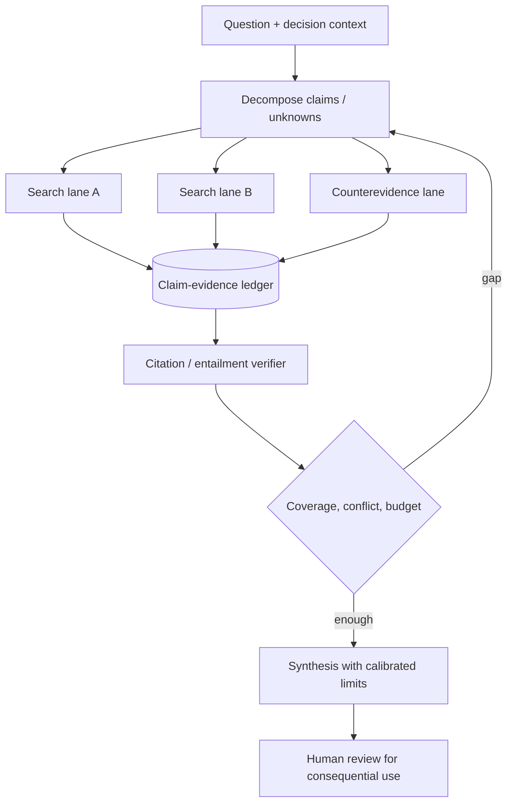

# 07 · Deep Research 与 Multi-agent

> 一句话点题：研究 Agent 的价值不是写得长，而是能把开放问题拆成可追踪主张，持续找到一手证据、暴露缺口与冲突，并在并行成本值得时扩大覆盖。

<div class="lesson-meta"><span>AGF19—AGF21</span><span>高价值专题</span><span>预计 10 × 45 分钟</span><span>前置：AGF01—12、AGF25—30</span></div>

## 解锁与跳过

任务需要多跳浏览、证据整合、文件/数据分析或互相独立的搜索方向时解锁。单一已知页面摘要、简单事实查询不要多 Agent；高风险结论必须保留人工复核和反证搜索。

## 本章可观察目标

你能建立 question→claim→evidence→counterevidence 图；区分 search coverage、source quality、citation entailment 与 synthesis correctness；设计 lead/subagent/citation verifier；用单 Agent 同 Token 预算对照多 Agent；识别搜索停止、网页注入和“引用存在但不支持”失败。

## 研究问题与关键公式：找到资料为什么不等于完成研究

研究输出至少有三种正确性：来源真实、引用支持主张、综合结论不过度外推。一个主张 $c_i$ 的支持可建模为证据集合 $E_i$：

$$
support(c_i)=\max_{e\in E_i} entail(e,c_i),\quad
coverage=\frac{|\{c_i:support(c_i)\ge\tau\}|}{|C|}
$$

还要记录反证、时间和来源独立性。十篇互相转载的文章不是十份独立证据。



## 核心机制：证据账本先于正文

每条记录至少含 `claim_id/source_url/source_type/published/retrieved/passage/supports-or-challenges/confidence/independence/notes`。正文由账本生成，而不是先写结论再找引用。搜索 lane 也按问题划分，不按“让三个 Agent 都搜一下”划分。

| 失败 | 看起来像成功 | 真正检查 |
|---|---|---|
| citation correctness | 链接存在 | 引文是否蕴含紧邻主张 |
| source quality | 来源很多 | 是否一手、独立、日期合适 |
| coverage | 报告很长 | 决策关键主张是否都有证据 |
| synthesis | 每句有引用 | 是否跨来源过度推出因果 |
| freshness | 搜到热门资料 | 是否覆盖截止日前最新版本 |

## 论文拆解一：GAIA 的通用助手任务

### 研究问题

GAIA 设计对人概念简单、对 AI 却需要推理、多模态、浏览和工具的现实问题，试图测量“能否把基本能力组合起来”。数据含 466 题，300 个答案保留用于 leaderboard。

### 实验与指标、真正贡献、局限

原论文报告人类 92%，带插件 GPT-4 为 15%。贡献是把难度从专业知识转向工具组合和鲁棒执行。局限是题量有限、答案泄漏/网络变化、短答案不测长报告证据链。产品不能用 GAIA 总分替代自己的查询分布。

## 论文拆解二：BrowseComp 的持续搜索

### 研究问题与核心机制

BrowseComp 有 1,266 个难找、纠缠事实问题，答案短且可对照；创建者要求另一位人类在十分钟和当时模型下无法轻易解决，并加入 canary 降低训练污染。它隔离“持续、创造性地找到信息”，故意不测长报告和歧义澄清。

### 实验与指标

人类尝试 1,255 题，29.2% 在最多约两小时内解决；原论文中 GPT-4o 0.6%、带浏览 1.9%、o1 9.9%、Deep Research 51.5%。Deep Research 在该题型上接受过专门训练，这一点必须和分数一起写。64 次采样的聚合策略相对单次报告 15%—25% 提升，但也付出巨大 test-time compute；浏览模型校准误差反而高。

### 真正贡献、局限与产品影响

贡献是一个难找但易验的 browsing core benchmark，并展示性能随 test-time compute 扩展。局限是短静态答案、非真实用户分布、训练适配和搜索引擎变化。产品要单独评测引用、歧义、时效和停止，而非只追求 obscure fact accuracy。

## 系统卡拆解三：Deep Research 的浏览＋代码执行

### 研究问题与架构

OpenAI Deep Research 使用优化浏览的早期 o3，在网页、图片、PDF间多步搜索，按发现调整路径，并能读用户文件、写 Python 分析。系统卡把新风险聚焦到 prompt injection、隐私、代码执行、偏差和幻觉。

### 真正贡献、局限与产品影响

它证明研究 Agent 是“浏览 policy＋数据分析环境＋引用产品＋安全层”的完整系统，不是搜索 API。系统卡无法公开训练/全部评测细节，也不是独立审计；产品应保留可信站点范围、代码沙箱、个人信息策略和引用验证。

## 工程报告拆解四：Anthropic 多 Agent 研究系统

### 核心机制与关键架构

lead researcher 制定策略并派发独立 subagent；subagent 迭代搜索并返回压缩发现；lead 决定是否继续；CitationAgent 最后定位主张的具体引用。计划写入 memory 以跨长上下文保存。适合 breadth-first、独立方向和超单上下文信息量。

### 实验与指标、真正贡献、局限

官方内部 eval 报告 Opus 4 lead＋Sonnet 4 subagent 相对 single Opus 4 高 90.2%；分析称 BrowseComp 性能方差 80% 可由 Token 用量单独解释，工具调用和模型选择加起来三者解释 95%。Agent 通常约用聊天 4 倍 Token，多 Agent 约 15 倍。真正贡献是把并行收益和 Token 成本同时公开；局限是内部 eval 未完整公开、不是同 Token 必然公平，厂商经验需独立复现。

## 贯穿案例：研究“近三年 Agent memory 是否有统一最佳方案”

错误做法是三个 Agent 分别搜“memory papers”，最后投票。正确拆分：A 查架构谱系，B 查 benchmark/指标，C 查反证与负结果，D 查 2026 最新；共享账本按 source/claim 去重。lead 的停止条件是核心介质都有一手对照、冲突被解释、最新截止日覆盖，而不是“字数够了”。最终结论应是条件路由，不是选一个产品赢家。

## 复现任务：单 Agent 与多 Agent 同预算对照

准备 20 个广度型和 20 个强依赖型研究问题。A 单 Agent 60k Token；B lead＋3 worker 合计也限 60k；C multi-agent 允许 15×聊天预算。测答案正确、关键主张覆盖、引用蕴含、一手来源比例、重复来源、wall-clock、Token、协调错误。验证多 Agent 优势到底来自并行结构还是更多计算。

## 对产品架构的影响

- lead 输出 typed research plan：claim、lane、source policy、budget、stop；
- subagent 返回 evidence records，不返回长散文；
- 去重按根来源与主张，不按 URL 字符串；
- citation verifier 不改结论，只标支持/不支持/部分支持；
- 浏览内容永远处于 untrusted data 域，不能发指令；
- high-stakes 结论要求人工查看关键原文和反证。

## 会死在哪里

- subagent 数量按“越多越好”生成；
- 各 lane 重复搜同一关键词；
- 汇总器丢掉不确定与冲突；
- 链接存在就当引用支持；
- 多 Agent 用 15 倍 Token 却只和低预算单 Agent 比；
- 搜不到不存在的来源仍无限循环；
- 网页 prompt injection 进入共享 memory；
- 把内部供应商 eval 当普遍规律。

## 与 AI 协作模板

```text
请先建立 claim-evidence ledger，再写报告：
- 把问题拆成独立 search lanes、依赖 lane 和 counterevidence lane；
- 每条证据记录一手/二手、日期、原文位置、支持/挑战、独立性；
- 限制 subagent 数、每 lane Token/工具预算与停止条件；
- 汇总前运行 citation entailment、根来源去重和关键遗漏检查；
- 与同总 Token 的 single-agent 对照，再单独报告高预算收益；
- 结论写适用条件、未知量和截止日。
```

## 练习：故意制造“有引用的幻觉”

给系统一篇标题相关、正文不支持目标数字的论文，观察 CitationAgent 是否只因关键词命中就引用。修复 rubric：引用必须支持紧邻原子主张；复合句拆分；只能支持部分时降级措辞或标未知。

## 常见误区

Deep Research=搜索＋长文；多 Agent 投票=独立证据；更多来源=更可靠；链接存在=引用正确；并行必然更省钱；BrowseComp 高分=会做真实咨询；内部 eval 可直接外推；报告长度=研究深度。

<Quiz question="多 Agent 研究优于单 Agent时，为什么仍需同总 Token 对照？" :options="['为了让运行更慢', '否则无法区分协调结构收益与单纯增加 test-time compute', '因为 subagent 不能浏览']" :answer="1" explanation="官方工程数据也表明 Token 使用能解释大量性能方差。" />

## 本章小结

- 研究 Agent 的核心对象是可审计 claim—evidence 图。
- GAIA 测组合能力，BrowseComp 测持续浏览，但都不是完整研究质量。
- 多 Agent 特别适合独立广度搜索，强依赖任务协调收益较小。
- 预算是实验变量；15 倍 Token 的系统不能伪装成架构免费提升。
- 引用正确、来源质量、覆盖和综合准确必须分别评测。

<EvidenceTracker lesson="frontier-agent-07-research-multi-agent" />

## 本章完成标准

完成 40 题同预算/高预算对照或等价小型实验；关键主张可回溯到一手来源；展示一次不支持引用被 verifier 拒绝；能写清多 Agent 的启用边界。最近平均至少 7/10。

<div class="source-note">主要来源：<a href="https://arxiv.org/abs/2311.12983">GAIA</a>、<a href="https://arxiv.org/abs/2504.12516">BrowseComp</a>、<a href="https://openai.com/index/deep-research-system-card/">Deep Research System Card</a>、<a href="https://www.anthropic.com/engineering/multi-agent-research-system">Anthropic Multi-agent Research</a>；核验截止 2026-08-30。</div>
