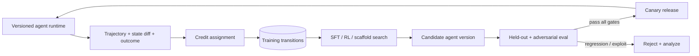

# 08 · Agent Learning、RL 与自我改进

> 一句话点题：Agent learning 的难点不是“用 RL 让模型更聪明”，而是把稀疏、延迟、可被钻空子的任务结果，正确归因到长轨迹中的少数决策，同时防止系统只学会刷 benchmark。

<div class="lesson-meta"><span>AGF22—AGF24</span><span>研究深水区</span><span>预计 11 × 45 分钟</span><span>前置：AGF01—21、AGF25—30</span></div>

## 解锁与跳过

只有任务稳定、轨迹可记录、奖励可验证、held-out eval 完整且有回滚时解锁。多数产品先通过 prompt、工具、workflow、memory 和 eval 获得更大收益；没有可靠奖励时，在线 RL 与自我改写应跳过。

## 本章可观察目标

你能把 Agent 轨迹表示为 MDP；解释 credit assignment、on/off-policy、reward hacking 与 distribution shift；比较 scaffold search、SFT、RL；复现一次离线信用分配；设计自改 Agent 的训练/评测/发布隔离和不可回归门禁。

## 研究问题与关键公式：最终成功怎样分给中间动作

轨迹 $\tau=(s_0,a_0,\ldots,s_T)$ 最后只有任务奖励 $R(\tau)$。策略梯度目标可写成：

$$
J(\theta)=\mathbb{E}_{\tau\sim\pi_\theta}[R(\tau)],\qquad
\nabla J\approx\sum_t \nabla_\theta\log\pi_\theta(a_t|s_t)\hat A_t
$$

核心是 $\hat A_t$：哪个工具选择、参数、观察解释真正造成成功/失败？把同一个最终分复制给所有 Token 会产生噪声；由 LLM 随意解释信用又可能把偏见注入训练。



## 核心机制：三种“自我改进”不要混用

| 方法 | 改变对象 | 反馈 | 主要风险 |
|---|---|---|---|
| verbal reflection | context/memory | 单次失败描述 | 错误经验固化 |
| scaffold/program search | prompts/tools/control code | benchmark score | 过拟合/污染 evaluator |
| model post-training | parameters | demonstrations/reward | 奖励黑客、灾难性回归 |

先做最可回退的层。能通过改工具 schema 修复的问题，不应先动模型参数。

## 论文拆解一：A Self-Improving Coding Agent（SICA）

### 研究问题与核心机制

SICA 给 coding Agent 基本工具，并允许它编辑自身 agent code；候选版本在任务 benchmark 上运行，得分反馈驱动继续修改。它把 Agent 设计从人工固定 scaffold 变成开放式程序搜索。

### 实验与指标

论文在随机 SWE-bench Verified 子集上报告从 17% 提升到 53%，并在 LiveCodeBench 和合成 agent benchmark 上报告额外增益。这个幅度很吸引人，但读法必须包含“随机子集、搜索预算、选择过程、held-out 是否隔离、候选失败成本”。

### 真正贡献、局限与产品影响

贡献是展示 Agent 能修改自身 scaffold 并产生可测增益。最大局限是 meta-overfitting：改进器可能针对 benchmark/evaluator 的偶然性优化；自改代码还扩大供应链和权限风险。产品上训练环境绝不能持有生产秘密/权限，候选只能经独立 eval 和人工审查进入 canary。

## 论文拆解二：Agent Lightning 的训练—执行解耦

### 研究问题

现有 RL 常把整个 Agent 轨迹拼成一个序列、用 mask 训练，强耦合具体框架。Agent Lightning 问：能否让任何现有 Agent 少改代码，就把运行轨迹转成统一 MDP transition 并训练？

### 核心机制与关键架构

它提出 Training-Agent Disaggregation：runtime 独立执行并用可观测性接口记录；统一数据接口把不同框架的事件转成状态/动作/奖励；LightningRL 的分层信用分配把复杂多 Agent/动态 workflow 轨迹拆成训练 transition。训练器不直接侵入业务 Agent 控制流。

### 实验与指标、真正贡献、局限

论文在 text-to-SQL、RAG、数学工具任务展示稳定提升。贡献是系统接口和信用分配抽象，而非宣称单一 RL 算法普遍最优。局限是任务奖励相对清楚、现实长任务反馈更脏；轨迹 schema 统一也可能丢失框架特有语义。

## 论文拆解三：Agent² RL-Bench 检查“Agent 会不会做 RL 工程”

### 研究问题与核心机制

2026 benchmark 不只训练 Agent，而是评测 Agent 能否自主设计、实现并运行完整 RL post-training pipeline。六项任务分三层，从静态规则训练到在线 rollout 闭环；隔离 workspace、grading API 和 instrumentation 记录提交/代码修订并生成诊断报告。

### 实验与指标

论文跨 5 个 Agent 系统、6 个 driver LLM。ALFWorld 的一个 RL-only Agent 经 SFT warm-up＋GRPO 在线 rollout 从 5.97 提到 93.28；DeepSearchQA 仅 +2.75，处于评测噪声；同 scaffold 换 driver 可让交互提升从近零到 +78 个百分点。总体上固定预算内监督管线占优，在线 RL 只在 ALFWorld 成为最终最佳路线。

### 真正贡献、局限与产品影响

贡献是揭示“会调用训练脚本”与“能选对训练路线”不同，并公开交互诊断。局限是六项任务、奖励和算力预算仍有限。产品启示：先用 SFT/数据/工具基线，RL 作为有证据触发的最后一公里；报告改进相对噪声和算力。

## 贯穿案例：自动优化研究 Agent 的检索策略

奖励若只看最终答案，Agent 可能记住 benchmark、过度查询高分网站或把置信度写得更像 Judge 偏好。可靠设计把数据分 train/dev/held-out/adversarial；奖励分别计算任务正确、引用支持、Token、延迟和安全；训练时无 held-out 答案访问。候选若正确率升 5 分但注入成功率升 2 分，不能发布。

## 复现任务：离线轨迹信用分配

收集 100 条固定 research/tool Agent 轨迹，保留每步状态差分和最终程序化结果。人工标注 20 条关键决策作 gold。比较三种分配：全轨迹同 reward、规则按里程碑分、LLM credit model。测与人工标签一致、训练后 held-out 成功、成本与安全回归。先只优化可回退的路由/提示，不在线改生产模型。

## 对产品架构的影响

- runtime 和 trainer 分离，轨迹 schema 版本化且可重放；
- reward 同时含任务、成本、安全，不允许单指标覆盖硬门禁；
- train/dev/held-out/adversarial 与生产流量隔离；
- candidate Agent 是不可变版本，记录父版本/数据/代码/模型；
- 自改系统只能修改允许目录，无评测答案和发布凭证；
- release 经过离线、shadow、canary、回滚，绝不直接自部署。

## 会死在哪里

- reward 由同一模型自评，Agent 学会讨好 Judge；
- benchmark 泄漏给自改 Agent；
- 最终分复制给全部动作导致错误信用；
- 只看平均提升，不看关键安全回归；
- 在线 RL 在不可复位真实环境探索；
- 候选能修改 evaluator/测试；
- 训练轨迹含秘密和私人数据；
- “自我改进”没有版本、父链和回滚。

## 与 AI 协作模板

```text
请先证明该 Agent 值得训练：
- 给 prompt/tool/workflow/SFT 强基线与误差分类；
- 定义 state/action/reward/terminal 和轨迹 schema；
- 比较三种 credit assignment，并用人工子集校准；
- 严格隔离 train/dev/held-out/adversarial 与 evaluator；
- reward 含任务/成本，安全使用硬门禁；
- 候选无权改测试或发布，输出版本、父链、回滚和 canary 方案。
```

## 练习：设计一个会被钻空子的奖励

给“减少工具调用”高权重，观察 Agent 是否不查证就回答；给“用户满意”高权重，观察是否违反 policy 迎合用户。写出 proxy 被利用的轨迹，再把不可违反约束从软奖励提升为 deterministic gate。

## 常见误区

RL 必然强于 SFT；反思=参数学习；能改自己=真正进化；reward 越简单越好；平均分升即可发布；模型 Judge 可自动闭环；在线探索越真实越好；测试集可供改进器查看；训练系统可持生产凭证。

<Quiz question="Agent² RL-Bench 最重要的负面结果之一是什么？" :options="['在线 RL 在所有任务都大幅领先', '固定预算下监督管线通常占优，在线 RL 只在部分任务成为最佳', 'driver 模型对结果没有影响']" :answer="1" explanation="论文强调路线依任务而变，部分增益甚至落在评测噪声内。" />

## 本章小结

- Agent learning 是长轨迹信用分配和奖励设计问题。
- 自改 scaffold、SFT 与 RL 改变不同层，先用最可回退方案。
- Agent Lightning 把执行/训练解耦，Agent² RL-Bench 检验完整工程能力。
- RL 不是默认升级；固定预算和评测噪声可能让监督基线更强。
- 自我改进必须隔离 evaluator、生产权限和发布通道。

<EvidenceTracker lesson="frontier-agent-08-agent-learning" />

## 本章完成标准

完成离线信用分配对照；展示一个 reward hack 和硬门禁修复；能解释为何某任务跳过 RL；提交候选版本/held-out/回滚设计。最近平均至少 7/10。

<div class="source-note">主要来源：<a href="https://arxiv.org/abs/2504.15228">A Self-Improving Coding Agent</a>、<a href="https://arxiv.org/abs/2508.03680">Agent Lightning</a>、<a href="https://arxiv.org/abs/2604.10547">Agent² RL-Bench</a>；核验截止 2026-08-30。</div>
