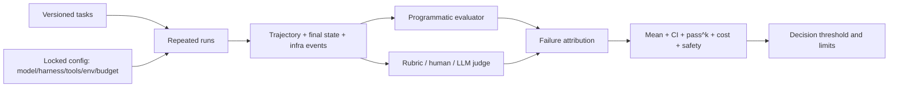

# 09 · Agent Evaluation：从排行榜到因果测量

> 一句话点题：Agent benchmark 测到的是 model × scaffold × tools × environment × evaluator × budget 的联合结果；不控制这些变量，排行榜小数点只是精确地表达不确定。

<div class="lesson-meta"><span>AGF25—AGF27</span><span>全路线支撑节点</span><span>预计 11 × 45 分钟</span><span>前置：AGF01—03；与所有专题并行</span></div>

## 解锁与跳过

不能跳过。可以暂不运行大规模公开 benchmark，但任何“更好、更可靠、更前沿”的说法都必须先定义任务、对照、环境、指标、重复次数和边界。

## 本章可观察目标

你能区分 capability 与 system performance；设计 state-diff/rubric/human/LLM Judge；计算重复成功与置信区间；分离模型、scaffold、环境和基础设施；审查数据污染、Judge 锚定、资源上限和动态网页；输出可复现实验卡而不只给平均分。

## 研究问题与关键公式：到底在测谁

观察分数可写成：

$$
Y=f(M,H,T,E,J,B,D,\epsilon)
$$

其中 $M$ 模型、$H$ harness、$T$ tools、$E$ 环境、$J$ Judge、$B$ 预算、$D$ 数据，$\epsilon$ 是随机/服务噪声。要估计换模型的效应，只改 $M$，其余锁定；要评整套产品，则接受联合变化，但不能称为“纯模型能力”。



## 核心机制：分层评测而不是一个总分

1. **model unit**：工具选择、参数、局部推理；
2. **trajectory**：是否恢复、重复、循环、遵守预算；
3. **environment outcome**：最终状态、产物、测试；
4. **system quality**：延迟、成本、可用性、人工负担；
5. **safety**：越权、注入、秘密泄露、不可逆副作用。

二项成功率 $\hat p=x/n$ 至少报告样本数和区间；模型/任务相关、动态环境时还要跨日期/种子分层。榜单相差 2 分，而置信区间和环境漂移都更大时，不能宣称胜出。

## 论文拆解一：Agent-Diff 的状态差分合约

### 研究问题

企业 API 任务要么用真实服务但难复现，要么完全模拟却不够真实。Agent-Diff 尝试保留真实 API interface，同时在沙箱中处理调用与状态，用 expected state diff 将过程与结果分开。

### 核心机制与关键架构

所有模型经统一脚本层调用 Slack、Box、Linear、Google Calendar 类接口。任务成功不是匹配工具序列/参数，而是最终环境变化等于预期合约。它覆盖 224 项任务、9 个 LLM，并消融 API 文档访问。

### 真正贡献、局限与产品影响

贡献是允许多条合法轨迹，同时保持确定 outcome evaluator。局限是状态 diff 写错就系统性误判；外部 API 的语义/权限比沙箱更复杂。产品应把 state transition contract 作为 acceptance，而不是把黄金轨迹硬编码成唯一答案。

## 论文拆解二：Unified Evaluation 隔离 scaffold 与环境

### 研究问题

不同 benchmark 自带不同 Agent 实现，分数同时反映模型与框架；live 环境又波动。论文把 7 个 benchmark、24 个领域适配到统一 instruction—tool—environment 格式，用固定 ReAct scaffold 和可选离线快照比较。

### 实验与指标

研究运行 15 个模型、约 400k rollouts、50 亿 Token，并统一资源消耗指标与 decision/execution failure taxonomy。结果显示 scaffold 选择和环境波动能让分数双向显著变化，因此跨 benchmark 排名不能当干净模型测量。

### 真正贡献、局限与产品影响

贡献是把 framework/environment effect 变成可操作的实验因子。局限是统一 ReAct 也可能压制原生适配的优势；离线快照提高复现却降低生态真实性。最佳实践是同时报告 standardized eval 和 product-native eval。

## 论文拆解三：AgentJudgeBench 的 Judge 结构性上限

### 研究问题

LLM Judge 已用于评价 Agent 工具轨迹，但依赖 DAG 的结构正确性不同于开放文本偏好。AgentJudgeBench 构造 3,808 个实例、6 类 DAG 拓扑、3 个难度层，比较 5 个 generator 与 6 个 judge，在有/无 ground truth 两种条件下评价。

### 实验与指标

Judge alignment 随难度单调下降，无 ground truth 时下降快 1.5 倍；hard queries 无 ground truth 的 6 个 Judge 聚集在 77%—82% 窄区间，不因规模自动突破。给 ground truth 也不总有益：GPT-5.4 下降 1.5pp、Gemini-2.5-Pro 下降 3.9pp，符合过度锚定；CoT 和 temperature 几乎无效，结构化 rubric 最多提升 6.5pp 但不跨组合稳定。

### 真正贡献、局限与产品影响

贡献是证明 Judge 误差有任务结构上限，且“给答案”可能改变偏差而非只提高准确。局限是 EMNLP 2026 论文仍待更广复现，rubric/prompt 可影响上限高度。产品上 LLM Judge 只做辅助，对可程序化 DAG/state 应优先代码验收，并对 Judge 建独立校准集。

## 2026 工程证据：基础设施噪声能大过榜单差距

Anthropic 在 Terminal-Bench 2.0 控制模型/harness，改变资源限制。严格 1× 到 uncapped 的成功率差最高约 6pp；infra error 从 5.8% 降到 0.5%。约 3× 后资源不只减少崩溃，还帮助解题。SWE-bench 227 题×10 次中，5× RAM 比 1× 高 1.54pp。结论不是“应无限资源”，而是 CPU/RAM floor、hard ceiling、超时和执行平台必须报告；小于约 3pp 的榜单差在配置未匹配时应谨慎。

## 贯穿案例：模型升级后为什么线上反而变差

离线 eval 使用高速 API、宽松 8GB→32GB、最大 60 分钟；线上限制 4GB/10 分钟。新模型更爱安装重依赖，离线分高，线上 OOM/超时更多。若只看 resolved 会误判模型退化/提升。错误分类必须把 `infra_failure` 与 `agent_failure` 分开，同时保留“资源策略本身改变了解法”的二阶效应。

## 复现任务：做一张实验因果矩阵

选择 30 项可重复 Agent 任务，设计 2 模型×2 scaffold×2 资源配置×3 seeds；总 360 runs。锁定镜像、工具、数据和 evaluator。报告 success/CI、pass^k、Token、wall-clock、infra error、decision/execution error。再让两个 LLM Judge 与程序化 ground truth 对照，画 confusion matrix 和难度分层。

## 对产品架构的影响

- 每次 run 保存 immutable config hash 与任务/模型/工具/镜像版本；
- 轨迹事件可重放，最终状态可独立读取；
- evaluator 自己有测试集、版本和人工校准；
- 指标同时含 mean/CI/distribution/pass^k/cost/safety；
- 动态网页和 live API 用跨时间重复＋离线快照双轨；
- leaderboard 决策要附效应量、样本、资源与已知 confounders。

## 会死在哪里

- 一项任务跑一次；
- 同时换模型和 scaffold；
- infra error 算模型失败或直接丢弃；
- LLM Judge 没有 gold calibration；
- 给 Judge ground truth 就假定更准；
- 只报平均成功，不报尾延迟/成本/安全；
- live 网站变化却把月份分数直接比；
- 榜单 2pp 差距写成确定优劣。

## 与 AI 协作模板

```text
请把这次 Agent eval 写成可复现实验卡：
- task/data/model/harness/tools/environment/evaluator/budget 全部版本化；
- 一次只改变目标变量，至少多 seed/跨日期重复；
- 分开 programmatic outcome、rubric、human、LLM judge；
- 报告 mean、CI、pass^k、cost、wall-clock、infra/decision/execution/safety；
- Judge 用 gold 子集校准，检查 ground-truth anchoring；
- 小差异若落在噪声/配置影响内，明确写“无法区分”。
```

## 练习：让一个排行榜结论失效

找两个分数接近的 Agent 配置，分别改变 RAM、超时或网络缓存，验证排名是否翻转。目的不是操纵结果，而是识别结论对环境是否敏感，并写出最小复现条件。

## 常见误区

benchmark=纯模型能力；Judge 越大越准；ground truth 一定帮助 Judge；更多 RAM 只减少噪声；离线快照等于真实环境；平均分足够；失败可全部归模型；排行榜领先就是生产更好。

<Quiz question="两个 Agent 相差 2 个百分点，但环境/资源未匹配，最合理结论是什么？" :options="['领先者一定更强', '差异可能小于基础设施和采样不确定，需匹配配置与区间', '只需再让 LLM Judge 投票']" :answer="1" explanation="2026 证据显示基础设施配置本身可产生数个百分点变化。" />

## 本章小结

- Agent eval 是完整系统测量，归因需要单变量和锁定配置。
- state diff 允许多条正确路径，比黄金轨迹匹配更接近目标。
- 统一 scaffold/离线快照能隔离变量，也有生态有效性代价。
- LLM Judge 有难度上限和锚定偏差，结构化 rubric 也非通用修复。
- 资源、时间、网络和平台是实验变量，不是脚注。

<EvidenceTracker lesson="frontier-agent-09-evaluation" />

## 本章完成标准

完成因果矩阵或等价缩小实验；报告区间/重复/失败分类；至少校准一个 LLM Judge；展示一个资源或 evaluator 变量怎样改变结论。最近平均至少 7/10。

<div class="source-note">主要来源：<a href="https://arxiv.org/abs/2602.11224">Agent-Diff</a>、<a href="https://arxiv.org/abs/2605.27898">Unified Agent Evaluation</a>、<a href="https://arxiv.org/abs/2608.26623">AgentJudgeBench</a>、<a href="https://www.anthropic.com/engineering/infrastructure-noise">Infrastructure Noise</a>；最新论文 v1 为 2026-08-27，截止 2026-08-30。</div>
