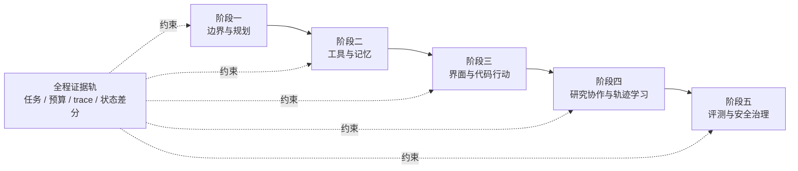

# Agent 前沿强化专题

> 本版证据核验于 **2026-09-04**，检索截止 **2026-09-03**。近三年主窗口为 **2023-09-04—2026-09-03**；更早的经典工作只用于解释来路，不用旧结论替代当前证据。

AGF01—AGF305 个阶段10 章 / 30 个强化节点前沿论文与可运行实验

这不是一条“把 Agent 名词都看一遍”的路线。你会一直改造同一个受控退款系统：先判断需求是否真的需要自治，再让计划接受环境纠正；随后接入工具和记忆；再进入网页操作与代码修改；最后学习研究协作、轨迹学习、评测和安全治理。每增加一种能力，都要留下同预算基线、失败 trace、环境状态差分和退出条件。

<AgentFrontierMap />

## 三十个前沿节点的学习契约

章节地图说明阶段关系；下面的契约进一步说明每个节点要形成什么判断、留下什么可复查产物。展开章节后可直接进入正文对应小节，避免把编号误当成学习完成。

<LearningNodeCatalog track="frontier" />

## 先判断你现在该从哪里进入

如果还不能区分模型、scaffold、工具、环境和 verifier，从第一阶段开始。若已经有工具 Agent，也不要仅凭“Demo 能跑”跳到多 Agent：先拿出类型化工具合同、未知结果处理、记忆删除和回归集，再按下表定位真实瓶颈。

| 你遇到的现象 | 优先进入 | 先带来的证据 | 现在不要做 |
|---|---|---|---|
| 模型能回答，但是否需要自治说不清 | 阶段一：边界与规划 | single-call / workflow / Agent 同任务对照 | 先搭复杂循环 |
| 工具偶尔重复执行，长期约束会被遗忘 | 阶段二：工具与记忆 | 状态差分、幂等、权限与记忆生命周期 | 把聊天记录当数据库 |
| 需要操作网页、桌面或仓库 | 阶段三：Computer use 与 Coding | 可复位环境、最小补丁、执行式评分 | 给生产账号和默认写权限 |
| 单 Agent 的覆盖或学习能力成为瓶颈 | 阶段四：研究协作与轨迹学习 | 单 Agent 基线、任务级归因、held-out 回归 | 用更多 Agent 替代任务分解 |
| 排行榜与线上表现对不上，或动作风险升高 | 阶段五：评测与安全 | 分层实验卡、能力令牌、红队与回滚 | 用模型自评替代环境验收 |

评测和安全虽然在第五阶段集中学习，却不是第五阶段才启用。前四阶段的练习从第一天就继承核心课程的确定性权限、假下游、预算和人工接管；第五阶段再把这些约束升级成可以比较版本、解释风险和决定发布的系统方法。因此路线没有“先不安全地行动，最后再补安全”的空档。

## 五个阶段怎样接成一套系统

- 阶段一交付系统边界图、复杂度 ADR、运行契约和有预算的计划器。出口不是“会解释 ReAct”，而是能在证据不足时拒绝退款。
- 阶段二把动作变成类型化协议，把记忆变成有来源、作用域、有效期和删除路径的状态。出口是工具重试不制造第二笔副作用，恶意内容不能借记忆升级权限。
- 阶段三把同一控制原则迁移到 GUI 和代码仓库。出口是动作前有预览、动作后有环境验收，补丁可以被测试、审阅和撤销。
- 阶段四才讨论并行 Agent 与轨迹学习。出口是能证明复杂拓扑或训练更新在 held-out 任务上增加净价值，而不是只增加调用量。
- 阶段五拆开能力、scaffold、环境、Judge 与基础设施噪声，再把信任边界、最小权限和停止策略接回整条链。出口是一份可审阅的 go / no-go 决定。

每完成两章，就用一个陌生场景做阶段迁移。阶段总结不是摘要：它会故意换对象、注入失败，并要求评审者不用阅读作者脑中的隐含假设就能重放结论。

## 学这条路线需要付出什么

完整路线按 **129 个标准回合**核算，每回合 45 分钟，共 96 小时 45 分钟：十章正文 83 回合、五次阶段迁移 38 回合、三类环境准备 3 回合、每阶段一次延时复测 5 回合。章节回合已包含局部环境调整、运行、故障分析和报告，不再另加隐藏作业。按每周 5～6 回合约需 22～26 周。需要 Python 基础、JSON/API 阅读能力，以及一个可复位的本地环境；GUI、代码修改和外部副作用实验全部使用测试账户、假服务或沙箱。

时间不足时可以缩小任务数、模型规模和实验轮次，不能删除四件事：简单基线、失败分支、环境验收和证据记录。没有 GPU 也能完成主体；涉及训练的章节提供离线轨迹或小样本替代。没有可复位环境时，停在纸面状态机和模拟器，不连接真实写工具。

## 每一章怎样产生反馈

阅读一手材料只是输入，真正的反馈来自可执行产物。

1. 先写预测：这个机制准备修复哪一种已观察失败，代价是什么。
2. 固定任务、环境、模型版本、预算和成功条件，只改变一个主要变量。
3. 保存完整 trace、状态前后差分、工具返回和终止原因；不能用最终回答代替过程证据。
4. 跑一个顺利样本、一个边界样本和一个故障样本。高风险动作还要有明确拒绝。
5. 让另一位评审者依据产物重算结论。若只有作者能解释，文档仍不完整。
6. 一周后换任务重做关键判断。能认出原题不等于能迁移。

`basic` 表示能解释机制、完成最小实验、处理一个常见失败，并在最近题目中达到 7/10。`proficient` 还要求跨日期证据、陌生变式、正确拒绝和对外推边界的说明，最近证据达到 8.5/10。网页里的证据记录只是学习账本，不会自动证明掌握。

## 什么时候主动跳过复杂方法

- 合法路径能够枚举时，优先固定工作流，不为“像 Agent”而增加循环。
- 没有稳定任务集、环境验收和预算记录时，暂不比较规划算法。
- 没有可撤销工具与状态对账时，不开放写操作。
- 没有单 Agent 同预算基线时，不上多 Agent。
- 没有 held-out 回归与归因方法时，不做自我改写或在线强化学习。
- 没有假环境、最小权限和人工接管时，不做 Computer use 的高风险动作。

跳过不是永久放弃，而是记录解锁证据。当前瓶颈改变以后，再回到[三年路线与知识图谱](/frontier/agents/roadmap)选择下一段。

## 从第一项真实判断开始

先进入[第 1 章：先决定这件事该不该交给 Agent](/frontier/agents/01-paradigm)。如果你已经有一个运行中的 Agent，可先用第一章的复杂度阶梯给它补做反事实：拿走模型的路径选择、限制预算、放大动作后果，看固定工作流是否仍能完成。这个结果会决定后续学习是在解决真实问题，还是为既有方案寻找理由。

论文的纳入、拒绝、修订和适用边界单独维护在[前沿证据库](/frontier/agents/evidence)。它是来源账本，不出现在正式学习导航中；课程正文只引用真正改变当前判断的证据。
