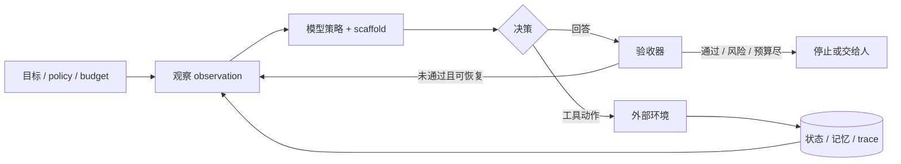

# 大模型 Agent 前沿强化专题

> 证据截止：**2026-08-30（昨天）**。核心观察窗口为 **2023-08-31—2026-08-30**；更早的 ReAct、Reflexion、Toolformer 只作为前置，不计入“近三年核心论文”。

AGF01—AGF30强化补充10 章 / 30 节点一手论文与官方技术报告

这条路线不把 Agent 理解成“会调用工具的聊天机器人”。一个可研究、可交付的 Agent 系统至少同时包含：**目标与约束、模型策略、状态/记忆、动作空间、环境反馈、验收器、预算、权限和停止条件**。模型只负责其中一部分；工具接口、scaffold、沙箱和评测环境经常与模型本身一样决定结果。

## 先纠正三个容易误判的地方

1. **Agent 进步不等于模型进步。** ACI、工具 schema、状态初始化、CPU/RAM、时间上限和重试策略都会改变分数。2026 年的研究已经开始把这些变量从“实现细节”提升为实验变量。
2. **更自主不等于更强。** Agentless 在 SWE-bench Lite 上用“定位—修复—验证”的固定流程击败过更复杂的自治 Agent。自治只有在环境反馈难预先编排时才值得付费。
3. **一次成功不等于可靠。** 对单次成功率为 (p) 的随机系统，连续 (k) 次全部成功的理想化概率是 (p^k)。这正是 τ-bench 引入 `pass^k` 的直觉：用户需要的往往不是偶尔惊艳，而是重复执行不翻车。

## 知识地图

<AgentFrontierMap />

## 近期只激活这 3 个节点

完整地图有 30 个节点，但你现在的 active queue 只放前三个，避免又进入“看了很多、没有形成深度”的状态。

| 当前节点 | 你要做出的可观察动作 | 完成证据 | 建议时长 |
|---|---|---|---|
| AGF01 Agent 系统边界 | 给一个现有 AI 功能画出模型、scaffold、工具、环境、验收和权限边界 | 一张系统图＋每个边界一个失败例 | 2 × 45 分钟 |
| AGF02 交互决策模型 | 用 POMDP/控制环解释“观察不完整、动作改变环境、奖励延迟” | 一段不看答案的解释＋一个 trace 标注 | 2 × 45 分钟 |
| AGF03 最小基线与消融 | 把同一任务做成 prompt、workflow、single-agent 三个版本 | 固定任务集上的成功率/成本/延迟表 | 3 × 45 分钟 |

只有 AGF01—03 达到 basic（解释＋应用＋最近相关题平均至少 7/10），才从真实项目中选择下一组：

- 工具/API 失败多：进入 AGF07—09；
- 长任务忘记约束：进入 AGF10—12；
- 想做网页/桌面自动化：进入 AGF13—15；
- 正在用 Codex/Claude Code：进入 AGF16—18；
- 想做研究与并行 Agent：进入 AGF19—21；
- 想研究 RL、自我改进：先完成评测，再进入 AGF22—24；
- 排行榜与生产表现对不上：进入 AGF25—27；
- 一旦有外部写入、付款、部署或私密数据：AGF28—30 立即成为阻塞前置。

## 每篇核心论文怎么拆

本专题不会用“论文摘要翻译”冒充学习。每篇材料都按同一组问题拆解：

| 层次 | 必须回答 | 不能偷换成什么 |
|---|---|---|
| 研究问题 | 作者试图隔离哪个未知量？ | “Agent 很重要” |
| 核心机制 | 状态、动作、数据和控制怎样流动？ | 框架组件列表 |
| 关键公式/架构 | 目标函数、状态转移、搜索或评分怎样定义？ | 只贴架构图 |
| 实验与指标 | 数据集、模型、预算、基线、次数和评价器是什么？ | 只抄最高分 |
| 真正贡献 | 哪个变量被第一次构造、测量或证伪？ | “显著提升性能” |
| 局限 | 结论不能外推到哪里？ | 作者 future work 的复述 |
| 复现任务 | 最小实验怎样验证核心因果链？ | 跑通官方 demo |
| 架构影响 | 它会改变产品里的哪份契约、trace 或门禁？ | “可以用于生产” |

## 截至昨天，最值得抓住的五条前沿变化

1. **研究对象从模型输出变成完整轨迹。** 工具调用的中间状态、环境差分、错误恢复和预算消耗成为一等数据。
2. **长程 Agent 的核心瓶颈是状态治理，不只是上下文长度。** 2026 年记忆研究显示，不存在对所有任务都最优的介质；召回更多内容甚至会伤害序列决策。
3. **Harness 会过时。** 模型能力提升后，旧的拆分、重试和多 Agent 结构可能变成额外成本；因此 scaffold 也要版本化、消融和退役。
4. **评测开始反过来成为研究对象。** 环境波动、Judge 偏差、ground truth 锚定、RAM/CPU 上限都可能超过榜单模型差距。
5. **安全从“拒答”转向“动作权限”。** Prompt injection 的问题不只是模型说错话，而是不可信内容能否借 Agent 身份读取秘密、改变状态或触发不可逆动作。

## 你最后要交付的贯穿项目

做一个“可审计研究 Agent”：输入一个问题，系统规划子问题、检索一手来源、维护 claim—evidence 账本、执行小型数据分析、生成带引用的结论；但它不能自行登录私人系统、不能把网页指令当系统指令、不能在没有证据时宣称完成。

必须保留四个对照：

1. 单次模型回答；
2. 固定 research workflow；
3. 单 Agent 自主循环；
4. 有明确并行价值时的 multi-agent。

统一报告任务成功、引用支持率、关键遗漏、wall-clock、Token/费用、工具失败、重复工作、人工接管和安全违规。最终产物不是“一个看起来聪明的 Demo”，而是一份能说明**什么时候 Agent 值得、为什么失败、怎样恢复**的实验报告。

## 开始方式

先看 [三年路线与知识图谱](/frontier/agents/roadmap)，随后进入 [01 · Agent 系统边界](/frontier/agents/01-paradigm)。每章均有论文拆解、复现任务、迁移题和证据记录；完成一章不自动解锁全部后续内容。

证据库、首次公开日、修订日与适用边界见<a href="./evidence">论文证据库</a>。最新纳入材料为 <a href="https://arxiv.org/abs/2608.26623">AgentJudgeBench</a>，v1 提交于 2026-08-27；截止日固定为 2026-08-30，页面不会把今天之后的内容倒填进本版本。

